| [<- до лаборних робіт](README.md) | [на основну сторінку курсу](../README.md) |
| --------------------------------- | ----------------------------------------- |
|                                   |                                           |

# Лабораторна робота №1.    Основи роботи з Node-RED

Node-RED - це інструмент програмування для об'єднання апаратних пристроїв, API та онлайн-послуг новими та цікавими способами.

Редактор функціонує на основі браузера, а програма виглядає як об’єднані в потоки (flow) вузли (node), що вибираються з палітри.

Після редагування потоки можуть бути розгорнуті в середовище виконання в один клік. Вбудована бібліотека дозволяє зберігати корисні функції, шаблони або потоки для повторного використання.

Легке середовище виконання побудоване на Node.js, що використовує подіємо-керовану неблокуючу модель. Це робить його ідеальним для роботи на краю (Edge) мережі на недорогих апаратних засобах, таких як Raspbery PI, а також у хмарі.

З більш ніж 225 000 модулів у репозиторію паекетів Node, легко збільшити діапазон вузлів палітри для додавання нових можливостей.

Потоки, створені в Node-RED, зберігаються за допомогою JSON, які можна легко імпортувати та експортувати для спільного використання з іншими.

Онлайн бібліотека потоків дозволяє вам поділитися своїми найкращими потоками зі світом.

## Про Node.JS

https://habr.com/post/243335/

https://uk.wikipedia.org/wiki/Node.js 

## 1. Інсталяція Node-RED під Windows

https://nodered.org/docs/platforms/windows 

Підтримувані платформи: Windows 10, Windows 8, Windows 7

###### 1.1. Завантаження Node.JS

Завантажити msi-файл Node.JS LTS версії https://nodejs.org/uk/ 

###### 1.2. Встановлення Node.JS

Запустити на виконання msi-файл від імені адміністратора і встановити Node.JS, при виклику діалоговий вікон все залишати за замовченням

###### 1.3. Визначення версії npm

Після інсталяції запустіть командний рядок (CMD), у якому введіть

```bash
node --version && npm –version
```

повинно вивести версію node() - npm () 

**npm** ([Node Package Manager](https://uk.wikipedia.org/wiki/Npm)) - це менеджер пакунків для мови програмування JavaScript. Для середовища виконання Node.js є менеджером пакунків за замовчуванням. Включає в себе клієнт командного рядка, який також називається npm, а також онлайн-базу даних публічних та приватних пакунків, яка називається реєстром npm. Реєстр доступний через клієнт, а доступні пакунки можна переглядати та шукати через веб-сайт npm. Менеджер пакунків та реєстр керуються npm, Inc. 

###### 1.4. Інсталяція Node-RED

Інсталюйте Node-RED . Інсталювання проводиться з використанням npm з командою install. Наберіть в командному рядку 

npm install -g --unsafe-perm node-red

почнеться процедура інсталяції

###### 1.5. Запуск Node-RED.

Запустіть Node-RED з командного рядка

```bash
node-red
```

Можуть бути показані повідомлення про пропозицію розблокування брандмауером, з якими треба погодитись.

###### 1.6. Відкриття редактору.

Відкрийте браузер, перейдіть до редактору Node-Red, за посиланням http://127.0.0.1:1880/ 

Для того, щоб Node-RED виконувався, вікно з командним рядком не можна закривати.

## 2. Знайомство з Node-RED

Програма створена на Node-RED складається з **потоків** (**Flow**), які виконуються як умовно незалежні програми. Потоки – це зв’язані між собою інформаційними **дротами** (**wires**)  **вузли** (**Node**), що виконують певну функцію. Таким чином, ідеологія програмування Node-RED дещо схоже на побудову програм на мові FBD, що є стандартною для програмування ПЛК (IEC 61131-3). Тим не менше, між цими мовами є значні відмінності. 

###### 2.1. Ознайомлення з редактором Node-RED.

Відкрийте в браузері редактор Node-RED, якщо він ще не відкритий. Ознайомтеся з його основними частинами (рис.1)

  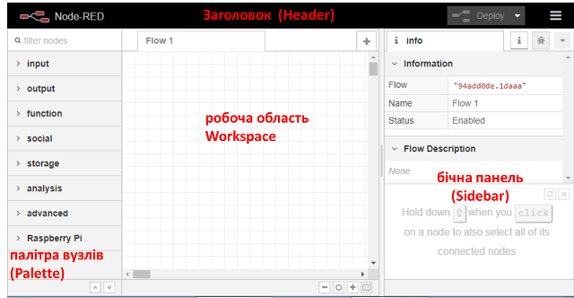                            

рис.1. Вигляд редактору Node-RED

Детально про роботу з редактором Ви можете ознайомитися в інструкції користувача. 

###### 2.2. Розміщення вузлів inject і Debug

Виберіть з палітри і розмістіть на робочій області вузли

·     **Input->inject** 

·     **Output->Debug**

З’єднайте їх між собою. Повинно вийти як на рис.2. Блакитні кружечки значать, що зміна в вузлах ще не відобразилася в середовищі виконання, так як змінена програма не була в ньому розгорнута.  

       

  рис.2. Вигляд програми

###### 2.3. Розгортання

В заголовку виберіть пункт **Deploy->Modified Nodes** (див.рис.3), після чого  натисніть **Deploy (Розгортання)**. 

   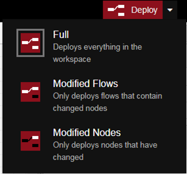

  рис.3. Вибір варіанту розгортання

При вдалому розгортанні з’явиться повідомлення. 

А в робочому просторі вузли вже будуть без блакитних кружечків.  

###### 2.4. Відображення вікна повідомлень

Для перевірки роботи програми, на бічній панелі треба відобразити вікно **Debug messages** (налагоджувальні повідомлення ) шляхом натиснення кнопки з «жуком».  

​    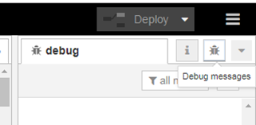

  рис.4. Показати вікно повідомлень

Ліворуч вузла типу Inject з назвою «timestamp» є кнопка, яка приводить до ініціювання розрахунку ланцюжка вузлів, що починаються з нього. Натисніть на цю кнопку.

В результаті з’явиться повідомлення про успішне вприскування (Inject) а на панелі повідомлень з’явиться повідомлення (рис.5). 

​    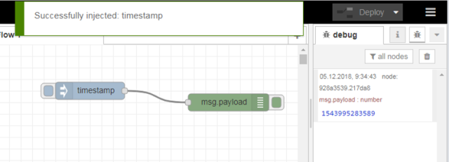

  рис.5. Результат виконання програми

На цьому прикладі розглянемо, як виконується програма. 

У більшості випадків перерахунок вузлів починається тоді, коли на його вхід подається повідомлення (message). Повідомлення – це прості об’єкти (типу структурні змінні) JavaScript що можуть мати будь який набір властивостей. Тобто в даній програмі після перерахунку вузла з іменем «timestamp» буде сформовано об’єкт-повідомлення (**msg**) і переданий по дроту вузлу з іменем (msg.payload). 

На вхід вузла з іменем «timestamp» повідомлення не надходять, бо він є ініціатором розрахунку. Всі вузли палітри що входять в групу **Input** є ініціаторами розрахунку. Ініціація вузлів типу **Inject** відбувається шляхом ручного запуску по кнопці, або через певні інтервали часу, що налаштовується у вузлі. Ініціювання повідомлення це формування полів **msg** та відправка його іншим вузлам по дротам. Повідомлення, надіслане вузлом Inject, має властивості **payload** (корисне навантаження) та **topic** (тема). За замовченням Inject записує у властивість topic відмітку часу (timestamp – кількість мілісекунд з 1980 року).

Вузол типу Debug «msg.payload» використовується для відображення повідомлень на бічній панелі Debug. Таким чином, після отримання повідомлення, цей вузол відображає його зміст на бічній панелі.

###### 2.5. Налаштування Inject на періодичне оновлення

Змініть налаштування властивостей вузлів, як показано на рис.6: змініть імена вузлів, вкажіть тему (topic) та періодичність оновлення для вузла типу Inject. Вікно налаштування з’являється по подвійному кліку по вузлу.   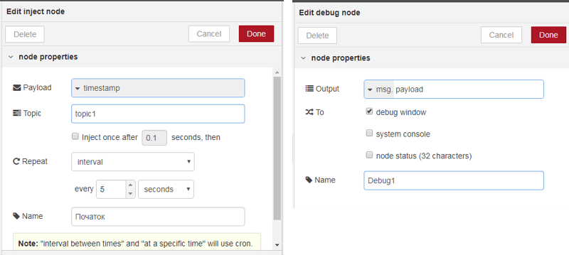  

рис.6. Налаштування вузлів

Зробіть розгортання, та проаналізуйте зміст виведених у вікні Debug повідомлень.

###### 2.6. Налаштування Inject на текстове повідомлення

Змініть вузол «Початок» так, щоб він формував корисне навантаження текстом «Це текстове повідомлення»(рис.7), та проаналізуйте як воно виводиться на вікно Debug.  

  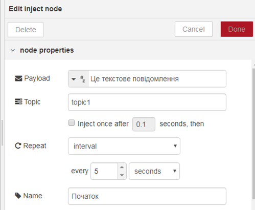 

рис.7. Формування текстового повідомлення

###### 2.7. Використання вузлів типу change та delay

Змініть вузол «Початок» так, щоб він знову формував корисне навантаження відміткою часу (Timestamp). Розгорніть (deploy) програму та проконтролюйте щоб відмітка часу кожні 5 секунд відображалася у вікні повідомлень 

Ознайомтеся з роботою вузлів типу **change** та **delay** в інструкції користувача. 

Змініть програму, як показано на рис.8, використовуючи вузли delay (“delay 1s”…”delay 4s”) та change (“set1”…”set5”). Для вузлів delay виставте затримки:

- delay 1s – 1 seconds
- delay 2s – 2 seconds
- delay 3s – 3 seconds
- delay 4s – 4 seconds

Для вузлів change виставте правило рівним «set», та змініть властивості «to» на наступні текстові поля:

- set1 – один
- set2 – два
- set3 – три
- set4 – чотири
- set5 – п’ять   

   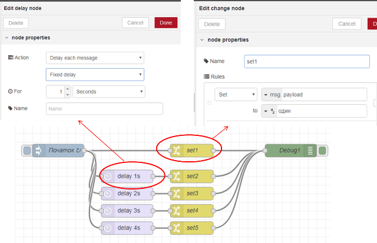

рис.8. Використання вузлів типу change та delay 

Розгорніть (deploy) програму та проконтролюйте щоб кожної секунди у вікні повідомлень виводилося конкретне повідомлення від «один» до «п’ять». 

###### 2.8. Ознайомлення з роботою вузлів типу function

Ознайомтеся з роботою вузлів типу function з інструкції користувача

Вузол function може обробляти повідомлення з використанням javascript. Змініть програму так, щоб відмітка часу виводилася в форматі дати та часу. Для цього використовується об’єкт типу Data та його метод  toLocaleString(). Зробіть розгортання та переведіть вузол “Debug1” в режим приховання повідомлень. 

  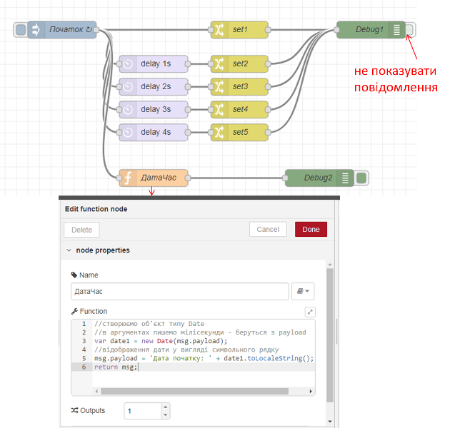 

рис.9. Змінена програма з вузлом function

Про синтаксис **javascript** можна дізнатися [тут](http://яваскрипт.укр) (укр. мова) або [тут](https://learn.javascript.ru/) (рос.мова)

Про об’єкт **Date** можна прочитати [тут](http://яваскрипт.укр/Date)  або [тут](https://learn.javascript.ru/datetime) 

## 3. Підключення та ознайомлення з модулем node-red-dashboard

Node-RED дозволяє інсталювати та обновляти палітру вузлів. Це робиться через Manage Palette (рис.10) . Деталі інсталяції читайте в інструкції користувача.

  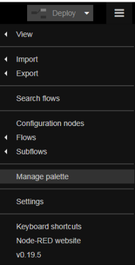 

рис.10. Вибір Manage palette

###### 3.1. Інсталяція node-red-dashboard

В налаштуваннях палітри на вкладці Install в поле фільтру введіть “node-red-dashboard” і інсталюйте даний пакет (рис.11):

- натисніть кнопку install
- підтвердьте інсталяцію у вікні повідомлення 
- після інсталяції закрийте вікно керування палітрою

  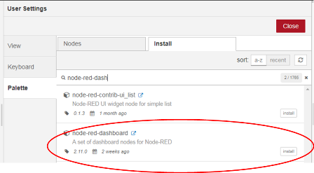 

рис.11. Вибір Manage palette

Перевірте чи з’явилася в палітрі розділ «Dashboard» 

###### 3.2. Добавлення закладок 

Після встановлення у бічній панелі з’явилася нова іконка з зображенням діаграми (рис.12) . Натисніть на ній. 

  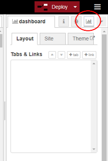 

рис.12. 

В Layout добавте дві закладки (tab) та змініть їх назви як це показано на рис.13.  

**Однак ім’я першої закладки повинно називатися Вашим прізвищем та ім’ям, наприклад «Іваненко Іван».**     

  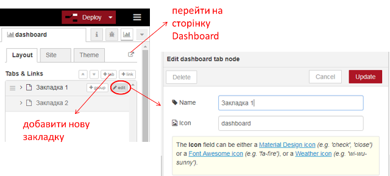 

рис.13. 

###### 3.3. Створення вузлу Dashboard text для виведення дати та часу

Модифікуйте програму, створивши вузол типу dashboard-> text і підєднавши його до вузла «ДатаЧас» (див. рис.14). Налаштуйте вузол відповідно до рис.14 **однак ім’я першої групи повинно називатися Вашим прізвищем «Іваненко». Створіть ще одну групу, яка повинна називатися Вашим ім’ям «наприклад Іван».**      

Після усіх налаштувань зробіть розгортання, відкрийте створений Dashboard, шляхом натискання кнопки переходу  (див.рис.13.), або ввівши в новій вкладці браузера http://127.0.0.1:1880/ui 

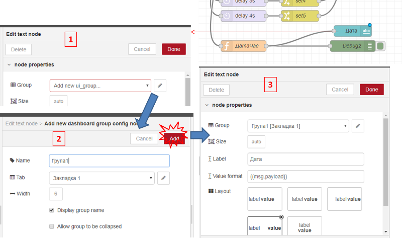

рис.14. 

На вкладці повинно з’явитися щось типу такого, як показано на рис.15

    

рис.15

3.4. Створення вузлу Dashboard text для виведення числа прописом

Аналогічним чином зробіть для відображення числа прописом.

  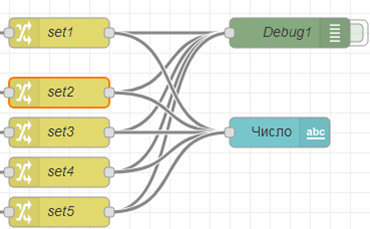  

рис.16

###### 3.5. Використання вузлів Slider, Gauge, Audio out 

Добавте до програми фрагмент, як показано на рис.17.

  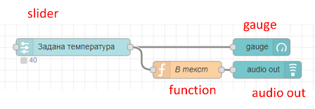 

рис.17

Налаштування вузлів показані на рис.18-21

  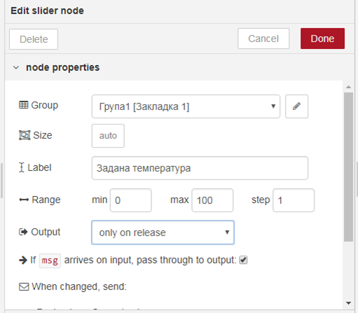 

рис.18

  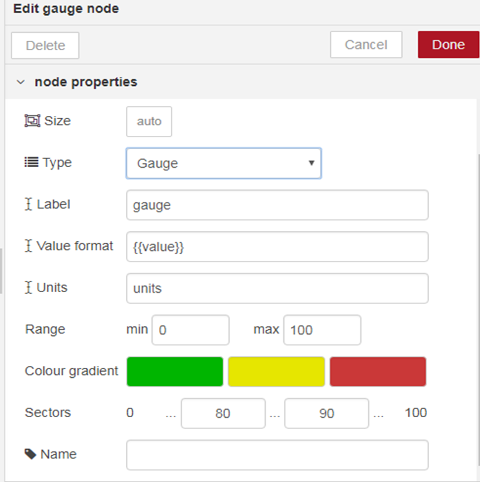 

рис.19

   

рис.20

  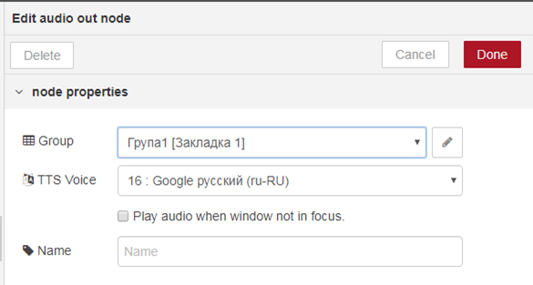 

рис.21

Зробіть розгортання і подивіться результат на вікні Dashboard.  

###### 3.6. Робота з вузлом switch

Ознайомтеся з принципами роботи вузла **switch**. Модифікуйте програму відповідно до наведеної на рис.22. Вузли налаштуйте відповідно до рис.23-26. 

  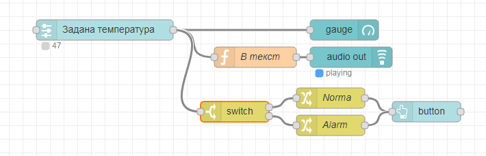 

рис.22. Фрагмент модифікованої програми

   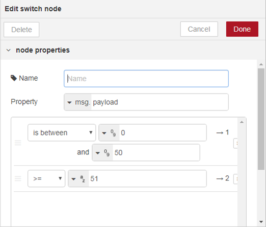 

рис.23. Налаштування вузла switch 

  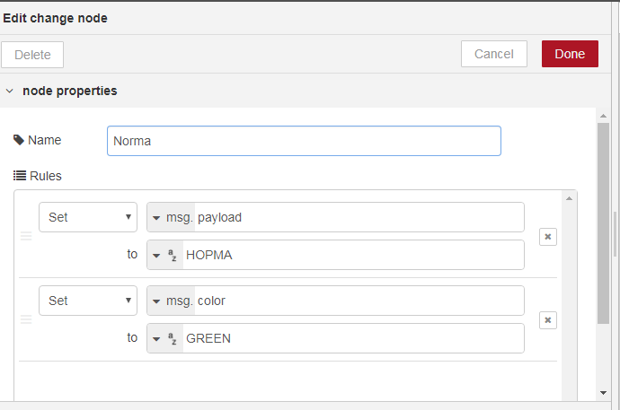 

рис.24. Налаштування вузла norma

  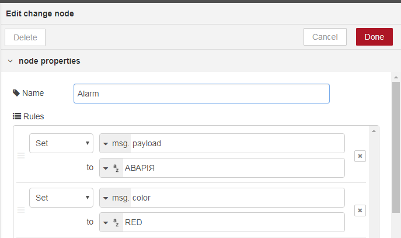 

рис.25. Налаштування вузла Alarm

  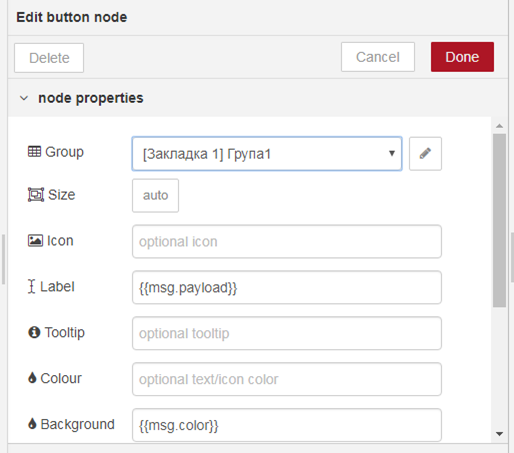  

рис.26. Налаштування вузла Button

Зробіть розгортання проекту, перевірте як працює програма. Для цього на сторінці веб-інтерфейсу змініть значення заданої температури в діапазоні 0-50, а потім >50.

Ця частина програми працює наступним чином. При зміні значення температури, в msg.payload значення поступає на обробку в вузол switch, де на один із 2-х виходів формується повідомлення в залежності від тієї умови, яка спрацювала. 

При виконанні умови 0<msg.payload<50 (is between), повідомлення передається на перший вихід, до якого в свою чергу приєднаний вузол “Norma” (тип function->change). Той задає текстове значення для властивості msg.payload рівним «НОРМА» і формує нову властивість msg.color рівною “GREEN”. Далі msg поступає вузол «button», який використовується для відображення тексту в прямокутнику. Значення тексту задається полі Label, а колір в полі Background. При формуванні динамічних значень для вузлів, використовується формат angular фільтрів, в якому вказується підстановка в подвійних фігурних дужках.

Аналогічна обробка проводиться при спрацюванні у вузлі switch умови msg.payload>50. Повідомлення згенерується на другому виході, який активує перерахунок вузла “Alarm” що буде формувати текст та колір для кнопки.         

Детальніше про використання фільтрів ангуляр дивіться [тут](https://metanit.com/web/angular/2.4.php   ) або [тут](http://javastudy.ru/angularjs/angularjs-filters/)

## 4. Робота з поштою (не обов’язкова частина)

###### 4.1. Визначення налаштувань поштового серверу

Для роботи з поштою необхідно дізнатися налаштування почтового сервера, який Ви будете використовувати для відправки повідомлень, і на якому є Ваш обліковий запис. **Ми рекомендуємо для тестування створити новий аккаунт** **на одному з поштових серверів.** 

Випишіть налаштування:

Для вихідних повідомлень (відправки пошти):

- SMTP Server 
- port

Для вхідних повідомлень (отримання пошти):

- POP3 Server або IMAP Server
- port

Інформацію про налаштування поштових сервісів можна отримати в довідці по цим серверам. Нижче наведений приклад деяких із найбільш вживаних: 

Приклади:

| Поштовий сервіс | Для відправки  (Сервер вихідних повідомлень  ) | Для отримання  (Сервер вхідних повідомлень)   | Примітка                                                     |
| --------------- | ---------------------------------------------- | --------------------------------------------- | ------------------------------------------------------------ |
| www.ukr.net     | SMTP Server: smtp.ukr.net                      | IMAP Server: imap.ukr.net                     | В налаштуваннях треба увімкнути IMAP/SMTP (рис.27)           |
| port            | port: 465 або 2525                             | port: 993                                     |                                                              |
| www.gmail.com   | SMTP Server: smtp.gmail.com                    | IMAP Server: imap.gmail.com  Вимагає SSL: так | В налаштуваннях треба увімкнути IMAP (рис.28)  Активувати доступ до додатків  https://myaccount.google.com/lesssecureapps (рис.29) |
| port            | port: 465(SSL) або  587(TLS)                   | port: 993                                     |                                                              |

 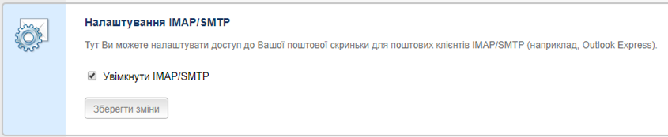 

рис.27. Налаштування ukr.net для активації отримання та відправки пошти.

  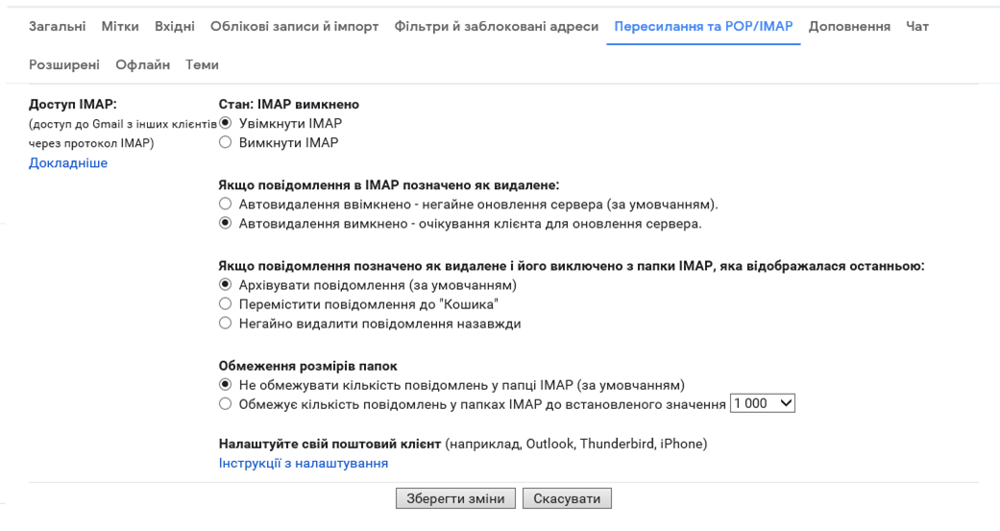 

рис.28. Налаштування gmail.con для активації отримання та відправки пошти.

Для сервісів gmail навіть після активації дозволу на взаємодію з поштовими клієнтами через IMAP/SMTP, при використанні додатку NodeRED може прийти повідомлення про блокування доступу (рис.29). Для активації доступу тимчасово (до закінчення лабораторної роботи) виставте дозвіл доступу до менш безпечних додатків (рис.30)

   

рис.29. Повідомлення gmail.com про блокування доступу.

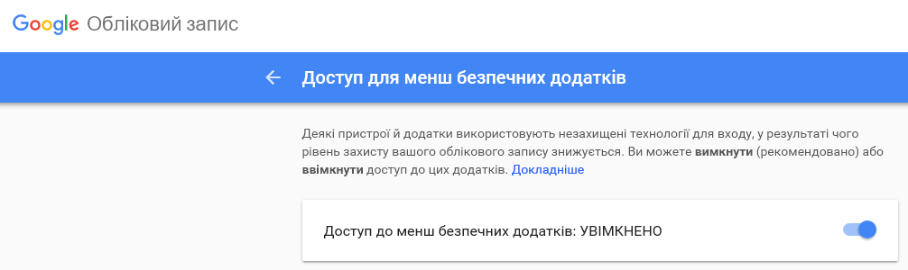 

рис.30. Активація доступу до менш безпечних додатків (https://myaccount.google.com/lesssecureapps).

 необхідно також дозволити https://myaccount.google.com/lesssecureapps  

###### 4.2. Модифікування програми для відправки поштових повідомлень 

Модифікуйте програму фрагментом показаним на рис.31. Налаштування вузів показано на рис.32-33. У поля user-id та password необхідно вказати користувача та пароль для аккаунта. Інші налаштування беруться з визначених в попередньому пункті. В поле отримувача введіть власну поштову скриньку. 

  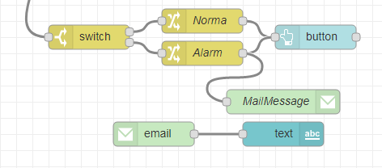  

рис.31. Модифікований фрагмент програми

    

рис.32. Налаштування вузла MailMessage типу Social e-Mail

  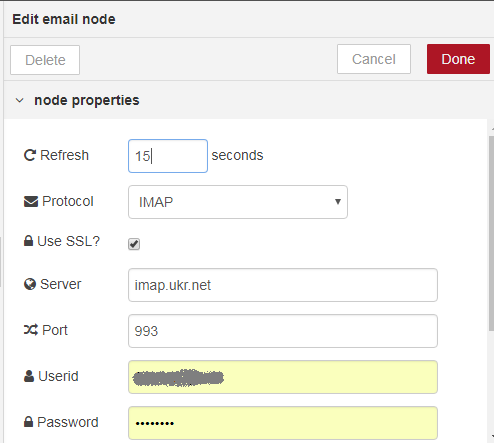  

рис.33. Налаштування вузла MailMessage типу Social e-Mail-in

Зробіть розгортання проекту, виставте значення заданої температури так, щоб згенерувалося повідомлення Alram. На пошту повинно прийти повідомлення, протягом 15 секунд воно повинно відобразитися на веб-сторінці в полі текст (рис.34).  

  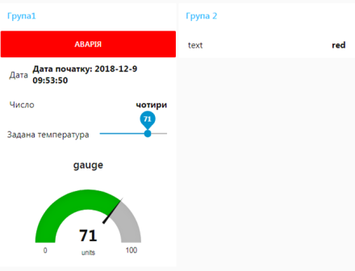  

рис.34. Приклад зовнішнього вигляду UI.

## 5. Робота з JS об’єктами та обробка системної інформації

###### 5.1. Встановлення модуля node-red-contrib-os

Встановіть в Node-RED модуль node-red-contrib-os

  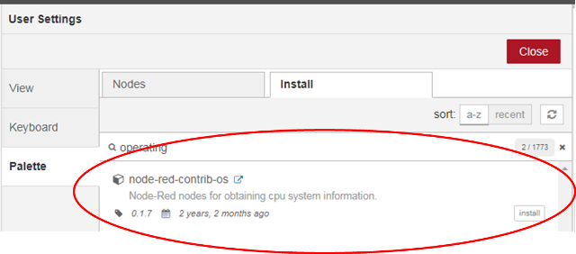 

рис.48 Встановлення модуля node-red-contrib-os.

###### 5.2. Використання вузлу Networkintf 

З нововстановленого модуля використайте вузол типу Networkintf для створення фрагменту програми, як на рис.49. 

  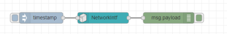  

рис.49 Фрагмент програми для виведення інформації по наявним мережним картам 

Зробіть розгортання програми, ініціюйте формування повідомлення, проаналізуйте вивід. Приклад виведеної інформації показаний на рис.50. Як видно, інформація надається у вигляді JS об’єкту, який включає в себе об’єкт NetworkInterfaces, що в свою чергу вміщує кілька мережних інтерфейсів, що є масивами об’єктів, що представляють певний протокол..  

  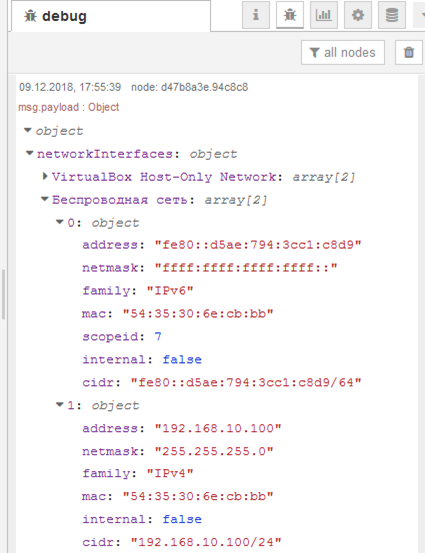  

 рис.50 Виведення інформації про мережу.

Про об’єкти в JavaScript можна почитати [тут](http://яваскрипт.укр/object)  або [тут](http://learn.javascript.ru/object).  Для перебору усіх властивостей об’єкту можна скористатися конструкцією [for..in](http://learn.javascript.ru/object-for-in ) 

###### 5.3. Виведення інформації про мережні карти

Створіть програму, що буде виводити перелік MAC адрес для мережних карт, що встановлені на Вашому ПК (рис.51-52). 

  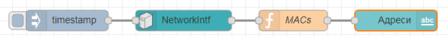

рис.51 Виведення інформації про мережні карти.

  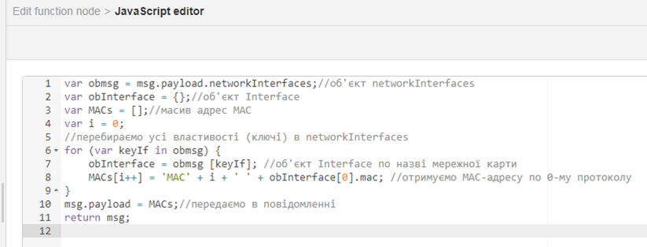 

рис.52 Програма для вузла MACs.

Про JSON читайте [тут](http://яваскрипт.укр/json )

У JavaScript та IoT часто використовуються дані типу JSON. Детально про JSON та їх обробку Ви можете почитати тут https://flows.nodered.org/node/node-red-contrib-os

## 6. Звіти та експорт потоку

###### 6.1. Копії екранів 

**Зробіть копії екранів програми та візуалізації для звіту до Вашої роботи.**   

###### 6.2. Експорт потоку

Відкрийте потік (Flow) створений в лабораторній роботі. Виділіть всі вузли шляхом комбінації Ctrl+A. Усі вузли повинні виділитися червоним контуром. Через меню бокової панелі зробіть експорт виділеного в буфер обміну (рис.53).

  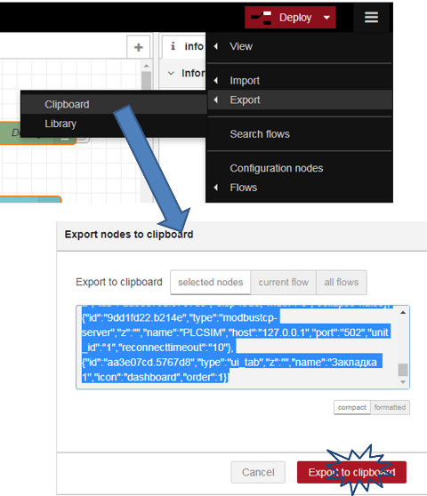 

рис.53. Експорт потоку Node-RED в буфер обміну.

Створіть текстовий файл з назвою Lab1.txt і скопіюйте з буферу обміну текст експорту. Збережіть файл, він вам знадобиться для звіту та для захисту лабораторних робіт у майбутньому.