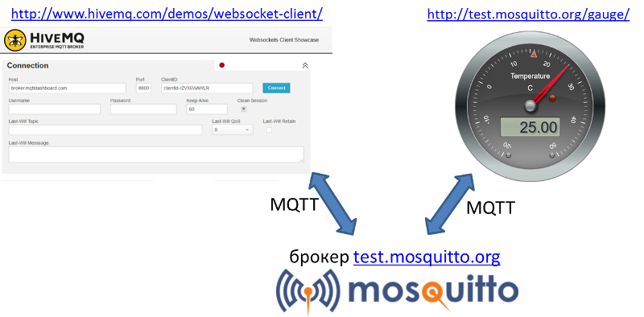
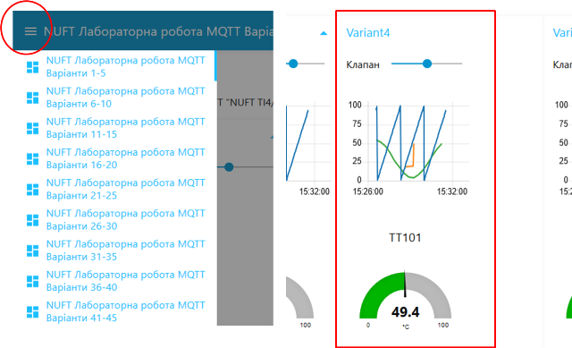
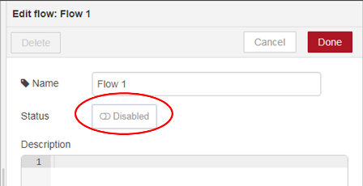
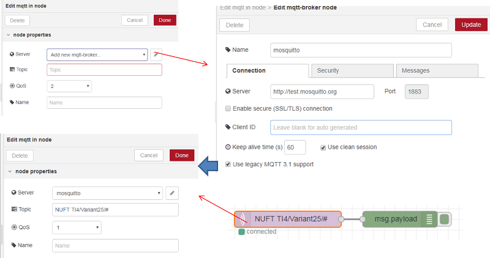
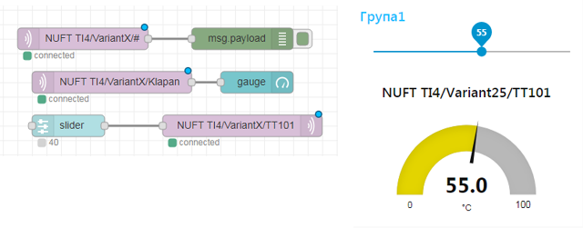
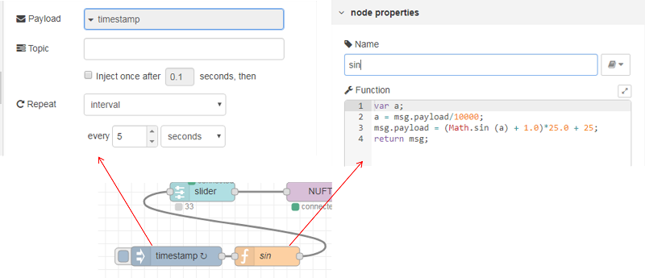

**Програмна інженерія в системах управління. Лабораторний практикум.** Автор і лектор: Олександр Пупена 

| [<- до лаборних робіт](README.md) | [на основну сторінку курсу](../README.md) |
| --------------------------------- | ----------------------------------------- |
|                                   | [2 частина ->](lab2WEBAPI.md)             |

# ЛР3.Ч1 Протоколи IoT. MQTT

## 1. Використання тестових клієнтів для зв’язку по MQTT

Одна із областей застосування MQTT – це обмін між пристроями та програмами, що підключені до Інтернет.  Для цього необхідно використовувати загальнодоступний брокер, наприклад test.mosquitto.org . Слід звернути увагу, що даний брокер хоч і є безкоштовним, проте він не гарантує безперебійну роботу сервісу, тому його не слід використовувати для реальних рішень, що потребують надійних з’єднань та цілодобового використання.  Брокер test.mosquitto.org використовується виключно в навчальних цілях, за необхідності використання надійних сервісів, слід користуватися іншими брокерами.

###### 1.1. Робота з test.mosquitto.org

Для ознайомленнями з принципами роботи MQTT скористайтеся тестовими клієнтами та брокером MQTT (рис.1).  Тестовим приладом буде [http://test.mosquitto.org/gauge](http://test.mosquitto.org/gauge/)[/](http://test.mosquitto.org/gauge/) який отримує дані через брокер test.mosquitto.org за темою (topic) “temp/random”. Для перевірки роботи MQTT скористуйтеся тестовим клієнтом http://www.hivemq.com/demos/websocket-client/  (надалі по тексту **Вебсокет-клієнт**)

                               

рис.1. Структура тестової установки

На сторінці Вебсокет-клієнта в полі Host введіть **test.mosquitto.org** , в полі Port **8080**, після чого натисніть кнопку Connect. Повинен з’явитися напис Connected.

У випадку відсутності зв’язку з брокером зробіть спробу пізніше. 

###### 1.2. Зміна значення temp/random

На панелі Publish Вебсокет-клієнта в полі Topic впишіть “**temp/random**”, QoS задайте рівним **1**, в полі Message введіть  якесь значення від 0 до 50, натисніть Publish. Перейдіть на [http://test.mosquitto.org/gauge](http://test.mosquitto.org/gauge/)[/](http://test.mosquitto.org/gauge/) там повинно відобразитися введене Вами значення. 

У випадку відсутності зв’язку з брокером зробіть спробу пізніше.

###### 1.3. Відкриття сторінки з варіантом на тестовому сервері

Перейдіть на http://edu.asu.in.ua:1880/ui/#/0 (надалі, **тестовий сервер**) виберіть вкладку з Вашим варіантом і знайдіть групу елементів з Вашим варіантом:

- повзунок для керування клапаном
- тренди температури, позиції клапану, та секундної пилоподібної кривої (0-100)  
- круговий індикатор температури 

 

​    рис.2. Вибір вкладки з варіантом та панель для варіанту 

###### 1.4.  Перевірка підключення до тестового варіанту

Відкрийте Вебсокет-клієнт (http://www.hivemq.com/demos/websocket-client/). Якщо ще не зроблене підключення, в полі Host введіть test.mosquitto.org, в полі Port 8080, після чого натисніть кнопку Connect. Повинен з’явитися напис Connected. 

У випадку відсутності зв’язку з брокером зробіть спробу пізніше.

###### 1.5.  Зміна даних на тестовому серверів через MQTT 

На панелі Publish Вебсокет-клієнта в полі Topic впишіть “NUFT TI4/Variant**X**/TT101”, де **X** – номер варіанту. QoS задайте рівним **1**, в полі Message введіть  значення від 10.5, натисніть Publish. Перейдіть на тестовий сервер, подивіться як змінюється значення на круговому індикаторі. Зробіть поступове введення 30, 75, 50, з періодичністю 5 секунд, після кожного натискайте Publish. Подивіться як змінюється значення на тренді. 

###### 1.6. Підписка на конкретні дані на тестовому сервері

На панелі Subscriptions Вебсокет-клієнта натисніть кнопку «Add New Topic Subscription» в полі Topic введіть «NUFT TI4/Variant**X**/Klapan» де **X** – номер варіанту.  QoS задайте рівним **1**, натисніть кнопку “Subscribe”. Перейдіть на **тестовий сервер**, змініть значення повзунка. Перейдіть на вкладку  Messages, через кілька хвилин повинно з’явитися повідомлення. Зробіть ще кілька змін, зробіть копію екранів з тестового Вебсокет-клієнта та тестового серверу.

###### 1.7. Підписка на усі дані на тестовому сервері відповідно до варіанту

Підпишіться на всі повідомлення з гілки вашого варіанту. Для цього на панелі Subscriptions Вебсокет-клієнта натисніть кнопку «Add New Topic Subscription» в полі Topic введіть «NUFT TI4/Variant**X**/#» де **X** – номер варіанту. QoS задайте рівним **1**, натисніть кнопку “Subscribe”. Тепер в полі Messages будуть з’являтися усі повідомлення з вашої гілки. Змініть значення на тестовому сервері для клапану і температури. 

###### 1.8. Підписка на всі повідомлення про зміну значення завдання для будь якого клапану

Підпишіться на всі повідомлення про зміну значення завдання для будь якого клапану. Для цього на панелі Subscriptions Вебсокет-клієнта натисніть кнопку «Add New Topic Subscription» в полі Topic введіть «NUFT TI4/+/Klapan». QoS задайте рівним **1**, натисніть кнопку “Subscribe”. Змініть значення усіх клапанів тестового серверу на вкладці з Вашим варіантом.

###### 1.9. Огляд дерева спеціальних тем серверу

Перейдіть на http://test.mosquitto.org/sys/ для огляду дерева спеціальних тем ($SYS) доступних на брокері test.mosquitto.org. На Вебсокет-клієнті видаліть усі підписки на теми, підпишіться на одну з системних гілок, наприклад «$SYS/broker/uptime», яка показує загальний час роботи брокера в секундах з його останнього перезапуску. Зробіть копії екранів. 

## 2. Зв’язок Node-RED з іншими пристроями по MQTT

У лабораторній роботі №1 показано, що Node-RED, як правило використовується або на стороні Edge або в якості хмарного застосунку. Якщо Node-RED використовується на стороні Edge в якості програми для концентратора або шлюзу чи маршрутизатору, наприклад на апаратній платформі Raspberry PI, він може збирати дані з різних пристроїв по протоколам промислових мереж. Таким чином, як варіант, з одного боку Raspberry PI буде взаємодіяти з пристроями по протоколам промислових мереж, а з іншого - взаємодіяти з хмарними застосунками, сервісами та іншими пристроями по MQTT (рис.3). У даній частині лабораторної роботи розглядається Node-RED з точки зору взаємодії з іншими пристроями по MQTT.  

 

рис.3. Приклад структури рішення IIoT з використанням Raspberry PI та Node-RED.

###### 2.1. Відключення активності потоку

Запустіть на своєму ПК на виконання Node-RED.  У налаштуваннях існуючих потоків переведіть статус з активного на пасивний (рис.4), щоб його робота не заважала в даній лабораторній роботі. Після зміни налаштувань зробіть розгортання потоку. 

  

рис.4. Відключення активності потоку (Flow).

###### 2.2. Налаштування отримання даних по MQTT

Створіть новий потік (Flow), назвіть його «Laba2». Ознайомтеся з роботою вузлів MQTT з [довідника Node-RED](https://drive.google.com/file/d/1tbhv1j-tiUGpIlAO4kWlInCRXJh0ZIqf/view). З розділу палітри Input вставте вузол MQTT In. В налаштуваннях Server добавте новий брокер MQTT з назвою mosquitto (рис.5) і адресою серверу http://test.mosquitto.org   

 

рис.5. Налаштування отримання даних по MQTT.

​        У полі Topic вузла «MQTT in» введіть «NUFT TI4/Variant**X**/#» де **X** – номер варіанту. Це значить, що цей вузол підписується на всі теми з даної гілки. Використайте вузол Debug для виведенню повідомлень (рис.5). Зробіть розгортання, дочекайтеся коли вузол «MQTT in» покаже статус «Connected».   

У випадку відсутності зв’язку з брокером зробіть спробу пізніше.

###### 2.3. Тестування отримання даних по MQTT

Активуйте на боковій панелі режим відображення повідомлень відлагодження. Змініть значення на тестовому сервері для клапану зі свого варіанту. Аналогічно пункту 1.5 використовуючи Вебсокет-клієнта задайте значення температури. Зробіть аналіз виведених повідомлень на бічній панелі. Зробіть копію екрану.

###### 2.4. Тестування відправки даних по MQTT

Використовуючи вузли «Slider» та «MQTT out» реалізуйте зв'язок локального графічного інтерфейсу з віртуальним приладом на тестовому сервері, що показує TT101 для вашого варіанту. Використовуючи вузли «gauge» і «MQTT in» реалізуйте зв'язок локального графічного інтерфейсу з повзунком завдання ступені відкриття клапану на тестовому сервері для вашого варіанту. Програма та зовнішній інтерфейс матиме вигляд приблизно як на рис.6. Для відображення підписів використовуйте теми а для формату відображення чисел ангулярні фільтри. 

 

рис.6. Вигляд фрагменту програми Node-RED та локального інтерфейсу.

Зробіть копії екранів програми Node-RED та локального інтерфейсу. 

###### 2.5. Генерування синусоїди

Модифікуйте програму так, як це показано на рис.7. Перейдіть на тестовий сервер, дочекайтеся коли синусоїда опише кілька періодів. Зробіть копії екранів. 

  

рис.7. Вигляд фрагменту програми Node-RED для формування синусоїди.

###### 2.6. Експортування потоку

Через меню бокової панелі зробіть експорт потоку в буфер обміну і збережіть в окремому файлі, який необхідно буде для захисту.

## 3. Зв’язок MQTT-клієнта з мобільного телефону (виконується за можливості) 

Для виконання даної частини лабораторної роботи необхідно мати пристрій з Андроїдом або iOS. Даний пристрій буде використовуватися як мобільний клієнт MQTT. 

###### 3.1. Встановлення MQTT Client для мобільного телефону

Встановіть безкоштовний додаток MQTT Client 

Приклад для Андроїд  “IoT MQTT Panel” [завантажити тут ](https://play.google.com/store/apps/details?id=snr.lab.iotmqttpanel.prod&hl=en_US)

Приклад для iOS «MQTTool» [завантажити тут](https://itunes.apple.com/us/app/mqttool/id1085976398?mt=8)

###### 3.2. Добавлення з'єднання з MQTT брокером

Запустіть на виконання. Добавте з’єднання з MQTT брокером (MQTT Host). 

Наприклад, для застосунку “IoT MQTT Panel” це робиться в розділі Connection, де означуються ті самі налаштування, що і в попередніх пунктах. Додатково також треба добавити Device.

###### 3.3. Добавлення та тестування інтерфейсу користувача

Створіть інтерфейс користувача шляхом добавлення графічних елементів та означте для них теми (Topic) відповідно до Вашого варіанту. Перевірте роботу, змінюючи значення клапану на тестовому сервері. 

[2 частина ->](lab2WEBAPI.md) 