| [<- до лаборних робіт](README.md) | [на основну сторінку курсу](../README.md) |
| --------------------------------- | ----------------------------------------- |
| [<- 1 частина](lab2MQTT.md)       |                                           |

# ЛР2.Ч2. Використання WEB API та Web-сокетів

**Увага! Більшість ресурсів є захищеними та потребують автентифікації, шифрування і т.п. У цій роботі усі інтерфейси є відкритими, тому не можуть в чистому вигляді використовуватися в промислових умовах!**  

## 1. Знайомство з роботою HTTP та використанням інструментів Веб-розробника  

Ознайомтеся з принципами роботи HTTP(даються в лекційному матеріалі).

Для перевірки роботи протоколу HTTP, відлагодження та тестування HTML, CSS і JavaScript в завантажених сторінках використовуються різноманітні інструменти Веб-розробника (WEB Developer Tools). Деякі з них є частиною браузерів, таких як Google Chrome або Mozila FireFox. Якщо Ви звикли працювати з Google Chrome, ознайомитися з вкладками і можливостями Ви можете за наступним [посиланням](https://www.quality-assurance-group.com/oglyad-instrumentiv-rozrobnyka-u-najpopulyarnishyh-brauzerah/). В даній лабораторній роботі використовується інструменти WEB Developer Tools, що вбудовані в Mozilla FireFox. Зокрема, для аналізу і тестування HTTP запитів використовується Монітор мережі, документація українською мовою для якого доступна за [посиланням](https://developer.mozilla.org/uk/docs/Інструменти/Network_Monitor?fbclid=IwAR2UDrojQ7d6Jeu7IHzpmKv50LR-YE6BbE-JQzVtolW3aJs1_kG7WxFQuK4). У прикладах в лабораторній роботі використовується українська версія FireFox, яку можна завантажити за наступним посиланням https://www.mozilla.org/uk/firefox/download/thanks/. При виконанні лабораторної роботи дозволяється використовувати і інші інструменти. 

Для перевірки роботи запитів HTTP використовуватимуться сервіси сайту https://zxing.org/w/decode.jspx. Ці сервіси дають можливість декодувати штрих-коди та QR-коди що передаються на сайт у вигляді зображення. Слід відмітити, що є багато програм, які можуть це робити в онлайн, дана використовується тільки в якості прикладу.   

###### 1. Перевірка роботи ВЕБ-застосунку ttps://zxing.org 

Відкрийте сторінку в браузері https://zxing.org/w/decode.jspx і перевірте її роботу. Для цього завантажте будь-який файл з зображенням штрих-коду, наприклад [звідси](https://drive.google.com/open?id=1HqK3ItqtxigkonY8VWg2fHVsA_XaEwY2) (див. рис.1).

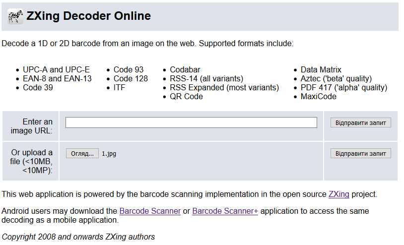                               

рис.1

 Натисніть «Відправити запит»,  при вдалій обробці запиту буде повернений результат з кодом, подібно до наведеного на рис.2.   

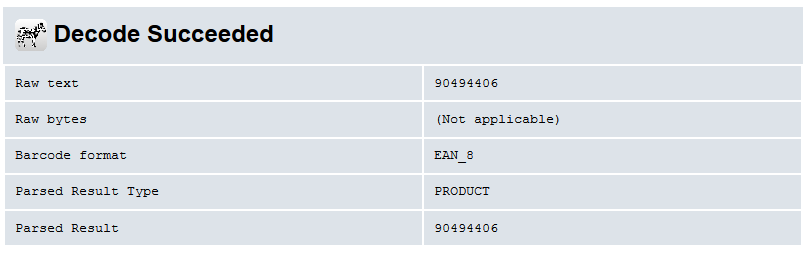 

рис.2

###### 2. Робота з Монітором мережі FireFox.

Активуйте в браузері FireFox інструмент «Монітор мережі», або аналогічний в інших браузерах. Робота з Монітором мережі описана за [посиланням](https://developer.mozilla.org/uk/docs/Інструменти/Network_Monitor?fbclid=IwAR2UDrojQ7d6Jeu7IHzpmKv50LR-YE6BbE-JQzVtolW3aJs1_kG7WxFQuK4). Виставте опцію «Вимкнути кеш» з панелі інструментів Монітору мережі. Відкрийте в браузері сторінку https://zxing.org . Подивіться список мережних запитів, які були зроблені при завантаженні сторінки, зокрема зверніть увагу на наступні значення:

- скільки запитів було зроблено
- які причини та типи запитів
- які були повернуті результати (стани), скористуйтеся [даним ресурсом Вікіпедії](https://uk.wikipedia.org/wiki/Список_кодів_стану_HTTP) для визначення стану

 

 рис.3

###### 3. Аналіз заголовків 1-го мережного запиту та відповіді.

Активуйте панель [Подробиць мережних запитів](https://developer.mozilla.org/uk/docs/Tools/Network_Monitor/request_details) , відкрийте панель «Заголовки» для першого запиту в списку. Ознайомтеся з призначенням використаних в запиті заголовків з ресурсів Інтернет, наприклад з [Вікіпедії](https://uk.wikipedia.org/wiki/Список_заголовків_HTTP) , сторінкою із [MDN](https://developer.mozilla.org/uk/docs/Web/HTTP/Заголовки/Content-Length) або іншими аналогічними. 

Заповніть перші два поля таблиці, наведеної нижче, для пояснення заголовків **в запиті**. Для зручності розшифровки можете скористатися посиланнями в колонці Заголовок.  Інші поля можете розібрати за бажанням.  

Таб.1. Пояснення значень заголовків запиту

| **Заголовок**                                                | **Значення**                                                 | **Пояснення  значень заголовків** |
| ------------------------------------------------------------ | ------------------------------------------------------------ | --------------------------------- |
| [Accept-Encoding](https://developer.mozilla.org/uk/docs/Web/HTTP/Заголовки/Accept-Encoding) | gzip, deflate, br                                            |                                   |
| [Accept-Language](https://developer.mozilla.org/uk/docs/Web/HTTP/Заголовки/Accept-Language) | uk-UA,uk;q=0.8,en-US;q=0.5,en;q=0.3                          |                                   |
| Cache-Control                                                | no-cache                                                     |                                   |
| Connection                                                   | keep-alive                                                   |                                   |
| Host                                                         | zxing.org                                                    |                                   |
| Pragma                                                       | no-cache                                                     |                                   |
| Upgrade-Insecure-Requests                                    | 1                                                            |                                   |
| User-Agent                                                   | Mozilla/5.0 (Windows NT 10.0; …) Gecko/20100101 Firefox/64.0 |                                   |

  

рис.4

Заповніть поля таблиці для заголовку Location для пояснення **відповіді** . Для зручності розшифровки можете скористатися посиланнями в колонці Заголовок. 

Таб.2. Пояснення значень заголовків відповіді

| **Заголовок**                                                | **Значення**   | **Пояснення  значень заголовків** |
| ------------------------------------------------------------ | -------------- | --------------------------------- |
| [Location](https://developer.mozilla.org/uk/docs/Web/HTTP/Заголовки/Location) | /w/decode.jspx |                                   |

 

  

рис.5.

Перегляньте вміст відповіді у вкладці «Відповідь» на перший запит. 

Зробіть висновок щодо результату запиту. Впишіть результати в перший рядок таблиці 3. 

Таб.3. Пояснення до запитів та відповідей

| **№** | **Запит (метод,** **URL****)** | **Пояснення до запиту,  ініціатор**                      | **Відповідь (стан –  пояснення )** | **Пояснення до відповіді** |
| ----- | ------------------------------ | -------------------------------------------------------- | ---------------------------------- | -------------------------- |
| 1     | GET https://zxing.org/         | Запит на документ, ініціював користувач в рядку браузеру | 301 - ???                          |                            |
| 2     |                                |                                                          |                                    |                            |
| 3     |                                |                                                          |                                    |                            |
| 4     |                                |                                                          |                                    |                            |
| 5     |                                |                                                          |                                    |                            |

###### 4. Аналіз заголовків 2-го мережного запиту та відповіді.

Проаналізуйте другий запит та відповідь на нього. Зверніть увагу на зовнішній вигляд у вікні «Перегляд» у порівнянні з виглядом завантаженої сторінки. Чим вони відрізняються? 

Відкрийте корисне навантаження відповіді на панелі «Відповідь» (у форматі HTML). Для того, щоб зручніше проаналізувати вміст завантаженої сторінки, скопіюйте його, відкрийте на іншій закладці браузеру посилання https://www.freeformatter.com/html-formatter.html та помістіть скопійований текст в поле «Option 1: Copy-paste your HTML document here» після чого натисніть на кнопку «format HTML». У вікні «Formatted HTML:» з’явиться відформатований код сторінки в форматі HTML. 

Проаналізуйте HTML код. Якщо ви до цього не знайомилися з мовою розмітки HTML - можете прочитати [цей урок](допомога по призначенню тегу тут). 

Зверніть увагу на тег **link** в заголовку HTML (допомога по призначенню тегу [тут](https://css.in.ua/html/tag/link)), та img (допомога по призначенню тегу [тут](https://css.in.ua/html/tag/img)).

Заповніть 2-й рядок таблиці 3. 

###### 5. Аналіз заголовків 3,4 мережного запиту та відповіді.

Проаналізуйте 3-й та 4-й запити та відповіді. За якої причини з`явилися ці запити? Заповніть 3-й та 4-й рядок таблиці 3. 

###### 6.Аналіз заголовків 5 мережного запиту та відповіді.

Для розуміння 5-го запиту, прочитайте цю статтю https://uk.wikipedia.org/wiki/Favicon . Заповніть 5-й рядок таблиці 3. 

###### 7. Аналіз форми в HTML .

Проаналізуйте частину HTML що відповідає за 2-гу форму (отримання коду по зображенню, що відправляється). Про форми в HTML та тег form, можна прочитати [за цим посиланням](https://css.in.ua/html/tag/form).  

###### 8. Аналіз заголовків та змісту POST.

Використовуючи кнопку «Очистити» що знаходиться на панелі інструментів Монітору мережі, очистіть список запитів. Завантажте будь-який файл з зображенням штрих-коду, як робили це в п.1. Натисніть «Відправити запит». При вдалій обробці запиту буде повернений результат з кодом. 

Використовуючи подробиці мережного запиту [POST](https://developer.mozilla.org/uk/docs/Web/HTTP/Methods/POST) продивіться та проаналізуйте Заголовки. Зробіть копію екранів з заголовками та впишіть пояснення в таблиці 4. Для пришвидшення пошуку призначення заголовків користуйтесь посиланнями, що прив’язані до назв заголовків. Про типи MIME можна прочитати [тут](https://developer.mozilla.org/uk/docs/Web/HTTP/Basics_of_HTTP/MIME_types). 

 Таб.4. Пояснення значень заголовків запиту

| **Заголовок**                                                | **Значення** | **Пояснення  значень заголовків** |
| ------------------------------------------------------------ | ------------ | --------------------------------- |
| [Content-Length](https://developer.mozilla.org/uk/docs/Web/HTTP/Заголовки/Content-Length) |              |                                   |
| [Content-Type](https://developer.mozilla.org/uk/docs/Web/HTTP/Заголовки/Content-Type) |              |                                   |

Використовуючи подробиці мережного запиту POST продивіться та проаналізуйте Параметри.

Зробіть копію екрану корисного навантаження запиту.

###### 9. Аналіз відповіді на POST

Відкрийте корисне навантаження відповіді на панелі «Відповідь» (у форматі HTML). Для того, щоб зручніше проаналізувати вміст завантаженої сторінки, скопіюйте його, відкрийте на іншій закладці браузеру посилання https://www.freeformatter.com/html-formatter.html та помістіть скопійований текст в поле «Option 1: Copy-paste your HTML document here» після чого натисніть на кнопку «format HTML». У вікні «Formatted HTML:» з’явиться відформатований код сторінки в форматі HTML. 

Знайдіть місце в документі HTML, де виводиться значення штрих-коду. Зробіть копію екрану і виділіть це місце.  

## 2. Реалізація клієнта HTTP в Node-RED

В даній частині лабораторної роботи необхідно в Node-RED розробити програму для визначення штрих-коду по зображенню, використовуючи сервіси https://zxing.org . Для розуміння цієї частини лабораторної знадобляться результати, отримані в частині 2.1. 

###### 1. Підготовчі роботи. 

На диску C:\ створіть директорію «Temp», якщо вона ще не існує. У цій директорії створіть директорію «barcods», в якій будуть розміщуватися усі необхідні файли для лабораторної роботи. В директорії C:\Temp\barcods створіть директорію “raw” для розміщення вихідних файлів зображень. Скопіюйте в папку «C:\Temp\barcods» та «C:\Temp\barcods\raw» файл з зображенням штрих-коду, що використовувався в попередній частині, наприклад взятий [звідси](https://drive.google.com/open?id=1HqK3ItqtxigkonY8VWg2fHVsA_XaEwY2). 

###### 2. Читання файлу. 

Завантажте Node-RED. 

Зробіть статус усіх потоків неактивним.

Створіть новий потік з назвою «Laba2_WEBAPI». Цей потік буде використовуватися для даної частини лабораторної роботи.

З [довідника](https://drive.google.com/file/d/1tbhv1j-tiUGpIlAO4kWlInCRXJh0ZIqf/view?usp=sharing) ознайомтеся з вбудованими функціями роботи з файлами. З розділу “Storage” палітри вузлів вставте вузол “File in”. Налаштуйте його таким чином, щоб він зчитував дані з файлу з штрих-кодом та виводив його вміст на панель відлагодження (Debug). Зверніть увагу, що виведення в Debug треба робити як “complete msg object” а не як “msg.payload”.  

Зробіть розгортання потоку, та з використанням панелі відлагодження подивіться що зміст файлу виводиться як масив байт (рис.6). 

  

рис.6.

###### 3. Формування запиту. 

Для роботи в Node-RED HTTP-клієнту використовується вузол «HTTP request». Ознайомтеся з його роботою з [довідника](https://drive.google.com/file/d/1tbhv1j-tiUGpIlAO4kWlInCRXJh0ZIqf/view?usp=sharing).

Для формування запиту необхідно сформувати на вході вузла «HTTP request» його заголовки та тіло. З попередньої частини лабораторної роботи видно, що для отримання штрих-коду по зображенню необхідно сформувати запит з методом POST, який буде багато-частинним, тобто складатися з розділів, що відокремлюються межами. У даному випадку розділ є тільки один, який включає вміст файлу зображення.  Для пришвидшення виконання лабораторної роботи імпортуйте в потік підготовлений код для вузлу «Формувати запит», файл імпорту завантажте [звідси](https://drive.google.com/open?id=1d1xujfMU5Z50m6xxTpjJ_f0i_QzuNFhz). Уважно ознайомтеся з його вмістом. 

Модифікуйте програму, як це показано на рис.7. Зробіть розгортання, активуйте ініціювання повідомлення в Inject і подивіться на вміст об’єкту на панелі відлагодження. Порівняйте результат з заголовками та вмістом запиту POST з п.1.8 попередньої частини («Знайомство з роботою HTTP»). Що відрізняється і чому? Результат порівняння і пояснення впишіть в звіт до лабораторної роботи.

 

 рис.7.

 

###### 4. Відправлення запиту.

З розділу «function» палітри вузлів вставте вузол «HTTP request». Модифікуйте програму, як це показано на рис.8. Зверніть увагу, що для кращого тестування бажано вивести як вхідне так і вихідне повідомлення «HTTP request». 

Зробіть розгортання, активуйте Inject, через кілька секунд на панелі відлагодження з’явиться інформація про об’єкт-відповідь. Порівняйте результат з заголовками та вмістом відповіді POST з п.9 попередньої частини («Знайомство з роботою HTTP»).  Результат виконання вважається позитивним, якщо у відповіді буде напис «Decode Succeeded». Знайдіть значення штрих-коду.

 

 

рис.8.

###### 5. Розбирання запиту по частинам.

Для витягування потрібних елементів з HTML-контенту в Node-RED використовується вузол «HTML». Ознайомтеся з його роботою з [довідника](https://drive.google.com/file/d/1tbhv1j-tiUGpIlAO4kWlInCRXJh0ZIqf/view?usp=sharing).

З розділу function палітри вузлів вставте «HTML». Модифікуйте програму, як це показано на рис.9. Селектор вибирає елемент HTML з ID=”result” у якого вибирає усі-елементи нащадки з тегом «pre».

 

рис.9 

Зробіть розгортання, активуйте Inject, через кілька секунд на панелі відлагодження з’явиться інформація про масив вибірки.

Добавте вузол-функцію для присвоєння значення msg.ID рівним номеру штрих-коду при позитивній відповіді, та “ERROR” при помилці обробки (рис.10).  Зробіть розгортання, активуйте Inject та перевірте роботу програми.  

 

рис.10.

## 3. Використання відкритого WEB API 

Ознайомтеся з принципами роботи WEB-API та REST (даються в лекційному матеріалі).

Багато застосунків в Інтернеті мають відкритий API інтерфейс для доступу до різних ресурсів як сервісів чи даних. Більшість з них є платними і надаються за підпискою. Деякі з них мають можливість обмеженого користування на певний період чи на певну продуктивність. 

Дана частина лабораторної роботи призначена для знайомства з тестовими утилітами та для самостійної побудови WEB-клієнта для доступу через API з Node-RED.

###### 1. Знайомство з сервісами IPAPI.

Веб-застосунок  [IPAPI](https://ipapi.co/) дає можливість визначити деталі місця розташування за IP адресою. Це можна зробити через сторінку Веб-інтерфейсу, або через відкритий API-інтерфейс (обмеження на безкоштовне використання до 1000 запитів/день). Повний опис API доступний за [посиланням](https://ipapi.co/api).

Зайдіть на сторінку за посиланням https://ipapi.co. Ознайомтеся зі змістом сторінки. Зверніть увагу на ту інформацію, яка надається по IP-адресі, а також на значення Вашої білої адреси IP, вірніше від якої Ваш пристрій спілкується в Інтернеті. Слід розуміти, що у більшості випадків видима IP-адреса – це одна з адрес провайдера, що надає послуги Інтернету, тому координати будуть саме цього провайдера. 

Подивіться на приклад запиту і відповіді в форматі JSON. 

###### 2. Робота з онлайн утилітами для API-тестування.

Для тестування API Ви можете користуватися будь якою утилітою, наприклад  https://apitester.com/ або http://restninja.io/ 

Відкрийте сторінку однієї з утиліт. Для перевірки роботи IPAPI введіть в поле адреси https://ipapi.co/8.8.8.8/json/ у метод – «GET», і натисніть «SEND» (або TEST). Проаналізуйте відповідь

Повторіть те саме зі своїм білим IP. Порівняйте отримані результати з тими, що показані на сторінці https://ipapi.co 

###### 3. Створення клієнту для IPAPI в Node-RED. 

Створіть новий потік і реалізуйте програму, як показано на рис.11. Вузол “Http request” повинен робити запит на отримання даних про свою адресу IP, тобто в форматі https://ipapi.co/json/ . Результат запиту вивести у вікно налагоджування. Усі інші налаштування зробіть **самостійно**. Зверніть увагу, що **IPAPI може повернути негативну відповідь. Подивіться поля заголовків**  https://apitester.com/  **в запиті, і заповніть їх аналогічно у вузлі «****headers».** 

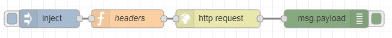     

   рис.11.

Зробіть копію фрагменту екрану виводу у вікні відлагодження і збережіть для звіту.

## 4. Робота з FRED - хмарним сервісом Node-RED  

На хмарних платформах, зокрема IBM, інструмент Node-RED можна використовувати як середовище для розробки програмних додатків. Є також можливість скористатися окремим хмарним сервісом FRED https://fred.sensetecnic.com/ . Ця платформа має безкоштовну ліцензію, обмежену 50-ма вузлами та потребує перезапуску (працює добу, після чого треба перезапускати). Для користування платформою потрібна безкоштовна реєстрація.

Даний сервіс буде використовуватися в лабораторних роботах в тому випадку, коли необхідно буде мати серверний додаток в Інтернет. 

###### 1. Реєстрація на FRED.

Зайдіть на https://fred.sensetecnic.com/ ознайомтеся з умовами ліцензії. 

Зайдіть на https://users.sensetecnic.com/register , зареєструйтеся:

- введіть необхідні дані в поля реєстрації, 
- виберіть PLAN Fred Short.
- виставте одну із опцій «How would you describe your use of FRED? (select one)»
- виставте одну або кілька опцій «What industry or area of interest are you using FRED for? (select all that apply)»
- виставте опцію «I agree to the Terms of Use»
- виставте опцію «Я не робот»
- ·     натисніть “Create An Account”
- через кілька хвилин на пошту прийде лист від [info@sensetecnic.com](mailto:info@sensetecnic.com) , в якому буде посилання  «Verify your email address»  для активації аккаунту

###### 2. Запуск FRED.

Зайдіть на https://fred.sensetecnic.com/ і якщо Node-RED не виконується, запустіть його натисканням “Start Instance”. Сховайте ліву бокову панель кнопкою «Togle slidebar» (стрілка в лівому нижньому кутку екрану)

Видаліть усі вузли в потоці, які вставлені туди при створенні аккаунту.

Створіть невеличку програму, наприклад, яка складається з двох з’єднаних вузлів «inject» та «debug», та перевірте її роботу.   

## 5. Використання WEB-сокетів 

Ознайомтеся з принципами роботи WEB-сокетів  (даються в лекційному матеріалі).

В даній частині лабораторної роботи WEB-сокети будуть використовуватися для наступних цілей:

- зв’язку між локальним (ПК) та віддаленим (FRED) Node-RED, тобто в якості подовжувача зв’язку між потоками
- зв’язку Node-RED з застосунками в Інтернет 
- зв’язку Node-RED з застосунками на мобільних пристроях 

При роботі з HTTP (у тому числі WEB-сокетами) FRED, як посередник, передає всі повідомлення з Інтернету на екземпляр Node-RED. Щоб відправити запит до конкретного екземпляру, FRED використовує ім'я користувача в заголовку для **приватних** вузлів введення API або URL для **загальнодоступних** вузлів вводу Websockets. 

Для створення загальнодоступного серверного вузла Websocket, необхідно в конфігураційному вузлі Websocket в URL-адресі прослухування вказати префікс «/public/». Тоді можна буде отримати доступ до websocket в

```http
wss://{ім'я користувача}.fred.sensetecnic.com/api/public/{custom_endpoint_name}.
```

Наприклад, вхідний вузол websocket, налаштований на шлях /public /data, створений користувачем mike, буде доступний як 

```http
wss://mike.fred.sensetecnic.com/api/public/data
```

Для того, щоб клієнт Websockets отримував доступ до захищених вузлів вводу Websocket у потоках, необхідно надати своє ім'я користувача та пароль, використовуючи базову аутентифікацію, або ключ API з вашими запитами. Щоб зробити запит до захищеного вузла вводу веб-сокету, ім'я користувача та ключ API повинні бути додані до заголовків запиту: x-auth-user та x-auth-key. В даній лабораторній роботі не будуть використовуватися захищені приватні з’єднання. 
З деталями роботи з Веб-сокетами на платформі FRED, можна ознайомитися [тут](http://docs.sensetecnic.com/fred/websocket-access/). 

######  1. Створення серверного WEB-сокету в FRED.

В Node-RED на платформі FRED створіть вхідний серверний “WebSocket In”  та з’єднайте його з вузлом “Debug” (рис.12) 

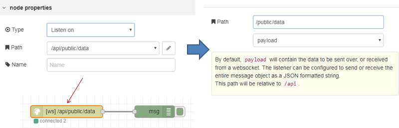 

рис.12.

Відкрийте Веб-інтерфейс Dashboard FRED, скопіюйте адресу, вона повинна мати вигляд:

```http
https://account_name.fred.sensetecnic.com/api/ui/
```

де *account _name –* ім’я вашої реєстрації 

###### 2.Створення клієнтського WEB-сокету в локальному Node-RED.

Запустіть Node-RED на локальному ПК. Створіть новий потік, в ньому розмістіть два вузли – клієнтський “WebSocket out”  та “Inject” (рис.13). Налаштуйте відповідно до вашого серверного сокету. Перевірте роботу з’єднання. Зробіть копію екрану потоку на FRED, на якій видно адресу вашого аккаунту і наявність з’єднання – зелений напис «connected». Добавте його до звіту.  

 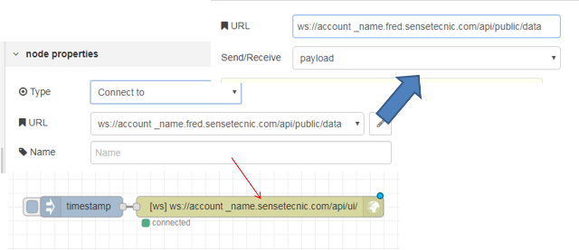 

 рис.13.

###### 3. Перевірка роботи сервісів WEB-сокету через онлайн утиліти.

Самостійно зробіть тестування клієнтського WEB-сокету в локальному Node-RED, під’єднавшись до wss://echo.websocket.org. Цей сервер передбачає ехо-відповіді на запити, тому для перевірки його роботи необхідно як вхідний так і вихідний клієнтські сокети.  

Самостійно зробіть тестування створеного раніше серверного WEB-сокету на FRED через севіс https://www.websocket.org/echo.html 


**Наступні частини не є обов’язковими для виконання!**

## 6. Використання WEB-сокетів для з’єднання мобільного застосунку та Node-RED  

В даній частині лабораторної роботи використовується безкоштовна версія застосунку  [Wireless Barcode Scanner](https://www.tec-it.com/ru/software/mobile-data-acquisition/wireless-barcode-scanner/overview/Default.aspx)  для пристроїв з Android. Даний застосунок дає можливість відсканувати і розпізнати штрих-код і передати його по наступним мережним протоколам:  

- Bluetooth, 
- TCP/IP, 
- UDP 
- HTTP 
- WebSocket

В даній частині в якості віддаленого сканера пропонується використати пристрій з  Android, який буде передавати сканований штрих-код по WebSocket через WiFi. Мобільний пристрій і ПК повинні бути в одній мережі.

###### 1. Налаштування дозволів використання вхідних портів на ПК.

Типово, вхідні порти ПК заблоковані брандмауером Windows. Тому необхідно налаштувати брандмауер Windows для можливості використання вхідного порту з мережі, а саме:

- відключити правила, що забороняють доступ до порту 1880 та роботи Node.js
- добавити правило, що дозволяє доступ до порту 1880

Відкрийте налаштування брандмауера Windows через «Панель керування»-«Адміністрування» - «брандмауер Windows». Відключіть усі правила що забороняють доступ JavaScript Node.js, добавте та активуйте правило для вхідних підключень по порту 1880 (рис.14) 

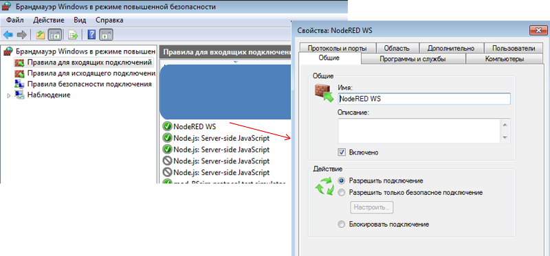  

рис.14.

###### 2. Конфігурація WebSocket server в застосунку Node-RED. 

Відкрийте програму, що була створена в частині 2.2 «Реалізація клієнта HTTP в Node-RED» (Потік «Laba2_WEBAPI»). Вставте вузол “Websocket In”, що буде очікувати з’єднання та отримувати по ньому дані (рис.15).

 

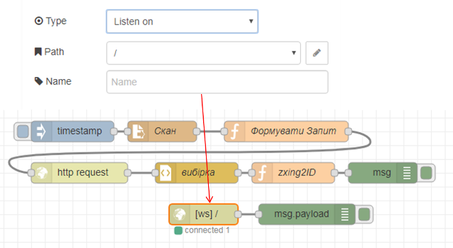 

рис.15.

 

###### 3. Встановлення та налаштування мобільного застосунку.

Встановіть на мобільний пристрій безкоштовну версію [Wireless Barcode Scanner](https://play.google.com/store/apps/details?id=com.tecit.android.bluescanner.demo) .  

Визначте IP-адресу ПК, через яку буде проводитися доступ до нього з мережі (можна подивитися у властивостях мережної карти). 

Запустіть застосунок Wireless Barcode Scanner. Відкрийте конфігурацію через пункт меню «setting».  Виставіть наступні налаштування в розділі Data link:

- Data transfer – вкл.
- Connection type – WebSocket client
- Configuration – Host=xx.xx.xx.xx, Port=1880

де xx.xx.xx.xx – номер IP ПК з Node-RED

Вийдіть з конфігурації застосунку в режим сканування. Якщо з’єднання відбулося, внизу екрана з’явиться зелена літера “**і**”, якщо ні – червона «**!**» .

 

###### 4. Перевірка роботи.

У Wireless Barcode Scanner в робочому режимі відскануйте штрих-код шляхом натискання кнопки “Scan”.

На панелі відлагодження Node-RED повинен з’явитися буфер відсканованих символів, що закінчуються двома символами – кінця і переведення рядку , тобто 0xd та 0xa (рис.16). 

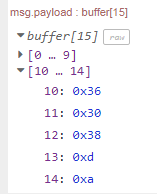      

рис.16

###### 5. Визначення ID.

Добавте функцію яка буде перетворювати отриманий буфер в символьний рядок ID (рис.17).

 

рис.17

Перевірте роботу, проконтролюйте щоб ID в повідомленні співпадав з ID на штрих-коді.

 

## 7. Доробка застосунку в Node-RED для фіксації штрих-кодів в базі даних та виведення по ним інформації.  

У даній частині лабораторної роботи необхідно доробити розроблену програму таким чином, щоб вона виконувала наступні функції:

1. ведення бази даних (текстовий файл) по продуктам за зчитуваними штрих-кодами; в БД записується:

- країна походження продукту: визначається автоматично за номером штрих-коду EAN-13
- джерело надходження в базу номеру штрих-коду: ім’я файлу зображення штрих-коду або напис «Android»
- дата та час надходження в базу номеру штрих-коду
- найменування продукту: вноситься вручну
- опис продукту: вноситься вручну
- посилання на PDF-файл документації: вноситься вручну 

2. перевірка наявності в директорії нових файлів з розширенням *.jpg  і *.png, автоматичне їх сканування і перейменування (для уникнення повторної обробки)

3. внесення в БД тільки тих штрих-кодів, які в ній відсутні

4. при скануванні існуючого в БД штрих-коду на веб-інтерфейс повинна бути виведена інформація за вказаним продуктом включно з PDF-файлом документації

5. помилка читання повинна бути зафіксована в журналі подій 

 

###### 1. Формування бази країн по EAN-коду.

[Завантажте та інсталюйте Notepad++](https://notepad-plus-plus.org/download), який Вам знадобиться для перегляду та коректної правки текстових файлів. 

Відкрийте потік LAbA2_WEBAPI. Імпортуйте в потік частину програми [з цього посилання](https://drive.google.com/open?id=1GxCa756Tr7V5VuVb9pRYiB8fFrfLLg3b). Вона матиме вигляд, як на рис.18. 

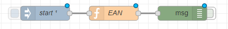  

рис.18.

Зробіть розгортання проекту. Активуйте відображення повідомлень з Msg (воно за замовчуванням в прихованому режимі). При старті системи, або при активації кнопкою елементу Inject “Start” у вікно налагодження буде виведено масив, в якому індекс відповідає за номер країни, а значення – за назву. Про деталі відповідності номеру країні можна прочитати [за цим посиланням](https://109.te.ua/219).

Подивіться на вміст функції EAN. При старті значення кодів також будуть записуватися в контекст потоку, у його властивість «arEAN», значення якої можна буде прочитати у будь якому вузлі цього потоку.

2. ###### Модифікація структури запису по продукту та виведення помилок сканування.

Імпортуйте в потік вузол-функцію «IDparse»  [з цього посилання](https://drive.google.com/open?id=1JOUfwNPxoFyIyHUAQb2WIjBUAFp3EB5G). Модифікуйте програму щоб вона виглядала так, як на рис.19.

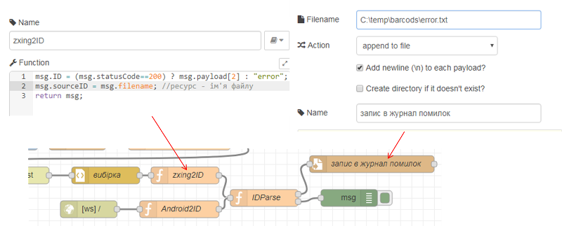 

рис.19.

Зробіть розгортання програми, активуйте повідомлення вприскуванням Inject. Тепер після обробки запиту на панелі відлагодження повинен з’явитися об’єкт з властивістю prodinfo, в якій будуть поля та значення, що описані в переліку функцій.

###### 3. Запис в базу даних (текстовий файл).

Модифікуйте програму так, як показано на рис.20.

 

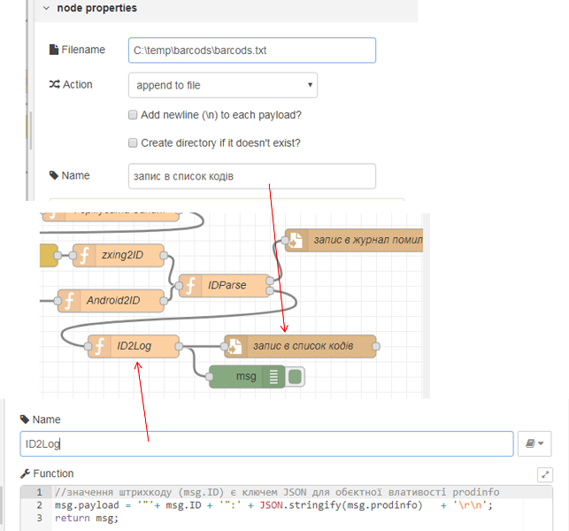    

рис.20

Розгорніть та запустіть на виконання, активуйте перерахунок потоку. В файл barcods.txt повинен записатися об’єкт з записами prodinfo. 

**Примітка.  Якщо в файлі некоректно відображається кирилиця (характерно для** **Windows 7 x86) необхідно зробити наступні кроки:**

\-     **встановити в Node-RED модуль contrib-iconv (рис.21)**

\-     **модифікувати програму, як показано на рис.22**

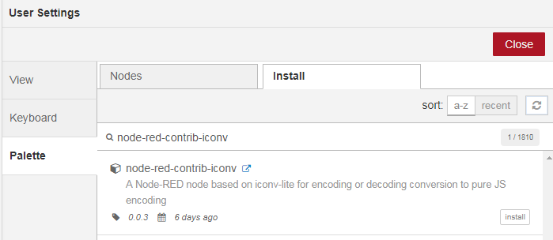  

рис.21

 

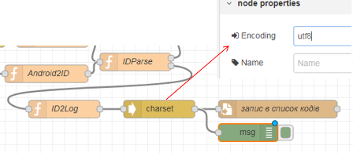 

рис.22

 

###### 4. Перевірка наявності в директорії файлів з розширенням \*.jpg і \*.png.

Завантажте [файли зі штрих-кодами](https://drive.google.com/open?id=1DS5j0x_LsYLt3zFds5rJE_n7thzNDvN9)  в директорію «C:\Temp\barcods\raw» вони будуть використовуватися як файли з зображеннями для сканування. **Для пришвидшення сканування можете обробити файли так, щоб на них залишилися тільки зображення штрих-кодів.** 

Інсталюйте модуль «node-red-contrib-fs-ops», в ньому знаходяться два вузли, які знадобляться для лабораторної роботи “dir” і “move”. Познайомтеся з принципами їх роботи з [довідника](https://drive.google.com/file/d/1tbhv1j-tiUGpIlAO4kWlInCRXJh0ZIqf/view?usp=sharing).

Перевірте роботу алгоритму вибірки файлів за фільтрами *.jpg та *.png  за допомогою фрагмента програми, показаного на рис.23.    

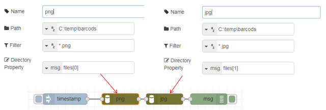  

рис.23

Зробіть розгортання, перекопіюйте декілька файлів з директорії «C:\Temp\barcods\raw» в «C:\Temp\barcods», запустіть фрагмент на виконання і подивіться на вміст панелі відлагодження.

 

###### 5. Пошук графічних файлів в директорії.

Імпортуйте вузол-функцію “find” [з цього посилання](https://drive.google.com/open?id=1efCSmwManiFmoUq0_ikfBdxKN8bbJG0s). Цей вузол об’єднує масиви назв «*.jpg» та «*.png» і шукає в них перший файл, в якого назва не містить послідовність літер «cmplt» (ця послідовність використовуватиметься для маркування оброблених файлів). Модифікуйте фрагмент програми, як це показано на рис.24. Перевірте його роботу.

 

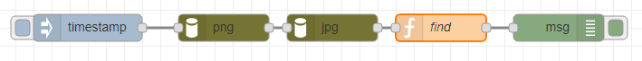 

рис.24

###### 6. Автоматичне сканування і перейменування знайдених файлів. 

Модифікуйте програму, щоб вона мала вигляд як на рис.25. Зверніть увагу, що назву файлу з вузлу «Скан» треба видалити, тільки в такому разі назва файлу буде братися з властивості повідомлення “msg.filename”. Перевірте як працює програма.

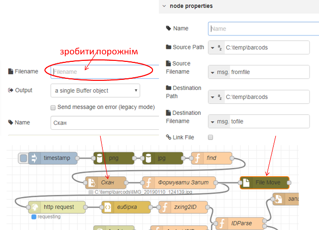 

рис.25

 

Модифікуйте програму так, щоб вузол «Timestamp» генерував повідомлення кожні 2 секунди.

Таким чином кожні 2 секунди буде скануватися один із графічних файлів і перейменовуватися з префіксом «cmplt_».

 

###### 7. Синхронізація сканування та періодичності обробки файлів.

Видаліть усі графічні та текстові файли з директорії «C:\Temp\barcods» . Скопіюйте усі графічні файли з директорії «C:\Temp\barcods\raw» в «C:\Temp\barcods».  Прослідкуйте з якою частотою обробляються запити у вузлі «http request» та “File move”. Node-RED дозволяє розсинхронізовувати потоки таким чином, що на вхід вузла може прийти декілька повідомлень, які він буде обробляти поступово, буферизуючи їх. Однак в деяких випадках така обробка небажана. Тому в даному пункті необхідно зробити синхронізацію: пошук нових файлів проводити тільки у випадку, коли не відбувається очікування відповіді на запит «http request». Контроль стану вузла можна проводити за допомогою вузла “Status”. 

Модифікуйте програму так, щоб відбувалася синхронізація між знаходженням нового файлу і відсутності очікування відповіді від серверу (рис.26). Також модифікуйте функцію «find» (рис.27).  

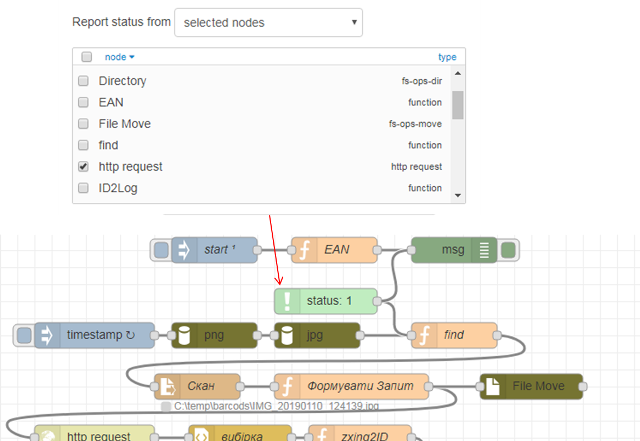

рис.26

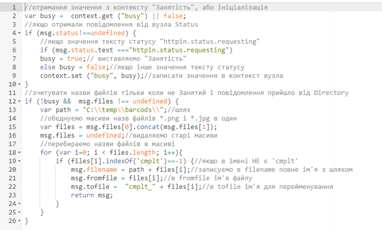  

рис.27

###### 8. Внесення в БД тільки тих штрих-кодів, які в ній відсутні. 

Імпортуйте вузол-функцію «Наявна в БД?» [з цього посилання](https://drive.google.com/open?id=1pVIatwRYlrh8ff5IihpL0cPWgRvN6pFG).  Модифікуйте програму як це показано на рис.28. Вузол “Directory” перевіряє наявність файлу «barcods.txt» в директорії. Якщо файлу не існує, вузол «switch» направляє повідомлення тим саме шляхом, як і до модифікації програми. Якщо файл є, повідомлення ініціює вузол «Читання», який зчитує зміст БД. Вузол-функція «Наявна в БД» перевіряє, чи є запис в БД, і якщо ні направляє повідомлення стандартним шляхом. Якщо запис в базі існує, то на другому (не підключеному) виході формується повідомлення з об’єктом, зчитаним з БД. Цей вихід буде використовуватися в подальшому.  

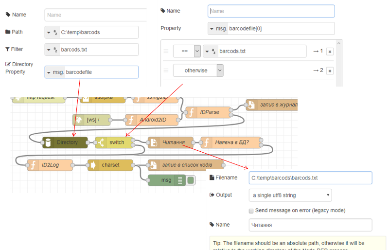 

рис.28

Видаліть усі графічні та текстові файли з директорії «C:\Temp\barcods» . Скопіюйте усі графічні файли з директорії «C:\Temp\barcods\raw» в «C:\Temp\barcods». Зробіть розгортання потоку і запустіть на виконання. Після обробки всіх файлів, скопіюйте ще раз один з них, в БД не повинен з’явитися новий запис. 

 

###### 9. Виведення інформації на ВЕБ-інтерфейс при скануванні існуючого в БД штрих-коду.

Імпортуйте вузли для ВЕБ-інтерфейсу [з цього посилання](https://drive.google.com/open?id=16M2KtRBFCY8RfirXK5EranyuGtaFU0hN). Модифікуйте програму як показано на рис.29. Зробіть розгортання. 

 

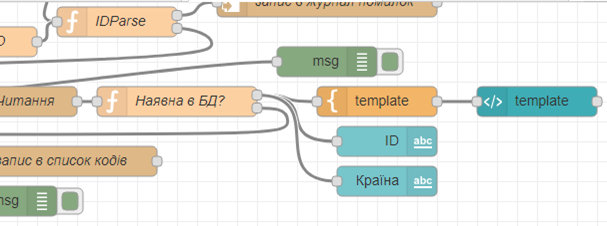  

рис.29

Відкрийте Веб-інтерфейс на закладці «Штрих-коди». Скопіюйте один із файлів зображень штрих-коду що є в БД в директорію «C:\Temp\barcods» або зробіть його скан з мобільного застосунку. На Веб-інтерфейсі повинен з’явитися його код, та країна походження. Повторіть те саме з іншим файлом.    

###### 10. Ручна модифікація БД та виведення додаткової інформації на ВЕБ-інтерфейс при скануванні існуючого в БД штрих-коду.

Для двох або більше штрих-кодів із файлу «barcods.txt» знайдіть назви, опис та посилання на файл PDF з Інтернету. Заповніть ці поля в БД, використовуючи Notepad++. Наприклад:

```json
"3606480071058":{"Country":"Франція","sourceID":"C:\\temp\\barcods\\IMG_20190110_124139.jpg","sourcedoc":"http://elprivod.nmu.org.ua/ua/student/techdoc/pch/atv12_%D1%80%D1%83%D0%BA_%D0%BF%D0%BE%D0%BB%D1%8C%D0%B7.pdf","name":"ATV12H037M2","descr":"variable speed drive ATV12 - 0.37kW - 0.55hp - 200..240V - 1ph - with heat sink","inputdate":"2019-1-11 23:34:54"}
```

```json
"3389110146608":{"Country":"Франція","sourceID":"C:\\temp\\barcods\\IMG_20190110_124417.jpg","sourcedoc":"https://www.alliedelec.com/m/d/68afa7d7064e3bef2fc703440bf8f780.pdf","name":"XS630B1PAL2","descr":"inductive sensor XS6 M30 - L62mm - brass - Sn15mm - 12..48VDC - cable 2m","inputdate":"2019-1-11 23:35:24"}  
```

Збережіть зміни. Скопіюйте файл з зображенням або відскануйте його мобільним застосунком Wireless Barcode Scanner. Дочекайтеся коли його буде оброблено, після чого на Веб-інтерфейсі повинен з’явитися документ, який було вказано в БД. Зробіть те саме з іншим файлом.  

 

###### Самостійні завдання (необов’язкове для виконання).

1) Виведіть на Веб-інтерфейс всю інформацію про товар.

2) Наведена програма має певні вади. Зокрема, вона не класифікує штрих-коди по типу, тому невірно в ряді випадків визначає країну походження. Зробіть модифікацію так, щоб країна походження визначалася тільки для кодів EAN-13. Можна також класифікувати типи штрих-кодів та обробляти їх окремо. 

[<- 1 частина](lab2MQTT.md)