**Програмна інженерія в системах управління. Лабораторний практикум.** Автор і лектор: Олександр Пупена 

| [<- до лаборних робіт](README.md) | [на основну сторінку курсу](../README.md) |
| --------------------------------- | ----------------------------------------- |
|                                   |                                           |

# Лабораторна робота №2. Робота з TCP/UDP та HTTP

**Тривалість**: 4 акад. години.

**Мета:** навчитися працювати з засобами тестування та налагодження TCP/UDP та HTTP та відповідними вузлами в середовищі Node-RED.  

**Лабораторна установка**

- Апаратне забезпечення: ПК. 
- Програмне забезпечення: Node-RED, утиліти Packet Sender, WireShark, браузер.

## Порядок виконання роботи 

Визначте дані відповідно до варіанту, який видається на початку курсу.

| Параметр                                                     | Значення               |
| ------------------------------------------------------------ | ---------------------- |
| Номер вхідного UDP порту для Node-RED (вихідного для `Packet Sender`) | Номер варіанту + 20000 |
| Номер вихідного UDP порту для Node-RED (вхідного для `Packet Sender`) | Номер варіанту + 21000 |
| Номер вхідного TCP порту для Node-RED (вихідного для `Packet Sender`) | Номер варіанту + 22000 |
| Номер вихідного TCP порту для Node-RED (вхідного для `Packet Sender`) | Номер варіанту + 23000 |

## 1. Тестові утиліти для роботи з TCP/UDP

### 1.1.Завантаження та встановлення тестових застосунків

У даній частині практичного заняття використовуються тестові утиліти для TCP та UDP обміну. Ці утиліти безкоштовні.

- [ ] Завантажте та встановіть Packet Sender <https://packetsender.com/>
- [ ] Завантажте та встановіть WireShark <https://www.wireshark.org/>

### 1.2. Робота з Packet Sender 

- [ ] Запустіть два екземпляри утиліти `Packet Sender`
- [ ] У налаштуваннях першого екземпляру у меню `File->Settings` вкажіть порт 5555 для серверного боку, а також активуйте повідомлення-відповідь. 

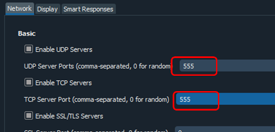

рис.2.1. Налаштування серверних портів

- [ ] Для 2-го екземпляру вкажіть повідомлення для відправки, протокол `TCP`, порт відповідно до варіанту ( наприклад `5555`) та адресу `127.0.0.1` і натисніть `Send`.
- [ ] Перейдіть на вікно `Traffic Log` і подивіться результат операції.   

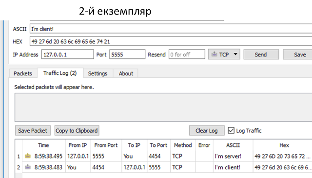

рис.2.2. Результат операції в обміну.

### 1.3. Робота з WireShark  

- [ ] За допомогою команди консольної команди `ping` визначте IP-адресу вузла з іменем `example.com`
- [ ] Запустіть WireShark 
- [ ] Виберіть інтерфейс (мережну карту), через який Ви працюєте з Інтернет

За замовченням Ви побачите весь трафік, який проходить через цей інтерфейс

- [ ] У WireShark у полі фільтра запишіть `ip.addr == 93.184.216.34`, де вказана адреса - це адреса  `example.com`. Цей фільтр задає відображення тільки тих пакетів, що відправляються чи отримуються з цієї адреси
- [ ] У Інтернет-браузері відкрийте http://example.com/
- [ ] У WireShark передивіться трафік, знайдіть HTTP-запит та HTTP-відповідь до цього вузлу.

### 1.4. Робота з `Loopback adapter` в WireShark  

- [ ] Перейдіть в меню `Захоплення -> Опції`, виберіть інтерфейс `Loopback adapter`, який захоплює пакети що циркулюють між застосунками на одному ПК. Якщо такого пункту немає (для старих версій) перейдіть до пункту 2.   
- [ ] У полі фільтра вкажіть `tcp.port == 5555`. Цей фільтр задає відображення тільки тих пакетів, що відправляються чи отримуються з даного порту
- [ ] Повторіть відправку пакету з п.1.2. 
- [ ] Знайдіть у WireShark TCP-пакети, які забезпечували передачу пакету з запитом та відповіддю.
- [ ] Закрийте WireShark без збереження пакетів.
- [ ] Закрийте усі екземпляри Packet Sender

## 2. Робота з UDP 

### 2.1. Робота з UDP-IN

- [ ] Запустіть Node-RED
- [ ] Створіть новий потік-вкладку, інші потоки видаліть 
- [ ] Релаізуйте в Node-RED фрагмент, який показаний на рис.2.3, але **вказавши номер порту відповідно до варіанту**
- [ ] Запустіть утиліту `Packet Sender`, якщо вона ще не запущена
- [ ] У `Packet Sender` виберіть режим UDP, вкажіть потрібний порт і текст, в якому англійськими літерами впишіть своє прізвище і натисніть `Send`

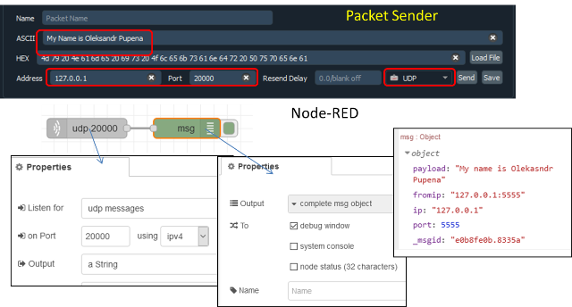

рис.2.3. Робота з UDP-IN в Node-RED

- [ ] Подивіться результат в панелі Debug, зробіть копію екрану з Node-RED

### 2.2. Налаштування вхідних портів `Packet Sender`  

- [ ] У `Packet Sender` виберіть меню `File->Settings`
- [ ] Налаштуйте вхідні порти для `Packet Sender` для TCP та UDP відповідно до варіанту

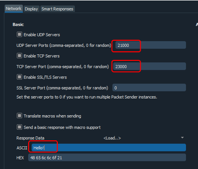

рис.2.4. Налаштування вхідних портів `Packet Sender` 

### 2.3. Робота з UDP-OUT

- [ ] У Node-RED модифікуйте програму, добавивши фрагмент програми для відправки текстового повідомлення по UDP, порт вкажіть відповідно до варіанту, прізвище вкажіть своє 
- [ ] Зробіть розгортання і ініціюйте запит з Node-RED. Перевірте отриманий пакет на Packet Sender і зробіть копію екрану.  

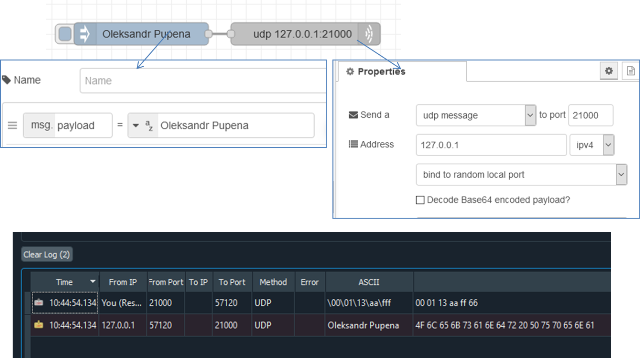

рис.2.5. Робота з UDP-OUT в Node-RED

## 3. Робота з об'єктом Buffer 

При роботі з бінарними даними в Node-RED використовується об'єкт Buffer.  Детально робота з цим об'єктом описана в [документації](https://nodejs.org/api/buffer.html). У цій частині необхідно перевірити деякі можливості при роботі з буфером. 

### 3.1. Використання Inject з типом Buffer

- [ ] Зробіть наступний фрагмент програми і перевірте його роботу.  


рис.2.6. Використання Inject з типом Buffer в Node-RED

### 3.2. Приклади роботи з Buffer

- [ ] Зробіть фрагмент потоку, наведений нижче. 

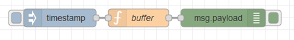

рис.2.7. Приклади роботи з Buffer в Node-RED

- [ ] Перевірте роботу фрагменту, поступово замінюючи і перевіряючи коди, наведені нижче
- виділення буферу вказаного розміру

```js
msg.payload = Buffer.alloc(16,255); // виділення буферу на 16 байт
return msg;
```

- отримання буферу з вказаного числового масиву

```js
msg.payload = Buffer.from([1, -1, 256, 0xFF]);//отримання буферу з вказаного масиву значень
return msg;
```

- конкатенація буферів

```js
let buf1 = Buffer.from([0,1,2]);
let buf2 = Buffer.from([3,4,5]); 
let buf3 = Buffer.from([6,7]);
msg.payload = Buffer.concat([buf1,buf3,buf2],buf1.length + buf2.length + buf3.length);
return msg;
```

### 3.3. Відправка бінарних даних по UDP

- [ ] Модифікуйте фрагмент програми з рис.2.5 так, щоб відправлялися бінарні дані з вузла буфер, що показаний на рис.2.6. 
- [ ] Зробіть ініціювання потоку, подивіться на результат в  `Packet Sender` 

## 4. Робота з TCP 

### 4.1. Реалізація TCP-клієнта в Node-RED 

- [ ] Проконтролюйте налаштування серверу TCP в `Packet Sender` (див.рис.2.4).
- [ ] Використовуючи вузол `tcprequest` добавте в програму наступний фрагмент (рис.2.8)

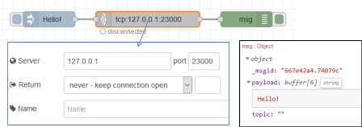

рис.2.8. Реалізація TCP-клієнта в Node-RED 

- [ ] Зробіть ініціювання потоку, використовуючи панель налагодження проконтролюйте щоб прийшла відповідь. Натискаючи на позначку `raw` змініть формат відображення на тип `string`.
- [ ] Зробіть копію екрану.

### 4.2. Реалізація TCP-сервера в Node-RED 

- [ ] Використовуючи вузли `tcpin` та `tcpout` добавте в програму наступний фрагмент (рис.2.9). Зверніть увагу що там повинне бути вписане Ваше ім'я та налаштування порту.

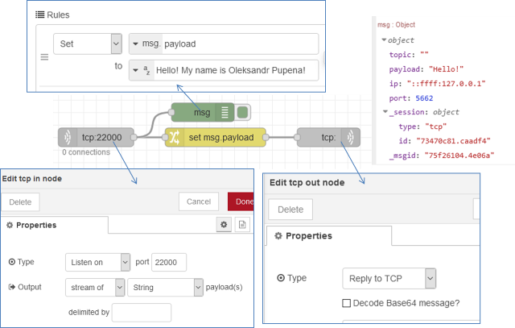

рис.2.9. Реалізація TCP-сервера в Node-RED

- [ ] Запустіть `Packet Sender` та відправте повідомлення на вказаний порт. 
- [ ] Проконтролюйте, що у відповідь до `Packet Sender` прийде записане у вузлі `change` повідомлення  

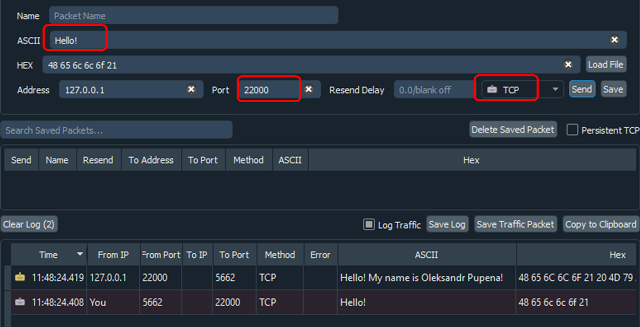 

рис.2.10. Перевірка роботи  в `Packet Sender` 

- [ ] Використовуючи вікно налагодження проаналізуйте зміст `msg`, отриманого з вузла `TCP-IN` (див. приклад рис.2.9)

## 5. Знайомство з роботою HTTP та використанням інструментів Веб-розробника  

Для перевірки роботи протоколу HTTP, відлагодження та тестування HTML, CSS і JavaScript в завантажених сторінках використовуються різноманітні інструменти Веб-розробника (WEB Developer Tools). Деякі з них є частиною браузерів, таких як Google Chrome або Mozila FireFox. Якщо Ви звикли працювати з Google Chrome, ознайомитися з вкладками і можливостями Ви можете за наступним [посиланням](https://www.quality-assurance-group.com/oglyad-instrumentiv-rozrobnyka-u-najpopulyarnishyh-brauzerah/). У даному практичному завданні показані приклали з використанням інструментів WEB Developer Tools, що вбудовані в Mozilla FireFox. Зокрема, для аналізу і тестування HTTP запитів використовується Монітор мережі, документація українською мовою для якого доступна за [посиланням](https://developer.mozilla.org/uk/docs/Інструменти/Network_Monitor?fbclid=IwAR2UDrojQ7d6Jeu7IHzpmKv50LR-YE6BbE-JQzVtolW3aJs1_kG7WxFQuK4). 

Для перевірки роботи запитів HTTP використовуватимуться сервіси сайту <https://barcatreader.onrender.com>. Ці сервіси дають можливість декодувати штрих-коди та QR-коди що передаються на сайт у вигляді зображення. Слід відмітити, що є багато програм, які можуть це робити в онлайн, дана використовується тільки в якості прикладу.   

### 5.1. Встановлення браузера FireFox

- [ ] У прикладах в лабораторній роботі використовується українська версія FireFox. Для спрощення роботи завантажте та встановіть її за наступним посиланням https://www.mozilla.org/uk/firefox/download/thanks/. При виконанні лабораторної роботи дозволяється використовувати і інші інструменти. 

### 5.2. Перевірка роботи ВЕБ-застосунку BarCat Reader 

- [ ] Відкрийте сторінку в браузері https://barcatreader.onrender.com/ і перевірте її роботу. Для цього завантажте будь-який файл з зображенням штрих-коду, наприклад [звідси](https://barcatreader.onrender.com/Samples) (див. рис.2.11).

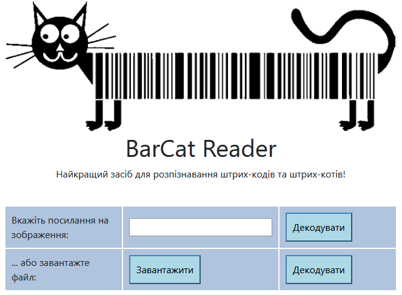                               

рис.2.11. Зовнішній вигляд ВЕБ-застосунку BarCat Reader 

Натисніть «Завантажити», оберіть файл з штрих-кодом, завантажте його та натисніть відповідну кнопку "Декодувати" при вдалій обробці запиту буде повернений результат з кодом, подібно до наведеного на рис.2.12.   

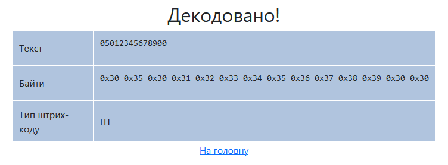 

рис.2.12. Результат декодування

### 5.3. Робота з Монітором мережі FireFox

- [ ] Активуйте в браузері FireFox інструмент монітору мережі «Веб-розробка->Мережі» (CTRL+Shift+E), або аналогічний в інших браузерах. Робота з Монітором мережі описана за [посиланням](https://developer.mozilla.org/uk/docs/Інструменти/Network_Monitor?fbclid=IwAR2UDrojQ7d6Jeu7IHzpmKv50LR-YE6BbE-JQzVtolW3aJs1_kG7WxFQuK4). 
- [ ] Виставте опцію «Вимкнути кеш» з панелі інструментів Монітору мережі. Це потрібно щоб не використовувалася інформація в кеші на Вашому ПК. 
- [ ] Відкрийте в браузері сторінку <https://barcatreader.onrender.com/>. 
- [ ] Проконтролюйте, щоб мережних запитів було 9. Якщо це не так - зробіть оновлення сторінки браузера іі знову впишіть вказану адресу.
- [ ] Подивіться список мережних запитів, які були зроблені при завантаженні сторінки, зокрема зверніть увагу на наступні значення:
  - скільки запитів було зроблено
  - які методи (спосіб) та типи запитів
  - які були повернуті результати (стани), скористуйтеся [даним ресурсом Вікіпедії](https://uk.wikipedia.org/wiki/Список_кодів_стану_HTTP) для визначення стану

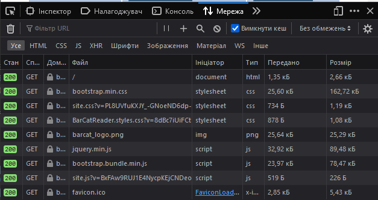 

 рис.2.13. Робота з Монітором мережі FireFox

### 5.4. Аналіз заголовків 1-го мережного запиту та відповіді

- [ ] Виберіть перший запис у списку запит і відкрийте панель «Заголовки».
- [ ] Ознайомтеся з призначенням використаних в запиті заголовків з ресурсів Інтернет, наприклад з [Вікіпедії](https://uk.wikipedia.org/wiki/Список_заголовків_HTTP) , сторінкою із [MDN](https://developer.mozilla.org/uk/docs/Web/HTTP/Заголовки/Content-Length) або іншими аналогічними. 
- [ ] Заповніть перші два поля таблиці, наведеної нижче, для пояснення заголовків **в запиті**. Для зручності розшифрування можете скористатися посиланнями в колонці Заголовок.  Інші поля можете розібрати за бажанням.  

Таб.2.1. Пояснення значень заголовків запиту

| **Заголовок**                                                | **Значення**                                                 | **Пояснення  значень заголовків** |
| ------------------------------------------------------------ | ------------------------------------------------------------ | --------------------------------- |
| [Accept-Encoding](https://developer.mozilla.org/uk/docs/Web/HTTP/Заголовки/Accept-Encoding) | gzip, deflate, br                                            |                                   |
| [Accept-Language](https://developer.mozilla.org/uk/docs/Web/HTTP/Заголовки/Accept-Language) | uk-UA,uk;q=0.8,en-US;q=0.5,en;q=0.3                          |                                   |
| Cache-Control                                                | no-cache                                                     |                                   |
| Connection                                                   | keep-alive                                                   |                                   |
| Host                                                         | barcatreader.onrender.com                                                    |                                   |
| Pragma                                                       | no-cache                                                     |                                   |
| Upgrade-Insecure-Requests                                    | 1                                                            |                                   |
| User-Agent                                                   | Mozilla/5.0 (Windows NT 10.0; Win64; x64; rv:109.0) Gecko/20100101 Firefox/116.0 |                                   |

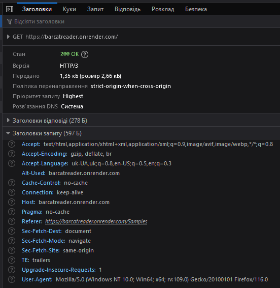  

рис.2.14. Аналіз заголовків 1-го мережного запиту

- [ ] Заповніть поля таблиці для заголовку Location для пояснення **відповіді** . Для зручності розшифрування можете скористатися посиланнями в колонці Заголовок. 

Таб.2.2. Пояснення значень заголовків відповіді

| **Заголовок**                                                | **Значення**   | **Пояснення  значень заголовків** |
| ------------------------------------------------------------ | -------------- | --------------------------------- |
| [Location](https://developer.mozilla.org/uk/docs/Web/HTTP/Заголовки/Location) | / |                                   |

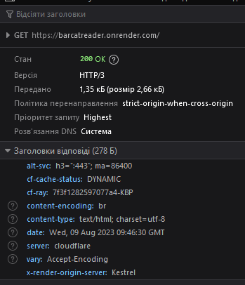  

рис.2.15. Аналіз заголовків відповіді для 1-го мережного запиту

- [ ] Перегляньте вміст відповіді у вкладці «Відповідь» на перший запит. Зробіть висновок щодо результату запиту. Впишіть результати в перший рядок таблиці 3. 

Таб.3. Пояснення до запитів та відповідей

| **№** | **Запит (метод,** **URL**) | **Пояснення до запиту,  ініціатор**                      | **Відповідь (стан –  пояснення )** | **Пояснення до відповіді** |
| ----- | -------------------------- | -------------------------------------------------------- | ---------------------------------- | -------------------------- |
| 1     | GET https://barcatreader.onrender.com/     | Запит на документ, ініціював користувач в рядку браузеру | 200 - ???                          |                            |
| 2     | ...                        |                                                          |                                    |                            |

### 5.5. Аналіз заголовків інших мережних запитів та відповідей

- [ ] Аналогічно проаналізуйте другий запит та відповідь на нього. Зверніть увагу на зовнішній вигляд у вікні «Перегляд» у порівнянні з виглядом завантаженої сторінки у браузері. Чим вони відрізняються? 

- [ ] Відкрийте "Корисне навантаження відповіді" на панелі «Відповідь» (у форматі HTML). Для того, щоб зручніше проаналізувати вміст завантаженої сторінки:
  - [ ]  скопіюйте цей текст
  - [ ] відкрийте на іншій закладці браузеру посилання <https://www.freeformatter.com/html-formatter.html> 
  - [ ] помістіть скопійований текст в поле «Option 1: Copy-paste your HTML document here» 
  - [ ] натисніть на кнопку «format HTML». 
- [ ] У вікні «Formatted HTML:» з’явиться відформатований код сторінки в форматі HTML. Проаналізуйте HTML код. Якщо ви до цього не знайомилися з мовою розмітки HTML - можете прочитати [цей урок](http://htmlbook.in.ua/01-html/). 

- [ ] Зверніть увагу на тег **link** в заголовку HTML (допомога по призначенню тегу [тут](https://css.in.ua/html/tag/link)), та img (допомога по призначенню тегу [тут](https://css.in.ua/html/tag/img)).


- [ ] Проаналізуйте 3-й та 4-й запити та відповіді. За якої причини з`явилися ці запити? Занотуйте для себе результат для захисту лабораторної.

- [ ] Для розуміння 5-го запиту, прочитайте [цю статтю](https://uk.wikipedia.org/wiki/Favicon).  Занотуйте для себе результат для захисту лабораторної.

### 5.6. Аналіз заголовків та змісту POST

- [ ] Використовуючи кнопку «Очистити» (зображення відерка) що знаходиться на панелі інструментів Монітору мережі, очистіть список запитів. 
- [ ] Завантажте будь-який файл з зображенням штрих-коду, як робили це в п.5.2. Натисніть «Декодувати». При вдалій обробці запиту буде повернений результат з кодом. 

- [ ] Використовуючи подробиці мережного запиту [POST](https://developer.mozilla.org/uk/docs/Web/HTTP/Methods/POST) продивіться та проаналізуйте Заголовки. Зробіть копію екранів з заголовками та впишіть пояснення в таблиці 2.4. Для пришвидшення пошуку призначення заголовків користуйтесь посиланнями, що прив’язані до назв заголовків. Про типи MIME можна прочитати [тут](https://developer.mozilla.org/uk/docs/Web/HTTP/Basics_of_HTTP/MIME_types). 

 Таб.2.4. Пояснення значень заголовків запиту

| **Заголовок**                                                | **Значення** | **Пояснення  значень заголовків** |
| ------------------------------------------------------------ | ------------ | --------------------------------- |
| [Content-Length](https://developer.mozilla.org/uk/docs/Web/HTTP/Заголовки/Content-Length) |              |                                   |
| [Content-Type](https://developer.mozilla.org/uk/docs/Web/HTTP/Заголовки/Content-Type) |              |                                   |

- [ ] Використовуючи подробиці мережного запиту POST продивіться та проаналізуйте параметри безпеки (вкладка "Безпека").

- [ ] Зробіть копію екрану корисного навантаження запиту.

### 5.7. Аналіз відповіді на POST

- [ ] Відкрийте корисне навантаження відповіді на панелі «Відповідь» (у форматі HTML). 
- [ ] Для того, щоб зручніше проаналізувати вміст завантаженої сторінки:
  - [ ] скопіюйте його в буфер
  - [ ] відкрийте на іншій закладці браузеру посилання <https://www.freeformatter.com/html-formatter.html> 
  - [ ] помістіть скопійований текст в поле «Option 1: Copy-paste your HTML document here» після чого натисніть на кнопку «format HTML». У вікні «Formatted HTML:» з’явиться відформатований код сторінки в форматі HTML. 

- [ ] Знайдіть місце в документі HTML, де виводиться числове значення штрих-коду. 

## 6. Реалізація клієнта HTTP в Node-RED

В даній частині практичного завдання необхідно в Node-RED розробити програму для визначення штрих-коду по зображенню, використовуючи сервіси <https://barcatreader.onrender.com/> . Для розуміння цієї частини лабораторної знадобляться результати, отримані в п.5. 

### 6.1. Підготовчі роботи

- [ ] На диску `C:\` створіть директорію «Temp», якщо вона ще не існує. 
- [ ] Скопіюйте в папку `C:\Temp\barcods` файл з зображенням штрих-коду, що використовувався в попередній частині, наприклад взятий [звідси](https://barcatreader.onrender.com/Samples). 

### 6.2. Читання файлу

- [ ] Запустіть Node-RED, якщо він не запущений. 

- [ ] Створіть нову вкладку

- [ ] З [довідника](https://pupenasan.github.io/NodeREDGuidUKR/files/) ознайомтеся з вбудованими функціями роботи з файлами. Ці вузли детально розглядаються на інших заняттях. 
- [ ] З розділу `Storage` палітри вузлів вставте вузол `File in`. 
- [ ] Налаштуйте його таким чином, щоб він зчитував дані з файлу з штрих-кодом та виводив його вміст на панель відлагодження (Debug) див.рис.2.14. Зверніть увагу, що виведення в `Debug` треба робити як `complete msg object` а не як `msg.payload`.  

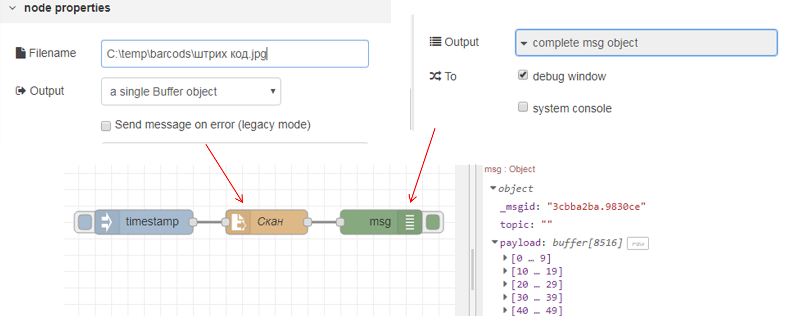  

рис.2.14. Фрагмент програми в Node-RED для читання файлу

- [ ] Зробіть розгортання потоку, та з використанням панелі відлагодження подивіться що зміст файлу виводиться як масив байт (рис.2.14). 

### 6.3. Формування запиту

Для формування запиту необхідно сформувати на вході вузла `HTTP request` його заголовки та тіло. З попередньої частини роботи видно, що для отримання штрих-коду по зображенню необхідно сформувати запит з методом POST, який буде багато-частинним, тобто складатися з розділів, що відокремлюються межами. У даному випадку розділ є тільки один, який включає вміст файлу зображення.  

- [ ] Для пришвидшення виконання роботи імпортуйте в потік підготовлений вузол «Формувати запит», скопіюйте код нижче і імпортуйте в потік через меню імпорту. 
```json
[
    {
        "id": "d0f382da.60357",
        "type": "function",
        "z": "89f03cbbbd325148",
        "name": "Формувати Запит",
        "func": "//формування корисного навантаження для POST\n//складається зі статичного тексту з описом розділу\n//та змісту розділу, який є типом image/jpeg що береться з файлу\n//деталі - https://developer.mozilla.org/uk/docs/Web/HTTP/Basics_of_HTTP/MIME_types#multipartform-data \nvar tmp1;//верхня частина - початок розділу\nvar tmp2;//нижня частина - закінчення розділу\ntmp1 = '-----------------------------12818302946532\\r\\n';//межа початку розділу\ntmp1 += 'Content-Disposition: form-data; name=\"file\"; filename=\"1.jpg\"\\r\\n';//заголовок розділу\ntmp1 += 'Content-Type: image/jpeg\\r\\n\\r\\n';//заголовок розділу\ntmp2 = '\\r\\n-----------------------------12818302946532--';//межа кінця розділу\nvar buf1 = Buffer.from(tmp1);//перетворення тексту в бінарний буфер\nvar buf3 = Buffer.from(tmp2);//перетворення тексту в бінарний буфер\nvar ar =[buf1, msg.payload, buf3];//об'єднання буферів та вмісту файлу в один масив\nmsg.payload =  Buffer.concat(ar);//перетворення масиву в один буфер\n\n//формування заголовків запиту\nmsg.headers = {};//об'явили як об'єкт\nmsg.headers[\"host\"] = \"barcatreader.onrender.com\";\nmsg.headers[\"Accept-Encoding\"] = \"identity\";\nmsg.headers[\"accept\"] = \"text/html,application/xhtml+xml,application/xml;q=0.9,*/*;q=0.8\";\nmsg.headers[\"content-type\"]= \"multipart/form-data; boundary=---------------------------12818302946532\";\nvar len = msg.payload.length;//визначаємо довжину тіла запиту\nmsg.headers[\"content-length\"] = len.toString();//перетворюємо в текст \nmsg.headers[\"referer\"] = \"https://barcatreader.onrender.com/decode\";\nmsg.headers[\"connection\"] = \"keep-alive\";\nmsg.headers[\"upgrade-insecure-requests\"] = 1;\nreturn msg;//повідомлення для відправки методом POST",
        "outputs": 1,
        "noerr": 0,
        "initialize": "",
        "finalize": "",
        "libs": [],
        "x": 150,
        "y": 560,
        "wires": [
            [
                "dc4e554a946d0ea7"
            ]
        ]
    }
]
```
- [ ] Уважно ознайомтеся з вмістом функції. 
- [ ] Модифікуйте програму, як це показано на рис.2.15. 

 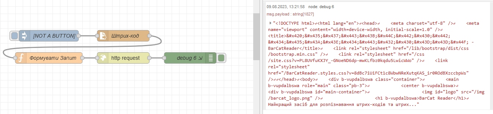

 рис.2.15. Формування запиту для декодування скану штрих-коду

- [ ] Зробіть розгортання, активуйте ініціювання повідомлення в `Inject` і подивіться на вміст об’єкту на панелі відлагодження. 
- [ ] Порівняйте результат з заголовками та вмістом запиту POST зпопередньої частини («Знайомство з роботою HTTP»). Що відрізняється? Результат порівняння занотуйте для захисту.

### 6.4. Відправлення запиту

- [ ] З розділу `network` палітри вузлів вставте вузол `HTTP request`. 
- [ ] Модифікуйте програму, як це показано на рис.2.16. Зверніть увагу, що для кращого тестування бажано вивести як вхідне так і вихідне повідомлення `HTTP request`. 

 

рис.2.16. Відправлення запиту та аналіз відповіді

- [ ] Зробіть розгортання, активуйте Inject, через кілька секунд на панелі відлагодження з’явиться інформація про об’єкт-відповідь. 
- [ ] Порівняйте результат з заголовками та вмістом відповіді POST з попередньої частини («Знайомство з роботою HTTP»).  Результат виконання вважається позитивним, якщо у відповіді буде напис «Decode Succeeded». 
- [ ] Знайдіть числове значення штрих-коду у відповіді.

### 6.5. Розбирання запиту по частинам

- [ ] Для витягування потрібних елементів з HTML-контенту в Node-RED використовується вузол `HTML`. Ознайомтеся з його роботою з [довідника](https://pupenasan.github.io/NodeREDGuidUKR/parsing/html.html).

- [ ] З розділу `parser` палітри вузлів вставте `HTML`. Модифікуйте програму, як це показано на рис.2.17. Селектор вибирає елемент HTML з class=”result-table” у якого вибирає усі-елементи нащадки з тегом «td».

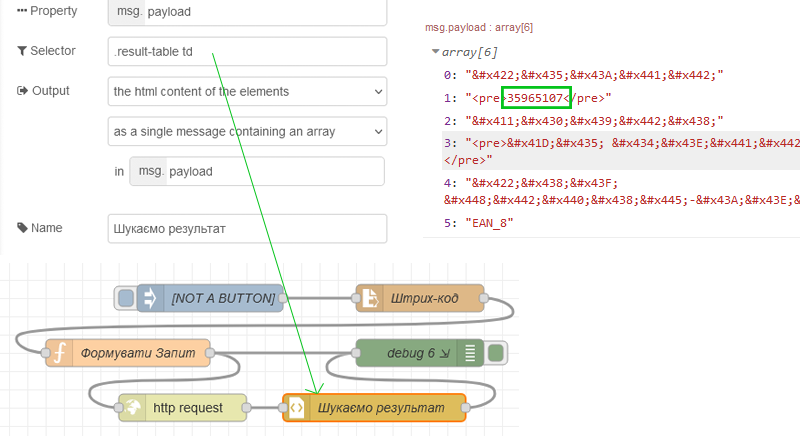 

рис.2.17. Модифікований варіант програми 

- [ ] Зробіть розгортання, активуйте `Inject`, через кілька секунд на панелі відлагодження з’явиться інформація про масив вибірки.

- [ ] Добавте вузол-функцію для присвоєння значення `msg.ID` рівним номеру штрих-коду при позитивній відповіді, та `ERROR` при помилці обробки (рис.2.18).  

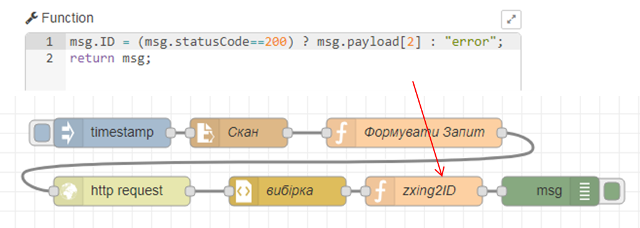 

рис.2.18.

- [ ] Зробіть розгортання, активуйте `Inject` та перевірте роботу програми.  

### 6.6. Робота з `http-in`, `http-response` та `template`

- [ ] Створіть нову вкладку
- [ ] Зробіть фрагмент програми в Node-RED, показаний нижче:

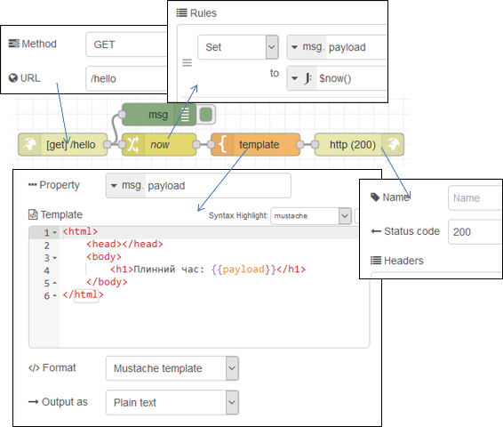

рис.2.19.

- [ ] зверніть увагу, що у вузлі template використовується замінник `{payload}`, що вказує на використання в даному місці властивості Payload
- [ ] зробіть розгортання, на іншій вкладці браузера наберіть наступний шлях: `http://127.0.0.1:1880/hello`  

## Питання до захисту

1. Розкажіть про функціонування протоколу TCP?
2. Розкажіть про функціонування протоколу UDP?
3. Розкажіть про функціонування протоколу HTTP?
4. Якими можливостями утиліти Packet Sender Ви користувалися в лабораторній роботі?
5. Якими можливостями утиліти Wireshark Ви користувалися в лабораторній роботі?
6. Розкажіть про роботу з вузлами UDP-IN та UDP-OUT в Node-RED.
7. Розкажіть про використання об'єктів Buffer в Node-RED.
8. Розкажіть про реалізацію TCP-клієнта в Node-RED.
9. Розкажіть про реалізацію TCP-сервера в Node-RED.
10. Які можливості налагодження браузерів використовувалися в лабораторній роботі.
11. Поясніть призначення заголовків в протоколі HTTP. Прокоментуйте заголовки, які використовувалися в запитах і відповідях лабораторної роботи.
12. Розкажіть про використання методу GET в HTTP.
13. Розкажіть про використання методу POST в HTTP.
14. Розкажіть про реалізацію HTTP-клієнта в Node-RED.
15. Поясніть роботу фрагменту програми в Node-RED для формування запиту та аналізу відповіді декодування штрих-коду.
16. Розкажіть про реалізацію HTTP-серверу в Node-RED.
17. Яке призначення вузлу "template" в Node-RED? 
