**Програмна інженерія в системах управління. Лабораторний практикум.** Автор і лектор: Олександр Пупена 

| [<- до лаборних робіт](README.md) | [на основну сторінку курсу](../README.md) |
| --------------------------------- | ----------------------------------------- |
|                                   |                                           |

# Лабораторна робота 4. Основи роботи з Git та GitHub.

**Мета**. Познайомитися з Git та GitHub. Почати використовувати для роботи з проектами Node-RED.

## 1. Основи роботи з Git

Перед виконанням лабораторної роботи варто ознайомитися з лекцією по Git та GitHub, яка доступна [за посиланням](https://drive.google.com/open?id=1WgLFaHt1Z9de_k_JkmdmFXZXW-UNPl3s).

###### **1. Встановлення Notepad++.**

Завантажте <https://notepad-plus-plus.org/downloads/> та встановіть редактор Notepad++, якщо він ще не встановлений у вас в системі.

###### **2. Встановлення Git.**

Завантажте та інсталюйте Git <https://git-scm.com/downloads>. При інсталяції залишайте усі опції за замовченням, окрім редактору, виберіть Notepad++ (рис.1.1).

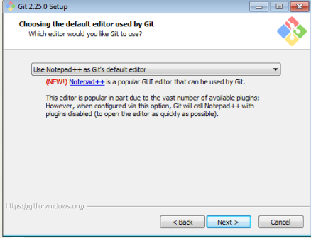

рис.1.1

###### **3. Реєстрація користувача в Git**

У одній із директорій створіть папку «Project». Перейдіть до папки і через контекстне меню виберіть «Git Bash Here»

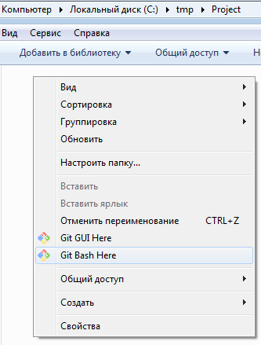

рис.1.2.

В консолі введіть команду перегляду конфігурації

```bash
git config –-list
```

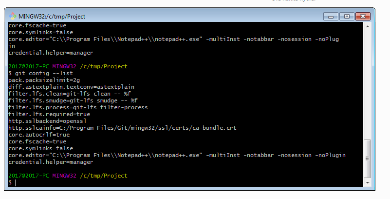

рис.1.3.

У переліку конфігурацій немає зареєстрованого користувача. Використовуючи команди

```bash
git config --global user.name "John Doe"
git config --global user.email johndoe@example.com
```

добавте свого користувача та пошту. Після цього перевірте, що вони добавлені через команду git config ---list

###### **4. Ініціалізація локального репозиторію.**

Використовуючи команду git init ініціалізуйте репозиторій. Перевірте, що в робочій папці створилася папка з назвою .git

###### **5. Створення файлу в робочій папці. Робота з Get Gui.**

В папці створіть текстовий документ «file1**X**» (де **X** -- номер варіанту) з трьома рядками і збережіть. Використовуючи git status перевірте стан репозиторію. Зробіть копію екрану.

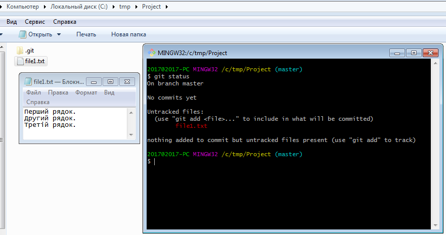

рис.1.4.

Використовуючи команду «Get Gui Here» контекстного меню в папці проекту викличте графічний інтерфейс. Проаналізуйте зміст. Зробіть копію екрану.

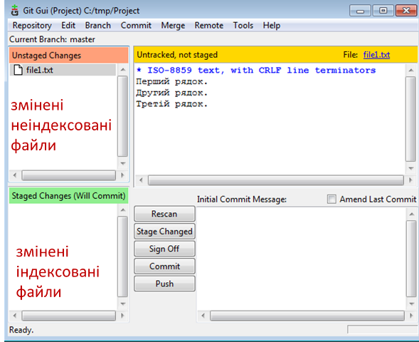

рис.1.5.

###### **6. Індексування (Staging)**

Запустіть команду для добавлення файлу на індексування, повторіть пункт 5.

```
git add file1X.txt  
```

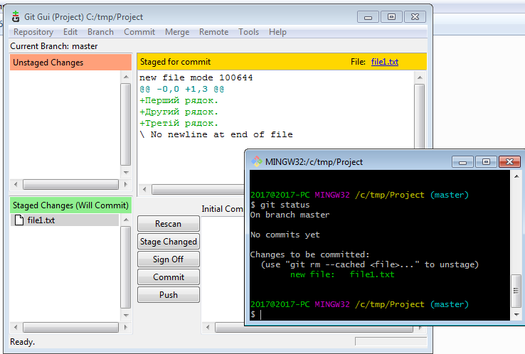

рис.1.6.

###### **7. Збереження відтиску (commit)**

Запустіть команду коміту з повідомленням (опція -m) «Перша версія проекту», повторіть пункт 5.

```bash
git commit -m 'Перша версія проекту' 
```

Порівняйте збережені копії екранів, зробіть висновок, щодо їх змісту.

###### **8. Історія проекту через Git Bash**

Створіть новий файл в робочій директорії з назвою file2X.txt. Запишіть туди три довільні рядки. У першому файлі видаліть другий рядок, та добавте в кінець рядок з написом «четвертий рядок». Добавте оба файли до індексу та зробіть коміт.

```bash
git add *.txt
git commit -m 'Друга версія проекту' 
```

Виконайте команду

```bash
git log
```

для перегляду історії проекту. Зробіть копію екрану.

###### **8. Історія проекту через Git Gui**

Відкрийте графічний інтерфейс, викличте меню «Repository-\>Visualize master's History», передивіться історію комітів. Зробіть копію екрану.

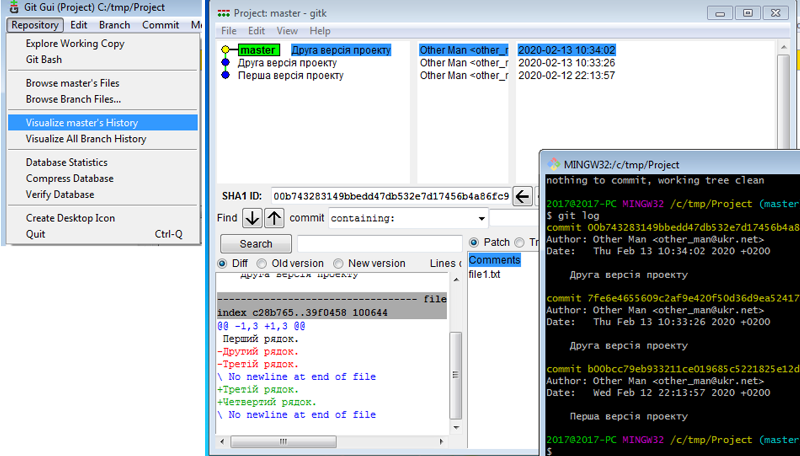

рис.1.7.

## 2. Налаштування Node-RED для роботи з проектами 

###### **1. Налаштвання Node-RED, щоб він працював на основі проектів.**

Node-RED має можливість працювати в режимі проектів, де на одному робочому місці можна створювати кілька проектів і керувати ними.

За допомогою Notepad++ відкрийте конфігураційний файл settings.js що знаходиться в папці «.node-red» за місцем розташування файлів користувача. Наприклад, якщо зареєстрований користувач в системі «User1», то розміщення буде

```bash
C:\Users\User1\.node-red
```

Змініть налаштування, активувавши проекти, як показано на рисунку. Збережіть файл.

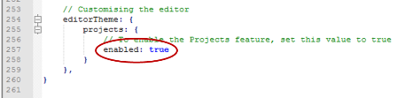

рис.2.1.

###### **2. Створення нового проекту node-red.**

Запустіть node-red. Перший раз, після активації опції проектів, node-red запропонує створити новий проект (див.рис.):

1.  У першому вікні необхідно вибрати опцію «Create project».

2.  У другому вікні вказати ім'я нового проекту, після чого натиснути «Next»

3.  У третьому вікні система запропонує усі існуючі потоки програми node-red перемістити в указаний файл. Це дасть можливість зробити імпорт цих файлів за необхідності. Натисніть Next.

4.  У четвертому вікні зробіть відмову від шифрування "Disable encription" після чого натисніть "Create Project".

5.  На останній сторінці натисніть "Done"

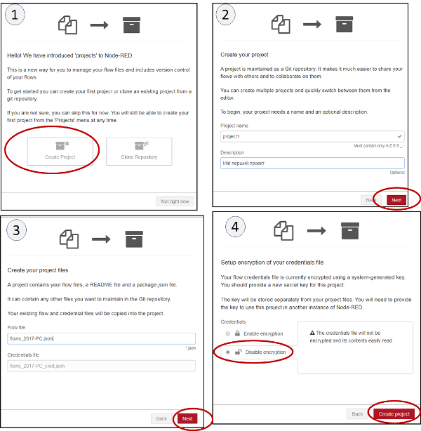

рис.2.2.

Новий проект включить в себе усі існуючі до цього потоки. Видаліть усі потоки окрім того, який був зроблений в 1-й лбораторній роботі. Після цього зробіть розгортання проекту.

###### **3. Аналіз стану проекту.**

Перейдіть на папку node-red

```bash
 C:\Users\<ім’я користувача>\.node-red
```

Там ви побачите папку «projects», де зберігатимуться усі локальні проекти. У цій папці знайдіть папку з назвою вашого проекту і зайдіть в неї. Там буде кілька файлів і папка «.git». Як Ви вже здогадалися, Node-RED використовує для ведення проекту систему Git. Тому папка проекту є робочою папкою Git з репозиторієм.

Використовуючи «Git Gui» або «Git Bash» проаналізуйте стан проекту.

Після цього перейдіть в Node-RED на закладку "Project History" і передивіться зроблені зміни в локальному репозиторію. Як видно, Node-RED надає інтерфейс для деяких основних команд керування Git.

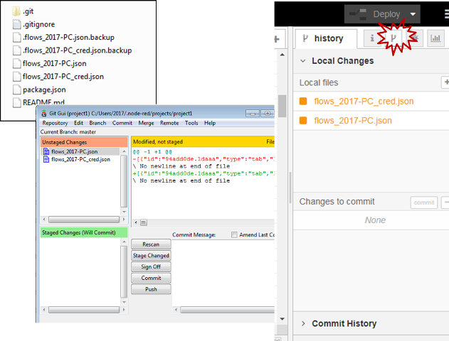

рис.2.3.

###### **4. Керування проектом.**

У Node-RED на закладці "Project History - Local Changes" через кнопку «+All» зробіть індексування усіх змінених файлів. Після цього вони з'являться в Changes to commit. Натисніть «Commit» і в полі повідомлення введіть «Мій перший коміт».

Перейдіть на вкладу "Project History -- Commit History" і подивіться історію коммітів. Виберіть останній коміт і у вікні що з'явиться подивіться деталі змін, які були зроблені. Використовуючи з «Git Gui» утиліту «Visualize Master History» порівняйте зміни.

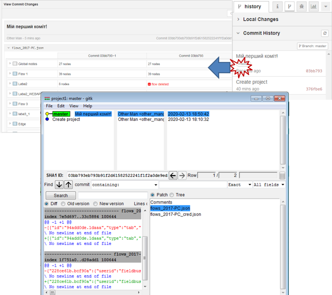

рис.2.4.

## 3. Створення SSH ключа

Для безпечного з'єднання з GitHub, який буде налаштовуватися в наступному пунктів, можна використовувати кілька варіантів. Один з них SSH. Для цього необхідно створити SSH-ключ і прописати його в GitHUB. У даному пункті необхідно створити SSH ключа, який використовуватиметься для доступу до віддалених GIT серверів. Детальне пояснення щодо створення ключа можете прочитати за [посиланням](https://git-scm.com/book/uk/v2/Git-%D0%BD%D0%B0-%D1%81%D0%B5%D1%80%D0%B2%D0%B5%D1%80%D1%96-%D0%93%D0%B5%D0%BD%D0%B5%D1%80%D0%B0%D1%86%D1%96%D1%8F-%D0%B2%D0%B0%D1%88%D0%BE%D0%B3%D0%BE-%D0%BF%D1%83%D0%B1%D0%BB%D1%96%D1%87%D0%BD%D0%BE%D0%B3%D0%BE-%D0%BA%D0%BB%D1%8E%D1%87%D0%B0-SSH#_generate_ssh_key).

###### **1. Перевірка наявності ssh ключів.**

На локальному ПК запустіть «Git Bash» з папки користувача


рис.3.1.

Запустіть команду перевірки наявності ключів ssh

```bash
ls -al ~/.ssh
```

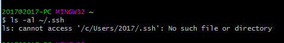

рис.3.2.

###### **2. Створення ssh ключа .**

Для створення нового SSH ключа необхідно викликати команду в якій вказати свою поштову адресу. Увага, важливо вказувати свою поштову адресу, яка буде використовуватися в подальшому при реєстрації в GitHUB.

```bash
ssh-keygen -t rsa -b 4096 -C other_man@ukr.net
```

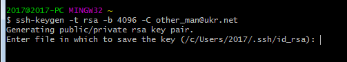

рис.3.3.

На прохання ввести назву файлу, натисніть ENTER

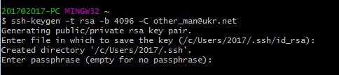

рис.3.4.

Вкажіть пароль-фразу «passphrase» (необхідно запам'ятати пароль, потім буде вказуватися при з'єднання Git в Node-red). Пароль не буде відображатися при вводі.

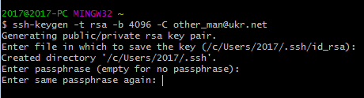

рис.3.5.

Повторно вкажіть пароль.

Після цього виведеться повідомлення, в якому буде вказано файл з ключем. Цей файл потрібно буде відкрити текстовим редактором, наприклад Notepad++

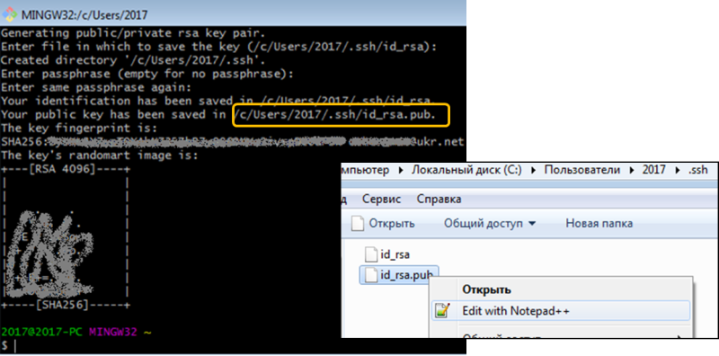

рис.3.6.

## 4. Основи роботи з GitHub

**1. Реєстрація на GitHub.**

Зайдіть на сайт <https://github.com/>

Зареєструйтеся в системі. Опис процесу реєстрації наведений за [цим](https://git-scm.com/book/uk/v2/GitHub-%D0%A1%D1%82%D0%B2%D0%BE%D1%80%D0%B5%D0%BD%D0%BD%D1%8F-%D1%82%D0%B0-%D0%BD%D0%B0%D0%BB%D0%B0%D1%88%D1%82%D1%83%D0%B2%D0%B0%D0%BD%D0%BD%D1%8F-%D0%BE%D0%B1%D0%BB%D1%96%D0%BA%D0%BE%D0%B2%D0%BE%D0%B3%D0%BE-%D0%B7%D0%B0%D0%BF%D0%B8%D1%81%D1%83) посиланням.

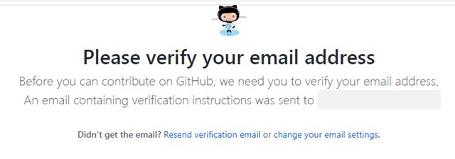

рис.4.1.

Дочекайтеся, коли прийде лист для підтвердження вашої поштової скриньки, підтвердіть кнопкою "Verify email address".

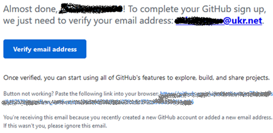

рис.4.2.

Увійдіть в систему GitHub.

**2. Добавлення ключу SSH.**

Зайдіть в налаштування Settings. Виберіть пункт "SSH and GPS keys". Натисніть «NewSSH key».

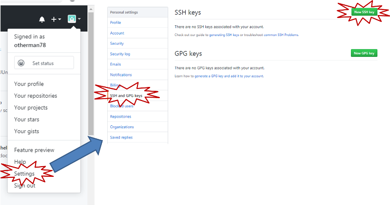

рис.4.3.

У вікні що з'явиться необхідно ввести найменування та ключ SSH, який було створено в попередньому пункті. Для цього відкрийте файл з ключем (id\_rsa.pub) скопіюйте весь зміст у вікно «key». Після цього натисніть Add SSH key.

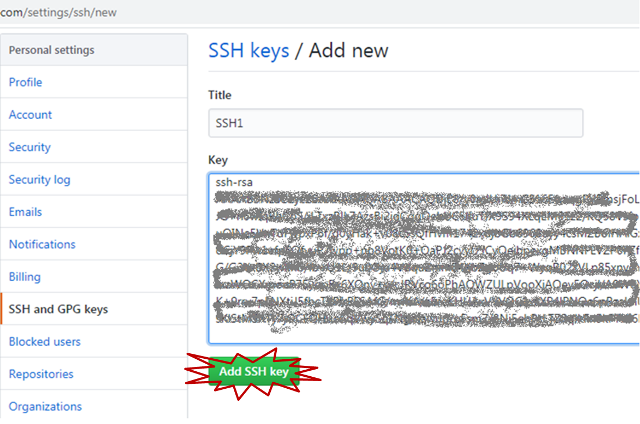

рис.4.4.

Після цього необхідно буде ввести користувача і пароль для GitHUB. На пошту прийде повідомлення про добавлення SSH ключа. Він також буде відображатися списку ключів GitHUB.

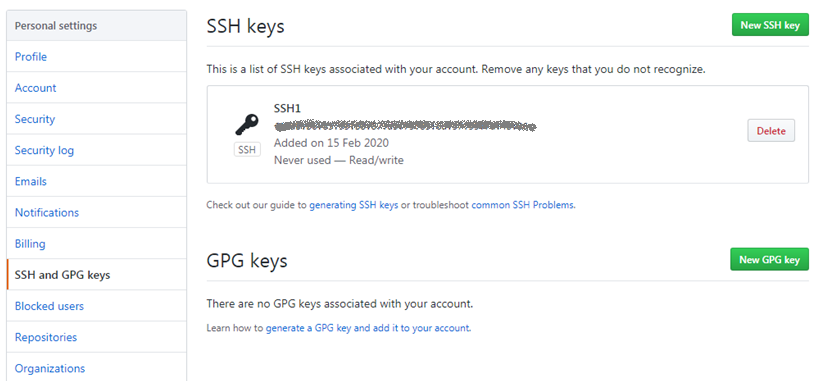

рис.4.5.

**3. Створення нового репозиторію.**

На даному кроці в GitHub необхідно створити новий репозиторій, який буде використовуватися для збереження лабораторних робіт.

Зайдіть в перелік репозиторіїв. Створіть новий репозиторій з назвою «LabsNodeRED», зробіть його приватним (див.рис.4.6)

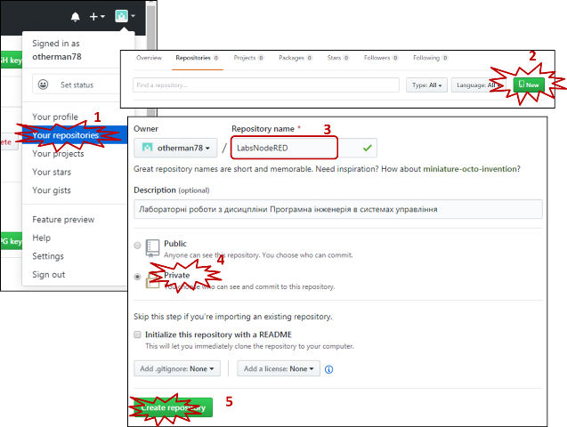

рис.4.6.

Після створення відкриється сторінка налаштування репозиторію. Не закривайте її, вона знадобиться в наступному пункті.

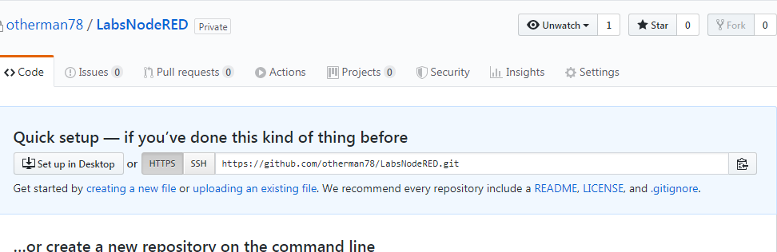

рис.4.7.

## 5. Підключення локального репозиторію до GitHub

**1. Налаштування з'єднання локального та віддаленого репозиторію. Завантаження файлів локального репозиторію на віддалений.**

Зайдіть в локальну директорію проекту Nod-RED. Запустіть Git Bash


рис.5.1.

У вікні \<Code\> репозиторію GitHub активуйте кнопку SSH і скопіюйте в буфер обміну команди, як показано на рисунку. Введіть пароль, який ви вказували при генеруванні SSH

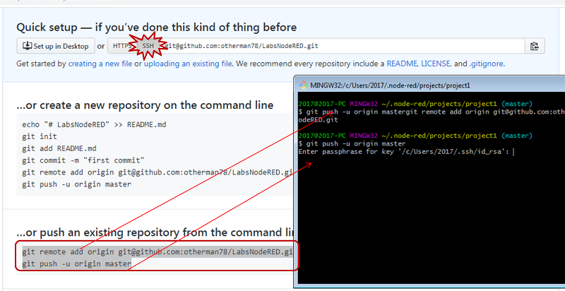

рис.5.2.

Має з'явитися повідомлення, що файли локального репозиторію завантажені на віддалений репозиторій.

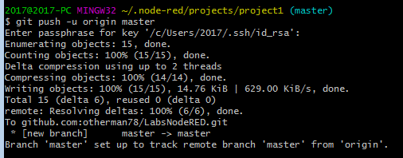

рис.5.3.

Відновіть сторінку \<Code\> репозиторію GitHub. Вона тепер повинна містити клон локального репозиторію Node-RED. Передивіться вкладку Branch та Commits.

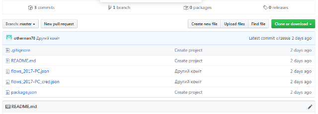

рис.5.4.

**2. Перевірка налаштувань в Node-RED.**

Команди push можна також робити через Node-RED.

Запустіть Node-RED на локальній машині, якщо він не запущений. Відкрийте налаштування і перевірте, що ключ SSH видимий для Node-RED.

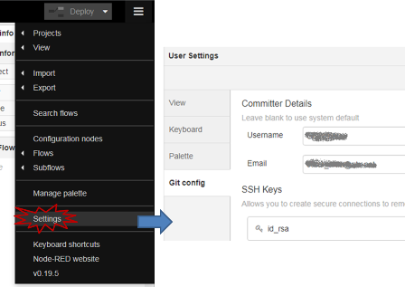

рис.5.5.

Ви завжди зможете передивитися і скопіювати значення ключа звідси, натиснувши по його назві.

Зайдіть в налаштування проекту, впевніться що підключення дійсно є для даного репозиторію.

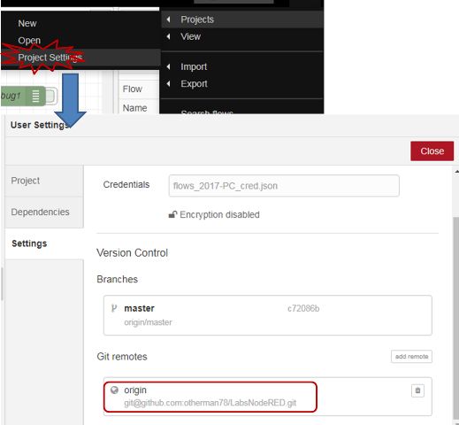

рис.5.6.

Якщо його немає, то перезавантажте Node-RED і сторінку браузера розробки і спробуйте знову.

**2. Push з NodeRED у віддалений репозиторій.**

Змініть потік в Node-RED, наприклад перемістіть якийсь вузол. Зробіть розгортання, в Project History зробіть індексування, коміт (див.рис.), після чого перейдіть в «Commit History». Ви побачите в кутку, що є один коміт, який не запушений в віддалений репозиторій. Натисніть кнопку «Push». Перший раз з'явиться екран для вводу паролю-фрази на SSH, введіть її і натисніть «Retry».

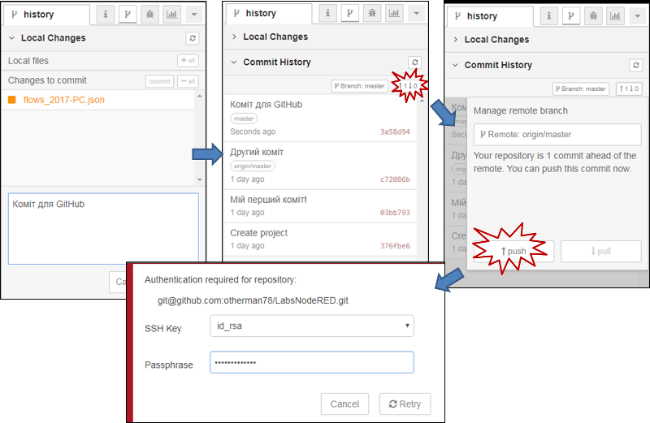

рис.5.7.

**3. Перевірка коміту в GitHub.**

Перйдіть на сторінку репозиторію GitHub. Обновіть сторінку. Ви побачите, що кількість комітів збільшилася на 1.

Натиснувши на кнопку перегляду останнього коміту, можна побачити усі файли, які в ньому є. А якщо натиснути кнопку по самому коміту, то можна побачити які саме зроблені зміни.

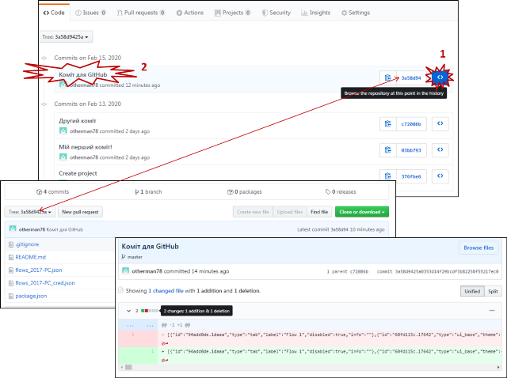

рис.5.8.

## 6. Підключення до репозиторію GitHub інших користувачів для колаборативної роботи

**1. Добавлення викладача до власного репозиторію.**

Зайдіть в Setting-\>Collaborations. Добавте в команду проекту викладача «pupenasan».

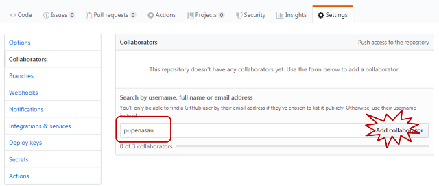

рис.6.1.

**2. Добавлення колеги до власного репозиторію.**

Добавте одного колегу до репозиторію.
