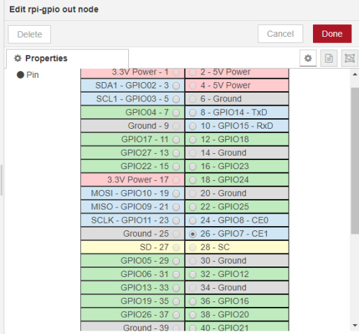
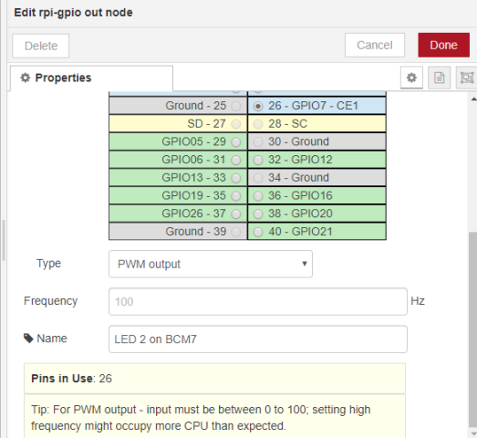
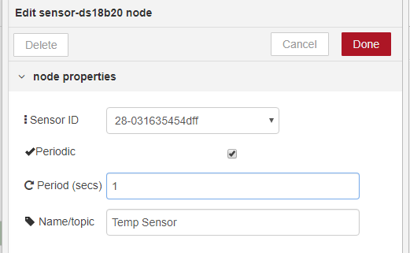

#  Лабораторна робота №4.    Основи роботи з Raspberry PI3

Рекомендується попередньо ознайомитися з матеріалами лекції по RPI за [посиланням](../Лекц/RaspberryPi.md).

## 2. Основи проектування, розробки та документація систем на базі Raspberry Pi з використанням GPIO.

### Проектування з використанням Fritzing

###### 2.1. Завантаження Fritzing.

Завантажте на ПК безкоштовну бета-версію середовища проектування Fritzing [за даним посиланням](https://www.electroschematics.com/fritzing-software-download/) або офіційну платну версію [з офіційного сайту](https://fritzing.org/download/) 

###### 2.2. Завантаження бібліотеки зображень RPI3.

Завантажте на ПК бібліотеку RPI3 з іменем `Raspberry Pi 3_3.fzpz` для  Fritzing  за [посиалнням](https://fritzing.org/media/fritzing-repo/projects/r/raspberry-pi-3/fritzing/Raspberry Pi 3_3.fzpz). Обговорення бібліотеки на форумі доступне за [посиланням ](https://fritzing.org/projects/raspberry-pi-3) 

###### 2.3. Запуск, налаштування Fritzing та встановлення бібліотеки RPI3.

Розпакуйте архів та запустіть `Fritzing.exe`. Імпортуйте файл з іменем `Raspberry Pi 3_3.fzpz` з панелі `Parts`, як це показано на рисунку

Через меню `Edit->Prefernces` Ви можете вибрати найзручнішу для Вас мову інтерфейсу 

###### 2.4. Розміщення елементів на платі для схеми керування діодом.

Активуйте режим відображення макетної плати через меню`View->Show BreadBoard`, або натиснувши відповідну вкладку. На панелі Parts перейдіть в розділ Mine, перенесіть туди RPI3

У розділі `CORE` панелі інструментів `Parts` виберіть два елементи:

- `Basic -> Resistor` 

- `Output -> RED LED`

  

У налаштуваннях резистора вкажіть опір 1 Ком (Resistance = 1kΩ).

###### 2.5. Реалізація схеми підключення .

Перейдіть на вкладку Shematic  `View->Show Schematic`, або натиснувши відповідну вкладку. Розмістіть на схемі елементи, щоб схема була більш читабельною, використовуючи команди з контекстного меню  `Flip vertical`, `Rotate` і т.п. З'єднайте елементи на схемі, як показано на рисунку.

  

У налаштуванні провідників виберіть колір, для підключення `GPIO4` до `LED1` - червоний, для підключення `R1` до `GND` - чорний.

###### 2.6. Коригування схеми підключення на платі . 

Перейдіть на режим відображення макетної плати. З'єднайте контакти, які обозначені пунктиром. Змініть кольори провідників. 

Використовуючи `Edit -> Add Note` добавте коментар до схеми `Схема Прізвище Ім''я`, де вкажіть своє прізвище.  

###### 2.7. Збереження проекту та експорт схем

Збережіть файл проекту з іменем `Diod_Name`, де замість Name вкажіть своє прізвище латинськими літерами.  

У папці проекту Git, яка була створена для лабораторної роботи 3, що має зв'язок з GitHub (наприклад `C:\Users\username\.node-red\projects\project1`) , створіть папку `Lab4` а в ній папку `Schemas`. 

Експортуйте у папку `Lab4` кілька файлів з проекту:

- перемкніть на панель макетної плати `Breadboard` та експортуйте список деталей `File -> Export -> List of Parts`
- та експортуйте схему у вигляді PNG `File -> Export -> as Image -> PNG... `
- перемкніть на панель схеми `Schematic` та експортуйте схему у вигляді PNG `File -> Export -> as Image -> PNG... `

### Реалізація та перевірка: підключення та керування діодом

###### 2.8. Збірка та перевірка схеми. 

Вимкніть Raspberry PI, якщо він включений.

Попросіть у викладача необхідні елементи, та підключіть їх, відповідно до розробленої схеми. Уважно перевірте підключення.

 

###### 2.9. Перевірка схеми викладачем.

Покличте викладача, щоб він перевірив схему. Якщо схема одобрена, перейдіть до наступного пункту. 

###### 2.10. Увімкнення та налаштування RPI.

Увімкніть RPI.  За допомогою VNC зайдіть на робочий стіл RPI. 

Зайдіть в меню `Налаштування -> Raspberry Pi Configuration` і на вкладці `Interfaces` активуйте Remote GPIO.

   

###### 2.11. Створення програми та перевірка програми для Node-RED.

Зайдіть на сторінку програмування Node-RED на RPI3. Створіть програму для керування діодом.

 

Перевірте роботу програми  натискаючи `Inject TRUE` а потім `Inject FALSE`

### Розробка документації .

###### 2.12. Збереження вигляду та коду програми користувача.

Зробіть копію екрану програми. Використовуючи графічний редактор виріжіть робочу частину програми і збережіть в форматі PNG на ПК в папці  проекту`Lab4`. 

Зробіть експорт потоку як форматований JSON та завантажте через кнопку Download. Збережіть в папці проекту  `Lab4` з назвою `diod.json`.

###### 2.13. Завантаження та встановлення Typora (або аналогічного). 

Завантажте та встановіть MarkDown редактор Typora або аналогічний.

-  завантажте редактор (Typora [для Windows](https://typora.io/#windows)) 

- встановіть редактор

###### 2.14. Створення файлу README.MD 

У папці проекту `Lab4`на ПК створіть файл з назвою README.MD. Зміст файлів, які так називаються автоматично відображаються в GitHub. Цей файл буде звітом з лабораторної роботи.

###### 2.15. Оформлення лабораторної роботи.

Повторіть матеріал [лекції](../Лекц/MarkDown.md) по MarkDown.

Відкрийте [приклад](RPIMedia\Example\README.MD) оформлення лабораторної роботи та зробіть аналогічне оформлення для зробленої частини.

###### 2.16. Завантаження матеріалів на GitHub.

Зробіть коміт та завантажте (push) проект на GitHub. 

Зайдіть на GitHub в репозиторій проекту. Зайдіть в папку Lab4, там повинен відображатися Ваш звіт. перевірте, що він дійсно відображається коректно. 

За необхідності зробіть виправлення та повторіть коміт та завантаження до GitHub.   

### Підключення датчика відстані до RPI.

###### 2.17. Встановлення бібліотеки.

Відключіть Raspberry PI. 

Зберіть нову схему, як показано на рисунку. Уважно перевірте правильність.

Попросіть викладача перевірити схему і у випадку підтвердження правильності, переходьте до виконання наступного пункту.

  

###### 2.18. Встановлення бібліотеки.

Встановіть бібліотеку node-red: **node-red-node-pisrf**

 

Задайте піни підключення (Trig, Echo)

 

!

Керування яскравістю світлодіода

1. Обрати GPIO pin.
2. Налаштувати його на ШІМ роботу

### Підключення датчика температури по 1-Wire.

 Для початку встановіть в node-red потрібну бібліотеку: node-red-contrib-sensor-ds18b20

Фізичне підключення датчика температури.

 **Резистор: 10К**

**Живлення: 3.3в**

Вимоги

У системі Linux, де працює ваш Node-RED і де підключені ваші датчики, переконайтесь, що ви завантажили всі модулі ядра, необхідні для роботи з пристроями 1-Wire, що таке датчик DS1820. Таким чином, вам потрібно активувати 1-провідний інтерфейс на Rpi. Для цього просто перейдіть на сторінку Raspi-Configuration.

Внутрішній вигляд вікна конфігурації блоку. Тут ви можете вибрати ваш підключений датчик, включити періодичне оновлення інформації від датчика. В іншому випадку оновлення буде ініціалізуватись зовнішнім сигналом

Оригінальна стаття: https://flows.nodered.org/node/node-red-contrib-sensor-ds18b20

