**Програмна інженерія в системах управління. Лабораторний практикум.** Автор і лектор: Олександр Пупена 

| [<- до лабораторних робіт](README.md) | [на основну сторінку курсу](../README.md) |
| ------------------------------------- | ----------------------------------------- |
|                                       |                                           |

# Лабораторна робота №6. Основи роботи з базами даних та SQL 

**Тривалість**: 4 акад. години.

**Мета:** Навчитися працювати з базами даних та  SQL

**Лабораторна установка**

- Апаратне забезпечення: ПК
- Програмне забезпечення: Node-RED, СКБД MariaDB

## Порядок виконання роботи 

Рекомендується попередньо ознайомитися з матеріалами лекцій по:

-  [базам даних](../Лекц/db.md)
-  [SQL](../Лекц/sql1.md)
-  [довідник SQL](../Довідники/SQL.md)

### 1. Робота з MariaDB на MS Windows

#### 1.1. Встановлення СКБД MariaDB 

- [ ] Встановіть на ПК СКБД "MariaDB". Інструкція зі встановлення доступна [у довіднику](../Довідники/windows_install.md). Зверніть увагу, що з довідника треба брати інструкцію тільки по встановленню "MariaDB", інші СКБД ставити не потрібно.

- [ ] зробіть пробне підключення до локального СКБД  відповідно до описаної у інструкції встановлення.

#### 1.2. Створення БД 

- [ ] ознайомтеся з довідником по роботі з клієнтською утилітою "HeidiSQL" за [посиланням](../Довідники/dbviz.md) 

- [ ] за допомогою редактору "Notepad++" або аналогічного створіть текстовий файл і виберіть мову відображення SQL 

- [ ] створіть нову базу даних з іменем "DB1"

- [ ] знайдіть відповідний SQL запит на створення у нижньому вікні журналу запитів, скопіюйте його в створений текстовий файл; **надалі усі запити, які буде вказано в роботі скопіювати, будете добавляти в цей файл в нижній рядок**.    

<iframe width="560" height="315" src="https://www.youtube.com/embed/AqTdbu5hUww" title="YouTube video player" frameborder="0" allow="accelerometer; autoplay; clipboard-write; encrypted-media; gyroscope; picture-in-picture" allowfullscreen></iframe>

#### 1.3. Створення таблиці та полів таблиці за допомогою клієнтської утиліти

- [ ] натисніть один раз по базі даних, вона активується, про що буде вказувати відповідний запис в журналі запитів (`USE`); скопіюйте запит `USE` в текстовий файл;  

- [ ] створіть у базі даних таблицю з іменем `tab1_lastname`, де `lastanme` - ваше прізвище латинськими літерами, з двома записами `filed1` та `field2` 

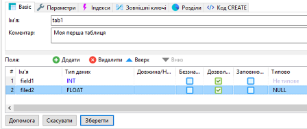

рис.6.1. Створення таблиці.

- [ ] натисніть зберегти; буде створена нова таблиця;

- [ ] знайдіть відповідний запис `CREATE TABLE`, та скопіюйте його в текстовий файл;

<iframe width="560" height="315" src="https://www.youtube.com/embed/_9DifDYyZ6Q" title="YouTube video player" frameborder="0" allow="accelerometer; autoplay; clipboard-write; encrypted-media; gyroscope; picture-in-picture" allowfullscreen></iframe>

#### 1.4. Ручне заповнення записів за допомогою клієнтської утиліти

- [ ] перейдіть на закладку "Дані"

- [ ] добавте 3 записи

- [ ] усі SQL запити `INSERT INTO` скопіюйте у файл;

<iframe width="560" height="315" src="https://www.youtube.com/embed/upOnGFBDvj4" title="YouTube video player" frameborder="0" allow="accelerometer; autoplay; clipboard-write; encrypted-media; gyroscope; picture-in-picture" allowfullscreen></iframe>

#### 1.5. Добавлення поля та запису з `Timestamp`

- [ ] перейдіть на поле `Таблиця`, в якій конфігуруються поля;

- [ ] добавте нове поле `TS` типу `TIMESTAMP`, куди за замовчуванням буде записуватися плинний дата та час виражений в секундах з 1970 року (функція `CURRENT_TIMESTAMP()`), перемістіть поле, щоб воно було першим і натисніть "зберегти";  

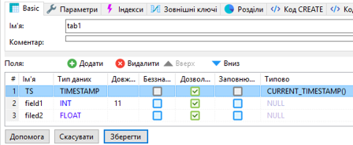

рис.6.2. Добавлення поля та запису з `Timestamp`.

- [ ] знайдіть відповідний запис в журналі (`ALTER TABLE`) та скопіюйте його в текстовий файл;

- [ ] перейдіть на закладку `дані`, добавте ще один запис, але в поле `TS` не вписуйте жодного значення; 

- [ ] після добавлення натисніть `оновити`, буде видно що в поле `TS` записалося автоматично значення;

<iframe width="560" height="315" src="https://www.youtube.com/embed/UCWaV41f7sI" title="YouTube video player" frameborder="0" allow="accelerometer; autoplay; clipboard-write; encrypted-media; gyroscope; picture-in-picture" allowfullscreen></iframe>

#### 1.6. Створення індексного поля

- [ ] Створіть первинний індекс для поля `TS`. 

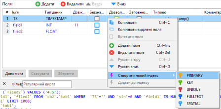

рис.6.3. Створення індексного поля

- [ ] натисніть кнопку "Зберегти";

- [ ] у результаті може вийти помилка, що дані в полі не є унікальними, перейдіть на вкладку "Дані" та виправіть дату та час, щоб дані були унікальними, після чого знову перейдіть на вкладу "Таблиця" і натисніть зберегти

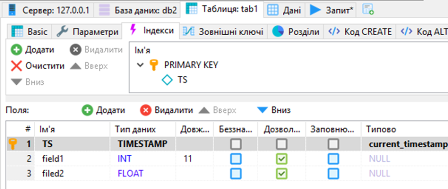

рис.6.4. Перегляд індексів

- [ ] скопіюйте запит `ALTER TABLE` зі зміною поля на індексне в текстовий файл 

<iframe width="560" height="315" src="https://www.youtube.com/embed/WykG-qcENQM" title="YouTube video player" frameborder="0" allow="accelerometer; autoplay; clipboard-write; encrypted-media; gyroscope; picture-in-picture" allowfullscreen></iframe>

#### 1.7. Створення БД, таблиці та полів таблиці за допомогою запита SQL

- [ ] уважно передивіться текстовий файл з записами та проаналізуйте кожен з них

- [ ] змініть цей файл таким чином, щоб:

- він створював базу даних 'DB3', 
- таблицю в ньому, одразу з трьома полями, одне з яких індексне 
- створював  один запис;

- [ ] в утиліті "HeidiSQL" перейдіть на вкладку "Запит" і перенесіть туди цей зміст файлу

- [ ] натисніть "Виконати SQL", якщо виникає повідомлення про помилку, проаналізуйте і виправіть код і знову повторіть; можливо виникне необхідність видалення бази даних 'DB3'

<iframe width="560" height="315" src="https://www.youtube.com/embed/14M_CHQoSJU" title="YouTube video player" frameborder="0" allow="accelerometer; autoplay; clipboard-write; encrypted-media; gyroscope; picture-in-picture" allowfullscreen></iframe>

#### 1.8. Створення копій екранів та  видалення баз даних

- [ ] створіть копії екранів даних таблиць для звіту;

- [ ] видаліть бази даних, які Ви до цього створили.

### 2. Робота з SQL в Node-RED

У цій частині лабораторної роботи бази даних будуть використовуватися у Node-RED для збереження показників роботи системи - процесорного часу та використання пам'яті.  

#### 2.1. Встановлення бібліотеки Node-RED для роботи з БД

- [ ] Запустіть Node-RED. 

- [ ] Створіть новий потік у вашому проекті з назвою DB

- [ ] Встановіть бібліотеку `node-red-node-mysql`

- [ ] ознайомтеся з роботою бібліотеки за посиланням [бібліотеки Node-RED для роботи з БД](https://pupenasan.github.io/NodeREDGuidUKR/dbase/)

<iframe width="560" height="315" src="https://www.youtube.com/embed/n8idvJ2P10Q" title="YouTube video player" frameborder="0" allow="accelerometer; autoplay; clipboard-write; encrypted-media; gyroscope; picture-in-picture" allowfullscreen></iframe>

#### 2.2. Отримання переліку баз даних

У даній лабораторній роботі будуть використовуватися два підключення:

- до системної бази даних `mysql` 
- до користувацької `devinfo`. 

Перша буде використовуватися для ініціалізації, а саме: при підключенні до системної БД буде перевірятися наявність БД  `devinfo`, якщо її немає - вона буде створюватися;  зрештою необхідність вказівки до системної БД `mysql` зумовлена необхідністю конфігурування підключення принаймні до якоїсь БД, а системна - завжди присутня; 

Після підключення до користувацької БД  `devinfo` перевіряється наявність сконфігурованої таблиці, і якщо її немає - вона також створюється автоматично. 

- [ ] у новоствореному потоці `DB` створіть фрагмент, який буде отримувати перелік баз даних

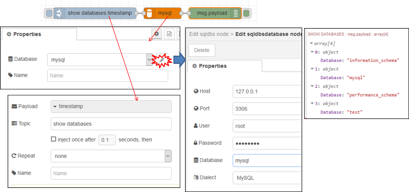

рис.6.5. Отримання переліку баз даних в Node-RED

- [ ] зробіть розгортання, зробіть ініціювання формування запиту, повинен бути результат як зображено на рисунку праворуч; проаналізуйте і порівняйте, чи співпадає цей перелік з побаченим за допомогою клієнтської утиліти HeidiSQL.    

<iframe width="560" height="315" src="https://www.youtube.com/embed/YdcM15xRIb4" title="YouTube video player" frameborder="0" allow="accelerometer; autoplay; clipboard-write; encrypted-media; gyroscope; picture-in-picture" allowfullscreen></iframe>

#### 2.3. Отримання переліку баз даних, з вказаним шаблоном імені

- [ ] у вузлі `Inject` змініть запит, щоб він повертав відповіді за вказаним шаблоном (оператор `LIKE`) імені `mysql`

```sql
SHOW DATABASES LIKE 'mysql' 
```

- [ ] подивіться на результат виконання запиту

- [ ] змініть запит на наступний

```sql
SHOW DATABASES LIKE 'devinfo' 
```

- [ ] подивіться на результат виконання запиту

<iframe width="560" height="315" src="https://www.youtube.com/embed/U3X9_3ex_nM" title="YouTube video player" frameborder="0" allow="accelerometer; autoplay; clipboard-write; encrypted-media; gyroscope; picture-in-picture" allowfullscreen></iframe>

#### 2.4. Створення запиту на створення бази даних

- [ ] модифікуйте програму, як показано на рисунку

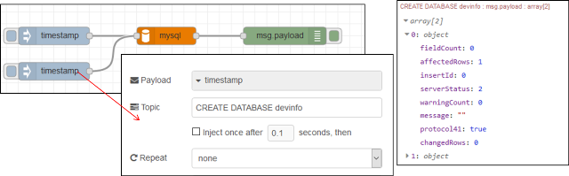

рис.6.6. Створення запиту на створення бази даних

- [ ] ініціюйте виконання запиту на створення БД

- [ ] ініціюйте виконання запиту на відображення списку БД з іменем 'devinfo', подивіться чи з'явилася  ця БД в списку

- [ ] ініціюйте виконання запиту на створення БД повторно; у панелі налагодження повинно з'явитися повідомлення про помилку;

<iframe width="560" height="315" src="https://www.youtube.com/embed/J-9a6q37Ug8" title="YouTube video player" frameborder="0" allow="accelerometer; autoplay; clipboard-write; encrypted-media; gyroscope; picture-in-picture" allowfullscreen></iframe>

#### 2.5. Створення фрагменту коду, що створює базу даних з необхідними таблицями при старті

- [ ] використовуючи HeidiSQL видаліть БД  'devinfo'; альтернативно можете створити вузол в Node-RED для виконання видалення;

- [ ] модифікуйте програму, як наведено нижче; код SQL запиту, який буде формувати таблицю показаний під рисунком

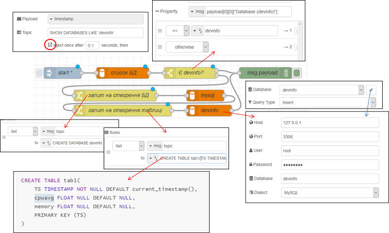

рис.6.7. Фрагменту коду, що створює базу даних з необхідними таблицями при старті

```sql
CREATE TABLE devinfo.tab1(
	TS TIMESTAMP NOT NULL DEFAULT current_timestamp(),
	cpuavg FLOAT NULL DEFAULT NULL,
    memory FLOAT NULL DEFAULT NULL,  
    PRIMARY KEY (TS)
)
```

Програма працює наступним чином: при старті перевіряється наявність бази даних  'devinfo', якщо її немає формується запит на створення БД, після чого формується запит на створення таблиці в БД.

<iframe width="560" height="315" src="https://www.youtube.com/embed/raGOfPmiHIQ" title="YouTube video player" frameborder="0" allow="accelerometer; autoplay; clipboard-write; encrypted-media; gyroscope; picture-in-picture" allowfullscreen></iframe>

#### 2.6. Встановлення та ознайомлення з бібліотеки Node-RED отримання статистики з ОС

- [ ] Встановіть бібліотеку Node-RED `node-red-contrib-os` для отримання даних з ОС. 

- [ ] Ознайомтеся з її вузлами та принципами їх роботи з  [опису бібліотеки  Node-RED Operating Systems](https://pupenasan.github.io/NodeREDGuidUKR/systems/os.html)

<iframe width="560" height="315" src="https://www.youtube.com/embed/64KB5m8086g" title="YouTube video player" frameborder="0" allow="accelerometer; autoplay; clipboard-write; encrypted-media; gyroscope; picture-in-picture" allowfullscreen></iframe>

#### 2.7. Перевірка роботи вузлів `Memory` та `CPUs`

- [ ] За допомогою наведеного нижче фрагменту програми протестуйте роботу вузлів  `Memory` та `CPUs`. Опис вузлів наведений в довіднику [Node-RED](https://pupenasan.github.io/NodeREDGuidUKR/systems/os.html) . Зокрема дізнйтеся:

- скільки часу працює ваш ПК з моменту останнього запуску
- скільки пам'яті було використано в момент ініціювання потоку (`inject` )
- зайдіть в диспетчер задач і порівняйте отримані результати з показаними в диспетчері

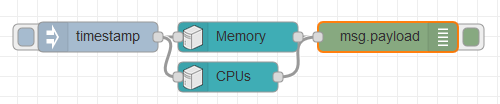

рис.6.8. Фрагмент програми з  `Memory` та `CPUs`.

<iframe width="560" height="315" src="https://www.youtube.com/embed/hVCSlSJWdAI" title="YouTube video player" frameborder="0" allow="accelerometer; autoplay; clipboard-write; encrypted-media; gyroscope; picture-in-picture" allowfullscreen></iframe>

#### 2.8. Створення фрагменту програми ресурсів

У цьому пункті необхідно зробити програму, яка буде відображати споживання ресурсів.

- [ ] Модифікуйте програму користувача як показано на рисунку. Нижче рисунку наведений лістинг програми вузла "Моніторинг". Вузли відображення на Dashboard налаштуйте самостійно. Оновлення повинно відбуватися кожні 5 секунд. 

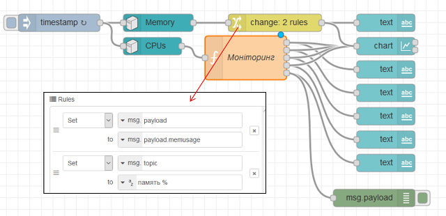

рис.6.9. Фрагмент програми в Node-RED для моніторингу ресурсів ПЛК

```js
//отримати попереднє значення ресурсів
//
var prev = flow.get("prev");
if (typeof prev!== 'undefined'){//якщо контекст отримано
    var cpus = msg.payload.cpus;//плинне значення 
    var cpusp = prev.payload.cpus;//попереднє значення 
    var user, sys, idle, total; var avg = 0;
    var uses = []; var msgs = cpus;
    //перебрати усі ЦПУ
    for (let i = 0; i < cpus.length; i++){
        //отримати значення різниці показників
        user = cpus[i].times.user - cpusp[i].times.user;
        sys = cpus[i].times.sys - cpusp[i].times.sys;
        idle = cpus[i].times.idle - cpusp[i].times.idle;
        total = user + sys + idle;//загальне споживання часу за період
        uses [i] = (user + sys)*100.0 / total;//навантаження CPU
        avg += uses [i];
        msgs [i].payload = uses[i];
        msgs [i].topic = "cpu_" + i;
    }
    avg = avg / cpus.length; msgs.length = cpus.length + 1;
    msgs[msgs.length-1] = {"payload":avg,"topic":"avg"};
    return msgs}
flow.set("prev",msg);
```

- [ ] зробіть розгортання проекту, має бути вигляд як на рисунку

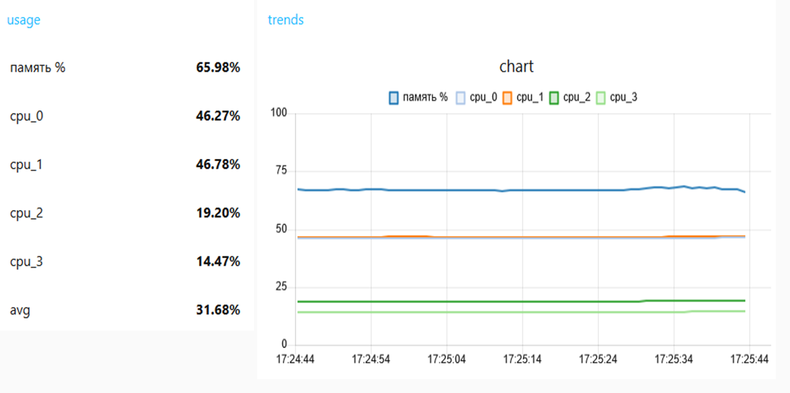

рис.6.10. Виведення даних на тренди

<iframe width="560" height="315" src="https://www.youtube.com/embed/0vpcuY140VE" title="YouTube video player" frameborder="0" allow="accelerometer; autoplay; clipboard-write; encrypted-media; gyroscope; picture-in-picture" allowfullscreen></iframe>

#### 2.9. Модифікація програми для формування записів в історію

- [ ] модифікуйте програму відповідно до наведеного нижче фрагменту, зверніть увагу що необхідно буде добавити конфігураційний вузол з БД 'devinfo', який буде посилатися на відповідну базу даних 

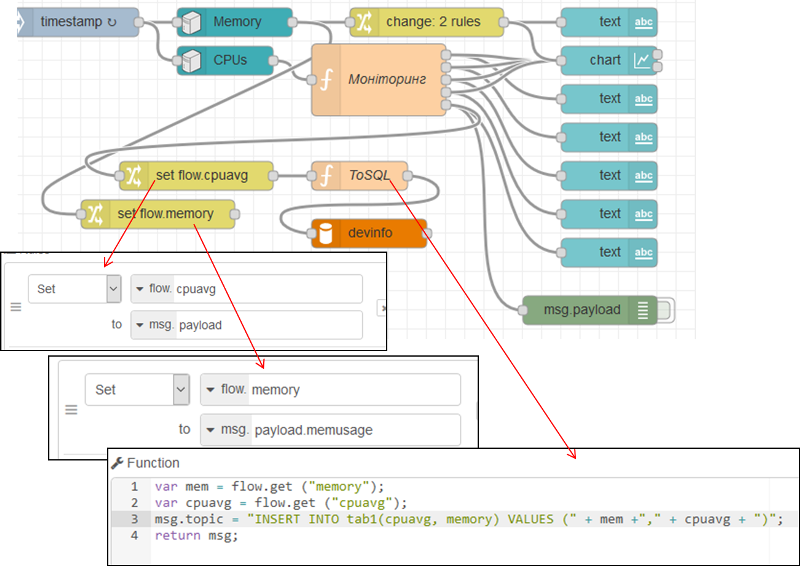

рис.6.11. Формування записів в історію

```js
var mem = flow.get ("memory");
var cpuavg = flow.get ("cpuavg");
msg.topic = "INSERT INTO tab1(cpuavg, memory) VALUES (" + mem + "," + cpuavg + ")";
return msg;
```

- [ ] зробіть розгортання та досягніть щоб не було помилок

- [ ] використовуючи HeidiSQL проконтролюйте, що дані дійсно записуються в БД

<iframe width="560" height="315" src="https://www.youtube.com/embed/43XUHliQ2cQ" title="YouTube video player" frameborder="0" allow="accelerometer; autoplay; clipboard-write; encrypted-media; gyroscope; picture-in-picture" allowfullscreen></iframe>

#### 2.10. Реалізація запиту вибірки

- [ ] **Використовуючи функції дати/часу MariaDB** в HeidiSQL реалізуйте запит вибірки `SELECT`, який буде показувати дані за останні 5 хвилин.

- [ ] Зробіть копії екранів для звіту. 

- [ ] Зробіть `commit` проекту та `push` в GitHub. 

## Питання до захисту

1. Розкажіть базові принципи організації даних в SQL-серверах.
2. Які можливості HeidiSQL використовувалися в лабораторній роботі?
3. Поясніть роботу запиту `CREATE TABLE`
4. Поясніть роботу запиту `INSERT INTO`
5. Поясніть роботу функції `CURRENT_TIMESTAMP()`
6. Навіщо потрібні індексні поля? Як індексні поля створюються в MariaDB?
7. Розкажіть про налаштування вузлів Node-RED для роботи з MariaDB, які використовувалися в даній лабораторній роботі.
8. Поясніть фрагмент коду, що створює базу даних з необхідними таблицями при старті.
9. Поясніть роботу вузлів `node-red-contrib-os` 
10. Розкажіть фрагмент програми що формує записи в історію 
