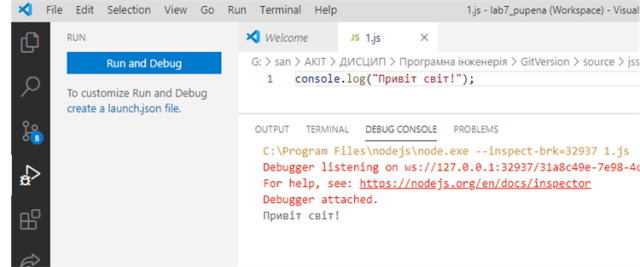
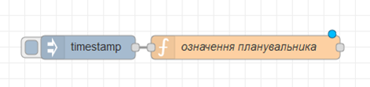
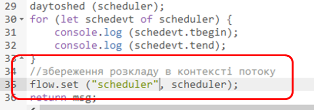
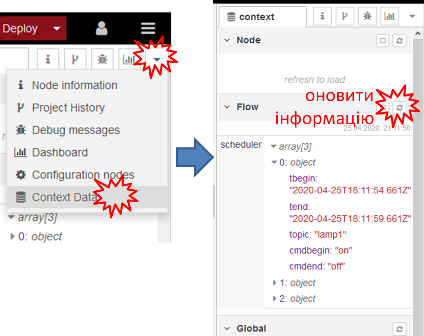
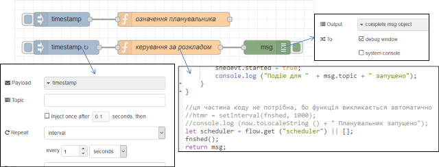
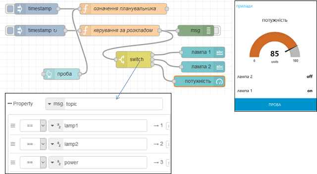
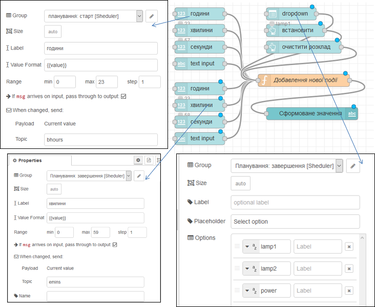
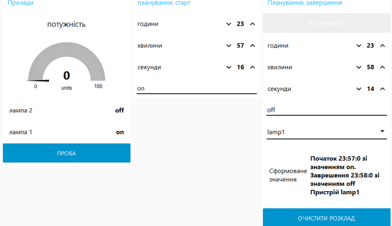

**Програмна інженерія в системах управління. Лабораторний практикум.** Автор і лектор: Олександр Пупена 

| [<- до лабораторних робіт](README.md) | [на основну сторінку курсу](../README.md) |
| ------------------------------------- | ----------------------------------------- |
|                                       |                                           |

# Лабораторна робота №7. Основи роботи з JavaScript

**Тривалість**: 4 акад. години.

**Мета:** Навчитися працювати з JavaScript

**Лабораторна установка**

- Апаратне забезпечення: ПК
- Програмне забезпечення: Node-RED, Visual Studio Code

## Порядок виконання роботи 

### 1. Основи JavaScript

#### 1.1. Встановлення та налаштування Visual Studio Code (VSC) 

- [ ] Завантажте та встановіть на робочий ПК безкоштовний редактор [Visual Studio Code](https://code.visualstudio.com/) .
- [ ] запустіть його на виконання

#### 1.2. Створення робочої області, добавлення папки та файлу 

Visual Studio Code (надалі VSC) - редактор IDE, який надаєм можливості зручного створення проектів на різних мовах програмування, у тому числі на JavaScript. Проект створюється в межах ***робочого простору*** (***Workspace***), який включає в себе файли налаштування, папки та файли проекту.  

- [ ] створіть десь на диску вашого ПК папку з назвою "Lab7_lastname", де  "lastname" - ваше прізвище 
- [ ] після відкриття VSC, одразу збережіть файл робочої області "File->Save Workspace As.." у папці, яку Ви щойно створили з такою ж назвою  
- [ ] створіть новий файл "File->New File" після чого збережіть його з іменем `2.js` у цю ж папку 
- [ ] скопіюйте в редактор наступний код:

```javascript
console.log("Привіт світ!"); 
```

- [ ] запустіть код на виконання клавішою `F5` у консолі налагодження повинно з'явитися повідомлення



рис.7.2. Використання консолі відлагодження 

- [ ] активуйте термінал: "View->Terminal"
- [ ] виведіть в терміналі 

```bash
node 2.js
```

- [ ] і натисніть `Enter`

У терміналі повинно з'явитися таке ж повідомлення. Надалі рекомендується використовувати запуск програми саме через комнаду  `node`

- [ ] зробіть коментар до рядку виводу, в такому форматі

```javascript
console.log("Привіт світ!"); //вивело "Привіт світ"
```

**У наступних кроках необхідно завжди писати в коментарях до  console.log, що вони виводили, це необхідно для звіту !** 

- [ ] Збережіть файл. 

#### 1.3.Робота зі змінними 

- [ ] Користуючись лекціями [Основи JavaScript](../Лекц/13_js.md) зробіть наступні завдання у новоствореному файлі, доповнюючи його новими рядками:

- Створіть новий файл та збережіть його з назвою "3.js" 
- Створіть змінні, які наведені в таб.7.1:

Таблиця 7.1. Назва змінних

| Назва    | Значення ініціалізації (приклад) | Примітка (вказати в коментарі)         |
| -------- | -------------------------------- | -------------------------------------- |
| frstName | Іван                             | вписати своє ім'я                      |
| lastName | Іваненко                         | вписати своє прізвище                  |
| nick     | mynick                           | вписати нік на GitHub                  |
| age      | 41                               | вписати свій вік                       |
| weight   | 80.4                             | вписати вагу (приблизно)               |
| hight    | 1.83                             | вписати свій ріст в метрах (приблизно) |
| birthday |                                  | залишити порожнім                      |
| marital  | true                             | вписати одружений/заміжня              |

- [ ] допишіть фрагменти для виведення в консоль:
  - типи усіх змінних, використовуючи оператор `typeof` ; 
  - результат множення висоти на 100  
  - речення у наступному форматі (у поля вставляються відповідні змінні)

```
Привіт! Мене звати Іван Іваненко, мені 41 роки.
```

- [ ] допишіть фрагменти для виведення в консоль:
  - повідомлення про свій вік у 10-ковому, 2-ковому та 16-ковому форматі. 
  - прізвища та імені у верхньому регістрі,  використовуючи методи об'єкта `String` 

```
ІВАН ІВАНЕНКО
```

- [ ] допишіть фрагменти для виведення в консоль:
  - суми довжин в літерах прізвища та імені, використовуючи методи об'єкта `String` 
  - перші три літери імені  

- [ ] Запустіть програму на виконання. Біля інструкцій виводу в консоль добавте коментарі, в яких вкажіть, що саме було виведено цією інструкцією.   

- [ ] Збережіть файл як "3.js"

#### 1.4. Робота з операторами 

- [ ] Збережіть файл як "4.js"
- [ ] видаліть усю частину програми, окрім об'явлення змінних
- [ ] використовуючи оператори, допишіть фрагменти для виведення в консоль:
  - остачу від ділення росту на `1`
  - результат порівняння ріст >`1.80`; результат порівняння попередньо занести в нову змінну `isHigh`
  - [індекс маси тіла](https://moz.gov.ua/article/health/jak-viznachti-optimalnu-vagu-formula-indeksu-masi-tila) = вага / квадрат росту; попередньо занести результат порівняння в нову змінну `IMT`
  - `вага нормальна` або `вага поза нормою` використовуючи умовний оператор (`?`), логічні операції та операції порівняння, за умови, що [нормою вважається діапазон](https://moz.gov.ua/article/health/jak-viznachti-optimalnu-vagu-formula-indeksu-masi-tila) IMT 18,5-24,9 ; результат попередньо занести в змінну `IMTstate`
- Запустіть програму на виконання. Біля інструкцій виводу в консоль добавте коментарі, в яких вкажіть, що саме було виведено цією інструкцією.   

- [ ] Збережіть файл як "4.js"

#### 1.5. Робота з умовними інструкціями

- [ ] Збережіть файл як "5.js" 

- [ ] видаліть усю частину програми, окрім об'явлення та розрахунку змінних

- [ ] допишіть фрагменти для виведення в консоль та виконання дій:

  - використовуючи інструкцію `if`  виведіть наступні повідомлення:

Таблиця 7.2. Список повідомлень

| **Показник ІМТ, кг/м2** | Повідомлення              |
| ----------------------- | ------------------------- |
| Менше 18,5              | Показник Менше 18,5       |
| 18,5-24,9               | Показник між 18,5 та 24,9 |
| 25,0-29,9               | Показник між 25,0 та 29,9 |
| Понад 30                | Показник Понад 30         |

- модифікуйте програму з використанням `if`, щоб змінився розрахунок `IMTstate`

Таблиця 7.3. Список повідомлень

| **Показник ІМТ, кг/м2** | **Ознака** (`IMTstate`) |
| ----------------------- | ----------------------- |
| Менше 18,5              | недостатня вага         |
| 18,5-24,9               | нормальна вага          |
| 25,0-29,9               | зайва вага              |
| Понад 30                | дуже надмірна вага      |

- використовуючи конструкцію `switch` визначте приналежність до діапазону значень (виведіть результат на консоль):

  - 0-10: "IMT нульове" 
  - 10-20:"IMT від 10 до 20" 
  - 20-30: "IMT від 20 до 30" 
  - 30-40: "IMT від 30 до 40" 
  - 40-нескінченність; "IMT неможливе" 

- > підказка: поділіть IMT на 10, визначте цілу частину і вкажіть в якості значень результат

- [ ] Запустіть програму на виконання. Біля інструкцій виводу в консоль добавте коментарі, в яких вкажіть, що саме було виведено цією інструкцією.   

- [ ] Збережіть файл як "5.js"

#### 1.6.Робота з циклами

- [ ] Збережіть файл як "6.js" 

- [ ] видаліть усю частину програми, окрім об'явлення та розрахунку змінних

- [ ] допишіть фрагмент програми, де  використовуючи оператори циклів перераховується, яких літер у Вашому прізвищі та імені найбільше; доступ до літер проводиться через `[індекс]`; результат запишіть у дві змінні: `lit` - найчастіше застосовна літера,`cnt` - кількість літер; слід передбачити, що регістр літер не має значення;

- [ ] допишіть фрагмент для виведення в консоль:

  ```
  Найчастіше використовувана у імені та прізвищі літера - lit, зустрічається cnt разів 
  ```

- [ ] Запустіть програму на виконання. Біля інструкцій виводу в консоль добавте коментар, в якому вкажіть, що саме було виведено цією інструкцією. 

- [ ] Збережіть файл як "6.js" 

> підказка: не забувайте ініціалізувати змінні початковими значеннями; можливо знадобиться створювати проміжні змінні 

#### 1.7.Робота з функціями

- [ ] Збережіть файл як "7.js" 

- [ ] видаліть усю частину програми, окрім об'явлення та розрахунку змінних

- [ ] створіть наступні функції:

- `getIMT` для розрахунку IMT за вагою та ростом, які передаються в якості аргументу
- `getIMTstate` для розрахунку `IMTstate` за IMT
- `getLitfavor` для розрахунку найчастіше застосовної літери та їх кількості за переданим іменем та прізвищем; підказка - повертається об'єктна змінна; 

- [ ] модифікуйте код програми таким чином, щоб при розрахунку використовувалися ці функції.

- [ ] Запустіть програму на виконання, перевірте щоб все працювало коректно.

- [ ] Збережіть файл як "7.js"

>  нагадування: функції окрім створення треба ще і викликати. 

#### 1.8. Робота з об'єктами

- [ ] Збережіть файл як "8.js"

- [ ] використовуючи літеральний синтаксис створіть об'єкт `Student`, який би включав в себе наведений вище функціонал, а саме:

- [ ] властивості, що наведені в таблиці 1;

- [ ] метод  `getIMT`, без передачі параметрів, який би автоматично розраховував і повертав об'єкт типу {`IMT`, `IMTstate`}; 

- [ ] метод `getLitfavor`, без передачі параметрів, який би автоматично розраховував і повертав об'єкт типу {`lit`, `cnt`};

- [ ] модифікуйте програму, в якій необхідно використовуючи об'єкт:

- змінити властивість ваги і вивести на консоль `IMT` та `IMTstate` ;
- змінити прізвище та ім'я і вивести на консоль   `lit` та `cnt`

- [ ] Збережіть файл як "8.js"

> нагадування: методи окрім створення треба ще і викликати. 

#### 1.9. Робота з масивом

- [ ] збережіть файл як "9.js"

- [ ] у літеральному означенні об'єкта `Student`добавте нову властивість `traits` типу масив, з трьома рисами у текстовому форматі, типу "працелюбний" і т.п.

- [ ] означте для об'єкта метод `getTraits`, який повертає перелік характеристик через кому; перевірте роботу метода;

- [ ] означте для об'єкта метод `addTraits`, який добавляє в перелік характеристик додаткову; перевірте роботу метода;

- [ ] збережіть файл як "9.js"         

### 2. Робота з датою та часом в JS. Розробка планувальника в Node-RED

У даній частині лабораторної роботи необхідно розробити планувальника, який буде запускати на виконання події, означені розкладом. Але спочатку проводиться ознайомлення з функціями дати та часу та написання фрагментів функцій планувальника в   

#### 2.1. Робота з датою та часом 

- [ ] запустіть `Visual Studio Code`, якщо він ще не запущений

- [ ] створіть новий файл "10.js".

- [ ] скопіюйте та перевірте роботу наступного фрагменту програми

```javascript
let now = new Date();                     //плинне значення
let tssp = new Date(now.getTime()- 5000); //задане значення
console.log ("Зараз - \t\t" + now.toLocaleString());
console.log ("5 секунд назад було \t" + tssp.toLocaleString());

let ny = new Date(now.getFullYear() + ", 1, 1 00:00:00"); //дата та часу нового року
let fromny = {
    //кількість секунд з нового року
    totalsec: Math.fround((now.getTime() - ny.getTime())/1000)
}; 
//поділено на кількість секунд за добу
fromny.days = Math.floor(fromny.totalsec/(60*60*24));
//остача від ділення кількості годин з НР на 24 
fromny.hours = Math.floor(fromny.totalsec/(60*60)) % 24;
//остача від ділення кількості хивлин з НР на 60
fromny.mins = Math.floor(fromny.totalsec/(60)) % 60;
//остача від ділення кількості секунд з НР на 60
fromny.seconds = fromny.totalsec % 60;        
console.log ("З нового року пройшло \t" + fromny.days + " днів, " + fromny.hours + " годин," + fromny.mins + " хвилин, " + fromny.seconds + " секунд.");
```

- [ ] проаналізуйте наведений вище код, та отримані результати, дайте відповіді на наступні питання:

* розпишіть призначення кожної функції, яка використана в фрагменті
* поясніть яким чином розраховується час нового року 
* поясніть призначення службового символу `\t` 
* поясніть призначення оператору `%`
* порівняйте результати кількості годин, що пройшли з Н.Р. з астрономічним часом, якщо є неспівпадіння, спробуйте вияснити з чим воно пов'язано  

- [ ] відповіді на питання запишіть внизу коду в коментарях 

- [ ] збережіть файл як "10.js".

#### 2.2. Створення функції визначення різниці в часі 

- [ ] збережіть файл як "11.js"

- [ ] модифікуйте програму: створіть функцію, яка буде повертати різницю в часі в добах, хвилинах, секундах:

* буде приймати два аргументи DT1 та DT2 у форматі TimeStamp 
* повертати об'єкт, аналогічний `fromny`

- [ ] перевірте роботу функції, вивівши час з нового року та з Вашого дня народження 

- [ ] збережіть файл як "11.js"

#### 2.3.Робота з функцією setInterval 

Завдання програми в цьому пункті запустити асинхронну функцію періодичного виклику функції планувальника `fnshed`, яка буде перевіряти чи наступила запланована. По завершенню події, планувальнику більше нічого робити, тому він зупиняється.

- [ ] збережіть файл як "12.js"

- [ ] видаліть весь зміст, перекопіюйте код, написаний нижче і запустіть його на виконання: 

```javascript
let fnshed = function (begin, end) {
    let dt = new Date();
    let msg = dt.toLocaleString();
    if (dt.getTime()>=end.getTime()) {
        clearTimeout(htmr);
        msg = msg + ": Подію зупинено";
    }    
    else if (dt.getTime()>=begin.getTime()) {
        msg = msg + ": Подія працює"; 
    }
    console.log (msg);     
} 
let now = new Date();                    
let begin = new Date(now.getTime() + 3000);
let end =  new Date (now.getTime() + 8000);     
htmr = setInterval(fnshed, 1000, begin, end );
console.log (now.toLocaleString () + " Планувальник запущено:"); 
console.log ("- початок події о " + begin.toLocaleString());
console.log ("- кінець події о " + end.toLocaleString());
```

- [ ] проаналізуйте усі інструкції, зробіть коментарі біля кожної з них

- [ ] збережіть файл як "12.js"

#### 2.4.Планувальник на одну подію

У даному пункті треба реалізувати код для роботи планувальника на одну подію  `shedevt`, яка повинна запуститися та зупинитися у вказаний час, при цьому зробити певні повідомлення для адресату з іменем `topic` та командами `cmdbegin` та  `cmdend`.

- [ ] збережіть файл як "13.js"  

- [ ] видаліть весь зміст, перекопіюйте код, написаний нижче і запустіть його на виконання: 

```javascript
let now = new Date();    
let shedevt = {
    tbegin: new Date(now.getTime()+ 5000), //дата/час початку  події
    tend: new Date (now.getTime() + 10000), //датча/час кінця  події
    topic: "lamp", //адресат для події
    cmdbegin:"on", //команда на виконання для початку події
    cmdend:"off"	//команда на виконання для кінця події
};

let fnshed = function () {
    let dt = new Date();
    msgtxt = dt.toLocaleString();
    let msg = {};
    //цю умову треба проаналізувати і прокоментувати
    if (dt.getTime()>=shedevt.tend.getTime()) {
        clearTimeout(htmr);
        msgtxt = msg.msgtxt + ": Подію зупинено";
        shedevt.started = false; //прапорець, що подія зараз не працює
        msg.payload = shedevt.cmdend;
        msg.topic = shedevt.topic;
        console.log (msg);
    }    
    //цю умову треба проаналізувати і прокоментувати
    else if ((dt.getTime()>=shedevt.tbegin.getTime()) && (!shedevt.started)) {
        msgtxt = msg.msgtxt + ": Подію запущено";
        msg.payload = shedevt.cmdbegin;
        msg.topic = shedevt.topic;
        shedevt.started = true; //прапорець, що подія зараз працює
        console.log (msg);  
    }
    console.log (msgtxt);     
}    
htmr = setInterval(fnshed, 1000);
console.log (now.toLocaleString () + " Планувальник запущено");
```

- [ ] проаналізуйте усі інструкції, зробіть коментарі біля вказаних умов; 

> Зверніть увагу, що час початку та завершення події в планувальнику задаються автоматично. Це зроблено свідомо, щоб автоматизувати перевірку. На пізніших етапах це буде використовуватися виключно для цілей тестування. 

- [ ] збережіть файл як "13.js"  

#### 2.5.Планувальник на кілька подій в стеці

- [ ] збережіть файл як "14.js"  

- [ ] видаліть весь зміст, перекопіюйте код, написаний нижче і запустіть його на виконання: 

```javascript
let now = new Date();    
let scheduler = [];
scheduler.push({
    tbegin: new Date(now.getTime()+ 5000), 
    tend: new Date (now.getTime() + 10000), 
    topic: "lamp1", cmdbegin:"on", cmdend:"off"	
});
scheduler.push({
    tbegin: new Date(now.getTime()+ 6000), 
    tend: new Date (now.getTime() + 8000),
    topic: "lamp2", cmdbegin:"on", cmdend:"off"
});
scheduler.push({
    tbegin: new Date(now.getTime()+ 3000),
    tend: new Date (now.getTime() + 9000),
    topic: "power", cmdbegin:"85", cmdend:"0"	
});
for (let schedevt of scheduler) {
    console.log (schedevt.topic);
}
```

- [ ] проаналізуйте роботу наведеного вище коду

- [ ] доповніть наведений вище код наступним фрагментом і запустіть його на виконання:

```javascript
let fnshed = function () {
    let dt = new Date();
    msgtxt = dt.toLocaleString();
    console.log (msgtxt);
    for (let schedevt of scheduler) checkshed (schedevt);
    for (let i = 0; i < scheduler.length; i++) {
        if (dt.getTime()> scheduler[i].tend.getTime()){
            console.log (scheduler[i].topic);
            scheduler.splice(i,1);
        }
    }
    if (scheduler.length === 0) clearTimeout(htmr);         
}

function checkshed (shedevt) {
    let dt = new Date();
    let msg = {};
    if (dt.getTime()>=shedevt.tend.getTime()) {
        if (shedevt.started){
            shedevt.started = false; 
            msg.payload = shedevt.cmdend;
            msg.topic = shedevt.topic;
            console.log ("Подію для "  + msg.topic + " зупинено ");
        }        
    }    
    else if ((dt.getTime()>=shedevt.tbegin.getTime()) && (! shedevt.started)) {
        msg.payload = shedevt.cmdbegin;
        msg.topic = shedevt.topic;
        shedevt.started = true; 
        console.log ("Подію для "  + msg.topic + " запущено");  
    }
}    
htmr = setInterval(fnshed, 1000);
console.log (now.toLocaleString () + " Планувальник запущено");
```

- [ ] проаналізуйте усі інструкції, зробіть коментарі біля усіх інструкцій 

- [ ] збережіть файл як "14.js"  

#### 2.6.Перетворення добового планувальника в астрономічний

У наведеному вище коді в планувальнику задавався астрономічний час. Однак часто план задається для днів тижня. Тому в даному прикладі необхідно написати функцію, яка буде формувати астрономічний план на добу за умов задання часу початку і завершення в мілісекундах, починаючи з 00:00:00.    

- [ ] збережіть файл як "15.js" 

- [ ] видаліть весь зміст, перекопіюйте код, написаний нижче і запустіть його на виконання: 

```javascript
let now = new Date();
let strtday = new Date(now.toDateString());
let delta = now.getTime() - strtday.getTime();//кількість мілісекунд з початку доби
let scheduler = [];
scheduler.push({
    tbegin: delta + 5000, //кількість мілісекунд з початку доби + 5000 мс
    tend: delta + 10000, 
    topic: "lamp1", cmdbegin:"on", cmdend:"off"	
});
scheduler.push({
    tbegin:delta + 6000, 
    tend: delta + 8000,
    topic: "lamp2", cmdbegin:"on", cmdend:"off"
});
scheduler.push({
    tbegin: delta + 3000,
    tend: delta + 9000,
    topic: "power", cmdbegin:"85", cmdend:"0"	
});

//пам'ятайте, що об'єкти передаються за посиланнями а не за значенням
function daytoshed (scheduler ){
    let strtday = new Date(now.toDateString());
    for (let schedevt of scheduler) {
        schedevt.tbegin = new Date (strtday.getTime() + schedevt.tbegin);
        schedevt.tend = new Date (strtday.getTime() + schedevt.tend);    
    }    
}
daytoshed (scheduler);
for (let schedevt of scheduler) {
    console.log (schedevt.tbegin);
    console.log (schedevt.tend);         
} 
```

- [ ] проаналізуйте роботу коду

- [ ] збережіть файл як "15.js" 

- [ ] скопіюйте другу частину коду з файлу "14.js"  (п.5), запустіть на виконання і перевірте роботу 

- [ ] збережіть файл як "16.js" 

#### 2.7.Реалізація функції створення добового розкладу в Node-RED

- [ ] запустіть Node-RED

- [ ] створіть новий потік з назвою `sheduler`, зробіть там наступний фрагмент коду



рис.7.3. Фрагмент програми Node-RED для створення добового розкладу

- [ ] у функцію скопіюйте код з файлу з "15.js" в  

- [ ] у кінці функції зробіть записування розкладу в контекст потоку

  

Рис.7.4. Змінена програма для збереження розкладу в контексті потоку

- [ ] зробіть розгортання проекту, через `inject` зробіть активацію запуску функції 

> зверніть увагу, що тепер записи в консоль видимі у командному вікні, з якого запускався Node-RED   

- [ ] подивіться чи в контексті потоку з'явився розклад 



рис.7.5. Перегляд контексту потоку.

#### 2.8. Реалізація функції керування компонентами за розкладом

- [ ] модифікуйте потік, як наведено на рисунку, зверніть увагу, що 2-й блок `inject` повинен періодично викликатися кожну секунду



рис.7.6. Реалізація функції керування компонентами за розкладом

- [ ] у код необхідно скопіювати другу частину коду з файлу "14.js" (починаючи з `let fnshed = function () {`) і внести певні зміни, наведені нижче

```javascript
//необхідно зробити коментарі настпуних частин програми
//у функції fnshed
//if (scheduler.length === 0) clearTimeout(htmr);   
...
//у функції checkshed
//let msg = {}; 
...
//у кінці коду закоментувати і добавити
//htmr = setInterval(fnshed, 1000);
//console.log (now.toLocaleString () + " Планувальник запущено");
let scheduler = flow.get ("scheduler") || [];
fnshed();
```

- [ ] Такі зміни зумовлені наступним: 

- немає необхідності викликати `setInterval`, бо функція викликається в Node-RED як вузол по ініціюванні повідомлення з вузла `inject`.
- об'єкт `msg` уже існує, він приходить як повідомлення

- [ ] зробіть розгортання проекту, через `inject` зробіть активацію запуску функції `означення планувальника`

- [ ] на панелі налагодження з часом повинні з'явитися заплановані об'єкти 

- [ ] у функціях закоментуйте усі виклики `console.log`, так як вони потрібні тільки для налагодження

#### 2.9. Реалізація керування приладами на панелі за розкладом 

- [ ] доробіть потік відповідно до наведеного на рисунку фрагменту, щоб команди відправлялися до відповідних компонентів `dashboard`



рис.7.7. Реалізація керування приладами на панелі за розкладом 

- [ ] зробіть розгортання потоку, відкрийте `dashboard`, натисніть кнопку `Проба` для запису в планувальник пробного розкладу, дочекайтеся щоб усі заплановані події відбулися

#### 2.10. Реалізація добавлення події в розклад (виконується за бажанням)

Даний пункт виконується за бажанням і буде додатково оцінений в 2 бали на іспиті.

- [ ] доповніть потік фрагментом, що добавляє подію до розкладу, яка задається з  `dashboard`, графічний вигляд наведений на рисунку; за бажанням можна скопіювати експорт фрагменту, який наведений в додатку 1 



рис.7.8. Реалізація добавлення події в розклад

- [ ] функція наведена в лістингу

```javascript
context.set (msg.topic, msg.payload);
//отримати задані значення з контексту вузлу
msg.bhours = context.get ("bhours") || 0;
msg.bmins = context.get ("bmins") || 0;
msg.bsecs = context.get ("bsecs") || 0;
msg.bval = context.get ("bval") || 0;
msg.ehours = context.get ("ehours") || 0;
msg.emins = context.get ("emins") || 0;
msg.esecs = context.get ("esecs") || 0;
msg.eval = context.get ("eval") || 0;
msg.device = context.get ("device") || 0;
let txt = "Початок " + msg.bhours + ":" + msg.bmins + ":" + msg.bsecs + " зі значенням " + msg.bval;
txt += ". Заврешення " + msg.ehours + ":" + msg.emins + ":" + msg.esecs + " зі значенням " + msg.eval;
txt += " Пристрій " + msg.device;     
msg.payload = txt;
if (msg.topic === "clear") {
    flow.set ("scheduler",[]);
}
if (msg.topic === "set"){
   //отримати розклад з контексту потоку        
   let scheduler = flow.get ("scheduler") || [];
   let now = new Date();
   let strtday = new Date(now.toDateString());

   scheduler.push({
    tbegin: new Date (strtday.getTime() + (msg.bhours*60*60 + msg.bmins*60 + msg.bsecs)*1000), //кількість мілісекунд з початку доби + 5000 мс
    tend: new Date (strtday.getTime() + (msg.ehours*60*60 + msg.emins*60 + msg.esecs)*1000), 
    topic: msg.device, 
    cmdbegin:msg.bval, 
    cmdend:msg.eval
   });
   flow.set ("scheduler",scheduler);
}

return msg;
```

- [ ] зробіть розгортання потоку, перейдіть на `dashboard`, задайте час початку, завершення, значення та виберіть пристрій, проаналізуйте зміст сформованого значення і натисніть кнопку `встановити`; 

>  кнопка `очистити розклад` видаляє усі події в розкладі; 



рис.7.9. Зовнішній вигляд вікна керування за розкладом

- [ ] після добавлення події, проконтролюйте, чи з'явилася вона в контексті потоку

- [ ] дочекайтеся коли почнеться та завершиться подія, проконтролюйте, що вона видалиться з контексту потоку 

#### 2.11. Збереження налаштування подій в БД та з БД (виконується самостійно за бажанням)

Даний пункт виконується за бажанням і буде додатково оцінений в 5 балів на іспиті.

- [ ] Спробуйте виконати наступні доповнення до потоку:

- зробити базу даних `Scheduler`, яка буде містити налаштування подій  
- зробити в БД таблиці:
  - `daily` - щоденні події
  - `mon`...`sun` - події на дні тижня
  - `cal` - події на конкретний день за календарем
- зробити вікно для налаштування запису у вказані таблиці, аналогічно як в пункті 11, але з вказівкою дня тижня, або щоденно, або у вказану дату в календарі
- при старті системи, або вручну, або при початку доби:
  - зчитуються усі події на вказану добу: по дню тижня, з  `daily`  або на вказану дату
  - добавляються в  `scheduler` та записуються в контекст потоку
- зробити можливість перегляду усіх подій з можливістю їх редагування та видалення  

#### 2.12. Звітування

- [ ]  Зробіть копії екранів для звіту. 
- [ ] Зробіть `commit` проекту та `push` в GitHub. 

### Додаток 7.1. Експорт фрагменту потоку Node-RED добавлення події в розклад

```javascript
[
    {
        "id": "33216177.294a3e",
        "type": "ui_numeric",
        "z": "113d9e0c.979eea",
        "name": "",
        "label": "години",
        "group": "8073b07a.c5eaf",
        "order": 0,
        "width": 0,
        "height": 0,
        "passthru": true,
        "topic": "bhours",
        "format": "{{value}}",
        "min": 0,
        "max": "23",
        "step": 1,
        "x": 200,
        "y": 420,
        "wires": [
            [
                "bb677a53.c79c6"
            ]
        ]
    },
    {
        "id": "25e79f2f.dd0b28",
        "type": "ui_numeric",
        "z": "113d9e0c.979eea",
        "name": "",
        "label": "хвилини",
        "group": "8073b07a.c5eaf",
        "order": 0,
        "width": 0,
        "height": 0,
        "passthru": true,
        "topic": "bmins",
        "format": "{{value}}",
        "min": 0,
        "max": "59",
        "step": 1,
        "x": 200,
        "y": 460,
        "wires": [
            [
                "bb677a53.c79c6"
            ]
        ]
    },
    {
        "id": "2aba4519.780a12",
        "type": "ui_numeric",
        "z": "113d9e0c.979eea",
        "name": "",
        "label": "секунди",
        "group": "8073b07a.c5eaf",
        "order": 0,
        "width": 0,
        "height": 0,
        "passthru": true,
        "topic": "bsecs",
        "format": "{{value}}",
        "min": 0,
        "max": "59",
        "step": 1,
        "x": 200,
        "y": 500,
        "wires": [
            [
                "bb677a53.c79c6"
            ]
        ]
    },
    {
        "id": "8398693e.197cf",
        "type": "ui_button",
        "z": "113d9e0c.979eea",
        "name": "",
        "group": "a0566308.93d1a",
        "order": 0,
        "width": 0,
        "height": 0,
        "passthru": false,
        "label": "встановити",
        "color": "",
        "bgcolor": "",
        "icon": "",
        "payload": "",
        "payloadType": "str",
        "topic": "set",
        "x": 430,
        "y": 460,
        "wires": [
            [
                "bb677a53.c79c6"
            ]
        ]
    },
    {
        "id": "770fc852.246da",
        "type": "ui_text_input",
        "z": "113d9e0c.979eea",
        "name": "",
        "label": "",
        "group": "8073b07a.c5eaf",
        "order": 0,
        "width": 0,
        "height": 0,
        "passthru": true,
        "mode": "text",
        "delay": 300,
        "topic": "bval",
        "x": 200,
        "y": 540,
        "wires": [
            [
                "bb677a53.c79c6"
            ]
        ]
    },
    {
        "id": "bb677a53.c79c6",
        "type": "function",
        "z": "113d9e0c.979eea",
        "name": "Добавлення нової події",
        "func": "context.set (msg.topic, msg.payload);\n//отримати задані значення з контексту вузлу\nmsg.bhours = context.get (\"bhours\") || 0;\nmsg.bmins = context.get (\"bmins\") || 0;\nmsg.bsecs = context.get (\"bsecs\") || 0;\nmsg.bval = context.get (\"bval\") || 0;\nmsg.ehours = context.get (\"ehours\") || 0;\nmsg.emins = context.get (\"emins\") || 0;\nmsg.esecs = context.get (\"esecs\") || 0;\nmsg.eval = context.get (\"eval\") || 0;\nmsg.device = context.get (\"device\") || 0;\nlet txt = \"Початок \" + msg.bhours + \":\" + msg.bmins + \":\" + msg.bsecs + \" зі значенням \" + msg.bval;\ntxt += \". Заврешення \" + msg.ehours + \":\" + msg.emins + \":\" + msg.esecs + \" зі значенням \" + msg.eval;\ntxt += \" Пристрій \" + msg.device;     \nmsg.payload = txt;\nif (msg.topic === \"clear\") {\n    flow.set (\"scheduler\",[]);\n}\nif (msg.topic === \"set\"){\n   //отримати розклад з контексту потоку        \n   let scheduler = flow.get (\"scheduler\") || [];\n   let now = new Date();\n   let strtday = new Date(now.toDateString());\n\n   scheduler.push({\n    tbegin: new Date (strtday.getTime() + (msg.bhours*60*60 + msg.bmins*60 + msg.bsecs)*1000), //кількість мілісекунд з початку доби + 5000 мс\n    tend: new Date (strtday.getTime() + (msg.ehours*60*60 + msg.emins*60 + msg.esecs)*1000), \n    topic: msg.device, \n    cmdbegin:msg.bval, \n    cmdend:msg.eval\n   });\n   flow.set (\"scheduler\",scheduler);\n}\n\nreturn msg;",
        "outputs": 1,
        "noerr": 0,
        "x": 450,
        "y": 580,
        "wires": [
            [
                "48cf856e.4aa254"
            ]
        ]
    },
    {
        "id": "b2d269f8.b6a2d8",
        "type": "ui_numeric",
        "z": "113d9e0c.979eea",
        "name": "",
        "label": "години",
        "group": "a0566308.93d1a",
        "order": 0,
        "width": 0,
        "height": 0,
        "passthru": true,
        "topic": "ehours",
        "format": "{{value}}",
        "min": 0,
        "max": "23",
        "step": 1,
        "x": 200,
        "y": 600,
        "wires": [
            [
                "bb677a53.c79c6"
            ]
        ]
    },
    {
        "id": "5c2624f.64e495c",
        "type": "ui_numeric",
        "z": "113d9e0c.979eea",
        "name": "",
        "label": "хвилини",
        "group": "a0566308.93d1a",
        "order": 0,
        "width": 0,
        "height": 0,
        "passthru": true,
        "topic": "emins",
        "format": "{{value}}",
        "min": 0,
        "max": "59",
        "step": 1,
        "x": 200,
        "y": 640,
        "wires": [
            [
                "bb677a53.c79c6"
            ]
        ]
    },
    {
        "id": "524595be.da9474",
        "type": "ui_numeric",
        "z": "113d9e0c.979eea",
        "name": "",
        "label": "секунди",
        "group": "a0566308.93d1a",
        "order": 0,
        "width": 0,
        "height": 0,
        "passthru": true,
        "topic": "esecs",
        "format": "{{value}}",
        "min": 0,
        "max": "59",
        "step": 1,
        "x": 200,
        "y": 680,
        "wires": [
            [
                "bb677a53.c79c6"
            ]
        ]
    },
    {
        "id": "3cb12524.9fad1a",
        "type": "ui_text_input",
        "z": "113d9e0c.979eea",
        "name": "",
        "label": "",
        "group": "a0566308.93d1a",
        "order": 0,
        "width": 0,
        "height": 0,
        "passthru": true,
        "mode": "text",
        "delay": 300,
        "topic": "eval",
        "x": 200,
        "y": 720,
        "wires": [
            [
                "bb677a53.c79c6"
            ]
        ]
    },
    {
        "id": "d319fe6e.55b0c",
        "type": "ui_dropdown",
        "z": "113d9e0c.979eea",
        "name": "",
        "label": "",
        "place": "Select option",
        "group": "a0566308.93d1a",
        "order": 0,
        "width": 0,
        "height": 0,
        "passthru": true,
        "options": [
            {
                "label": "",
                "value": "lamp1",
                "type": "str"
            },
            {
                "label": "",
                "value": "lamp2",
                "type": "str"
            },
            {
                "label": "",
                "value": "power",
                "type": "str"
            }
        ],
        "payload": "",
        "topic": "device",
        "x": 420,
        "y": 420,
        "wires": [
            [
                "bb677a53.c79c6"
            ]
        ]
    },
    {
        "id": "48cf856e.4aa254",
        "type": "ui_text",
        "z": "113d9e0c.979eea",
        "group": "a0566308.93d1a",
        "order": 0,
        "width": "6",
        "height": "3",
        "name": "",
        "label": "Сформоване значення",
        "format": "{{msg.payload}}",
        "layout": "row-left",
        "x": 470,
        "y": 660,
        "wires": []
    },
    {
        "id": "263861ef.3ff97e",
        "type": "ui_button",
        "z": "113d9e0c.979eea",
        "name": "",
        "group": "a0566308.93d1a",
        "order": 0,
        "width": 0,
        "height": 0,
        "passthru": false,
        "label": "очистити розклад",
        "color": "",
        "bgcolor": "",
        "icon": "",
        "payload": "",
        "payloadType": "str",
        "topic": "clear",
        "x": 450,
        "y": 500,
        "wires": [
            [
                "bb677a53.c79c6"
            ]
        ]
    },
    {
        "id": "8073b07a.c5eaf",
        "type": "ui_group",
        "z": "",
        "name": "планування: старт",
        "tab": "8e131842.3edc18",
        "disp": true,
        "width": "6",
        "collapse": false
    },
    {
        "id": "a0566308.93d1a",
        "type": "ui_group",
        "z": "",
        "name": "Планування: завершення",
        "tab": "8e131842.3edc18",
        "disp": true,
        "width": "6",
        "collapse": false
    },
    {
        "id": "8e131842.3edc18",
        "type": "ui_tab",
        "z": "",
        "name": "Sheduler",
        "icon": "dashboard"
    }
]
```

## Питання до захисту

1. Які функції інструменту Visual Studio Code використовувалися в даній лабораторній роботі?
2. Розкажіть про синтаксис умовного оператору `?`.
3. Розкажіть про синтаксис умовної інструкції `if`.
4. Розкажіть про синтаксис конструкції `switch` .
5. Розкажіть про синтаксис конструкції `for `
6. Розкажіть про синтаксис конструкції `for of `
7. Розкажіть про роботу функції JS.
8. Розкажіть про роботу з об'єктами в JS.
9. Розкажіть про роботу з масивами в JS. Які методи використовувалися для роботи з масивами в даній лабораторній роботі?
10. Розкажіть про роботу з об'єктом Date. Які методи використовувалися для роботи з датою та часом в даній лабораторній роботі?
11. Розкажіть про призначення та синтаксис функції `setInterval`.
12. Які операції з контекстами Node-RED використовувалися в даній лабораторній роботі? Як перевірити значення контекстів в режимі виконання?
