**Програмна інженерія в системах управління. Лабораторний практикум.** Автор і лектор: Олександр Пупена 

| [<- до лабораторних робіт](README.md) | [на основну сторінку курсу](../README.md) |
| ------------------------------------- | ----------------------------------------- |
|                                       |                                           |

# Лабораторна робота №8. Інтегрування з хмарними застосунками та сервісами

**Тривалість**: 4 акад. години.

**Мета:** Навчитися інтегрувати застосунки рівня зв'язку з об'єктом з хмарними застосунками 

**Лабораторна установка**

- Апаратне забезпечення: ПК
- Програмне забезпечення: Node-RED, хмарні застосунки Google Sheet, сервіси Telegram

## Порядок виконання роботи 

У цій лабораторній роботі необхідно забезпечити інтегрування Node-RED з хмарним застосунком `Google Sheet` (Електронна таблиця) та сервісом `Telegram`. Це дасть можливість забезпечити передачу даних з RaspberryPI на хмару для аналізу та взаємодію з віддаленим користувачем. Node-RED можна запускати як на ПК так і на RPI.   

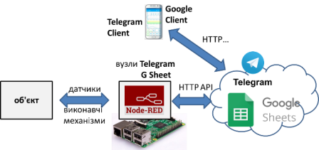

рис.8.1.Структура системи з використанням хмарних застосунків.

### 1.Створення та налаштування сервісного аккаунту Google (для доступу іншого сервісу) 

#### 1.1.Створення облікового запису Google

Якщо у Вас немає облікового запису Google - створіть його [на сайті](https://www.google.com/). Це безкоштовно, потребується тільки поштова скринька і номер телефону. 

#### 1.2.Створення сервісного аккаунту Google  

- [ ] Зайдіть на сторінку налаштування API для сервісів, якими Ви користуєтеся на GoogleCloud  [https://console.cloud.google.com/apis](https://console.cloud.google.com/apis). 
- [ ] При першому входженні Вам запропонують прийняти умови використання. Для того, щоб користуватися сервісами виставте опцію "Приймаю умови використання" після чого натисніть кнопку "Прийняти і продовжити" 

 

рис.8.2. Прийняття умов користування

#### 1.3. Створення проекту

- [ ] Натисніть "Створити проект"

 

рис.8.3. Створення проекту 

#### 1.4. Налаштування проекту

- [ ] Заповніть налаштування проекту, як показано на рисунку.

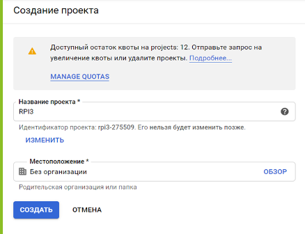

рис.8.4. Створення проекту (назва)

#### 1.5. Створення сервісного аккаунту

- [ ] Зайдіть в головне меню і перейдіть в розділ створення сервісних аккаунтів 
- [ ] Натисніть "Створити сервісний аккаунт".

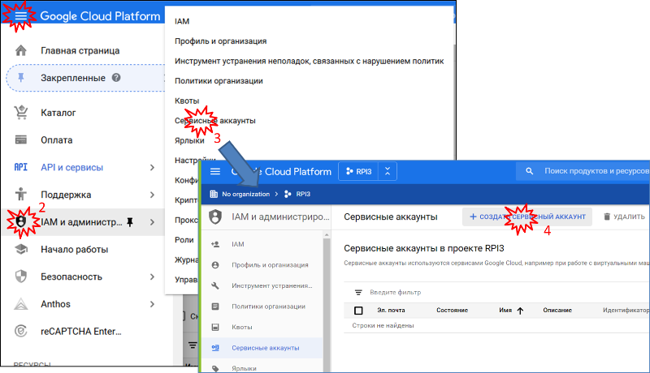

рис.8.5. Створення сервісного акаунту

- [ ] На першому кроці означте назву

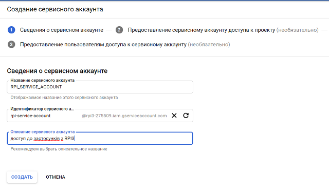

рис.8.6. Створення сервісного акаунту (назва)

- [ ] На другому кроці можна поки нічого не вписувати, а просто натиснути "Продовжити".  
- [ ] На третьому кроці кроці виберіть "Створити ключ", після чого у новому вікні виберіть "Створити". 
- [ ] Система запропонує відкрити або зберегти файл JSON. Збережіть цей файл, він Вам потребується в майбутньому. 
- [ ] Після збереження, натисніть "Готово". 


рис.8.7. Створення ключа сервісного акаунту

#### 1.6. Надання доступу до сервісів Google Sheet

- [ ] Перейдіть на сторінку з сервісами. 


рис.8.8. Активація доступу до сервісів Гугл

- [ ] Зайдіть в розділ `G Suite` 
- [ ] Знайдіть `Google Sheets`

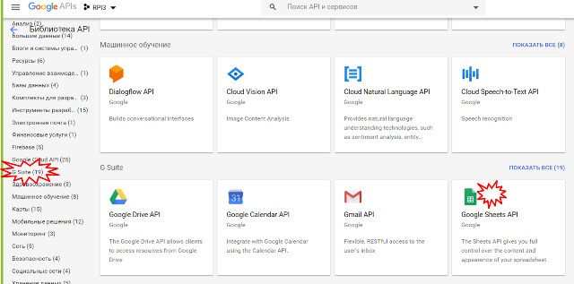

рис.8.9. Вибір хмарного сервісу

- [ ] Натисніть "Включити" для активації доступу до цього сервісу.


рис.8.10. Включення активації сервісу

### 2. Інтегрування з застосунками Google

У даній частині лабораторної роботи необхідно забезпечити запис значень з Node-RED в електронну таблицю, що обслуговується хмарним електронним застосунком `Google Sheet`. 

#### 2.1.Встановлення бібліотеки node-red-contrib-google-sheets

- [ ] запустіть Node-RED

- [ ] встановіть бібліотеку `node-red-contrib-google-sheets` 

#### 2.2.Створення таблиці `Google Sheet` 

`Google Sheet` - це хмарний застосунок від Google для роботи з електронними таблицями. За функціональністю і принципами роботи він схожий на `Microsoft Excel`. Усі створені таблиці зберігаються на Гугл Диску (`Google Drive`) 

- [ ] Зайдіть на головну сторінку [Google](https://www.google.com/) і зайдіть в застосунок `Google Sheet`(`Таблиці`)


рис.8.11. Створення таблиці Google Sheet

Альтернативно можна відразу перейти [на сторінку](https://docs.google.com/spreadsheets)  

- [ ] У новому вікні натисніть кнопку "+" (створити) щоб створити нову електронну таблицю

- [ ] Змініть назву документу на якусь більш прийнятну, наприклад RPIData

#### 2.3. Створення фрагменту для наповнення буферу

У даному пункті необхідно створити фрагмент, який буде вміщувати буфер останніх 60-ти значень імітованих змінних `rad ` та `val` а також дати та часу їх зміни. Такий буфер можна організувати різним чином, однак для спрощення були використані властивості масивів в JavaSript як черг та стеків. Кожне нове обчислення записується на верх масиву. Таким чином, спочатку "буфер-масив" буде наповнюватися аж до 60-го елементу. Коли елементів стане більше ніж 60 (тобто 61), нижні елементи виймаються, і масив "зсувається" вниз. І так кожного разу при виклику функції. Для збереження даних масиву між викликами використовується контекст потоку. 

Про всяк випадок, зроблена також перевірка на переповнення масиву: коли кількість елементів повинна бути 60, а вона все одно більша - масив обрізається до 60-ти елементів. Така ситуація не повинна відбуватися, але бажано передбачати такі випадки.   

- [ ] Запустіть Node-RED, якщо він не запущений
- [ ] Створіть новий потік з назвою `clouds`.
- [ ] добавте туди фрагмент, який наведений на рисунку, код функції наведений під рис. 8.12.  

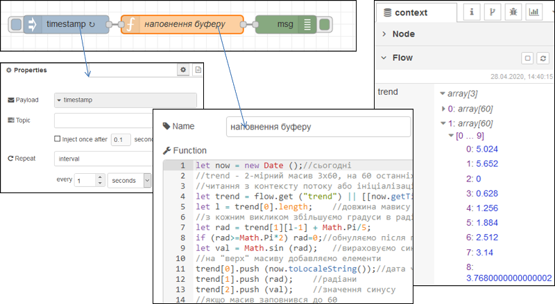

рис.8.12. Фрагмент програми для запису даних в масив

```javascript
let now = new Date ();//сьогодні
//trend - 2-мірний масив 3x60, на 60 останніх значень 
//читання з контексту потоку або ініціалізація масиву-буферу
let trend = flow.get ("trend") || [[now.toLocaleString()],[0],[0]];
let l = trend[0].length;    //довжина мавису
//з кожним викликом збільшуємо градуси в радіанах
let rad = trend[1][l-1] + Math.PI/5;   
if (rad>=Math.PI*2) rad=0;//обнуляємо після повного кола
let val = Math.sin (rad);   //вираховуємо синус
//на "верх" масиву добавляємо елементи 
trend[0].push (now.toLocaleString());//дата час
trend[1].push (rad);    //радіани
trend[2].push (val);    //значення синусу
//якщо масив заповнився до 60
if (trend[0].length >60){
    trend[0].shift ();//вилучаємо перший (найстаріший) елемент
    trend[1].shift ();
    trend[2].shift ();
    //після цього масиви повинні зменшитися на 1 елемент (60) 
    //і зсунутися вниз
    //у випадку, якщо раптом елементів більше 60
    //наприклад були добавлені випадково стороннім кодом
    //зробити кількість елементів =60
    trend[0].length = 60;//
    trend[1].length = 60;
    trend[2].length = 60; 
}
flow.set ("trend", trend);//записати в контекст потоку
return msg;
```

- [ ] зробіть розгортання потоку

- [ ] проаналізуйте контекст потоку, як він наповнюється з кожною секундою, він повинен мати вигляд як на рис.8.12  (не забудьте натискати кнопку оновлення)

#### 2.4.Створення фрагменту запису в електронну таблицю значень буферу 

- [ ] Користуючись рекомендаціями щодо [роботи з базовими функціями читання та запису Google Sheet](https://pupenasan.github.io/NodeREDGuidUKR/google/googlesheet.html) :

  надайте доступ до Гугл таблиці створеному раніше сервісному аккаунту

- [ ] добавте наступний фрагмент потоку.

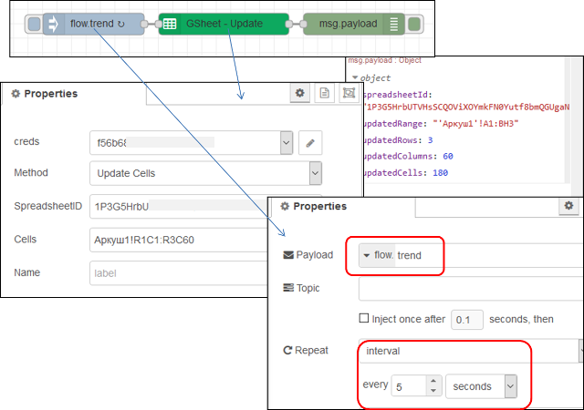

рис.8.13. Фрагмент запису в електронну таблицю значень буферу

- [ ] зробіть розгортання потоку
- [ ] перейдіть до Гугл таблиці там повинні відображатися дані з буфера і кожні 5 секунд оновлюватися

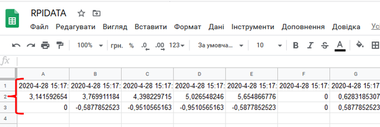

рис.8.14. Таблиця з записаними даними 

#### 2.5.Створення діаграми

- [ ] Виділіть три рядки з даними і створіть по ним діаграму залежності значень змінних від часу

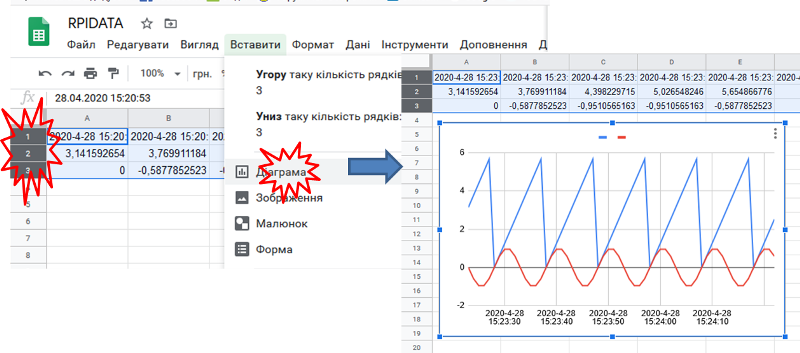

рис.8.15. Відображення діаграми за записаними в Google Sheet даними 

### 3. Реєстрація телеграм-бота 

У цій частині лабораторної роботи необхідно реалізувати Телеграм-бота, який буде в онлайн режимі забезпечувати зв'язок користувача з RPI.  

#### 3.1. Створення облікового запису Telegram

- [ ] Якщо у Вас немає облікового запису Telegram - завантажте клієнтський застосунок і створіть обліковий запис [за посиланням](https://telegram.org/). Це безкоштовно, потребується тільки номер телефону. 

#### 3.2. Реєстрація нового телеграм-бота.

- [ ] Знайдіть в телеграмі і додайте до своїх контактів `@BotFather` - це бот, який створює ботів

- [ ] і введіть команду `/start` з'явиться вікно з доступними командами 


рис.8.16. Доступні команди створення телеграм-бота

- [ ] напишіть (або натисніть) команду `/newbot` для створення нового бота


рис.8.17. Команда створення телеграм-бота

- [ ] дайте йому ім'я, наприклад `RPI Ivanenko Ivana`


рис.8.18. Надання імені телеграм-боту

- [ ] тепер треба ввести ім'я користувача для бота, який повинен закінчуватися на ` Bot` , наприклад 

`RPI_IvanenkoIvana_Bot` За допомогою цього нікнейма можна знайти й додати вашого бота  до своїх контактів. 


рис.8.19. Надання імені користувача телеграм-боту

- [ ] Збережіть токен, який видав бот, бо він нам  знадобиться згодом для керування.

- [ ] Добавте бота до своїх контактів `t.me/<username>`.

- [ ] за допомогою `RPI_IvanenkoIvana_Bot` ви зможете завжди відредагувати своїх ботів

### 4. Створення Телеграм-бота в Node-RED

#### 4.1. Встановлення бібліотеки 

- [ ] Запустіть Node-RED, встановіть бібліотеку `node-red-contrib-telegrambot`

#### 4.2. Створення першого варіанту бота

- [ ] Ознайомтеся з [описом](https://pupenasan.github.io/NodeREDGuidUKR/bots/telegrambot.html) бібліотеки `node-red-contrib-telegrambot`

- [ ] створіть в Node-RED новий потік з іменем `bot` 

- [ ] створіть потік, як показано на рис.8.20; з правилами заповнення конфігураційного вузла ознайомтеся в [описі](https://pupenasan.github.io/NodeREDGuidUKR/bots/telegrambot.html) 

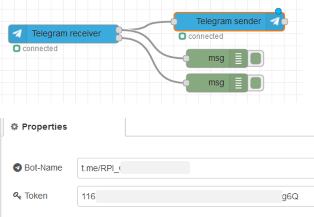

рис.8.20. Перший варіант бота в Node-RED

#### 4.3. Перший запуск бота

Зроблений потік робить ехо-відповіді на будь яке повідомлення в приватному чаті.

- [ ] зробіть розгортання потоку

- [ ] зайдіть в Telegram добавте контакт свого бота, якщо ще не добавили

- [ ] зайдіть в чат і натисніть кнопку `Розпочати` або команду `/start` 

- [ ] якщо бот працює, Вам повинна повернутися та сама команда 

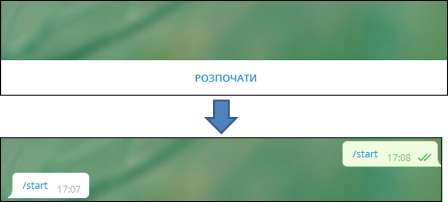

рис.8.21. Перший запуск бота - перевірка

#### 4.4. Аналіз отриманого повідомлення 

- [ ] У вікні налагодження перегляньте структуру повідомлення (рис.8.22). 
- [ ] Визначте `chatId` він вам знадобиться для відправки повідомлення до вказаного чату.     

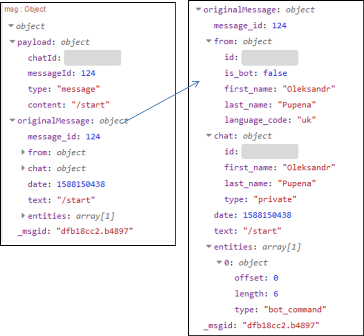

рис.8.22. Аналіз отриманого повідомлення

#### 4.5. Формування стартового повідомлення допомоги

У подальшому бот буде використовуватися в діалозі тільки з використанням команд. Перша команда - це `/start` має виводити список доступних команд.

- [ ] видаліть попередній фрагмент потоку для ехо-відповіді, створіть новий потік 

 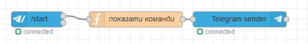

рис.8.23. Формування стартового повідомлення допомоги

Функція "показати команди має наступний вигляд"

```javascript
let txtmsg = "/start - показати базові команди\r\n";
txtmsg += "/sp - виставлення уставок\r\n";
txtmsg += "/pv - отримання плинних значень\r\n";
txtmsg += "/alm - список активних тривог\r\n";
txtmsg += "/rprt - сформувати звіт\r\n";
msg.payload.content = txtmsg;
return msg;
```

- [ ] зробіть розгортання потоку, у чаті наберіть команду `/start`, повинной вийти повідомлення з командами

- [ ] натисніть на команду `/start` - дія повинна повторитися, що показує, що команди в списку можна натискати 

#### 4.6. Відправка тестового повідомлення 

- [ ] Модернізуйте потік так, щоб можна було відправити текстове повідомлення у вказаний чат. Ідентифікатор `chatId` необхідно було визначити в пункті 2.5.

> зверніть увагу, що в `inject` повинен бути формат корисного навантаження `{}JSON`


рис.8.24. Відправка тестового повідомлення

- [ ] згенеруйте відправку повідомлення в чат і проконтролюйте його отримання

#### 4.7. Генерування тривог

У цьому пункті необхідно зробити формування повідомлення в Телеграм, коли значення змінних `rad` та `val` що імітувалися в попередній частині лабораторної роботи будуть вище заданих значень.

- [ ] модифікуйте функцію `наповнення буферу` з попередньої частини лабораторної роботи, вставивши фрагмент між  `flow.set ("trend", trend);` та `return`

```javascript
flow.set ("trend", trend);//записати в контекст потоку
//-------------------
let rtdb = { //глобальна змінна
    trend: trend,
    rad: rad,
    val: val
}
global.set ("rtdb", rtdb);
//---------------------
return msg;
```

цей фрагмент записує буфер, та значення змінних в глобальний контекст

- [ ] добавте до потоку `bot` наступний фрагмент:

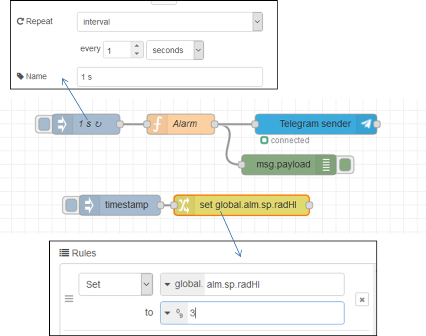

рис.8.25. Генерування тривог - програма

Функція `Alarm`  має наступний зміст

```javascript
let rtdb = global.get ("rtdb") || {}; 
let alm = global.get ("alm") || { //система тривог 
    state:{radHI:false, valHI:false}, //стан тривог 
    sp: {radHI:10.0, valHI:2.0}     //уставки тривог
    };

let almmsg = "";
//умова тривоги активна?
let alm_radHI = rtdb.rad > alm.sp.radHI;
let alm_valHI = rtdb.val > alm.sp.valHI;
//якщо тривога тільки активувалася
if (alm_radHI && !alm.state.radHI) {
    almmsg += "Радіани дорвінюють " + rtdb.rad + " , що вище зданого значення " + alm.sp.radHI + "\r\n";
}
if (alm_valHI && !alm.state.valHI) {
    almmsg += "Синус дорвінює " + rtdb.val + " , що вище зданого значення " + alm.sp.valHI + "\r\n"
}
//запис у стан тривоги
alm.state.radHI = alm_radHI;
alm.state.valHI = alm_valHI;
//збереження станів тривоги в глобальному контексті
global.set ("alm", alm);
//якщо хоча виникла хоча б одна тривога - відправка повідомлень 
if (almmsg.length > 1) {
    msg.payload = {chatId : #######, //тут має бути ваш ідентифікатор
                   type : 'message', 
                   content : almmsg}
    return msg;
}
```

Вузол `change` потрібен для того щоб змінювати уставку для однієї з змінних, наприклад для `rad`. Ця уставка аварійно високого значення зберігається в глобальному контексті як  `alm.sp.radHI`. Значення  `rad` змінюється від `0` до `6.28` а `val` від `-1` до `1`. Таким чином, щоб згенерувати тривогу про високе значення, необхідно його вказати в цих межах.

- [ ] використовуючи фрагмент з вузлом `timestamp` та `change` сформуйте значення `alm.sp.radHI` рівним `3`. 

У результаті з певним періодом повинні генеруватися в чаті тривоги про перевищення значення. 

- [ ] верніть `alm.sp.radHI` в значення вище  `6.28` , щоб тривоги не генерувалися

#### 4.8. Виставлення уставок

У цьому пункті необхідно зробити зміну уставок з чатую Для цього використовується команда `/sp` яка формує клавіатуру з 3-ма кнопками:

- `/rad` - вибору уставки верхнього рівня для змінної `rad` , відправиться відповідна команда
- `/val` - вибору уставки верхнього рівня  для змінної `val`, відправиться відповідна команда
- `відміна ` - відмова від вибору

Далі при виборі змінної формується відповідна команда, яка обробляється окремим обробником, що просить ввести значення цих змінних уставок.  

- [ ] добавте до потоку `bot` наступний фрагмент:

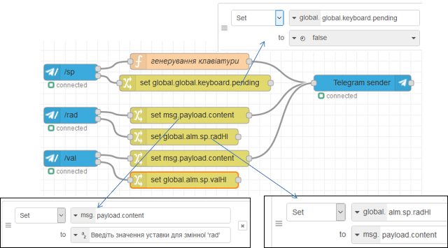

рис.8.26.  Виставлення уставок - програма

- [ ] означте код функції `генерування клавіатури` , який наведений нижче

```javascript
context.global.keyboard = {pending : true};
let opts = {
    reply_to_message_id: msg.payload.messageId,
    reply_markup: JSON.stringify({
        keyboard: [
            ['/rad'],
            ['/val'],
            ['відміна']],
        	'resize_keyboard' : true,
        	'one_time_keyboard' : true
    })
};
msg.payload.content = 'Виберіть змінну';
msg.payload.options = opts;
return [msg];
```

- [ ] зробіть розгортання потоку

- [ ] введіть команду `/sp`

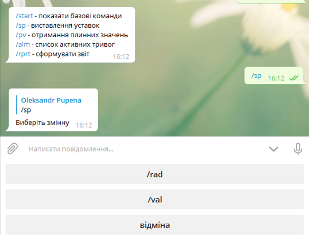

рис.8.27. Виставлення уставок - перевірка

- [ ] натисніть кнопку `/rad`

- [ ] введіть значення 3

- [ ] проконтролюйте, що тривоги будуть спрацьовувати, поверніть задане значення до 10

- [ ] аналогічним чином змініть значення уставки для змінної `/val` (наприклад `0.5`)  

#### 4.9. Отримання плинних значень

- [ ] реалізуйте самостійно команди:

- видачі активних значень змінних у форматі "назва - значення" у новому рядку
- видачі списку активних тривог у форматі "назва тривоги" у новому рядку, якщо активних тривог немає - видати повідомлення "Немає активних тривог"

- [ ] команда на формування звіту може бути використана в курсовому проекті  

#### 4.10. Тестування чат бота в приватному чаті товариша

- [ ] попросіть свого товариша протестувати Вашого чат-бота

- [ ] відправте ім'я чат-бота для перевірки викладачем 

#### 4.11. Тестування чат бота в загальному чаті (не обов'язкове для виконання)

Виконання даного пункту буде враховуватися як додаткові 5 балів на іспиті

- [ ] попросіть у викладача запрошення на бот-чат групу

- [ ] відлагодіть ваш бот, щоб він правильно працював у групі   

## Питання до захисту

1. Навіщо в лабораторній роботі створювався сервісний аккаунт Google? Поясніть чому не можна користуватися звичайним аккаунтом користувача?
2. Яким чином вирішується задача захисту від несанкціонованого доступу застосунку до сервісів Google? 
3. Яким чином вирішується задача авторизації доступу до конкретних сервісів та документів Google? 
4. Як в лабораторній роботі вирішується питання буферизації даних перед відправленням? У чому необхідність буферизації?
5. Прокоментуйте фрагмент програми, де відбувається запис даних в масив буферу.
6. Розкажіть про налаштування вузлів Node-RED для роботи з Google Sheet.
7. Розкажіть про основні кроки реєстрації Telegram Bot.
8. Розкажіть про налаштування вузлів Node-RED для роботи з Telegram Bot.
9. Які функції виконував Telegram Bot в даній лабораторній роботі?
10. Прокоментуйте роботу фрагмента програми що генерує тривоги.
11. Прокоментуйте роботу фрагмента програми що змінює уставки для тривог з Telegram Bot.      

