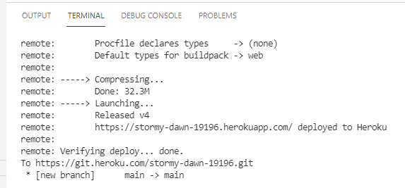

**Програмна інженерія в системах управління. Лабораторний практикум.** Автор і лектор: Олександр Пупена 

| [<- до лабораторних робіт](README.md) | [на основну сторінку курсу](../README.md) |
| ------------------------------------- | ----------------------------------------- |
|                                       |                                           |

# Лабораторна робота №9. Основи роботи з Node.js. Розгортання в хмарному хостингу

**Тривалість**: 4 акад. години.

**Мета:** навчитися створювати застосунки для середовища виконання Node.js та розгортати їх в хмарному середовищі.    

**Лабораторна установка**

- Апаратне забезпечення: ПК
- Програмне забезпечення: Node.js, Visual Studio Code, сервіси heroku, Git 

## Порядок виконання роботи 

Передбачається що на комп'ютері встановлені Node.js, npm та Visual Studio Code, Git. 

### 1. Робота з проектами та вбудованими модулями Node.js

#### 1.1. Створення нового проекту Node.js

- [ ] Створіть папку з назвою `lab9_nodejs`, у якій буде знаходитися проект Node.js
- [ ] Запустіть на виконання Visual Studio Code
- [ ] Виберіть створену папку в `File -> Open Folder`
- [ ] Відкрийте вікно терміналу `View -> Terminal`
- [ ] У терміналі наберіть `npm init -y` та натисніть Enter для автоматичного створення файлу `package.json` з залежностями
- [ ] Відкрийте створений файл package.json, подивіться на створені за замовченням поля. 
  - [ ] Зверніть увагу, що головний файл проекту очікується як `index.js`
  - [ ] Зверніть увагу що в проекті немає жодної залежності від інших пакунків, так як він порожній 

#### 1.2. Встановлення пакунку nodemon 

Пакунок `nodemon` дає можливість змінювати програму в середовищі виконання  без зупинки та повторного запуску. Цей пакунок відноситься до середовищ розроблення.   

- [ ] У терміналі наберіть `npm install nodemon -D` та натисніть Enter. 

Команда `install` встановлює потрібний пакунок, а опція  `-D` вказує на те, що цей пакунок потрібен тільки в середовищі розроблення для налагодження застосунку. 

У результаті виконання команди менеджер npm завантажує необхідний пакунок з репозиторію, розпаковує його у вашу папку і встановлює залежності в:

- файл  package.json
- новостворений файл package-lock.json

- [ ] Використовуючи вбудоване у Visual Studio Code вікно Explorer подивіться на зміст папки проекту: там повинна з'явитися папка `node_modules` та міститися два файли json.
- [ ] Подивіться на зміст файлу  `package.json`: там повинен з'явитися розділ `devDependencies` у якому є назва встановленого пакунку. Тепер він використовується в проекті для середовища розроблення.
- [ ] Подивіться на зміст файлу  `package-lock.json`: він сформований автоматично для роботи системи, з відомостями про встановлені пакунки та їх залежності.
- [ ] Відкрийте папку `node_modules`, там  є велика кількість папок, які є пакунками. 

Ці пакунки поставилися разом з `nodemon` так як він залежить від деяких пакунків, а ті у свою чергу залежать від інших і т.д. Тому у папку `node_modules` ставляться усі необхідні пакунки для проекту. 

- [ ] У папці `node_modules` знайдіть папку пакунку nodemon, та відкрийте наявний в ньому файл package.json та перегляньте його зміст. Зверніть увагу на поля  `Dependencies` та  `devDependencies` 

Файли  package.json дають можливість зберігати в репозиторію та передавати іншим проекти без node_modules. Можна видалити  папку node_modules та використовуючи команду `npm install` встановити усі необхідні пакунки, які вказані в   `Dependencies` та  `devDependencies`.

- [ ] Видаліть папку `node_modules`.
- [ ] У терміналі наберіть `npm install` та натисніть Enter.

Усі необхідні пакунки будуть встановлені. 

#### 1.3. Створення файлів-модулів проекту

- [ ] У корні проекту створіть файл `index.js` у якому запишіть фрагмент програми  

```js
console.log ('Hello!');
```

- [ ]  Перевірте роботу програми через команду в консолі `node index`
- [ ] Змініть програму та перевірте її роботу 

```js
console.log ('Hello!', __dirname); //ім'я директорії плинного модуля 
console.log (__filename); //ім'я файлу плинного модуля
```

- [ ] Створіть файл `user.js` у якому запишіть наступний код, вказуючи своє прізвище замість 'Ivanenko Ivan':

```js
const user = {
  name: 'Ivanenko Ivan', 
  age: 21 
}
//експортувати з модуля об'єкт user та функцію 
module.exports = {
  user: user,
  sayHello() {
    console.log ('Hello')
  }  
}  
```

- [ ] Змініть програму у файлі `index.js` та перевірте її роботу  

```js
//підключити експортовані об'єкти user.js 
const Obj = require ('./user.js'); 
console.log (Obj.user);
Obj.sayHello(); 
```

- [ ] Зробіть копію екрану для звіту

#### 1.4. Модуль os

- [ ] У  файлі `index.js` закоментуйте попередню програму, створіть нову та перевірте її роботу

```js
const os = require('os');   //підключення модуля роботи з os 
console.log(os.platform()); //платформа
console.log(os.arch());     //архітектура 
console.log(os.cpus());     //інформація про ЦПУ
console.log(os.freemem());  //вільна пам'ять 
console.log(os.totalmem()); //скільки пам'яті
console.log(os.homedir());  //коренева директорія
console.log(os.uptime());   //час роботи системи
```

- [ ]   Зробіть копію екрану для звіту

#### 1.5. Модуль path

- [ ] У  файлі `index.js` закоментуйте попередню програму, створіть нову та перевірте її роботу

```js
const os = require('os');
const path = require('path');
console.log(`Роздільник системи - ${path.sep}`); 
let homedir = os.homedir();
console.log(`Домашня директорія - ${homedir}`); 
console.log (`Шлях директорії складається з частин - ${path.parse(homedir)}`);
console.log ('Файл з розширенням - ' + path.basename('/foo/bar/baz/asdf/quux.html'));
console.log ('Файл без розширення - ' + path.basename('/foo/bar/baz/asdf/quux.html','.html')); 
console.log ('Розділювач шляхів - ' + path.delimiter); 
console.log (path.dirname('/foo/bar/baz/asdf/quux')); 
console.log ('Розширення - ' + path.extname('index.html'));
console.log (path.join(homedir,'f1','sf1','file.txt'));
console.log(path.resolve());
console.log(path.resolve(homedir, '..',  'newuser'));
console.log(homedir.split(path.sep)); 
```

- [ ]   Зробіть копію екрану для звіту

#### 1.6. Модуль fs

- [ ] У  файлі `index.js` закоментуйте попередню програму, створіть нову, де змініть прізвища та ім'я на своє та перевірте її роботу

```js
const fs = require('fs');
fs.writeFileSync('file1.txt', 'Цей текст запишеться у файл\n', 'utf8');
fs.appendFileSync('file1.txt', 'Цей текст добавила в файл програма Іваненко Івана\n', 'utf8');
console.log (fs.readdirSync('./', 'utf8'));
fs.copyFileSync('file1.txt', 'destination.txt'); 
try {
  const content = fs.readFileSync('file1.txt', 'utf8');
  console.log(content); 
} catch (e) { console.log(e)}
try {
  const content = fs.readFileSync('file1.txt');
  console.log(content); 
} catch (e) { console.log(e)}
fs.readFile('file1.txt', 'utf8', (err, data) => {
  if (err) throw err
  console.log(data);
})
```

- [ ] Перевірте створення файлів   'file1.txt' та 'destination.txt' і подивіться на їх зміст
- [ ] Зробіть копію екрану для звіту

#### 1.7. Створення клієнту з використанням модулю http

- [ ] У  файлі `index.js` закоментуйте попередню програму, створіть нову та перевірте її роботу

```js
const http = require('http');
const fs = require('fs');
const options = {
  hostname: 'www.example.org',
  port: 80, path: '/',
  method: 'GET', headers: {}
};
const req = http.request(options, (res) => {
  console.log(`STATUS: ${res.statusCode}`);
  console.log(`HEADERS: ${JSON.stringify(res.headers)}`);
  res.setEncoding('utf8');
  res.on('data', (chunk) => {   
    fs.writeFileSync('example.html', chunk, 'utf8');
    //console.log(`BODY: ${chunk}`);
  });
});
req.on('error', (e) => { 
  console.error(`problem with request: ${e.message}`);
});
req.end();
```

- [ ] Зміст сторінки   www.example.org повинен записатися у файл `example.html`
- [ ] Зробіть копію екрану для звіту 

### 2.Створення простого ВЕБ-серверу 

#### 2.1. Створення серверу з використанням модулю http

- [ ] Перенесіть весь зміст `index.js`  у  якийсь файл для збереження історії ваших дій. У  файлі `index.js` створіть нову програму наведену нижче, але змініть прізвище на своє. Перевірте роботу програми з використанням ВЕБ-браузеру, вказавши локальну адресу `127.0.0.1:7001`. Перевірте як працюють обидві відповіді:  зі `statusCode = 200` та `statusCode = 404`. 

```js
const http = require('http');
const fs = require('fs');
const path = require('path');
const port = 7001;
//створення серверу
const server = http.createServer((req, res) => {
  //обробка GET 
  if (req.method === 'GET') {
    switch (req.url) {
      case '/':
      case '/home': {
        res.statusCode = 200;
        res.setHeader('Content-Type', 'text/plain;charset=utf-8');
        res.end('Це домашня сторінка Іваненко Івана \n');//завершити з'єднання 
        break}
      default: {
        res.statusCode = 404;
        res.setHeader('Content-Type', 'text/plain;charset=utf-8');
        res.end('Не знайдено\n');
        break}}}
 //обробка POST
})  
//запуск прослуховуваня
server.listen(port, () => {
  console.log(`Server listens http://${host}:${port}`)
})
```

- [ ] Зробіть копію екрану для звіту 
- [ ] Зупиніть роботу програми з використанням комбінації `CTRL+C` в консолі

#### 2.2. Використання nodemon

Для внесення змінних у виконавчу програму приходиться її зупиняти і запускати заново. Пакунок `nodemon` , який був встановлений у Ваш проект на початку лабораторної роботи, дає можливість вносити зміни без перезапуску. Цей пакунок запускає застосунок та слідкує за зміною JS файлів. Як тільки файл змінюється - nodemon автоматично перезапускає проект.

Для можливості запуску в режимі налагодження (з nodemon) та виконання, можна використати функціональність скриптів пакунку npm. Для цього у файлі `package.json` можна записати скрипти, які будуть запускатися при виклику команди `npm run <назва скрипта>`. Також скрипти використовуються при розгортанні застосунку на кінцевому місці розташування. Так, після розгортання застосунку може використовуватися скрипт `start`, а при запуску на комп'ютері розробника - `dev`.

- [ ] Відкрийте файл  `package.json` змініть властивість `scripts` як це показано нижче 

```json
  "scripts": {
    "start": "node index.js",
    "dev": "nodemon index.js"
  }
```

Перший скрипт викликає звичайну команду запуску файлу `js` середовищем node.  Другий скрипт запускає модуль `nodemon`, який у свою чергу запускає `index.js` в особливому режимі. Тепер для запуску необхідного скрипта треба викликати команду `npm run <назва скрипта>`.

- [ ] Запустіть програму з використанням пакунку `nodemon`, набравши в консолі наступну команду

```bash
npm run dev
```

- [ ] Змініть програму в  `index.js` змінивши кодування відповіді на `text/html` та добавивши заголовки `<h1>` в тексті відповіді

```js
res.setHeader('Content-Type', 'text/html;charset=utf-8');//тут змінили на text/html 
res.end('<h1> Це домашня сторінка Іваненко Івана </h1>');//тут добавили заголовки 
```

- [ ] Збережіть `index.js` 

Тепер `nodemon` автоматично перезапустить систему виконання, так як файл `index.js` було змінено, про що буде повідомлено в консолі.   

- [ ] Перевірте роботу серверу аналогічно як в п.2.1 Зробіть копії екрану браузеру.

#### 2.3. Відправка файлу html на запит

- [ ] Створіть у проекті папку з назвою `Views` 
- [ ] Створіть у створеній паці файл `index.html` з наступним змістом, але змінивши прізвище на своє

```html
<!DOCTYPE html>
<html lang="en">
<head>
  <meta charset="UTF-8">
  <meta http-equiv="X-UA-Compatible" content="IE=edge">
  <meta name="viewport" content="width=device-width, initial-scale=1.0">
  <title>Document</title>
</head>
<body>
  <h1>Це сторінка Іваненко Івана</h1>
  <h2>Тут відображаються звіти</h2>
</body>
</html>
```

- [ ] Змініть фрагмент програму користувача в  `index.js`, щоб відкривалася дана сторінка. Перевірте роботу 

```js
      case '/home': {
        res.statusCode = 200;
        fs.readFile(
          path.join(__dirname, "views", "index.html"),
          "utf-8",
          (err, content) => {
            if (err) {
              throw err;
            }
            res.end(content);
          }
        );
        break}
```

#### 2.4. Створення сторінки з графіками

- [ ] Створіть у паці  `Views`  файл `chart.html` з наступним змістом

```html
<html>
  <head>
    <script type="text/javascript" src="https://www.gstatic.com/charts/loader.js"></script>
    <script type="text/javascript">
      google.charts.load('current', {'packages':['corechart']});
      google.charts.setOnLoadCallback(drawChart);

      function drawChart() {
        var data = google.visualization.arrayToDataTable([
          ['', 'Toutdoor', 'Thome'],
          ['12:00',  10.5,      18.2],
          ['12:30',  10.2,      20.2],
          ['13:00',  10,       19.5],
          ['13:30',  11.5,      21.3]
        ]);

        var options = {
          title: 'Average temperature',
          curveType: 'function',
          legend: { position: 'bottom' }
        };

        var chart = new google.visualization.LineChart(document.getElementById('curve_chart'));

        chart.draw(data, options);
      }
    </script>
  </head>
  <body>
    <div id="curve_chart" style="width: 900px; height: 500px"></div>
  </body>
</html>

```

- [ ] Змініть файл `index.html` наступним чином

```html
<body>
  <h1>Це сторінка Іваненко Івана</h1>
  <h2>Тут відображаються звіти</h2>
  <a href="/chart">Сторінка з графіками </a>
</body>
```

- [ ] Змініть фрагмент програму користувача в  `index.js`, добавивши туди ще один шлях 

```js
      case '/chart': {
          res.statusCode = 200;
          fs.readFile(
            path.join(__dirname, "views", "chart.html"),
            "utf-8",
            (err, content) => {
              if (err) {
                throw err;
              }
              res.end(content);
            }
          );
          break}
```

- [ ] Перевірте роботу програми, не забудьте перезавантажувати сторінку в браузері.

### 3. Зв'язок Node-RED з ВЕБ-сервером з використанням REST API

#### 3.1. Створення обробника шляху для передачі даних

- [ ] Змініть фрагмент програму користувача в  `index.js`, добавивши туди обробник POST, який буде відправляти отримані повідомлення. Фрагмент програми вставляється в місце тексту `//обробка POST`.

```js
    //обробка POST
    if (req.method === 'POST') {
      const body = [];
      res.statusCode = 200;
      req.on("data", (data) => {
        body.push(data);
      });
      req.on("end", () => {
        console.log (body.toString());
        res.end();
      });            
    } 
```

- [ ] Збережіть файл

#### 3.2. Відправка JSON з Node-RED

- [ ] Запустіть Node-RED
- [ ] Створіть новий проект.

- [ ] Імпортуйте в проект Node-RED наступний фрагмент

```json
[{"id":"38c3746b.971e2c","type":"debug","z":"f26616a5.84896","name":"","active":false,"tosidebar":true,"console":false,"tostatus":false,"complete":"true","targetType":"full","statusVal":"","statusType":"auto","x":590,"y":240,"wires":[]},{"id":"ff49cd77.fdd1c8","type":"http request","z":"f26616a5.84896","name":"","method":"POST","ret":"txt","paytoqs":"ignore","url":"http://127.0.0.1:7001/","tls":"","persist":false,"proxy":"","authType":"","x":450,"y":240,"wires":[["38c3746b.971e2c"]]},{"id":"8cf05f5b.1dedd8","type":"function","z":"f26616a5.84896","name":"","func":"let trends = flow.get ('trends') || [];\nlet val = {\n    ts : Date.now(), \n    Toutlet: Math.random()*10, \n    Thome: Math.random()*20\n}\ntrends.push (val);\nif (trends.length >= 10) {\n    msg.payload = trends;\n    node.send (msg);    \n    trends = [];\n}\nflow.set ('trends', trends);\n","outputs":1,"noerr":0,"initialize":"","finalize":"","libs":[],"x":300,"y":240,"wires":[["ff49cd77.fdd1c8"]]},{"id":"db420679.8a255","type":"inject","z":"f26616a5.84896","name":"","props":[{"p":"payload"},{"p":"topic","vt":"str"}],"repeat":"1","crontab":"","once":false,"onceDelay":0.1,"topic":"","payload":"","payloadType":"date","x":150,"y":240,"wires":[["8cf05f5b.1dedd8"]]}]
```

- [ ] Запустіть проект Node-RED на виконання.

Тепер Node-RED буде кожні десять секунд відправляти масив значень вимірювальних параметрів та їх відмітки часу на веб-сервер з використанням методу POST. Масив відображається в консолі.

#### 3.3. Збереження отриманих даних на сервері в один масив 

Необхідно забезпечити, щоб дані зберігалися в одному масиві. 

- [ ] Добавте в програму `index.js` рядок з об'явленням масиву для збереження трендів

```js
const http = require('http');
const fs = require('fs');
const path = require('path');
const port = 7001;
let trends = [];//масив для збереження трендів
//створення серверу
```

- [ ] Змініть в `index.js` обробник записування в масив отримання даних з Node-RED

```js
      req.on("end", () => {
        //console.log (JSON.parse(body.toString()));
        trends = trends.concat (JSON.parse(body.toString()));
        console.log (`Записів тренду в масиві ${trends.length}, останній запис ${(JSON.stringify(trends[trends.length-1]))}`); 
        if (trends.length >= 3600) {
          let fname = trends[0].ts;
          //запис в файл значень за годину
          fs.writeFileSync(fname + '.log', JSON.stringify(trends), 'utf8');
          trends = [];
        } 
        res.end();
      });
```

#### 3.4. Створення обробника для запиту даних від серверу 

Необхідно зробити обробник для серверу, який віддавав би збережені в масиві дані за останню хвилину у форматі, який визначений для `drawChart`. Для цього спочатку необхідно реалізувати функцію яка буде вибирати дані за вказаний період.

- [ ]  У кінці файлу `index.js` добавте функцію, що відправляє дані згідно запиту 

```js
function gettrenddata (trdata, dtstart = Date.now() - 1*60*1000, dtend = Date.now()){
  let ret = [['Time', 'Toutdoor', 'Thome']];
  for (let i=0; i < trdata.length; i++) {
    if (trdata[i].ts>dtend) break; 
    if (trdata[i].ts>dtstart) {
      let ts = new Date (trdata[i].ts);
      stime = '' + ts.getHours() + ':' + ts.getMinutes() + ':' + ts.getSeconds(); 
       let rec = [stime, trdata[i].Toutlet, trdata[i].Thome]; 
       ret.push (rec); 
    }  
  }
  return JSON.stringify(ret);
}
```

- [ ] У файлі `index.js` в case обробника `GET` добавте наступний обробник для маршруту `/gettrend`

```js
      case '/gettrend': {
          res.statusCode = 200;
          res.setHeader('Content-Type', 'text/json; charset=utf-8');        
          res.end (gettrenddata (trends));
          //console.log (gettrenddata (trends));
        break}
```

- [ ] перевірте роботу серверу, звернувшись в браузері за адресою http://127.0.0.1:7001/gettrend . Ви маєте отримувати дані за останню хвилину

#### 3.5. Зміна клієнтського файлу html для динамічної зміни графіку за останню хвилину 

Необхідно щоб сторінка chart кожні 10 секунд оновлювала дані і видавала їх у вигляді графіку тренду.

- [ ] Змініть файл `chart.html` наступним змістом

```html
<html>
  <head>
    <script type="text/javascript" src="https://www.gstatic.com/charts/loader.js"></script>
    <script type="text/javascript">
      google.charts.load('current', {'packages':['corechart']});
      google.charts.setOnLoadCallback(drawChart);

      function drawChart() {
        let trnd = [];
        let xhr = new XMLHttpRequest();
        xhr.open('GET', '/gettrend');
        xhr.send();
        xhr.onload = function() {
        if (xhr.status != 200) { 
            alert(`Error ${xhr.status}: ${xhr.statusText}`); 
          } else { 
            var data = google.visualization.arrayToDataTable(            
            JSON.parse(xhr.response)
            );
            var options = {
              title: 'Average temperature',
              curveType: 'function',
              legend: { position: 'bottom' }
            };
            var chart = new google.visualization.LineChart(document.getElementById('curve_chart'));

            chart.draw(data, options);
          }
        };  
      }
      setInterval (drawChart, 10000);
    </script>
  </head>
  <body>
    <div id="curve_chart" style="width: 900px; height: 500px"></div>
  </body>
</html>

```

- [ ] Збережіть файл. У браузері відкрийте або оновіть стоірнку http://127.0.0.1:7001/chart . 

Раз в 10 секунд графіки повинні оновлюватися.

Зробіть копію екрану.

### 4. Розгортання серверу на хмарному хостингу

 [Heroku](https://uk.wikipedia.org/wiki/Heroku) -  хмарна PaaS-платформа, що підтримує ряд середовищ виконання тому числі Node.js. У певному обсязі для власного користування сервіс доступний на безоплатній основі. У даній лабораторній роботі сервіс використовується для розгортання серверного застосунку.

#### 4.1. Реєстрація на хмарному хостингу heroku

- [ ] Зайдіть на <www.heroku.com> . Зареєструйтеся, натиснувши кнопку `sign up` , це безкоштовно. 
  - [ ] Введіть Ім'я, Прізвище, Email, організацію та роль в ній, країну
  - [ ] У полі `Primary development language` виберіть `Node.js`
  - [ ] натисніть `Create Free Account`
  - [ ] Почекайте коли на пошту прийде пароль для підтвердження реєстрації, перейдіть за посиланням
  - [ ] Зайдіть в систему

#### 4.2. Завантаження, встановлення клієнта heroku та реєстрація

- [ ] Зайдіть на <https://devcenter.heroku.com/articles/heroku-cli>. Завантажте та встановіть клієнт командного рядку для роботи з хмарним застосунком heroku.  

- [ ] У Visual Studio Code добавте новий термінал через кнопку + у вікні  терміналу. У новій консолі введіть команду:

```bash
heroku -v 
```

- [ ] Має вивестись інформація про heroku. Якщо інформація не виводиться, варто перезапустити Visual Studio Code.
- [ ] Введіть `heroku login` натисніть Enter, після чого відкриється браузер для реєстрації
- [ ] Увійдіть в браузері до свого аккаунту. Після цього в консолі буде написано що Ви успішно зайшли в систему.

#### 4.3. Створення проекту

- [ ] У консолі введіть 

```bash
heroku create
```

Буде виведено посилання на створений застосунок.

- [ ] Відновіть в браузері сторінку на сайті heroku https://dashboard.heroku.com/apps Повинна відобразитися сторінка з новим застосунком  


рис.9.1. Сторінка із застосунком в сервісі heroku 

- [ ] Зайдіть в створений проект на сайті heroku, клікнувши по назві. Передивіться зміст закладок.

#### 4.4. Налаштування проекту для роботи з http сервером

Зараз застосунок серверу налаштований таким чином щоб розгортатися на локальному ПК. Необхідно змінити налаштування так, щоб в залежності від місця запуску застосунок запускався з використанням порту, який видає хмарний сервіс. Для цього в коді index.js треба внести посилання на змінну середовища яка в heroku вказується як порт.  

- [ ] У файлі `index.js` змініть рядок та збережіть  

```js
const port = process.env.PORT || 7001;
```

Таким чином у змінну port буде записуватися значення змінної середовища `PORT`, якщо вона не означена, то буде писатися константа.

#### 4.5. Розгортання застосунку

- [ ] Добавте в корінь проекту файл '.gitignore'. Впишіть у файл наступний текст

```
node_modules
```

Це дасть змогу не передавати пакунки разом з застосунком а поставити їх на місці розгортання при розгортанні.

Усі процедури розгортання написані на вкладці `deploy` на сторінці проекту heroku. 

- [ ] Проініціалізуйте в корні папки застосунку репозиторій. Наберіть в консолі 

```
git init
```

- [ ] Добавте в індекс усі файли

```
git add .
```

- [ ] Добавте файли в комміт

```
git commit -am "First commit"
```

- [ ] Встановіть віддалений репозиторій для зв'язку з локальним. Зверніть увагу, що у вашому випадку має бути назва вашого проекту. Команду можна також скопіювати з вкладки `deploy` на сторінці проекту heroku. 

```
heroku git:remote -a <назва_вашого_застосунку_в_heroku>
```

- [ ] Зробіть завантаження проекту у віддалений репозиторій

```
git push heroku main
```

Після запуску цієї команди застосунок повинен завантажитися у віддалений репозиторій і початися процес розгортання. 



рис.9.2. Журнал повідомлень процесу розгортання

- [ ] Після завершення операції виведіть детальний журнал розгортання

```
heroku logs
```

- [ ] Після завершення розгортання перейдіть на вкладку `activity` сторінки застосунку в heroku. 
- [ ] Зробіть копію екрану. 
- [ ] Натисніть `Open App` для відкриття застосунку.  

Якщо сторінка відкривається, переходьте до наступного пункту, якщо ні - попросіть викладача про допомогу. 

#### 4.6. Зміна застосунку Node-RED на запис даних в хмарний сервер.

- [ ] Використовуючи адресу вашого хмарного застосунку самостійно реалізуйте, щоб значення змінних з Node-RED писалися також і в хмарний сервер. 

Зробіть копію екрану роботи хмарного застосунку з відображеними графіками. 

## Питання до захисту

1. Які команди npm і для чого використовувалися в даній лабораторній роботі.
2. Яке призначення файлу `package.json`? Як він створювався в даній лабораторній роботі і які зміни Ви вносили в цей файл і для чого?
3. Яке призначення пакунку `nodemon`?
4. Що таке модулі в Node.js? Як модулі підключаються до інших модулів?
5. Розкажіть про модуль `os`.
6. Розкажіть про модуль `path`.
7. Розкажіть про модуль `fs`.
8. Розкажіть про модуль `http`.
9. Прокоментуйте програму для роботи http-клієнта.
10. Прокоментуйте програму для роботи http-сервера.
11. Прокоментуйте роботу скриптів файлу `chart.html`.
12. Розкажіть яким чином Node-RED відправляє дані для графіків на Веб-сервер.
13. Прокоментуйте роботу обробника для запиту даних історії від серверу.
14. Прокоментуйте роботу фрагменту програми `chart.html` що виводить дані на графік.
15. Розкажіть про принципи розгортання застосунку на сервісі heroku.
