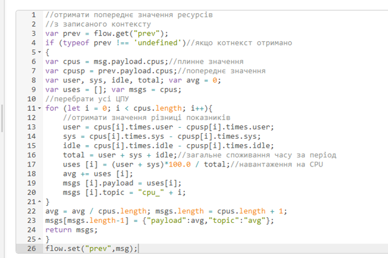

| [<- до лаборних робіт](README.md) | [на основну сторінку курсу](../README.md) |
| --------------------------------- | ----------------------------------------- |
| [<- частина 1](labdb_1maria.md)   | [частина 3 ->](labdb_3rpi.md)             |

# Лабораторна робота №6. Основи роботи з базами даних та SQL

- Робота з SQL в NodeRED
- Приклад реалізації завдання

[Команди SQL](../Довідники/SQL.md)

[бібліотека Node-RED для роботи з БД](https://pupenasan.github.io/NodeREDGuidUKR/dbase/)

[бібліотека  Node-RED Operating Systems](https://pupenasan.github.io/NodeREDGuidUKR/systems/os.html)

## Частина 2. Робота з SQL в Node-RED.

У цій частині лабораторної роботи бази даних будуть використовуватися у Node-RED для збереження показників роботи системи - процесорного часу та використання пам'яті.  

###### 1.Встановлення бібліотеки Node-RED для роботи з БД.

- Запустіть Node-RED. 
- Створіть новий потік у вашому проекті з назвою DB
- Встановіть бібліотеку `node-red-contrib-sqldbs`
- ознайомтеся з роботою бібліотеки за посиланням [бібліотека Node-RED для роботи з БД](https://pupenasan.github.io/NodeREDGuidUKR/dbase/)

###### 2.Отримання переліку баз даних.

У даній лабораторній роботі будуть використовуватися два підключення - до системної бази даних `mysql` та до користувацької `devinfo`. Перша буде використовуватися для ініціалізації, а саме:

- при підключенні до системної БД буде перевірятися наявність БД  `devinfo`, якщо її немає - вона буде створюватися; зрештою необхідність вказівки до системної БД `mysql` зумовлена необхідністю конфігурування підключення принаймні до якоїсь БД, а системна завжди присутня; 

Після підключення до користувацької БД  `devinfo` перевіряється наявність сконфігурованої таблиці, і якщо її немає - вона також створюється автоматично. 

- у новоствореному потоці `DB` створіть фрагмент, який буде отримувати перелік баз даних


-  зробіть розгортання, зробіть ініціювання формування запиту, повинен бути результат як зображено на рисунку праворуч; проаналізуйте і порівняйте, чи співпадає цей перелік з побаченим за допомогою клієнтської утиліти HeidiSQL.    

У бібліотеці `sqldbs` будь який запит чомусь видає масив з 2-х однакових членів. Можливо це було створено автором навмисно, а можливо це особливість виконання на платформі. 

###### 3.Отримання переліку баз даних, з вказаним шаблоном імені.

- у вузлі `Inject` змініть запит, щоб він повертав відповіді за вказаним шаблоном (оператор `LIKE`) імені `mysql`

```sql
SHOW DATABASES LIKE 'mysql' 
```

- подивіться на результат виконання запиту
- змініть запит на наступний

```sql
SHOW DATABASES LIKE 'devinfo' 
```

- подивіться на результат виконання запиту

###### 4.Створення запиту на створення бази даних

- модифікуйте програму, як показано на рисунку


- ініціюйте виконання запиту на створення БД
- ініціюйте виконання запиту на відображення списку БД з іменем 'devinfo', подивіться чи з'явилася  ця БД в списку
- ініціюйте виконання запиту на створення БД повторно; у панелі налагодження повинно з'явитися повідомлення про помилку;

###### 5.Створення фрагменту коду, що створює базу даних з необхідними таблицями при старті

- використовуючи HeidiSQL видаліть БД  'devinfo'; альтернативно можете створити вузол в Node-RED для виконання видалення;
-  модифікуйте програму, як наведено нижче; код SQL запиту, який буде формувати таблицю показаний під рисунком


```sql
CREATE TABLE tab1(
	TS TIMESTAMP NOT NULL DEFAULT current_timestamp(),
	cpuavg FLOAT NULL DEFAULT NULL,
    memory FLOAT NULL DEFAULT NULL,  
    PRIMARY KEY (TS)
)
```

Програма працює наступним чином: при старті перевіряється наявність бази даних  'devinfo', якщо її немає формується запит на створення БД, після чого формується запит на створення таблиці в БД (зверніть увагу що необхідно буде добавити конфігураційний вузол з БД 'devinfo')

###### 6.Встановлення та ознайомлення з бібліотеки Node-RED отримання статистики з ОС. 

- Встановіть бібліотеку Node-RED `node-red-contrib-os` для отримання даних з ОС. 
- Ознайомтеся з її вузлами та принципами їх роботи з  [опису бібліотеки  Node-RED Operating Systems](https://pupenasan.github.io/NodeREDGuidUKR/systems/os.html)

###### 7.Перевірка роботи вузлів `Memory` та `CPUs`.

За допомогою наведеного нижче фрагменту програми протестуйте роботу вузлів  `Memory` та `CPUs`. Опис вузлів наведений в довіднику [Node-RED](https://pupenasan.github.io/NodeREDGuidUKR/systems/os.html) . Зокрема дізнйтеся:

- скільки часу працює ваш ПК з моменту останнього запуску
- скільки пам'яті було використано в момент ініціювання потоку (`inject` )
- зайдіть в диспетчер задач і порівняйте отримані результати з показаними в диспетчері


###### 8.Створення фрагменту програми ресурсів.

У цьому пункті необхідно зробити програму, яка буде відображати споживання ресурсів.

- Модифікуйте програму користувача як показано на рисунку. Нижче рисунку наведений лістинг програми вузла "Моніторинг". Вузли відображення на Dashboard налаштуйте самостійно. Оновлення повинно відбуватися кожні 5 секунд. 




- зробіть розгортання проекту, має бути вигляд як на рисунку

  

###### 9.Модифікація програми для формування записів в історію.

- модифікуйте програму відповідно до наведеного нижче фрагменту


- зробіть розгортання та досягніть щоб не було помилок
- використовуючи HeidiSQL проконтролюйте, що дані дійсно записуються в БД

###### 10.Реалізація запиту вибірки.

Використовуючи функції дати/часу MariaDB в HeidiSQL реалізуйте запит вибірки `SELECT`, який буде показувати дані за останні 5 хвилин.

###### 11.Зробіть копії екранів для звіту. Зробіть `commit` проекту та `push` в GitHub. 

| [<- до лаборних робіт](README.md) | [на основну сторінку курсу](../README.md) |
| --------------------------------- | ----------------------------------------- |
| [<- частина 1](labdb_1maria.md)   | [частина 3 ->](labdb_3rpi.md)             |