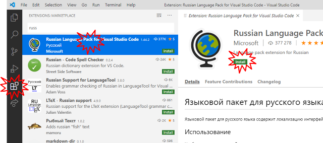

| [<- до лаборних робіт](README.md) | [на основну сторінку курсу](../README.md)   |
| --------------------------------- | ------------------------------------------- |
|                                   | [перейти до 2-ї частини ->](labjs_2node.md) |

# Лабораторна робота №7. Основи роботи з JavaScript та Node.js

Рекомендується попередньо ознайомитися з матеріалами лекцій по:

- [Основи JavaScript](../Лекц/javascript.md)
- [Об'єкти та функції JavaScript](../Лекц/jsobjects.md)

##### План.

###### Частина 1. 

- Робота з JavaScript 

###### Частина 2.

- Робота з функціями в Node-RED

## Частина 1. Робота з JavaScript.

###### 1.Встановлення та налаштування Visual Studio Code (VSC) 

- Завантажте та встановіть на робочий ПК безкоштовний редактор [Visual Studio Code](https://code.visualstudio.com/) .
- запустіть його на виконання
- за бажанням виберіть та встановіть мовне розширення; на момент написання даних методичних рекомендацій українського розширення немає, але є російське. Тим не менше в наступних частинах лабораторної роботи використовується оригінальний англомовний інтерфейс




###### 2.Створення робочої області, добавлення папки та файлу.  

Visual Studio Code (надалі VSC) - редактор IDE, який надаєм можливості зручного створення проектів на різних мовах програмування, у тому числі на JavaScript. Проект створюється в межах ***робочого простору*** (***Workspace***), який включає в себе файли налаштування, папки та файли проекту.  

- створіть десь на диску вашого ПК папку з назвою "Lab7_lastname", де  "lastname" - ваше прізвище 
- після відкриття VSC, одразу збережіть файл робочої області "File->Save Workspace As.." у папці, яку Ви щойно створили з такою ж назвою  
- створіть новий файл "File->New File" після чого збережіть його з іменем `1.js` у цю ж папку 
- скопіюйте в редактор наступний код:

```javascript
console.log("Привіт світ!");
```

- запустіть код на виконання клавішою `F5` у консолі налагодження повинно з'явитися повідомлення


| [<- до лаборних робіт](README.md) | [на основну сторінку курсу](../README.md)   |
| --------------------------------- | ------------------------------------------- |
|                                   | [перейти до 2-ї частини ->](labjs_2node.md) |

