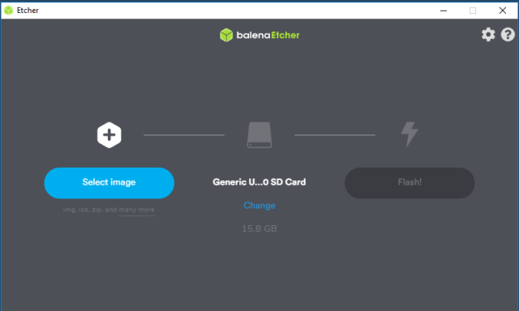
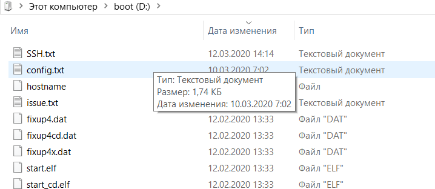
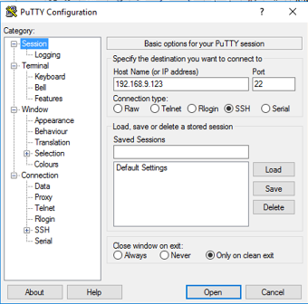
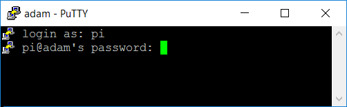
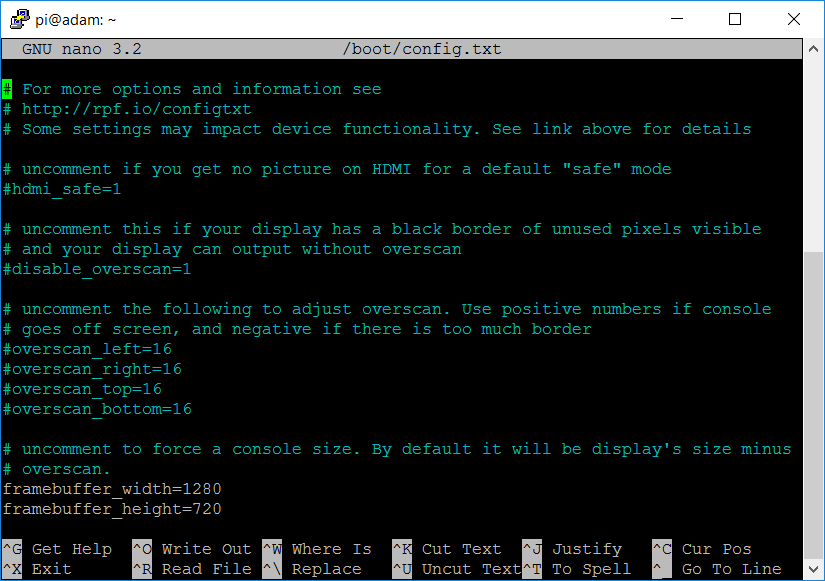
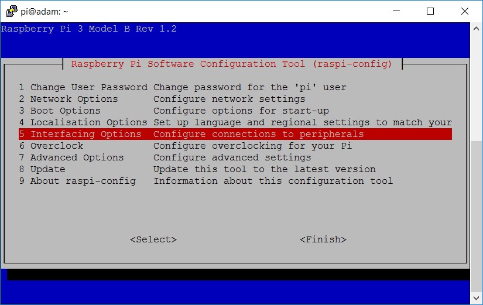
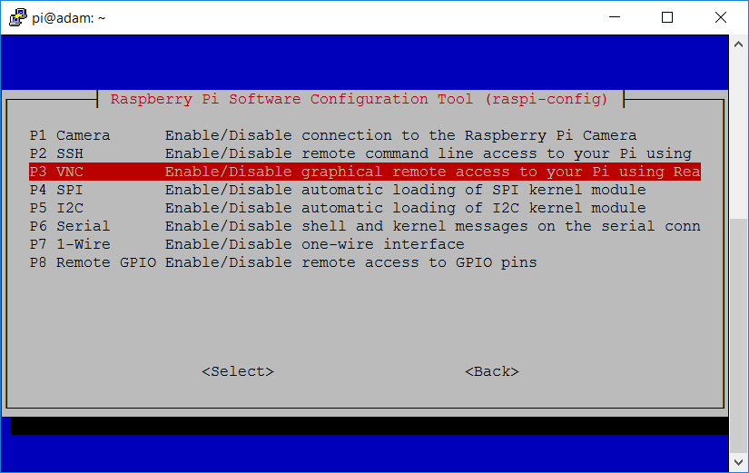
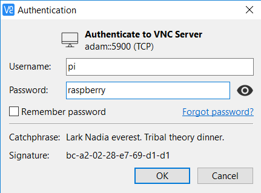
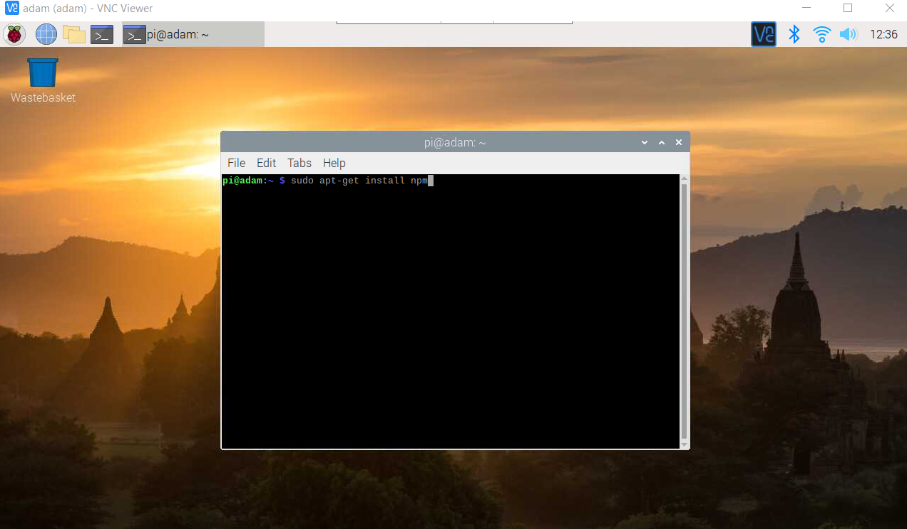

# Встановлення ОС та налаштування Raspberry PI (альтернативний метод)

Рекомендується використовувати методику підготовки описану за [цим посиланням](https://github.com/asu-in-ua/atpv/blob/main/micropc/rpiinstall/lab.md) , варіант наведений у цьому розділі є застарілим.

#### 1.1. Завантаження образу для RPI з Інтернету

- [ ] Завантажте образ з ОС та мінімальним ПЗ для карти RPI (`Raspberry Pi OS with desktop`) за [посиланням](https://www.raspberrypi.org/downloads/raspbian). Виберіть один з варіантів завантаження `Download` або `Download Torrent`. 

#### 1.2. Завантаження утиліти для створення образу

- [ ] Завантажте утиліту `balenaEtcher` для запису образу Raspbian на SD карту за [посиланням](https://www.balena.io/etcher/) або попросіть її у викладача. 

#### 1.3. Запис початкового образу

- [ ] Запустіть `balenaEtche`r на виконання.

                 

рис.5.1.  Запис початкового образу

- Натисніть Select Image та виберіть завантажений в п.1.1 образ Raspbian.
- Натисніть Change для вибору SD карти.
- Натисніть Flash для запису образу, та зачекайте закінчення цього процесу.

#### 1.4. Створення конфігураційного файлу з налаштуваннями WiFi

- [ ] На SD карті в кореневій директорії створіть текстовий файл з наведеним нижче змістом (вказані налаштування працюють тільки в лабораторії А-532 НУХТ). Даний файл автоматично налаштує Raspberry на підключення до WiFi-мережі з іменем записаним в полі `ssid`, та паролем в полі `psk`. Поле `key_mgmt` вказує на тип шифрування.

```bash
ctrl_interface=DIR=/var/run/wpa_supplicant GROUP=netdev
update_config=1
country=UA

network={
	ssid="WF532"
	psk="123456789"
	key_mgmt=WPA-PSK
}
```

- [ ] Збережіть даний файл з іменем та розширенням `wpa_supplicant.conf`.

#### 1.5. Активація способу підключення через SSH

- [ ] На SD карті в кореневій директорії створіть пустий текстовий файл з іменем SSH . Даний файл автоматично активує спосіб підключення до Raspberry через [SSH](https://uk.wikipedia.org/wiki/SSH#%D0%9F%D0%B5%D1%80%D0%B5%D0%B4%D0%B0%D1%87%D0%B0_%D1%84%D0%B0%D0%B9%D0%BB%D1%96%D0%B2_%D0%B7_%D0%B2%D0%B8%D0%BA%D0%BE%D1%80%D0%B8%D1%81%D1%82%D0%B0%D0%BD%D0%BD%D1%8F%D0%BC_SSH).



рис.5.2. Активація способу підключення через SSH

#### 1.6. Увімкнення та пошук в мережі Raspberry

- [ ] Вставте SD карту в Raspberry та ввімкніть його.

- [ ] Разом з викладачем дізнайтесь IP адресу Вашого Raspberry (наприклад через сканування мережі, або переглядаючи перелік вузлів в маршрутизаторі).

#### 1.7. Встановлення програми терміналу PuTTY

- [ ] Завантажте утиліту роботи з терміналом PuTTY з [офіційного сайту](https://www.putty.org/ ) та установіть її на свій ПК, якщо це не було зроблено раніше.

#### 1.8. З'єднання з Raspberry по SSH 

- [ ] Запустіть PuTTY на виконання.

- [ ] У поле `Host Name` (`Ім'я хоста`) введіть IP-адресу Raspberry, яку Ви дізналися в п.1.6 та натисніть кнопку `Open` .



рис.5.3. З'єднання з Raspberry по SSH з Putty

- Відкриється командне вікно, яке служить для діалогу через захищений SSH канал зв'язку з Raspberry Pi.
- Система попросить ввести логін и пароль. 

- [ ] По замовчуванню логін — `pi`, а пароль — `raspberry`. При введенні паролю символи в консолі не відображаються.



рис.5.4. Введення логіну і паролю

- Після введення паролю Вам доступна можливість діалогу через команди SSH. 

  Перелік найбільш вживаних команд можна знайти за [посиланням](../Довідники/командиSSH.md)   

#### 1.9. Зміна параметрів монітора

- [ ] Через термінал PuTTY запустіть команду зміни файлу налаштування параметрів монітора 

```bash
sudo nano /boot/config.txt
```

- [ ] у редакторі змініть поля 

```bash
framebuffer_wight=1280
framebuffer_height=720
```



рис.5.5. Зміна параметрів монітора

Також за необхідності змініть наступні налаштування, якщо вони відрізняються від вказаних^

- існуючий параметр `dtoverlay` закоментуйте символом #
- у розділі `[pi4]` добавте `dtoverlay=vc4-fkms-v3d` 

Це матиме приблизно такий вигляд

```bash
# dtoverlay=vc4-kms-v3d

[pi4]
dtoverlay=vc4-fkms-v3d
```

- [ ] Збережіть файл через комбінацію ctrl+X, Y

#### 1.10. Зміна імені RPI

- [ ] Через термінал PuTTY запустіть команду зміни файлу налаштування параметрів імені

```bash
sudo nano /etc/hostname
```

- [ ] дайте ім'я латинськими літерами щоб воно було унікальним в межах університету; рекомендується давати ім'я в форматі

```
firstnamelastnameRPI
```

де `firstname` - ім'я (латинськими літерами), `lastname` - прізвище (латинськими літерами)

- [ ] Збережіть файл через комбінацію ctrl+X, Y 

#### 1.11. Зміна налаштувань DNS

- [ ] Через термінал PuTTY запустіть команду зміни файлу налаштування параметрів імені

```bash
sudo nano /etc/hosts
```

- [ ] напроти `127.0.0.1` змініть ім'я аналогічно п.1.10

- [ ] Збережіть файл через комбінацію  ctrl+X, Y 

- [ ] перезавантажте RPI через командний рядок 

```bash
sudo reboot
```

#### 1.12. Перевірка підключення через ім'я

- [ ] Після того як Raspberry перевантажиться повторно, підключіться до нього з PuTTY, але вже через ім'я (в полі hostname).

#### 1.13. Встановлення Samba

**Samba** - це [пакет](https://uk.wikipedia.org/wiki/Samba) програм, які дозволяють підключатися до мережних дисків і принтерів на різних операційних системах по протоколу SMB/CIFS. Наприклад, встановлення серверу на RPI дає можливість підключатися до RPI з ОС Windows по його імені.    

- [ ] Через термінал PuTTY запустіть команду встановлення samba з репозиторію

```bash
sudo apt-get install samba
```

#### 1.14. Налаштування samba

- [ ] Через термінал PuTTY запустіть команду зміни файлу налаштування параметрів серверу samba

```bash
sudo nano /etc/samba/smb.conf
```

- [ ] встановіть поле

```bash
win support = yes
```

- [ ] Збережіть файл через комбінацію  ctrl+X, Y 

- [ ] перезапустіть службу

```bash
sudo service smbd restart
```

#### 1.15. Перевірка видимості через ім'я 

- [ ] У командному рядку Windows на ПК розробника зробіть пінг RPI по імені 

```bash
ping firstnamelastnameRPI
```

де `firstnamelastnameRPI` - ім'я RPI, що надане йому в п.1.10

#### 1.16. Активацій сервісу VNC (сервер) на RPI 

- [ ] Запустіть команду  запуску опцій налаштування Raspberry

```bash
sudo raspi-config  
```



рис.5.6. Вікно налаштувань конфігурації RPI

- [ ] Відкрийте розділ 5 `Interfacing Options` та активуйте P3 VNC.



рис.5.7. Активацій сервісу VNC (сервер) на RPI

#### 1.17. Завантаження, запуск та підключення сервісу VNC-клієнта на PC-розробника 

- [ ] Завантажте VNC з [офіційного сайту](https://www.realvnc.com/en/connect/download/viewer/ ) та запустіть його

- [ ] у полі `VNC Conect` введіть ім'я вашого Raspberry та натисніть `Enter` . Під час входу необхідно ввести логін і пароль (логін — `pi`, пароль — `raspberry`).



рис.5.8. Автентифікація VNC на сервері

- [ ] після цього відкриється віддалений робочий стіл вашого Raspberry.


#### 1.18.   Встановлення npm для Manage Pallete

- [ ] Запустіть командний рядок та запустіть команду для встановлення `npm` для Manage Pallete

```bash
sudo apt-get install npm
sudo npm install -g npm
sudo reboot
```



рис.5.9. Встановлення npm для Manage Pallete