**Програмна інженерія в системах управління. Лекції.** Автор і лектор: Олександр Пупена 

| [<- до лекцій](README.md) | [на основну сторінку курсу](../README.md) |
| ------------------------- | ----------------------------------------- |
|                           |                                           |

# 10. Створення документації на основі MarkDown

## 10.1. Базовий синтаксис MarkDown (MD) 

При необхідності відображення тексту у форматованому вигляді не обов'язково користуватися спеціальними форматами типу DOC чи DOCX. Останні зберігають документи не в текстовому форматі, що ускладнює їх відображення в онлайні і керування версіями, як наприклад з використанням Git. Альтернативою цьому є  мова Markdown, яка дозволяє відображати форматовані тексти на сторінках та використовувати мультикористувацькі функції. Крім того,  Markdown використовується в GitHub для відображення текстового змісту репозиторіїв.    

**«Markdown»** (створена John Gruber’s)  — полегшена [мова розмітки даних](https://uk.wikipedia.org/wiki/Мова_розмітки_даних), яку створено з ухилом на [прочитність](https://uk.wikipedia.org/wiki/Прочитність) та зручність у публікації з подальшим перетворенням її на структуровану валідність  [XHTML](https://uk.wikipedia.org/wiki/XHTML) або [HTML](https://uk.wikipedia.org/wiki/HTML).

Нижче наведений опис, який не є вичерпним переліком синтаксису Markdown. У багатьох  випадках можуть використовуватися додаткові елементи синтаксису, які відрізняються від використовуваного переглядача. Опис доступний також на сайті https://www.markdownguide.org/ 

Кожен застосунок реалізує дещо іншу версію Markdown. Ці варіанти Markdown зазвичай називають *ароматами(Flavors)*, аналогічно як діалекти в мовах. Нижче наведені основні (базові функції MD). У наступному розділі наведені розширені, доступні для деяких застосунків.

Тексти Markdown зберігаються у текстовому файлі з розширенням `.md` або ` .markdown`.  Для відображення цих текстових файлів необхідний *застосунок Markdown*. Доступно багато програм - від простих скриптів до настільних програм, схожих на Microsoft Word. Незважаючи на візуальні відмінності, усі програми роблять одне і те саме - перетворюють текст у форматі Markdown у формат HTML, для того, щоб він міг відображатися у веб-браузерах. Для цих цілей застосунки Markdown використовують ***Markdown-обробники***  (їх також називають «парсерами» ). 

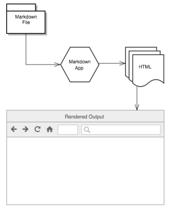

рис.10.1. Принцип роботи застосунків Markdown.

Для перевірки роботи наведених прикладів, просто вставляйте текст за посиланням https://dillinger.io/

### Екранування

Для форматування в MD використовуються спеціалізовані літери. Для того щоб ці літери, які Markdown однозначно визначає як команди форматування, могли бути відображені як звичайні, вони можуть бути екрановані зворотною косою лінією; наприклад, вираз 

```markdown
'\*'
```

виведе зірочку (\*), а не означатиме початок проміжку виділеного тексту. 

Також Markdown не перетворює текст із «сирим» [XHTML](https://uk.wikipedia.org/wiki/XHTML)-елементом блокового рівня. Це дозволяє включати секції XHTML у джерело Markdown  документа, обернувши їх в XHTML теги блокового рівня.

### Заголовки

HTML-заголовки створюються розміщенням тої кількості "решіток" перед текстом заголовка, що  відповідає бажаному рівню (HTML підтримує 6 рівнів заголовків),  наприклад:

```markdown
 # це заголовок першого рівня
 #### це заголовок четвертого рівня
```

Це матиме наступний вигляд:

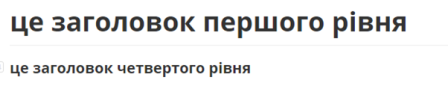

Перші два рівні заголовків також мають альтернативний синтаксис:

```markdown
Заголовок першого рівня
=======================

Заголовок другого рівня
-----------------------
```

### Параграфи

Параграф є одним чи декількома послідовними рядками тексту, які розділяються  одним чи декількома порожніми рядками. Звичайні параграфи не повинні  мати відступи або табуляцію:

```markdown
Це параграф. Він містить два речення.

Це інший параграф. Він також містить два речення.
```

### Список

Починаютья з `* `,  `+ `, або  `- `, кожен підпункт виділяється чотирма пробілами 

```markdown
 * Пункт в маркованому (ненумерованому) списку
     * Підпункт, відділений 4 пробілами
         * підпункт третього рівня, виділений 4 пробілами
 * Інший пункт в маркованому списку

 1. Пункт в нумерованому списку
     1.1. Підпункт, відділений 4 пробілами
 2. Інший пункт в нумерованому списку
```

Це матиме наступний вигляд

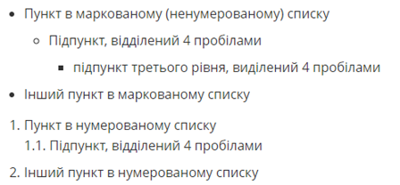
### Формат тексту

```markdown
 *emphasis* або _emphasis_ (тобто нахил)

 **сильне виділення** або __сильне виділення__ (тобто напівжирний)
```

```markdown
це ~~закреслений текст~~
```

### Код

Для включення коду (відформатованого в моноширинний шрифт), ви можете або оточити вбудований код зворотніми лапками (\`), наприклад, \` деякий код, або відділити декілька рядків коду щонайменше чотирма пробілами, як тут: 

```markdown
    перший рядок коду
    другий рядок коду
    третій рядок коду
```

Останній варіант за допомогою пробілів дозволяє зберігати і показувати синтаксис Markdown.

### Кінець рядку

Якщо необхідно вставити закінчення рядка Markdown (символ `<BR>` в HTML), треба в кінці рядку вставити щонайменше два пробіли.

Наприклад:

```markdown
 def show_results space space
 end
```

дасть результат:

def show_results  
end 

### Цитати

Цитати позначаються символом `>`

```markdown
 > Весь цей абзац тексту буде поміщений у HTML blockquote елемент.
 Blockquote елементи змінюються в залежності від потреби/пристрою виводу.
 Ви можете обернути довільний текст за власним смаком, та воно перетвориться
 на єдиний blockquote елемент.
```

Приклад вище перетвориться на такий HTML:

```html
<blockquote><p>Весь цей абзац тексту буде поміщений у HTML blockquote елемент.
 Blockquote елементи змінюються в залежності від потреби/пристрою виводу.
 Ви можете обернути довільний текст за власним смаком, та воно перетвориться
 на єдиний blockquote елемент.</p></blockquote>
```

Якщо необхідно цитату зробити в кілька рядків, кожен рядок починається з символу `>` Вкладеність цитат досягається подвійним символом  `>>`

### Зовнішні посилання

Посилання можуть бути вбудованими:

```markdown
[текст посилання](адреса посилання)
```

Наприклад: `[Markdown](http://en.wikipedia.com/wiki/Markdown)` матиме вигляд

[Markdown](http://en.wikipedia.com/wiki/Markdown)

Також посилання можуть бути розміщені у примітках поза параграфом. Наприклад, наступний формат тексту

```markdown
[текст посилання][1]
```

створить посилання, якщо додати примітку (як показано нижче) поза параграфом, або в кінці документу:

```markdown
 [1]: http://en.wikipedia.com/wiki/Markdown "Markdown на WiKi"
```

### Зображення

Зображення мають схожий із посиланнями синтаксис, але перед цим ставиться знак оклику.

```markdown

```

або:

```markdown

```

Як і посилання, зображення також можуть мати стиль синтаксису примітки, 

```markdown
![Альтернативний текст][id]
```

з пізнім посиланням в документі, яке визначає URL розміщення зображення.

```markdown
 [id]: url/to/image "Optional title attribute"
```

### Горизонтальні лінії

Горизонтальні лінії задаються розміщенням трьох або більшим дефісів, зірочок, або  підкресленням в рядку самостійно. Ви можете використовувати пробіли між  дефісами чи зірочками. Кожен з наведених нижче рядків створить  горизонтальну лінію:

```markdown
 * * *
 ***
 *****
 - - -
 ---------------------------------------
```

### HTML

Деякі переглядачі дозволяють використовувати пряме вставлення тегів HTML. Але з точки зору безпеки не усі Markdown  застосунки підтримують HTML в документах Markdown. Деякі ж підтримують тільки деякі з тегів.  Необхідно використовувати пусті лінії для відділення блочних елементів HTML такі як `<div>`, `<table>`, `<pre>`, та `<p>` від їх контенту. 

## 10.2. Використання 

Markdown  може використовуватися для різних цілей: websites, документи, нотатки, книги, презентації, повідомлення на пошту, та технічної документації. Нижче коротко наведені ці варіанти використання.

Markdown був розроблений для Інтернету, тому не дивно, що існує багато застосунків, спеціально розроблених для створення контенту веб-сайту на ньому. Якщо ви шукаєте найпростіший можливий спосіб створити веб-сайт із файлами Markdown, перегляньте  [blot.im](https://blot.im) та [smallvictori.es](https://smallvictori.es). Після реєстрації в одній із цих служб вони створюють папку Dropbox на вашому комп’ютері. Для відображення змісту  на ВебСайті необхідні файли Markdown просто копіюються у потрібну папку.

Якщо ви знайомі з HTML, CSS та контролем версій, перегляньте [Jekyll](https://www.markdownguide.org/tools/jekyll/), популярний генератор статичних сайтів, який приймає файли Markdown та створює веб-сайт HTML. Однією з переваг цього підходу є те, що [GitHub Pages](https://www.markdownguide.org/tools/github-pages/) надають безкоштовний хостинг для веб-сайтів, створених [Jekyll](https://www.markdownguide.org/tools/jekyll/).  

Якщо ви хочете використовувати систему управління вмістом (CMS) для підтримки свого веб-сайту, подивіться на  [Ghost](https://www.markdownguide.org/tools/ghost/). Це безкоштовна платформа для блогів із відкритим кодом із приємним редактором Markdown. Якщо ви користувач WordPress, ви будете раді дізнатися, що існує [підтримка Markdown](https://en.support.wordpress.com/markdown/) для веб-сайтів, розміщених на WordPress.com. Сайти WordPress, що розміщуються на власних веб-сайтах, можуть використовувати плагін [Jetpack](https://jetpack.com/support/markdown/).

У Markdown немає всіх можливостей текстових процесорів, таких як Microsoft Word, але він досить добре підходить для створення основних документів, таких як завдання та листи. Ви можете використовувати застосунок для створення документів Markdown, експорту документів з формату Markdown у PDF або HTML. У свою чергу, маючи документ PDF, ви можете зробити з ним що завгодно - роздрукувати , надіслати електронною поштою або завантажити його на веб-сайт.

Майже в усіх напрямках Markdown є ідеальним синтаксисом для нотаток. На жаль, [Evernote](https://evernote.com/) та [OneNote](https://www.onenote.com/), два найпопулярніші застосунки для нотаток, наразі не підтримують Markdown. Але є кілька інших застосунків для нотаток, які підтримують Markdown, зокрема [Simplenote](https://www.markdownguide.org/tools/simplenote/), [Notable](https://www.markdownguide.org/tools/notable/),  [Bear](https://www.markdownguide.org/tools/bear/) , [Boostnote](https://www.markdownguide.org/tools/boostnote/) та інші.

Для створення електронних книг можна використати спеціальні сервіси, наприклад [Leanpub](https://leanpub.com/), які приймають вихідні файли у форматі Markdown. Leanpub видає книгу у форматі файлів PDF, EPUB та MOBI. Для створення копії книги в паперовому вигляді, можна завантажити файл PDF в інший сервіс, наприклад [Kindle Direct Publishing](https://kdp.amazon.com). Щоб дізнатися більше про написання та самостійне видання книги за допомогою Markdown, прочитайте [цю публікацію в блозі](https://medium.com/techspiration-ideas-making-it-happen/how-i-wrote-and-publisher-my -novel-using-only-open-source-tools-5cdfbd7c00ca).

Можна створювати презентації з файлів, відформатованих Markdown. Це може бути хорошою альтернативою використанню застосунків, таких як PowerPoint або Keynote. [Remark](https://remarkjs.com) ([проект GitHub](https://github.com/gnab/remark)) - популярний браузерний інструмент для слайд-шоу від Markdown, як і [Cleaver](https://jdan.github.io/cleaver/)([проект GitHub](https://github.com/jdan/cleaver)). 

Існує простий спосіб писати форматоване повідомлення електронної пошти за допомогою Markdown. [Markdown Here](https://www.markdownguide.org/tools/markdown-here/) - це вільне розширення для браузера з відкритим кодом, яке перетворює текст у форматі Markdown у HTML, готовий для надсилання.

Markdown - може використовуватися для ведення технічної документації. Якщо ви пишете документацію для товару чи послуги, подивіться на ці зручні інструменти:

- [Read the Docs](https://readthedocs.org) можна створити веб-сайт документації з ваших файлів Markdown з відкритим кодом. Просто підключіть свій сховище GitHub до їх служби та push - Прочитайте Документи робить все інше. Вони також мають [послугу для комерційних структур](https://readthedocs.com/).
- [MkDocs](https://www.markdownguide.org/tools/mkdocs/) - це швидкий і простий генератор статичних сайтів, орієнтований на створення проектної документації. Джерельні файли документації записуються в Markdown і налаштовуються одним файлом конфігурації YAML. У MkDocs є кілька [вбудованих тем](https://www.mkdocs.org/user-guide/styling-your-docs/), включаючи порт [Read the Docs](https://readthedocs.org/ ) тема документації для використання з MkDocs. Однією з найновіших тем є [MkDocs Material](https://squidfunk.github.io/mkdocs-material/).
- [Docusaurus](https://www.markdownguide.org/tools/docusaurus/) - статичний генератор сайтів, призначений виключно для створення веб-сайтів з документацією. Він підтримує переклади, пошук та версії.
- [VuePress](https://vuepress.vuejs.org/) - статичний генератор сайту, що працює від [Vue](https://vuejs.org/) та оптимізований для написання технічної документації.
- [Jekyll](https://www.markdownguide.org/tools/jekyll/) згадувався раніше у розділі на веб-сайтах, але це також хороший варіант для створення веб-сайту документації з файлів Markdown. Якщо ви йдете цим шляхом, обов’язково ознайомтеся з [темою документації на Jekyll](https://idratherbewriting.com/documentation-theme-jekyll/).

## 10.3. Редактори

Хоча Markdown є полегшеною мовою розмітки яку легко читати та редагувати  звичайними текстовими редакторами, існують спеціально розроблені  редактори, які дозволяють попередньо переглядати зі стилями. Є багато таких редакторів, які наявні для всіх основних платформ. Існує плаґін [підсвітки синтаксису](https://uk.wikipedia.org/wiki/Підсвітка_синтаксису) для Markdown, вбудований у [gedit](https://uk.wikipedia.org/wiki/Gedit) та [Vim](https://uk.wikipedia.org/wiki/Vim).

Деякі з редакторів:

- **Mac:** [MacDown](https://www.markdownguide.org/tools/macdown/), [iA Writer](https://www.markdownguide.org/tools/ia-writer/), або[Marked](https://marked2app.com/)
- **iOS / Android:** [iA Writer](https://www.markdownguide.org/tools/ia-writer/)
- **Windows:** [ghostwriter](https://wereturtle.github.io/ghostwriter/) або [Markdown Monster](https://markdownmonster.west-wind.com/), https://v2.docusaurus.io/
- **Linux:** [ReText](https://github.com/retext-project/retext) або [ghostwriter](https://wereturtle.github.io/ghostwriter/)
- **Web:** [Dillinger](https://www.markdownguide.org/tools/dillinger/) або [StackEdit](https://www.markdownguide.org/tools/stackedit/)

Крім наведених вище є набагато більше платних та безкоштовних редакторів. Наприклад [Typora](https://typora.io/)   - це редактор Markdown що працює за принципом *Live Preview*, тобто після введення редагування тексту, він одразу показує результат. Підтримує багато мов локалізації, у тому числі українську. Завантажується [за посиланням](https://typora.io/#download). Наразі знаходиться в режимі бета-тестування, тому є безкоштовним. Typora використовує аромат Markdown сумісний з GitHub. 

Visual Studio Code має кілька плагінів для роботи з MD, так само як і Notepad++.  Таким чином кожен може вибрати собі редактор, який буде йому зручний.

## 10.4. Розширений синтаксис

Елементів базового синтаксису, що викладений в оригінальному проектному документі Джона Грубера, може бути недостатньо для деяких функцій. Декілька людей та організацій взяли на себе завдання розширити основний синтаксис, додавши додаткові елементи, такі як таблиці, кодові блоки, підсвічування синтаксису, автоматичне посилання URL-адрес та виноски. Ці елементи можна ввімкнути за допомогою легкої мови розмітки, що базується на базовому синтаксисі Markdown, або додавши розширення до сумісного процесора Markdown.  Слід нагадати, що не всі програми Markdown підтримують розширені елементи синтаксису, а перелік цих елементів залежить від використовуваного Markdown-аромату. 

Існує кілька легких мов розмітки, які є *супер-наборами* у Markdown. Вони включають основний синтаксис Грубера та надбудовують його, додаючи додаткові елементи, такі як таблиці, кодові блоки, підсвічування синтаксису, автоматичне посилання URL-адрес та виноски. У багатьох найпопулярніших застосунках Markdown використовується одна з таких легких мов розмітки:

- [CommonMark](https://commonmark.org)
- [GitHub Flavored Markdown (GFM)](https://github.github.com/gfm/)
- [Markdown Extra](https://michelf.ca/projects/php-markdown/extra/)
- [MultiMarkdown](https://fletcherpenney.net/multimarkdown/)
- [R Markdown](https://rmarkdown.rstudio.com/)

### Таблиці

Щоб додати таблицю, використовуйте три чи більше дефісів (`---`), щоб створити заголовок кожного стовпця, а для розділення кожного стовпця використовуйте труби (` | `). Ви можете додатково додати труби на будь-якому кінці таблиці.

```markdown
| Syntax      | Description |
| ----------- | ----------- |
| Header      | Title       |
| Paragraph   | Text        |
```

Результат матиме наступний вигляд:

| Syntax    | Description |
| --------- | ----------- |
| Header    | Title       |
| Paragraph | Text        |

Ширина комірок може змінюватися, як показано нижче. Але результат матиме однаковий вигляд.

```markdown
| Syntax | Description |
| --- | ----------- |
| Header | Title |
| Paragraph | Text |
```

Створення таблиць з дефісами та трубами може бути втомливим. Щоб прискорити процес, спробуйте скористатися [Генератором таблиць Markdown](https://www.tablesgenerator.com/markdown_tables). Створіть таблицю за допомогою графічного інтерфейсу, а потім скопіюйте створений текст у форматі Markdown у свій файл. Крім того редактори можуть мати вбудовані редактори таблиць, аналогічно  як наприклад у MS Word.

Ви можете вирівняти текст у стовпцях ліворуч, праворуч або по центру, додавши двокрапку (`:`) зліва, справа або з обох боків дефісів у рядку заголовка.

```
| Syntax      | Description | Test Text     |
| :---        |    :----:   |          ---: |
| Header      | Title       | Here's this   |
| Paragraph   | Text        | And more      |
```

Це матиме наступний вигляд:

| Syntax    | Description |   Test Text |
| :-------- | :---------: | ----------: |
| Header    |    Title    | Here’s this |
| Paragraph |    Text     |    And more |

Ви можете відформатувати текст у таблицях. Наприклад, ви можете додати посилання, код, і форматування. Але ви не можете додавати заголовки, блоки цитат, списки, горизонтальні правила, зображення чи теги HTML.

### Огороджені блоки коду 

Основний синтаксис Markdown дозволяє створити кодові блоки шляхом відступу рядків на чотири пробіли або одну вкладку. Якщо вам це незручно, спробуйте використовувати огороджені кодові блоки. Залежно від процесора або редактора Markdown, ви будете використовувати три зворотні одинарні лапки ```` `або три тилди (` ~~~ `) на рядках до і після кодового блоку. Не потрібно відступати жодних рядків!

````
```
{
  "firstName": "John",
  "lastName": "Smith",
  "age": 25
}
​```
````

Зрештою, це матиме вигляд:

```
{
  "firstName": "John",
  "lastName": "Smith",
  "age": 25
}
```

Багато процесорів Markdown для огороджених блоків коду підтримують підсвічування синтаксису . Ця функція дозволяє додавати кольорове підсвічування для будь-якої мови, на якій був написаний ваш код. Щоб додати підсвічування синтаксису, вкажіть мову поруч із задніми позначками перед огородженим кодом блоку. Наступний шматок тексту

```
```json
{
  "firstName": "John",
  "lastName": "Smith",
  "age": 25
}
​```
```

матиме такий вигляд:

```json
{
  "firstName": "John",
  "lastName": "Smith",
  "age": 25
}
```

### Виноски

Виноски дозволяють додавати примітки та посилання, не захаращуючи тіло документа. Коли ви створюєте виноску, з'являється надрядковий номер з посиланням на виноску. Читачі можуть натиснути посилання, щоб перейти до вмісту виноски внизу сторінки.

Щоб створити посилання на виноску, додайте каретку та ідентифікатор всередині дужок (`[^1]`). Ідентифікатори можуть бути числами або словами, але вони не можуть містити пробілів чи вкладок. Ідентифікатори лише співвідносять посилання виноски із самою виноскою - у висновку виноски нумеруються послідовно.

Додайте виноску, використовуючи іншу каретку та цифру всередині дужок із двокрапкою та текстом (`[^1]: My footnote.`). Не потрібно ставити виноски в кінці документа. Ви можете розмістити їх куди завгодно, крім інших елементів, таких як списки, блокові лапки та таблиці.

```
Here's a simple footnote,[^1] and here's a longer one.[^bignote]  
[^1]: This is the first footnote.
[^bignote]: Here's one with multiple paragraphs and code.
    Indent paragraphs to include them in the footnote.
    `{ my code }`
    Add as many paragraphs as you like.
```

Це матиме вигляд:

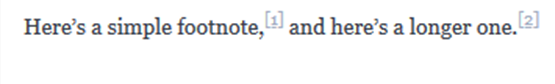

### Ідентифікатори заголовків (Heading ID)

Багато процесорів Markdown підтримують власні ідентифікатори для [заголовків](https://www.markdownguide.org/basic-syntax/#headings) - деякі процесори Markdown автоматично додають їх. Додавання спеціальних ідентифікаторів дозволяє вам безпосередньо посилатися на заголовки та змінювати їх за допомогою CSS. Щоб додати спеціальний ідентифікатор заголовка, додайте його до фігурних фігурних дужок у тому ж рядку, що й заголовка.

```
#### My Great Heading {#custom-id}
```

HTML матиме наступний вигляд:

```html
<h3 id="custom-id">My Great Heading</h3>
```

Ви можете зв’язати заголовки зі спеціальними ідентифікаторами у файлі, створивши [стандартне посилання](https://www.markdownguide.org/basic-syntax/#links) зі знаком цифри (`#`), за яким слідує ідентифікатор заголовку.

| Markdown                      | HTML                           | Вигляд                                                       |
| ----------------------------- | ------------------------------ | ------------------------------------------------------------ |
| `[Heading IDs](#heading-ids)` | ` [Heading IDs](#heading-ids)` | [Heading IDs](https://www.markdownguide.org/extended-syntax/#heading-ids) |

Інші веб-сайти можуть посилатися на заголовок, додавши спеціальний ідентифікатор заголовка до повної URL-адреси веб-сторінки (наприклад,

`[Heading IDs](https://www.markdownguide.org/extended-syntax#heading-ids)`.

### Списки означень

Деякі процесори Markdown дозволяють створювати *списки означень* термінів та їх відповідні означення. Щоб створити список означень, введіть термін у перший рядок. У наступному рядку введіть двокрапку, а потім пробіл та означення.

```markdown
First Term
: This is the definition of the first term.

Second Term
: This is one definition of the second term.
: This is another definition of the second term.
```

HTML матиме вигляд:

```html
<dl>
  <dt>First Term</dt>
  <dd>This is the definition of the first term.</dd>
  <dt>Second Term</dt>
  <dd>This is one definition of the second term. </dd>
  <dd>This is another definition of the second term.</dd>
</dl>
```

У переглядачі це матиме вигляд:


### Список завдань 

Списки завдань дозволяють створити список елементів за допомогою прапорців. У додатках Markdown, що підтримують списки завдань, поруч із вмістом відображатимуться прапорці. Щоб створити список завдань, перед пунктами списку завдань додайте тире (`-`) і дужки з пробілом (` [ ] `). Щоб встановити прапорець, додайте між дужками "x" (`[x]`).

```
- [x] Write the press release
- [ ] Update the website
- [ ] Contact the media
```

Це матиме вигляд:

- [x] Write the press release
- [ ] Update the website
- [ ] Contact the media

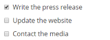

### Емоджі (смайли)

Є два способи додати смайли до файлів Markdown: скопіювати та вставити смайли у текст, відформатований Markdown, або введення *короткого коду емоджи*. У більшості випадків ви можете просто скопіювати емоджи з такого джерела, як [Emojipedia](https://emojipedia.org/), і вставити його у свій документ. Багато застосунків Markdown автоматично відображатимуть емоджи у тексті, відформатованому Markdown. Файли HTML та PDF, які ви експортуєте зі своєї програми Markdown, ткож повинні відображати емоджи.

Деякі програми Markdown дозволяють вставляти смайли, вводячи короткі коди смайлів. Вони починаються і закінчуються двокрапкою і включають назву емоджи.

```markdown
Gone camping! :tent: Be back soon.
That is so funny! :joy:
```

Матиме вигляд:

Gone camping! ⛺ Be back soon.

That is so funny! 😂

Ви можете використовувати цей [список коротких кодів емоджі](https://gist.github.com/rxaviers/7360908), але майте на увазі, що короткі коди емоджі відрізняються для різних застосунків. 

### Автоматичне зв'язування URL 

Багато процесорів Markdown автоматично перетворюють URL-адреси в посилання. Це означає, що якщо ви введете http://www.example.com, ваш процесор Markdown автоматично перетворить його на посилання, навіть якщо ви не [використали дужки](https://www.markdownguide.org/basic-syntax/ # посилання). Тобто введений текст

```
http://www.example.com
```

автоматично буде сприйматися як лінк:

http://www.example.com

Якщо ви не хочете, щоб URL-адресу було автоматично пов’язано, ви можете видалити посилання, [позначаючи URL-адресу як код](https://www.markdownguide.org/basic-syntax/#code) за допомогою зворотних лапок.

```
`http://www.example.com`
```

### LaTeX/Mathematics

У Markdown можна використовувати формули в форматі LaTeX. Для цього формула пишеться в блоці математики, що позначається виділенням з двох боків позначенням `$$`. 

Підтримуються також грецькі літери, для спрощення їх введення можна скористатися детектором літер з переведення в LaTeX http://detexify.kirelabs.org/. 

Нижче наводяться приклади, з оригінальним текстом та відображенням в LaTeX. 

`\cos (2\theta) = \cos^2 \theta - \sin^2 \theta` -> $\cos (2\theta) = \cos^2 \theta - \sin^2 \theta$

`\lim\limits_{x \to \infty} \exp(-x) = 0` -> $\lim\limits_{x \to \infty} \exp(-x) = 0$

`k_{n+1} = n^2 + k_n^2 - k_{n-1}` -> $k_{n+1} = n^2 + k_n^2 - k_{n-1}$

`n^{22}` -> $n^{22}$

`f(n) = n^5 + 4n^2 + 2 |_{n=17}` -> $f(n) = n^5 + 4n^2 + 2 \|_{n=17}$

`\frac{n!}{k!(n-k)!} = \binom{n}{k}` -> $\frac{n!}{k!(n-k)!} = \binom{n}{k}$

`\frac{\frac{1}{x}+\frac{1}{y}}{y-z}` -> $\frac{\frac{1}{x}+\frac{1}{y}}{y-z}$

`^3/_7` -> $^3/_7$

```
\begin{equation}
  x = a_0 + \cfrac{1}{a_1 
          + \cfrac{1}{a_2 
          + \cfrac{1}{a_3 + \cfrac{1}{a_4} } } }
\end{equation}
```

$$
\begin{equation}
  x = a_0 + \cfrac{1}{a_1 
          + \cfrac{1}{a_2 
          + \cfrac{1}{a_3 + \cfrac{1}{a_4} } } }
\end{equation}
$$

```
\begin{equation}
\frac{
    \begin{array}[b]{r}
      \left( x_1 x_2 \right)\\
      \times \left( x'_1 x'_2 \right)
    \end{array}
  }{
    \left( y_1y_2y_3y_4 \right)
  }
\end{equation}
```

$$
\begin{equation}
\frac{
    \begin{array}[b]{r}
      \left( x_1 x_2 \right)\\
      \times \left( x'_1 x'_2 \right)
    \end{array}
  }{
    \left( y_1y_2y_3y_4 \right)
  }
\end{equation}
$$

`\sqrt{\frac{a}{b}}` -> $\sqrt{\frac{a}{b}}$

`\sqrt[n]{1+x+x^2+x^3+\dots+x^n}` -> $\sqrt[n]{1+x+x^2+x^3+\dots+x^n}$

`\sum_{i=1}^{10} t_i` -> $\sum_{i=1}^{10} t_i$

`\displaystyle\sum_{i=1}^{10} t_i` -> $\displaystyle\sum_{i=1}^{10} t_i$

`\int_0^\infty \mathrm{e}^{-x}\,\mathrm{d}x` ->$\int_0^\infty \mathrm{e}^{-x}\,\mathrm{d}x$

`\sum` -> $\sum$ `\prod` -> $\prod$ `\coprod` -> $\coprod$ `\bigoplus` -> $\bigoplus$ `\bigotimes` -> $\bigotimes$ `\bigcup` -> $\bigcup$ `\bigcap` -> $\bigcap$ `\bigvee` -> $\bigvee$ `\bigwedge` -> $\bigwedge$ `\bigsqcup` -> $\bigsqcup$ `\int` -> $\int$ `\iint` -> $\iint$ `\iiint` -> $\iiint$

`\iiiint` -> $\iiiint$ `\idotsint` -> $\idotsint$ `\oint` -> $\oint$ `\bigodot` -> $\bigodot$ `\biguplus` -> $\biguplus$

```
\sum_{\substack{
   0<i<m \\
   0<j<n
  }} 
 P(i,j)
```

$$
\sum_{\substack{
   0<i<m \\
   0<j<n
  }} 
 P(i,j)
$$

`\int\limits_a^b` -> $\int\limits_a^b$

```
( a ), [ b ], \{ c \}, | d |, \| e \|,
\langle f \rangle, \lfloor g \rfloor,
\lceil h \rceil, \ulcorner i \urcorner,
/ j \backslash
```

$$
( a ), [ b ], \{ c \}, | d |, \| e \|,
\langle f \rangle, \lfloor g \rfloor,
\lceil h \rceil, \ulcorner i \urcorner,
/ j \backslash
$$

`\left(\frac{x^2}{y^3}\right)` -> $\left(\frac{x^2}{y^3}\right)$

`P\left(A=2\middle|\frac{A^2}{B}>4\right)` -> $P\left(A=2\middle\|\frac{A^2}{B}>4\right)$

`\left\{\frac{x^2}{y^3}\right\}` -> $\left\\{\frac\{x^2\}\{y^3\}\right\\}$

`\left.\frac{x^3}{3}\right|_0^1` -> $\left.\frac{x^3}{3}\right\|_0^1$

`( \big( \Big( \bigg( \Bigg(` -> $( \big( \Big( \bigg( \Bigg($

`\frac{\mathrm d}{\mathrm d x} \left( k g(x) \right)` -> $\frac{\mathrm d}{\mathrm d x} \left( k g(x) \right)$

`\frac{\mathrm d}{\mathrm d x} \big( k g(x) \big)`-> $\frac{\mathrm d}{\mathrm d x} \big( k g(x) \big)$

```
\begin{matrix}
  a & b & c \\
  d & e & f \\
  g & h & i
 \end{matrix}
```

$$
\begin{matrix}
  a & b & c \\
  d & e & f \\
  g & h & i
 \end{matrix}
$$

```
A_{m,n} = 
 \begin{pmatrix}
  a_{1,1} & a_{1,2} & \cdots & a_{1,n} \\
  a_{2,1} & a_{2,2} & \cdots & a_{2,n} \\
  \vdots  & \vdots  & \ddots & \vdots  \\
  a_{m,1} & a_{m,2} & \cdots & a_{m,n} 
 \end{pmatrix}
```

$$
A_{m,n} = 
 \begin{pmatrix}
  a_{1,1} & a_{1,2} & \cdots & a_{1,n} \\
  a_{2,1} & a_{2,2} & \cdots & a_{2,n} \\
  \vdots  & \vdots  & \ddots & \vdots  \\
  a_{m,1} & a_{m,2} & \cdots & a_{m,n} 
 \end{pmatrix}
$$

```
\begin{array}{c|c}
  1 & 2 \\ 
  \hline
  3 & 4
 \end{array}
```

$$
\begin{array}{c|c}
  1 & 2 \\ 
  \hline
  3 & 4
 \end{array}
$$

```
M = \begin{bmatrix}
       \frac{5}{6} & \frac{1}{6} & 0           \\[0.3em]
       \frac{5}{6} & 0           & \frac{1}{6} \\[0.3em]
       0           & \frac{5}{6} & \frac{1}{6}
     \end{bmatrix}
```

$$
M = \begin{bmatrix}
       \frac{5}{6} & \frac{1}{6} & 0           \\[0.3em]
       \frac{5}{6} & 0           & \frac{1}{6} \\[0.3em]
       0           & \frac{5}{6} & \frac{1}{6}
     \end{bmatrix}
$$

```
50 \text{ apples} \times 100 \text{ apples}
 = \text{lots of apples}^2
```

$$
50 \text{ apples} \times 100 \text{ apples}
 = \text{lots of apples}^2
$$

```
50 \textrm{ apples} \times 100
 \textbf{ apples} = \textit{lots of apples}^2
```

$$
50 \textrm{ apples} \times 100
 \textbf{ apples} = \textit{lots of apples}^2
$$

```
\boldsymbol{\beta} = (\beta_1,\beta_2,\dotsc,\beta_n)
```

$$
\boldsymbol{\beta} = (\beta_1,\beta_2,\dotsc,\beta_n)
$$


```
k = {\color{red}x} \mathbin{\color{blue}-} 2
```

$$
k = {\color{red}x} \mathbin{\color{blue}-} 2
$$

`\pm` -> $\pm$

`\mp` -> $\mp$

```
f(n) =
  \begin{cases}
    n/2       & \quad \text{if } n \text{ is even}\\
    -(n+1)/2  & \quad \text{if } n \text{ is odd}
  \end{cases}
```

$$
f(n) =
  \begin{cases}
    n/2       & \quad \text{if } n \text{ is even}\\
    -(n+1)/2  & \quad \text{if } n \text{ is odd}
  \end{cases}
$$

`\int y\; \mathrm{d}x` -> $\int y\; \mathrm{d}x$

```
\left(
    \begin{array}{c}
      n \\
      r
    \end{array}
  \right) = \frac{n!}{r!(n-r)!}
```

$$
\left(
    \begin{array}{c}
      n \\
      r
    \end{array}
  \right) = \frac{n!}{r!(n-r)!}
$$

| Code              | Output            | Comment                                    |
| ----------------- | ----------------- | ------------------------------------------ |
| `A_1,A_2,\dotsc,` | $A_1,A_2,\dotsc,$ | for "dots with commas"                     |
| `A_1+\dotsb+A_N`  | $A_1+\dotsb+A_N$  | for "dots with binary operators/relations" |
| `A_1 \dotsm A_N`  | $A_1 \dotsm A_N$  | for "multiplication dots"                  |
| `\int_a^b \dotsi` | $\int_a^b \dotsi$ | for "dots with integrals"                  |
| `A_1\dotso A_N`   | $A_1\dotso A_N$   | for "other dots" (none of the above)       |

| Symbol        | Script        |      | Symbol        | Script        |      | Symbol    | Script    |
| ------------- | ------------- | ---- | ------------- | ------------- | ---- | --------- | --------- |
| $<$           | `<`           |      | $>$           | `>`           |      | $=$       | `=`       |
| $\leq$        | `\leq`        |      | $\geq$        | `\geq`        |      | $\doteq$  | `\doteq`  |
| $\ll$         | `\ll`         |      | $\gg$         | `\gg`         |      | $\equiv$  | `\equiv`  |
| $\subset$     | `\subset`     |      | $\supset$     | `\supset`     |      | $\approx$ | `\approx` |
| $\subseteq$   | `\subseteq`   |      | $\supseteq$   | `\supseteq`   |      | $\cong$   | `\cong`   |
| $\nsubseteq$  | `\nsubseteq`  |      | $\nsupseteq$  | `\nsupseteq`  |      | $\simeq$  | `\simeq`  |
| $\sqsubset$   | `\sqsubset`   |      | $\sqsupset$   | `\sqsupset`   |      | $\sim$    | `\sim`    |
| $\sqsubseteq$ | `\sqsubseteq` |      | $\sqsupseteq$ | `\sqsupseteq` |      | $\propto$ | `\propto` |
| $\preceq$     | `\preceq`     |      | $\succeq$     | `\succeq`     |      | $\neq$    | `\neq`    |
| $\therefore$  | `\therefore`  |      | $\because$    | `\because`    |      |           |           |

| Symbol            | Script            |      | Symbol           | Script           |
| ----------------- | ----------------- | ---- | ---------------- | ---------------- |
| $\parallel$       | `\parallel`       |      | $\nparallel$     | `\nparallel`     |
| $\asymp$          | `\asymp`          |      | $\bowtie$        | `\bowtie`        |
| $\vdash$          | `\vdash`          |      | $\dashv$         | `\dashv`         |
| $\in$             | `\in`             |      | $\ni$            | `\ni`            |
| $\smile$          | `\smile`          |      | $\frown$         | `\frown`         |
| $\models$         | `\models`         |      | $\notin$         | `\notin`         |
| $\perp$           | `\perp`           |      | $\mid$           | `\mid`           |
| $\prec$           | `\prec`           |      | $\succ$          | `\succ`          |
| $\sphericalangle$ | `\sphericalangle` |      | $\measuredangle$ | `\measuredangle` |
|                   |                   |      |                  |                  |

| Sym        | Script     |      | Sym      | Script   |      | Sym                | Script             |      | Sym         | Script      |
| ---------- | ---------- | ---- | -------- | -------- | ---- | ------------------ | ------------------ | ---- | ----------- | ----------- |
| $\pm$      | `\pm`      |      | $\cap$   | `\cap`   |      | $\diamond$         | `\diamond`         |      | $\oplus$    | `\oplus`    |
| $\mp$      | `\mp`      |      | $\cup$   | `\cup`   |      | $\bigtriangleup$   | `\bigtriangleup`   |      | $\ominus$   | `\ominus`   |
| $\times$   | `\times`   |      | $\uplus$ | `\uplus` |      | $\bigtriangledown$ | `\bigtriangledown` |      | $\otimes$   | `\otimes`   |
| $\div$     | `\div`     |      | $\sqcap$ | `\sqcap` |      | $\triangleleft$    | `\triangleleft`    |      | $\oslash$   | `\oslash`   |
| $\ast$     | `\ast`     |      | $\sqcup$ | `\sqcup` |      | $\triangleright$   | `\triangleright`   |      | $\odot$     | `\odot`     |
| $\star$    | `\star`    |      | $\vee$   | `\vee`   |      | $\bigcirc$         | `\bigcirc`         |      | $\circ$     | `\circ`     |
| $\dagger$  | `\dagger`  |      | $\wedge$ | `\wedge` |      | $\bullet$          | `\bullet`          |      | $\setminus$ | `\setminus` |
| $\ddagger$ | `\ddagger` |      | $\cdot$  | `\cdot`  |      | $\wr$              | `\wr`              |      | $\amalg$    | `\amalg`    |

| Symbol     | Script     |      | Symbol               | Script                                                       |
| ---------- | ---------- | ---- | -------------------- | ------------------------------------------------------------ |
| $\exists$  | `\exists`  |      | $\to$                | `\rightarrow` or `\to`                                       |
| $\nexists$ | `\nexists` |      | $\gets$              | `\leftarrow` or `\gets`                                      |
| $\forall$  | `\forall`  |      | $\mapsto$            | `\mapsto`                                                    |
| $\neg$     | `\neg`     |      | $\implies$           | `\implies`                                                   |
| $\cap$     | `\cap`     |      |                      |                                                              |
| $\cup$     | `\cup`     |      | $\rightleftharpoons$ | `\rightleftharpoons`                                         |
| $\subset$  | `\subset`  |      | $\impliedby$         | `\impliedby`                                                 |
| $\supset$  | `\supset`  |      | $\implies$           | `\Rightarrow` or `\implies`                                  |
| $\in$      | `\in`      |      | $\leftrightarrow$    | `\leftrightarrow`                                            |
| $\notin$   | `\notin`   |      | $\iff$               | `\iff`                                                       |
| $\ni$      | `\ni`      |      | $\Leftrightarrow$    | `\Leftrightarrow` (preferred for equivalence (iff))          |
| $\land$    | `\land`    |      | $\top$               | `\top`                                                       |
| $\lor$     | `\lor`     |      | $\bot$               | `\bot`                                                       |
| $\angle$   | `\angle`   |      | $\emptyset$          | `\emptyset` and `\varnothing`[[1\]](https://en.wikibooks.org/wiki/LaTeX/Mathematics#endnote_symbolpackage) |

| Sym          | Script                                | Sym          | Script       | Sym       | Script    | Sym       | Script    |
| ------------ | ------------------------------------- | ------------ | ------------ | --------- | --------- | --------- | --------- |
| $\mid$       | `|` or `\mid` (difference in spacing) | $\|$         |              |           |           |           |           |
| $\\{$        | `\{`                                  | $\\}$        | `\}`         | $\langle$ | `\langle` | $\rangle$ | `\rangle` |
| $\uparrow$   | `\uparrow`                            | $\Uparrow$   | `\Uparrow`   | $\lceil$  | `\lceil`  | $\rceil$  | `\rceil`  |
| $\downarrow$ | `\downarrow`                          | $\Downarrow$ | `\Downarrow` | $\lfloor$ | `\lfloor` | $\rfloor$ | `\rfloor` |

Примітка. Щоб використовувати грецькі літери в LaTeX, які мають такий самий вигляд у латинському алфавіті, просто використовуйте латини: наприклад, A замість Alpha, B замість Beta тощо.

| Sym           | Script                             |      | Sym        | Script                             |
| ------------- | ---------------------------------- | ---- | ---------- | ---------------------------------- |
| $\alpha$      | `A` and `\alpha`                   |      | $\nu$      | `N` and `\nu`                      |
| $\beta$       | `B` and `\beta`                    |      | $\xi$      | `\Xi` and `\xi`                    |
| $\gamma$      | `\Gamma` and `\gamma`              |      | $o$        | `O` and `o`                        |
| $\delta$      | `\Delta` and `\delta`              |      | $\pi$      | `\Pi`, `\pi` and `\varpi`          |
| $\varepsilon$ | `E`, `\epsilon` and `\varepsilon`  |      | $\rho$     | `P`, `\rho` and `\varrho`          |
| $\zeta$       | `Z` and `\zeta`                    |      | $\sigma$   | `\Sigma`, `\sigma` and `\varsigma` |
| $\eta$        | `H` and `\eta`                     |      | $\tau$     | `T` and `\tau`                     |
| $\theta$      | `\Theta`, `\theta` and `\vartheta` |      | $\upsilon$ | `\Upsilon` and `\upsilon`          |
| $\iota$       | `I` and `\iota`                    |      | $\phi$     | `\Phi`, `\phi` and `\varphi`       |
| $\kappa$      | `K`, `\kappa` and `\varkappa`      |      | $\chi$     | `X` and `\chi`                     |
| $\lambda$     | `\Lambda` and `\lambda`            |      | $\psi$     | `\Psi` and `\psi`                  |
| $\mu$         | `M` and `\mu`                      |      | $\omega$   | `\Omega` and `\omega`              |

| Sym        | Script     |      | Sym      | Script   |      | Sym   | Script |
| ---------- | ---------- | ---- | -------- | -------- | ---- | ----- | ------ |
| $\partial$ | `\partial` |      | $\imath$ | `\imath` |      | $\Re$ | `\Re`  |
| $\eth$     | `\eth`     |      | $\jmath$ | `\jmath` |      | $\Im$ | `\Im`  |
| $\hbar$    | `\hbar`    |      | $\ell$   | `\ell`   |      | $\wp$ | `\wp`  |

| Sym      | Script   |      | Sym      | Script   |
| -------- | -------- | ---- | -------- | -------- |
| $\nabla$ | `\nabla` |      | $\aleph$ | `\aleph` |
| $\Box$   | `\Box`   |      | $\beth$  | `\beth`  |
| $\infty$ | `\infty` |      | $\gimel$ | `\gimel` |

| Sym    | Script |      | Sym       | Script    |      | Sym     | Script  |      | Sym    | Script |
| ------ | ------ | ---- | --------- | --------- | ---- | ------- | ------- | ---- | ------ | ------ |
| $\sin$ | `\sin` |      | $\arcsin$ | `\arcsin` |      | $\sinh$ | `\sinh` |      | $\sec$ | `\sec` |
| $\cos$ | `\cos` |      | $\arccos$ | `\arccos` |      | $\cosh$ | `\cosh` |      | $\csc$ | `\csc` |
| $\tan$ | `\tan` |      | $\arctan$ | `\arctan` |      | $\tanh$ | `\tanh` |      |        |        |
| $\cot$ | `\cot` |      |           |           |      | $\coth$ | `\coth` |      |        |        |

### Mermaid

https://mermaid.js.org

Це інструмент для створення схем і діаграм на основі JavaScript, який відтворює текстові означення на основі Markdown для динамічного створення та зміни діаграм. Синтаксис наведений  [за посиланням](https://mermaid.js.org/intro/n00b-syntaxReference.html).


[](https://github.com/mermaid-js/mermaid/actions/workflows/build.yml) [](https://www.npmjs.com/package/mermaid) [](https://bundlephobia.com/package/mermaid) [](https://coveralls.io/github/mermaid-js/mermaid?branch=master) [](https://www.jsdelivr.com/package/npm/mermaid) [](https://www.npmjs.com/package/mermaid) [](https://join.slack.com/t/mermaid-talk/shared_invite/enQtNzc4NDIyNzk4OTAyLWVhYjQxOTI2OTg4YmE1ZmJkY2Y4MTU3ODliYmIwOTY3NDJlYjA0YjIyZTdkMDMyZTUwOGI0NjEzYmEwODcwOTE) [](https://twitter.com/mermaidjs_)

[](https://mermaid-js.github.io/mermaid/landing/)

Mermaid — це інструмент для створення схем і діаграм на основі JavaScript, який використовує текстові означення на основі Markdown і засіб візуалізації для створення та зміни складних діаграм. Для того щоб відобразити діаграму в Mermaid використовується блок коду, тобто з обох боків береться в \`\`\`, з позначенням мови `Mermaid`

 Mermaid підтримує кілька типів діаграм. Нижче наведені приклади. 

#### [Flowchart](https://mermaid.js.org/syntax/flowchart.html?id=flowcharts-basic-syntax) 

```
graph TD;
    A-->B;
    A-->C;
    B-->D;
    C-->D
```


#### [Sequence diagram](https://mermaid.js.org/syntax/sequenceDiagram.html) 

```
sequenceDiagram
    participant Alice
    participant Bob
    Alice->>John: Hello John, how are you?
    loop Healthcheck
        John->>John: Fight against hypochondria
    end
    Note right of John: Rational thoughts <br/>prevail!
    John-->>Alice: Great!
    John->>Bob: How about you?
    Bob-->>John: Jolly good!
```

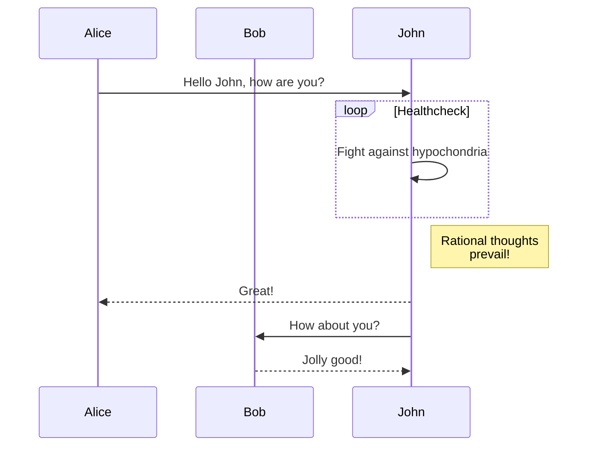


#### [Gantt diagram](https://mermaid.js.org/syntax/gantt.html) 

```
gantt
dateFormat  YYYY-MM-DD
title Adding GANTT diagram to mermaid
excludes weekdays 2014-01-10

section A section
Completed task            :done,    des1, 2014-01-06,2014-01-08
Active task               :active,  des2, 2014-01-09, 3d
Future task               :         des3, after des2, 5d
Future task2               :         des4, after des3, 5d
```

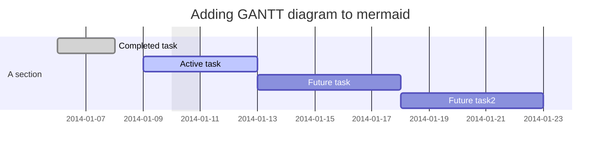

#### [Class diagram](https://mermaid.js.org/syntax/classDiagram.html) 

```
classDiagram
Class01 <|-- AveryLongClass : Cool
Class03 *-- Class04
Class05 o-- Class06
Class07 .. Class08
Class09 --> C2 : Where am i?
Class09 --* C3
Class09 --|> Class07
Class07 : equals()
Class07 : Object[] elementData
Class01 : size()
Class01 : int chimp
Class01 : int gorilla
Class08 <--> C2: Cool label
```

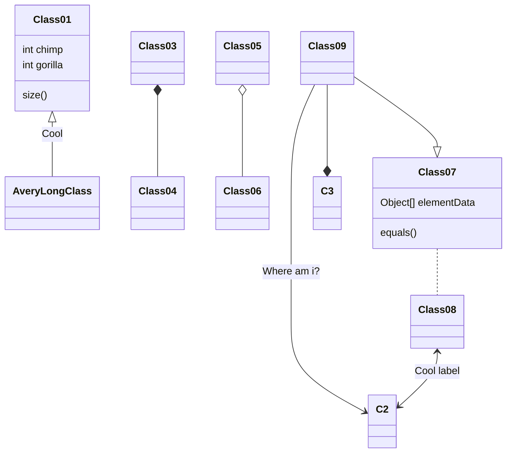

#### [Git graph](https://mermaid.js.org/syntax/gitgraph.html) 

```
    gitGraph
       commit
       commit
       branch develop
       commit
       commit
       commit
       checkout main
       commit
       commit
```

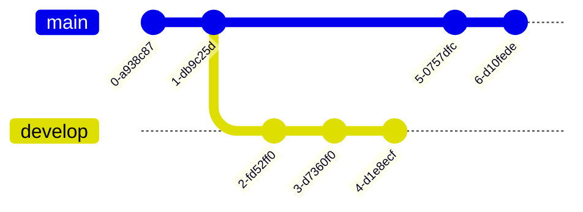

#### [Entity Relationship Diagram](https://mermaid.js.org/syntax/entityRelationshipDiagram.html) 

```
erDiagram
    CUSTOMER ||--o{ ORDER : places
    ORDER ||--|{ LINE-ITEM : contains
    CUSTOMER }|..|{ DELIVERY-ADDRESS : uses
```

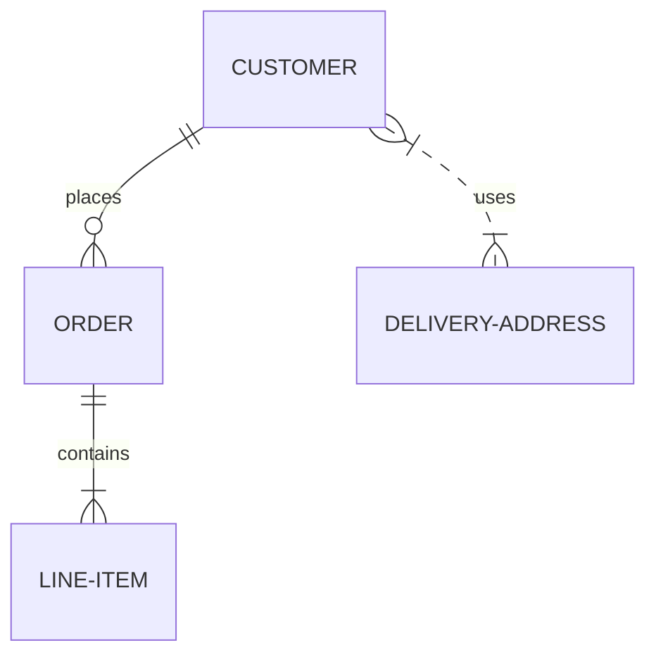

#### [User Journey Diagram](https://mermaid.js.org/syntax/userJourney.html) 

```
journey
    title My working day
    section Go to work
      Make tea: 5: Me
      Go upstairs: 3: Me
      Do work: 1: Me, Cat
    section Go home
      Go downstairs: 5: Me
      Sit down: 5: Me
```

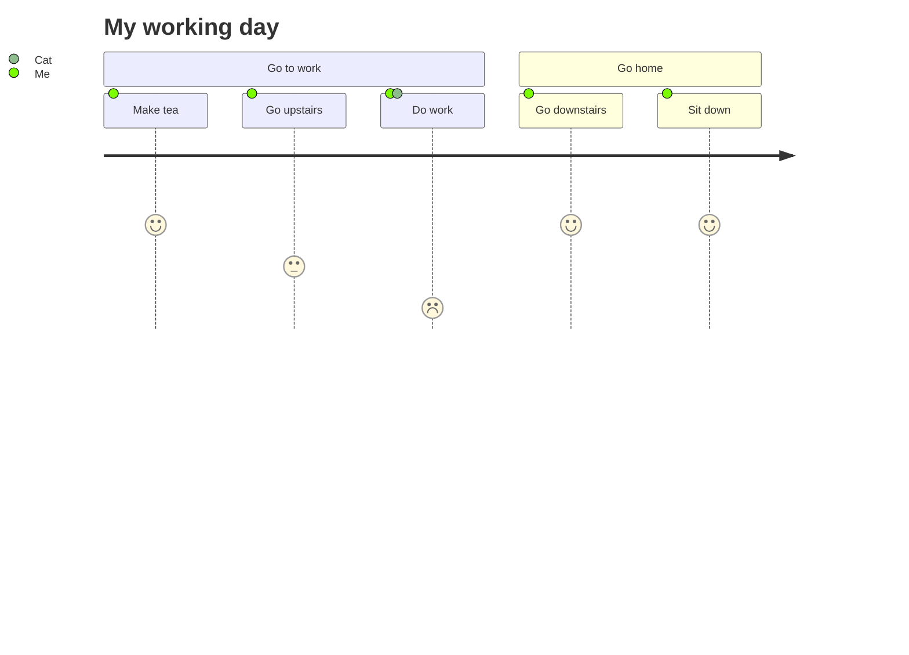

## Запитання для самоперевірки

1. Яка основна ідея використання MarkDown? Чому текстові формати подібні до MsWORD можуть не підійти для цих задач?
2. Прокоментуйте принципи роботи застосунків MarkDown. 
3. Поясніть що таке Flavors MD? У чому причина появи різних Flavors?  
4. Перерахуйте основні елементи синтаксису форматування MarkDown.
5. Розкажіть про області використання MarkDown.
6. Назвіть кілька редакторів для MarkDown.
7. Назвіть ряд елементів розширеного синтаксису форматування MarkDown. Які обмеження їх використання?

| [<- до лекцій](README.md) | [на основну сторінку курсу](../README.md) |
| ------------------------- | ----------------------------------------- |
|                           |                                           |

