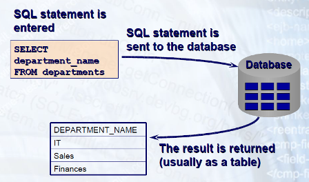
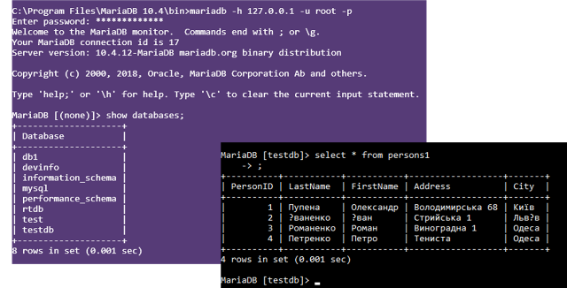
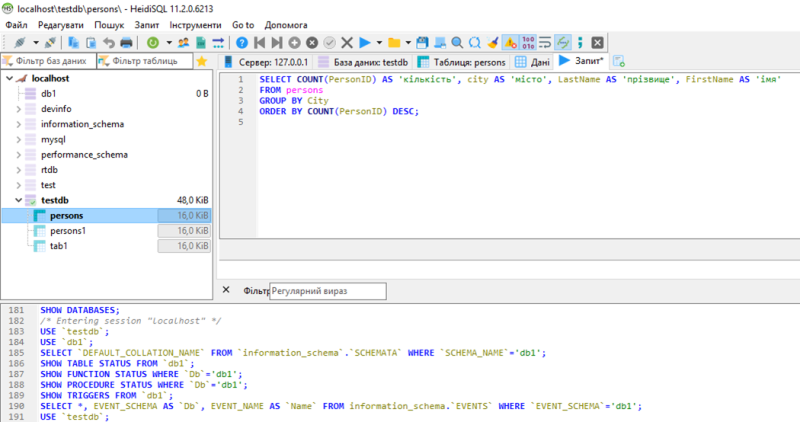
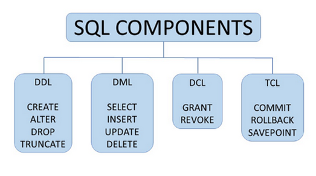
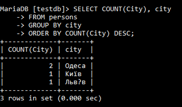
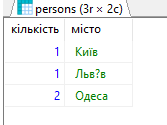

**Програмна інженерія в системах управління. Лекції.** Автор і лектор: Олександр Пупена 

| [<- до лекцій](README.md) | [на основну сторінку курсу](../README.md) |
| ------------------------- | ----------------------------------------- |
|                           |                                           |

# 12. Мова SQL

## 12.1. Загальні принципи

***SQL*** (Structured Query Language – мова структурованих запитів) – це універсальна мова для створення, модифікації і керування даними в реляційних базах даних. Дана мова описана в ряді стандартів ANSI, ISO/IEC і на момент написання останньою версією є SQL:2019. На сьогоднішній день практично всі відомі СКБД підтримують даний стандарт, з деяким розширеннями до нього для адаптації під свої формати даних та функціональні можливості серверів. Такі мови називають діалектами SQL. Так, наприклад діалект СКБД MS SQL Server має назву «Transact-SQL», а MySQL – «SQL/PSM». Перед використанням SQL для конкретної СКБД варто ознайомитися з підтримуваними командами.



рис.12.1. Принципи роботи SQL 

При необхідності використовувати мови SQL в ПЗ для доступу до даних, варто перевірити роботу SQL-запитів в тестових утилітах. Для здійсненні запиту використовується якийсь із інтерфейсів СКБД, який дозволяє обмінюватися текстовими повідомленнями. Тим не менше часто з СКБД постачаються консольні програми, які дозволяють взаємодіяти з СКБД командами в тому числі SQL.    

Наприклад, в СКБД mariadb можна запустити однойменну програму (рис.12.2), ввести ім'я користувача та пароль доступу до СКБД, та зайти у меню введення SQL команд. На ис.12.2 показаний приклад виведення списку баз даних та усіх записів з таблиці testdb. 



рис.12.2. Робота з консоллю

Для того, щоб команди виконалися, необхідно завершити їх символом `;` .

Є багато графічних клієнтських утиліт, які з’єднуються з базами даних через різні інтерфейси і надають можливість керувати ними. Наприклад, `Microsoft SQL Server Management Studio` дає можливість не лише виконувати запити SQL, але і надає інструменти для їх побудови (`Query Designer`). 

На рис.12.3 показаний приклад перевірки SQL-запиту в інший безкоштовній утиліті HeidiSQL, яка ставиться разом з  MariaDB.



рис.12.3. Тестова утиліта для робота з СКБД

Мова SQL задає тільки формат повідомлень запитів та відповідей між застосунком-клієнтом та сервером. Однак яким чином цей запит передається, як формується з’єднання між застосунками, створюється та розриваються сеанси і т.п. вирішується на інших рівнях взаємодії. Усі сучасні стандартизовані технології доступу до даних (ODBC, JDBC, OLE DB, ADO, .NET) надають інтерфейс через SQL. 

Мова SQL розроблена для взаємодії з реляційними БД для інших типів вона не завжди застосовна. Тим не менше, багато NoSQL СКБД підтримують SQL-подібні мови.

## 12.2. Загальний опис SQL команд 

SQL використовується для створення структури бази даних, маніпуляції з даними, тобто їх вибірки і модифікації, та для їх адміністрування. Будь яка операція по вибірці, модифікації, визначенню або адмініструванню виконується за допомогою ***оператору*** (***statement***) або ***команди*** (***command***) SQL.

Use – використовується в усіх реляційних базах даних для вказівки бази даних за замовчуванням.

```sql
USE db1;
SELECT COUNT(*) FROM mytable;   # вибірка з db1.mytable
USE db2;
SELECT COUNT(*) FROM mytable;   # вибірка з db2.mytable
```

**SHOW** **DATABASES** – показує перелік БД.

**SHOW** **TABLES** – показує перелік таблиць. Наприклад:

```sql
SHOW DATABASES; 
SHOW TABLES FROM testdb; 
```

Мова SQL надає широкі можливості для роботи з означенням схеми даних та самими даними, як прийнято відносити до однієї з груп: 

- **[DDL](https://uk.wikipedia.org/wiki/DDL)** ([Data Definition Language](https://uk.wikipedia.org/wiki/Data_Definition_Language)) — робота зі структурою бази
- **[DML](https://uk.wikipedia.org/wiki/DML)** ([Data Manipulation Language](https://uk.wikipedia.org/wiki/Data_Manipulation_Language)) — робота з записами
- **[DCL](https://uk.wikipedia.org/wiki/DCL)** ([Data Control Language](https://uk.wikipedia.org/wiki/Data_Control_Language)) — робота з правами
- **TCL** ([Transaction Control Language](https://uk.wikipedia.org/w/index.php?title=Transaction_Control_Language&action=edit&redlink=1)) — робота з транзакціями

Основні команди SQL відповідно до цих груп наведені на рис.12.4.



рис.12.4. Класифікація команд за призначенням

Однак найбільш вживаними серед цих груп є команди означення схеми даних та роботи з записами даних. Тому надалі зупинимося на них детальніше.  

## 12.3. Запити для означення схеми даних 

**CREATE** – створює базу даних або таблицю в базі даних. Наприклад:

```sql
CREATE TABLE Persons (
    PersonID int,
    LastName varchar(255),
    FirstName varchar(255),
    Address varchar(255),
    City varchar(255)
);
```

Колонка типу даних (datatype) означує які значення в полі : integer, character, money, date and time, binary і т.п. Для різних типів БД типи можуть відрізнятися. У таблицях 12.1-12.3 показані для прикладу типи даних для MySQL. 

Таблиця 12.1. Деякі текстові типи даних MySQL

| Тип             | Характеристики                                               |
| --------------- | ------------------------------------------------------------ |
| CHAR(size)      | Рядок із фіксованою довжиною (може містити літери, цифри та спеціальні символи). Параметр size означує довжину стовпця в символах - може бути від 0 до 255. За замовчуванням 1 |
| VARCHAR(size)   | Рядок із змінною довжиною (може містити літери, цифри та спеціальні символи). Параметр size означує максимальну довжину стовпця в символах - може становити від 0 до 65535 |
| BINARY(size)    | Аналогічний CHAR (), але зберігає двійкові байтові рядки. Параметр size означує довжину стовпця в байтах. За замовчуванням 1 |
| VARBINARY(size) | Аналогічний VARCHAR (), але зберігає двійкові байтові рядки. Параметр size означує максимальну довжину стовпця в байтах. |
| TINYBLOB        | Для BLOBів (Binary Large OBjects). Макс довжина: 255 bytes   |
| TINYTEXT        | Зберігає string з максимальною довжиною  255 символів        |
| TEXT(size)      | Зберігає string з максимальною довжиною  65,535 байт         |
| BLOB(size)      | Для BLOBs (Binary Large OBjects). Зберігає до 65,535 байтів даних |

Таблиця 12.2. Деякі числові типи даних MySQL

| Тип                                | Характеристики                                               |
| ---------------------------------- | ------------------------------------------------------------ |
| BIT(size)                          | Тип бітового значення. Кількість бітів на значення вказано в розмірі. Параметр size може містити значення від 1 до 64. Значення за замовчуванням для size доівнює 1. |
| TINYINT(size)                      | Дуже маленьке ціле число. Діапазон для знакового числа від -128 до 127, для беззнакового - від 0 до 255. Параметр розміру означує максимальну ширину відображення (яка становить 255) |
| BOOL  або BOOLEAN                  | Нуль вважається хибним, ненульові значення - істинними.      |
| SMALLINT(size)                     | Невелике ціле число. Діапазон для знакового числа від -32768 до 32767, для беззнакового - від 0 до 65535. Параметр розміру визначає максимальну ширину відображення (яка становить 255) |
| INT(size)  або INTEGER(size)       | Ціле число. Діапазон для знакового числа від -2147483648 до 2147483647, для беззнакового - від 0 до 4294967295. Параметр розміру визначає максимальну ширину відображення (яка становить 255) |
| FLOAT(p)                           | Число з плаваючою комою. MySQL використовує значення p, щоб визначити, чи використовувати FLOAT або DOUBLE для результуючого типу даних. Якщо p від 0 до 24, тип даних стає FLOAT (). Якщо p становить від 25 до 53, тип даних стає DOUBLE () |
| DECIMAL(size, d)  або DEC(size, d) | Точне число з фіксованою точкою. Загальна кількість цифр вказана в розмірі. Кількість цифр після десяткової коми визначається параметром d. Максимальне число для розміру - 65. Максимальне число для d - 30. Значення за замовчуванням для розміру - 10. Значення за замовчуванням для d - 0. |

Таблиця 12.2. Типи даних дати та часу в MySQL

| Тип            | Характеристики                                               |
| -------------- | ------------------------------------------------------------ |
| DATE           | Дата. Формат: YYYY-MM-DD. Підтримуваний діапазон - від "1000-01-01" до "9999-12-31" |
| DATETIME(fsp)  | Поєднання дати та часу. Формат: YYYY-MM-DD hh:mm:ss. Підтримуваний діапазон - від "1000-01-01 00:00:00" до "9999-12-31 23:59:59". Додавання DEFAULT та ON UPDATE у визначення стовпця приведе до отримання автоматичної ініціалізації та оновлення поточною датою та часом |
| TIMESTAMP(fsp) | Мітка часу. Значення TIMESTAMP зберігаються як кількість секунд з епохи Unix ('1970-01-01 00:00:00' UTC). Формат: YYYY-MM-DD hh:mm:ss. Підтримуваний діапазон - від '1970-01-01 00:00:01' UTC до '2038-01-09 03:14:07' UTC. Автоматичну ініціалізацію та оновлення поточною датою та часом можна вказати за допомогою DEFAULT CURRENT_TIMESTAMP та ON UPDATE CURRENT_TIMESTAMP у означенні стовпця |
| TIME(fsp)      | Час. Формат: hh: mm: ss. Підтримуваний діапазон: від -838: 59: 59 до 838: 59: 59. |
| YEAR           | Рік у чотирьох-символьному форматі. Значення, дозволені у чотиризначному форматі: від 1901 до 2155 та 0000. MySQL 8.0 не підтримує рік у двосимвольному форматі. |

**DROP** – видаляє об'єкт з бази даних: database, table, index, view та інші. Наприклад у наступному прикладі видаляється таблиця. 

```sql
DROP TABLE Persons;
```

А в цьому видаляється база даних.

```sql
DROP DATABASE testDB;
```

**Створення індексу** в MySQL відбувається через означення його в таблиці через ключове словосполучення **PRIMARY KEY**:

```sql
CREATE TABLE Persons (
   ID int NOT NULL,
   LastName varchar(255) NOT NULL,
   FirstName varchar(255),
   Age int,
   PRIMARY KEY (ID)
 ); 
```

Те саме для СКБД MS SQL Server/Oracle/MS Access матиме вигляд:

```sql
CREATE TABLE Persons (
   ID int NOT NULL PRIMARY KEY,
   LastName varchar(255) NOT NULL,
   FirstName varchar(255),
   Age int
 ); 
```

**ALTER** - змінює структуру об'єктів бази даних. Модифікує існуючий об’єкт.

У наступному прикладі добавляється колонка `nicname`: 

```sql
ALTER TABLE Persons ADD nicname varchar(255); 
```

У цьому прикладі видаляється колонка `nicname` 

```sql
ALTER TABLE Persons DROP COLUMN nicname ;
```

У цьому прикладі модифікується тип колонки `Age` 

```sql
ALTER TABLE persons MODIFY COLUMN Age SMALLINT;
SHOW CREATE TABLE persons; 
```

**TRUNCATE** – очищає весь зміст таблиці (видаляє всі дані в таблиці). Він працює швидше за *DELETE*.  

```sql
TRUNCATE testdb.persons;
```

## 12.4. Запити для створення та модифікації даних

Є дві можливості операцій по маніпуляції з даними – ***вибірка даних*** (data retrieval) і ***модифікація даних*** (data modification). Вибірка – це пошук необхідних даних, а модифікація означає добавлення, знищення або заміна даних. Операції по вибірці називають ***SQL запитами*** (***SQL queries***). Вони проводять пошук в базі даних, найбільш ефективно вибирають необхідну інформацію і відображають її. У всіх запитах SQL використовується ключове слово `SELECT`. Операції по модифікації виконуються відповідно з використанням ключових слів `INSERT`, `DELETE` та `UPDATE`. 

**INSERT INTO** – вставлення даних в таблицю (створення запису в таблиці).

У наступному прикладі в таблицю Persons вставляються записи з вказаними значеннями. Якщо поля перераховуються в дужках після назви таблиці, то можна не вказувати їх всі а послідовність записуваних значень змінювати. Якщо за назвою таблиці одразу йде ключове слово VALUES, то значення вказуються в тій кількості і послідовності, як вони задаються при означенні таблиці. 

```sql
DROP TABLE persons; /*видалимо стару таблицю*/
CREATE TABLE Persons (
    PersonID INT NOT NULL AUTO_INCREMENT, /*тип лічильник*/
    LastName varchar(255) COLLATE 'utf8_unicode_ci', /*кодування utf8*/
    FirstName varchar(255) COLLATE 'utf8_unicode_ci',
    Address varchar(255) COLLATE 'utf8_unicode_ci',
    City varchar(255) COLLATE 'utf8_unicode_ci',
    PRIMARY KEY (PersonID) /*первинний ключ*/
);

INSERT INTO Persons (LastName, FirstName, Address, City)
VALUES ('Озерний', 'Олександр', 'Володимирська 68', 'Київ');

INSERT INTO Persons VALUES (0, 'Іваненко', 'Іван', 'Стрийська 1', 'Львів');
INSERT INTO Persons VALUES (0, 'Романенко', 'Роман', 'Виноградна 1', 'Одеса');
INSERT INTO Persons VALUES (0, 'Петренко', 'Петро', 'Тениста', 'Одеса');
```

**UPDATE** – оновлення (модифікація) існуючих даних в таблиці. У цьому прикладі для усіх записів, я яких значення поля `PersonID`<3, будуть замінені значення полів `LastName` та  `FirstName`

```sql
UPDATE testdb.persons 
SET LastName = 'Супер', FirstName = 'Стар' 
WHERE PersonID<3;
```

У цьому прикладі для всіх записів таблиці `persons` значення поля `LastName` буде дорівнювати об'єднанню  полів `LastName` та `FirstName`

```sql
UPDATE persons 
SET LastName = CONCAT (LastName, " " , FirstName); 
```

**SELECT** – отримання даних з БД. 

Спрощена його конструкція має вигляд:

```sql
SELECT список_стовпчиків
FROM список_таблиць
[WHERE умови]
```

де слова в квадратних дужках `[]` – не обов’язкові.

У списку стовпчиків (полів записів) вказуються ті поля таблиці, які повертаються після обробки запиту. Список таблиць означує з яких таблиць необхідно проводити вибірку, а в умовах вказують умови для вибірки рядків. 

У даному прикладі повертаються усі записи з таблиці `Persons` 

```sql
SELECT * FROM Persons
```

А у цьому повертаються тільки поля `LastName` та `FirstName`

```sql
SELECT LastName, FirstName 
FROM Persons
```

У цьому прикладі задається умова, при якій будуть повертатися тільки ті запити, в яких поле `City`='Одеса' 

```sql
SELECT LastName, FirstName, Address 
FROM Persons
WHERE City='Одеса'
```

Ключове слово **WHERE** - використовується для команд SELECT, UPDATE, DELETE і інших для вказівки умови, що має задовольняти запис. Ці умови задаються операторами: порівняння, логічними, визначення діапазону:

- порівняння (=,<,>, >=, <=, <> або != )
- логічними (AND, OR, NOT)
- визначення діапазону ([BETWEEN ](https://www.w3schools.com/sql/sql_between.asp)і NOT BETWEEN)
- символьному порівнянню за шаблоном ([LIKE](https://www.w3schools.com/sql/sql_like.asp))
- входження в перелік IN 

У наступному прикладі будуть повертатися усі записи, в яких поле `LastName` буде містити текст `%енко` 

```sql
SELECT LastName, FirstName 
FROM Persons
WHERE LastName LIKE '%енко'
```

Повний синтаксис оператора `SELECT` має наступний вигляд:

```sql
SELECT [ALL|DISTINCT] список_стовпчиків
[INTO нова_таблиця]
FROM {таблиця | курсор}[,{таблиця | курсор}…] 
[WHERE умови]
[GROUP BY стовпчик [, стовпчик…]]
[HEAVING умови]
[ORDER BY {ім’я_стовпчика | список_вибору}[ASC|DESC] ... ]
```

У списку `SELECT` вказуються ті поля (стовпчики), які необхідно повернути запитом. Є можливість зробити деякі операції над полями перед відображенням: +,-,*, /. 

Ключове слово `INTO` вказує на необхідність створення нової таблиці з вказаним іменем. 

Умови в `WHERE` задаються операторами порівняння (`=`,`<`,`>`, `>=`, `<=`, `!=` або `<>`), логічними (`AND`, `OR`, `NOT`), визначення діапазону (`BETWEEN` і `NOT BETWEEN`),  символьному порівнянню за шаблоном (`LIKE`) та ін.

Ключове слово `ORDER BY` дозволяє упорядковувати знайдені записи по вказаному стовпчику по зростанню `ASC`, або по спаданню `DESC`.

У наступному прикладі буде виведено перелік записів упорядкованих за полем `LastName` по зростанню

```sql
SELECT * FROM Persons
ORDER BY LastName ASC 
```

Додатково про ORDER BY можна почитати  [за посиланням](https://www.w3schools.com/sql/sql_orderby.asp)

**GROUP BY** – може групувати записи за певними полями. У цьому прикладі, виводиться значення кількості записів, що мають однакові поля `City`

```sql
SELECT COUNT(city), city
FROM persons
GROUP BY City
ORDER BY COUNT(city) DESC;
```



рис.12.5. Приклад групування 

У наведеному вище прикладі використовується функція `COUNT`. СКБД як правило підтримують велику кількість [функцій](https://www.w3schools.com/sql/sql_ref_mysql.asp). Серед них є функції агрегації, наприклад: 

- **COUNT** (column_name) – кількість рядків, що відповідають критеріям
- **SUM** (column_name) - сума
- **MAX (**column_name**)** - максимальне
- **MIN (**column_name**)** **-** мінімальне
- **AVG (**column_name**)** **-**  середнє

Для визначення доступних функцій необхідно звертатися до довідкової системи.

Команда **DELETE** призначена для видалення усіх записів з таблиці, залишається місце для записів(команда що видаляє таблиці які задовільняють умову) 

Для користувача частіше всього зручно дивитися назви колонок (полів) у читабельному вигляді, а не так як вони називаються в таблицях. Для цього використовуються **ALIAS (псевдоніми)**, які дає можливість виводити поля під певним текстом. Наприклад, запис виду:

```sql
SELECT COUNT(City) AS 'кількість', city AS 'місто' 
FROM persons 
GROUP BY city
ORDER BY 'кількість' DESC;
```

виведе записи у вигляді, як на рис.12.6. Зверніть увагу, на назви колонок.



рис.12.6. Виведення назви колонок через псевдоніми.

## Запитання для самоперевірки

1. Яке призначення мови SQL?
2. Яким чином можна скористатися мовою при роботі з СКБД?
3. Які групи команд мови роботи з БД підтримує SQL?
4. Розкажіть про команду CREATE.
5. Розкажіть про типи даних на прикладі MySQL.
6. Розкажіть про команду DROP.
7. Розкажіть про команду ALTER.
8. Розкажіть про команду INSERT INTO.
9. Розкажіть про команду UPDATE
10. Розкажіть про команду SELECT.
11. Розкажіть про використання ключового слова WHERE.
12. Розкажіть про призначення функцій SQL. Наведіть приклад.
13. Розкажіть про призначення псевдонімів у запитах SQL.

| [<- до лекцій](README.md) | [на основну сторінку курсу](../README.md) |
| ------------------------- | ----------------------------------------- |
|                           |                                           |