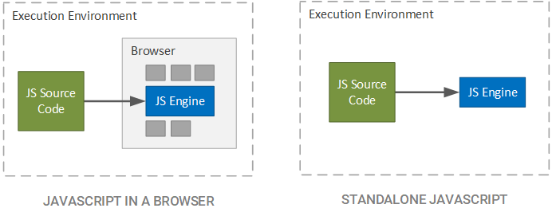
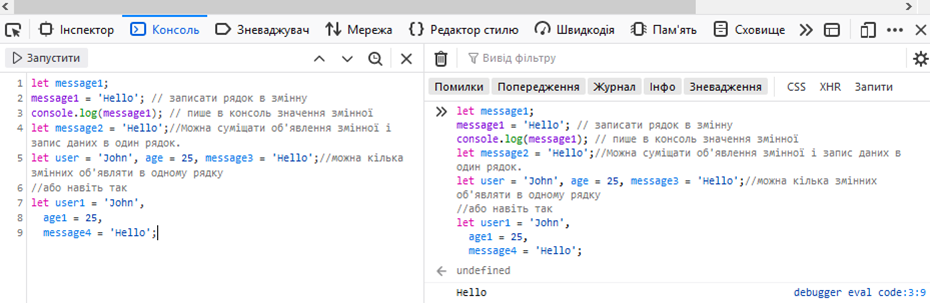
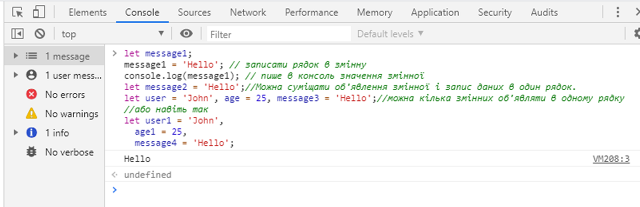
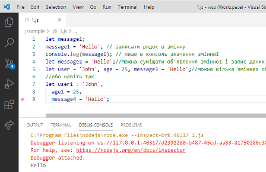
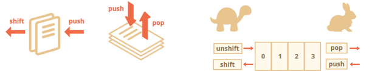

**Програмна інженерія в системах управління. Лекції.** Автор і лектор: Олександр Пупена 

| [<- до лекцій](README.md) | [на основну сторінку курсу](../README.md) |
| ------------------------- | ----------------------------------------- |
|                           |                                           |

# 13. Основи JavaScript

## 13.1. Основні поняття

**JavaScript (скорочено JS )** — мова програмування, яка використовується для сценаріїв  (скриптів). Рушій JavaScript підключається до об'єктів свого середовища  виконання (наприклад, веб-браузера) та надає можливість керування  ними.

JS це реалізація стандарту [ECMAScript](http://xn--80adth0aefm3i.xn--j1amh/ECMAScript). **ES** - це скорочення від **E**CMA**S**cript. Кожне видання  специфікації отримує назву з абревіатурою ES та номеру версії. Починаючи з ES6 офіційна назва специфікації позначається роком виходу. Тобто ES2015...ES2019...

Не дивлячись на схожість назв і елементів синтаксису, JavaScript та Java - це різні мови, які навіть відрізняються парадигмами програмування. Серед відмінностей окремо виділимо середовища виконання.  

Java компілюється в проміжний байт-код, який на необхідному для виконання середовищі перетворюється на машинний код та виконується за допомогою **Java-машини**. Таким чином, реалізовуючи Java-машину (**JVM**) на різному залізі т ОС реалізовується крос-платформність.


рис.13.1. Принципи роботи Java для порівняння з Java Script 

На відміну від системи з проміжною компіляцією, мова JavaScript - інтерпретована. Тобто аналізується та виконується вихідний код програми **JavaScript-рушієм**. Цей рушій може бути вбудований наприклад в браузер. 

Таким чином, JavaScript найчастіше використовується як частина браузера, що надає можливість виконання коду на стороні клієнта  (на пристрої кінцевого користувача), взаємодіяти з ним, керувати браузером, обмінюватися даними з сервером, змінювати структуру та зовнішній вигляд веб-сторінки. Однак рушій може бути частиною іншого застосунку або бути окремим застосунком, наприклад серверним.   



рис.13.2. Принципи роботи Java Script

Таким чином, JavaScript використовується для:

- написання сценаріїв веб-сторінок для надання їм інтерактивності;
- створення односторінкових веб-застосунків ([React](https://uk.wikipedia.org/wiki/React), [AngularJS](https://uk.wikipedia.org/wiki/AngularJS), [Vue.js](https://uk.wikipedia.org/wiki/Vue.js));
- програмування на стороні сервера ([Node.js](https://uk.wikipedia.org/wiki/Node.js));
- стаціонарних застосунків ([Electron](https://electron.atom.io/), [NW.js](https://nwjs.io/));
- мобільних застосунків ([React Native](https://facebook.github.io/react-native/), [Cordova](https://cordova.apache.org/));
- сценаріїв в прикладному ПЗ (наприклад, в програмах зі складу [Adobe Creative Suite](https://uk.wikipedia.org/wiki/Adobe_Creative_Suite) чи [Apache JMeter](https://uk.wikipedia.org/wiki/Apache_JMeter));
- всередині PDF-документів тощо.

Серед рушіїв можна виділити: 

- [V8](https://uk.wikipedia.org/wiki/V8_(%D1%80%D1%83%D1%88%D1%96%D0%B9_JavaScript)) – використовується в Chrome, Opera, Node.js.
- [SpiderMonkey](https://uk.wikipedia.org/wiki/SpiderMonkey) – використовується Firefox.

Якщо спрощено, рушії працюють за таким алгоритмом: читають та розбирають (парсять) текст скрипта; перетворюють скрипт в машинний код; запускають машинний код. При цьому можуть використовуватися алгоритми оптимізації.  

У даному курсі будуть використовуватися приклади в основному для серверних застосунків, що виконуються на Node.js 

Для створення скриптів та застосунків можна використовувати різні редактори, IDE (інтегровані середовища розробки, Integrated Development Environment) або/та утиліти розробки. При розробці скриптів для Веб-сторінок можна скористатися інтегрованими у Веб-бразуери утилітами. Наприклад для FireFox є Веб-консоль, яка може працювати у мультирядковому режимі. Можна вводити туди JS код і дивитися результат, запустивши його на виконання. 

  

рис.13.3. Налагоджувач JS в консолі WEB-браузера FireFox 

У останніх версіях, при намаганні скопіювати в консоль текст, FireFox попросить один раз явно написати дозвіл на виконання копіпасту. Слід також розуміти, що код в консолі буде запускатися в контексті відкритої сторінки. 

У Google Chrome можливість перевірки коду доступна в Інструментах розробника. Введені у консолі інструкції одразу виконуються після натискання `Enter`. Якщо необхідно ввести кілька рядків інструкцій, після кожної треба вводити `Shift+Enter`.   



рис.13.4. Налагоджувач JS в консолі WEB-браузера Google Chrome

У даному курсі усі приклади для лабораторних робіт наводяться для безкоштовного IDE середовища [Visual Studio Code](https://code.visualstudio.com/). Код пишеться в файлах `*.js`, які можна об'єднати в один проект, наприклад для серверу `Node.js`.    



рис.13.5. Інструментальне середовище Visual Studo Code 

Таким чином, усі приклади, що наведені нижче, можете тестувати у [Visual Studio Code](https://code.visualstudio.com/): створити файл, зберегти його як `test.js`, копіювати туди код і запускати на виконання `F5`.

## 13.2. Основні конструкції JavaScript

### Побудова коду програми

Код складається з набору інструкцій, які розділені символом `;`.  У наступному фрагменті дві інструкції введені через крапку з комою в одному рядку. 

```javascript
console.log("Привіт світ!"); console.log("Друга інструкція.");
```

У наведених вище інструкціях викликається метод `log` вбудованого системного об'єкту  `console`. Це дає можливість виводити на налагоджувальну консоль текстові повідомлення.

Мова JavaScript чутлива до регістру. Наприклад код `console.Log()` видасть помилку, так як у системному об'єкті `console` методу `Log` не існує, натомість є метод `log`. 

Синтаксис коментарів такий самий, як в `C` та багатьох інших мовах програмування:

```js
console.log("Привіт світ!"); // коментар для одного рядка 
/* довгий коментар
   на кілька рядків
*/
/* Однак, не можна /* змішувати коментарі */ тут буде SyntaxError */
```

При необхідності виконувати кілька інструкцій при керуванні потоком виконання (наприклад, `if`, `for`, `while`),  використовують блокові інструкції `{` та `}`.  Все що знаходиться в межах фігурних дужок об'єднується в одну інструкцію. 

```javascript
let a=3; let b=2;
if (a>b) //якщо треба виконати кілька інструкцій коли a>b  
{ //початок блоку
	console.log("Це перша інструкція блоку."); 
	console.log("Це друга інструкція блоку.");
} //кінець блоку
```

### Змінні та константи

Для створення змінної в JavaScript використовуються ключові слова `let` та `var`.  Оператор **`let`** оголошує локальну змінну, яка видима в межах блоку, де вона оголошена (`{}`). Оператор **`var`**  має область видимості у межах усіє функції. Є ще ряд відмінностей між  `let` та `var`, але тут вони не розглядаються. У нових скриптах рекомендується використовувати  `let` .

Наведений нижче приклад створює (іншими словами: *об'являє* або *означує*) змінну з іменем `message`, і поміщає в неї дані, використовуючи оператор присвоювання `=` . Рядок збережеться в області пам'яті, зв'язаною зі змінною. Ми можемо отримати до неї доступ, використовуючи ім'я змінної. 

```javascript
let message1;
message1 = 'Hello'; // записати рядок в змінну
console.log(message1); // пише в консоль значення змінної
let message2 = 'Hello';//Можна суміщати об'явлення змінної і запис даних в один рядок.   
let user = 'John', age = 25, message3 = 'Hello';//можна кілька змінних об'являти в одному рядку
//або навіть так
let user1 = 'John',
  age1 = 25,
  message4 = 'Hello';
```

Оголошення **`const`**  створює посилання на значення, доступне лише для читання. Що **не** гарантує незмінність значення, на котре вказує посилання, а лише той факт, що не можна повторно присвоїти будь-яке значення змінній з відповідним ім'ям.

Коли ви оголошуєте змінну за  межами будь-якої функції, вона називається **глобальною змінною**, оскільки  вона доступна для будь-якого іншого коду в поточному документі. Коли ви оголошуєте змінну в межах функції, вона називається **локальною змінною**, оскільки доступна лише в межах цієї функції. 

### Типи даних 

Змінна в JavaScript може містити будь-які дані. У один момент там може бути текст, а в інший – число. Тобто під час виконання програми тип може змінюватися кілька раз (так звана "динамічна типізація"). У наведеному нижче коді, одній змінній присвоюють різні за типом значення. Оператор `typeof` повертає значення типу.

```javascript
//в JS тип може змінюватися під час виконання програми
let message = "hello";		//це текст, і message тепер типу string
console.log (typeof(message));//string
message = 123456; 			//це число, і message тепер типу number 
console.log (typeof(message));//number
```

У JavaScript існує сім типів даних: `number`, `string`, `boolean`, `null`, `undefined`, `object`, `symbol`. Спочатку розглянемо базові (примітивні) типи, усі інші типи будуть розглянуті пізніше. Детальніший розгляд типів можна подивитися у [розділі "Типи даних та літерали" з довідника](../Довідники/js/js.md#types).

У JavaScript примітивні типи даних `number`, `string`, `boolean`, подібно об'єктам мають методи і властивості, до яких можна звертатися через крапку. Для цього JavaScript при такому доступі створює спеціальний об'єкт-обгортку, який надає потрібну функційність, після чого видаляється. Ці об'єкти мають відповідні назви  `String`, `Number`, `Boolean` і `Symbol`, і мають різний набір методів. Наприклад, у наведеному нижче фрагменті, метод `toUpperCase` з об'єкту типу`String` виводить рядок зі зміненим регістром літер на усі великі.   

```javascript
let message = "привіт";	
console.log (message);//привіт
console.log (message.toUpperCase());//ПРИВІТ
```

Особливими типами є `null` та `undefined`. Тип і значення `null` значить буквально `нічого`.  Значення `undefined` значить, що змінна є, але їй не було присвоєне значення.                       

```javascript
let x;
console.log(x); // виведе "undefined"
```

### Булеві змінні та оператори 

Булевий тип (`boolean`) може приймати значення: `true` (істина) і `false` (хибність). Можна записати у таку змінну результат операції порівняння або логічної операції. 

```javascript
let isGreater = 4 > 1;
console.log(isGreater); // буде true 
let a = true; // використання булевого літералу "true"
```

До булевих значень можна застосовувати логічні оператори "І" (`&&`), "АБО"(`||`), "НЕ"(`!`).  Однак, оператори `&&` та `||` насправді повертають значення одного з заданих операндів. Тому, якщо ці оператори використовуються зі значеннями не булевого типу, вони повернуть  значення того самого типу. Оскільки логічні вирази обчислюються зліва направо, вони  перевіряються на можливе "коротке замикання", тобто обчислення проходить за наступними  правилами:

- `false` `&&` *`будь-що`* дає результат `false`.
- `true` `||` *`будь-що`* дає результат `true`.

Правила логіки гарантують, що ці обчислення завжди будуть правильними. Зауважте, що частина виразу *`будь-що`* не обчислюється, тому будь-які побічні ефекти від цих обчислень не відбудуться.

```js
let a1 =  true && true;     // t && t вертає true
let a2 =  true && false;    // t && f вертає false
let a3 = false && true;     // f && t вертає false
let a4 = false && (3 == 4); // f && f вертає false
let a5 = 'Кіт' && 'Пес';    // t && t вертає Пес
let a6 = false && 'Кіт';    // f && t вертає false
let a7 = 'Кіт' && false;    // t && f вертає false
let o1 =  true || true;     // t || t вертає true
let o2 = false || true;     // f || t вертає true
let o3 =  true || false;    // t || f вертає true
let o4 = false || (3 == 4); // f || f вертає false
let o5 = 'Кіт' || 'Пес';    // t || t вертає Кіт
let o6 = false || 'Кіт';    // f || t вертає Кіт
let o7 = 'Кіт' || false;    // t || f вертає Кіт
let n1 = !true;  // !t вертає false
let n2 = !false; // !f вертає true
let n3 = !'Кіт'; // !t вертає false
```

### Числові змінні 

У JavaScript усі числові дані, як цілочисельні значення, так і числа з  плаваючою комою представлені через тип даних (`number`). Для дуже великих цілих чисел (більше за модулем, ніж два в степені 53), застосовується спеціальний об'єкт - `BigInt`, у цій лекції не будемо його розглядати.  

У якості літералів, крім звичайних чисел (`15` чи  `36.6`) існують спеціальні числові значення: `Infinity` (нескінченність), `-Infinity` (мінус нескінченність) і `NaN` (не число).

```js
console.log(1+2);//видасть 3
console.log(1.1+2.1);//видасть 3.2
console.log("2"+3);//видасть "23"
console.log("два"+3);//видасть "два3"
console.log(2/"0.5");//видасть 4
console.log("два"/3);//видасть NaN
console.log(1/0);//видасть Infinity
```

Цілочисельні літерали типу `number` можна виразити у різних формах. Це задається першою літерою літералу: 

- без літери - для 10-кової, 
- `0o` - вісімкової , 
- `0x` - 16-кової, 
- `0b` - для 2-кової. 

```js
console.log(-345);		//-345
console.log(-0o77);		//-63
console.log(-0xF1A7);	//-61863
console.log(-0b11);		//-3
```

Літерали з плаваючою комою можуть задаватися у різному форматі:

```js
console.log(3.1415926);	//3.1415926
console.log(-.123456789);//-0.123456789
console.log(-3.1E+12);	//-3100000000000
console.log(.1e-3);		//0.0001
```

Як наводилося вище, примітивні типи можуть використовуватися як об'єкти. Об'єкт-обгортка `Number` має багато корисних властивостей та методів. Наприклад метод `toString` виводить значення типу `String` у вказаній у дужках системі числення. 

```js
let a=0xF; //16-ковий формат
console.log (a.toString(2)); // 1111 - двійковий формат
```

Про об'єктні властивості та методи `Number` можна прочитати  у [наступній лекції](jsobjects.md).

### Змінні `string`

Рядок (`string`) в JavaScript повинна бути взята в лапки.

```javascript
let str = "Рядок в подвійних лапках";
let str2 = 'Можна використовувати одинарні лапки';
let phrase = `Зворотні лапки (зліва від '1') дозволяють вставляти значення змінних ${str}, інші лапки таке не дозвоялють робити`;
```

Крім звичайних символів до рядків можна також включати спеціальні, як це показано в наступному прикладі. Весь перелік символів доступний [у розділі string з довідника](../Довідники/js/js.md#string).

```js
console.log ("один рядок \n інший рядок");	//виведеться в два рядки
```

Об'єкт-обгортка `String` мають багато корисних методів і властивостей. Повний перелік наведений у [довіднику](https://wiki.developer.mozilla.org/uk/docs/Web/JavaScript/Reference/Global_Objects/String). У прикладі нижче, деякі з них: 

```javascript
let a='Текст';
console.log (a.length);     //5 - довжина, тобто кільксть літер
console.log (a.toLowerCase());//текст - усі літери маленькі
console.log (a[2]);         //к - доступ до літери по номеру
for (let char of a='Текст') {//перебір усіх символів
    console.log(char); // Т,е,к,с,т
}
console.log(a.substring(0,3)); //Тек - підрядок з 0-го по 3-й не включно
console.log(a.substr(1,2)); //ек - підрядок з 1-го, 2 шт
```

Додатково про роботу зі змінними `string` та виразами можна почитати за [цим посиланням](https://wiki.developer.mozilla.org/uk/docs/Web/JavaScript/Guide/Text_formatting) або [за цим](https://learn.javascript.ru/string).

### Оператор typeof 

Оператор `typeof` повертає тип аргумента. Він працює однаково з довма синтаксисами

```js
typeof операнд
typeof (операнд)
```

```javascript
console.log (typeof undefined);// "undefined"
console.log (typeof 0) ;// "number"
console.log (typeof true); // "boolean"
console.log (typeof "foo"); // "string"
console.log (typeof Symbol("id")); // "symbol"
conso;e.log (typeof (['Я','М']));//"object", бо масиви це об'єкти
console.log (typeof Math); // "object" - так як Math вбудований в JS обєкт для роботи з мат.операціями
console.log (typeof null); // "object" - хоч це не так
console.log (typeof console.log); // "function" - хоч формально такого типу немає, для методів і функцій повертається "function"
```

### Перетворення типів 

Найчастіше оператори і функції автоматично перетворюють передані їм значення (примітивного типу) до потрібного типу. Наприклад, `console.log` автоматично перетворює будь-яке значення до типу `string`. Математичні оператори перетворюють значення до чисел. Але є випадки, коли потрібно явно перетворити значення в очікуваний тип.

Можна використовувати функцію `String (value)`, щоб явно перетворити значення до рядка:              

```javascript
let value = true;
console.log (typeof value); // boolean
value = String(value); 		// тепер це рядок, що дорівнює "true"
console.log (typeof value); // string
```

Можна використати функцію `Number(value)`, щоб явно перетворити `value` в число. Якщо рядок не може бути перетворений в число, результатом буде `NaN`.

```javascript
let str = "123"; console.log(typeof str); // string
let num = Number(str); console.log(typeof num); // стає числом 123, тому number
let age = Number("Будь який рядок без числа"); console.log(age); // NaN, перетворення не вдалося
console.log(Number("   123   ") ); // 123
console.log(Number("123z") );      // NaN (помилка читання числа в "z")
console.log(Number(true) );        // 1
console.log(Number(false) );       // 0
```

Майже усі математичні оператори виконують чисельне перетворення, за виключенням  `+`. Якщо один із доданків є рядком, тоді всі інші приводяться до строчок і робиться конкатенація (з'єднання).   

```js
console.log("1.1" + "1.1");		//"1.11.1"
console.log((+"1.1") + (+"1.1"));//2.2   
```

У випадку, коли значення, що представляє число, знаходиться в пам'яті як рядок, існують методи для перетворення [`parseInt()`](https://developer.mozilla.org/uk/docs/Web/JavaScript/Reference/Global_Objects/parseInt) та [`parseFloat()`](https://developer.mozilla.org/uk/docs/Web/JavaScript/Reference/parseFloat). 

```javascript
console.log(Boolean(1)); // true
console.log(Boolean(0)); // false
console.log(Boolean("Привіт!")); // true
console.log(Boolean("")); // false
console.log(Boolean("0")); // true
console.log(Boolean(" ")); // пробіл це також true (любий непустий рядок це true)
```

### Оператор присвоєння (=)

Лівосторонньому операнду `=` дається значення правостороннього виразу.

```javascript
let x = 2 * 2 + 1;
console.log(x); 		// 5
let a, b, c;
a = b = c = 2 + 2;		//присвоєння ланцюжком, усім змінним буде присвоєно 4
let a1 = 1;				//1
let b1 = 2;				//2
let c1 = 3 - (a1 = b1 + 1);//0
```

### Оператори порівняння

Оператор порівняння порівнює операнди та повертає логічне значення істинності  порівняння. Операнди можуть бути числовими, рядками, логічними значеннями або об'єктами. Рядки порівнюються згідно стандартного лексикографічного порядку, з використанням значень Unicode. 

У більшості  випадків, якщо два операнди не належать до одного типу, JavaScript  намагається привести їх до належного для порівняння типу. Зазвичай це  призводить до числового порівняння операндів. Єдиними винятками у  конвертації типів під час порівняння є оператори `===` та `!==`, які виконують перевірку на строгу рівність та строгу нерівність. Ці  оператори не намагаються перед перевіркою на рівність привести операнди  до спільного типу. 

Наступний приклад показує як працюють оператори. Усі виведення в консоль будуть давати результат TRUE. 

```js
let var1 = 3; let var2 = 4;
//усі наведені нижче приклади виведуть значення TRUE;
console.log (3 == var1);	//рівність
console.log ("3" == var1);	//рівність
console.log ("3" == 3);		//рівність
console.log (var1 != 4);	//нерівність
console.log (var2 != "3");	//нерівність
console.log (3 === var1);	//строга рівність, оператори рівні і одного типу
console.log (var1 !== "3");	//строга нерівність, оператори одного типу, але нерівні 
console.log (3 !== '3');	//строга нерівність, оператори різного типу
console.log (var2 > var1);	//більше ніж
console.log ("12" > 2);		//більше ніж
console.log (var2 >= var1); //більше абл дорівнює
console.log (var1 < var2);  //менше ніж
console.log (var1 <= var2); //менше або дорівнює
```

### Арифметичні оператори

Арифметичний оператор приймає числові значення (літерали чи змінні) в якості операндів та повертає єдине числове  значення. Стандартними арифметичними операторами є додавання (`+`), віднімання (`-`), множення (`*`) та ділення (`/`). Ці оператори працюють так само, як і в більшості інших  мов програмування, при використанні з числами з рухомою комою (зокрема,  зауважте, що ділення на нуль повертає [`Infinity`](https://developer.mozilla.org/uk/docs/Web/JavaScript/Reference/Global_Objects/Infinity)). Робота з іншими арифметичними операторами показана у прикладі  нижче:

```javascript
let x=3;
console.log (12 % 5);	//2, остача від ділення
console.log (++x);	console.log (x); //4(інкрменет, потім вивід), потім 4
console.log (x++);	console.log (x); //4(вивід потім інкремент), потім 5
console.log (--x);	console.log (x); //4(декрменет, потім вивід), потім 4
console.log (x--);	console.log (x); //4(вивід потім декремент), потім 3
console.log (-x);	//-3, унарний мінус робить знак протилежним
console.log (+"3");	//-3, унарний плюс перетворює операнд на число 
console.log (2**3);	//8, підносить до степеня 
```

### Бітові оператори

Бітовий оператор опрацьовує свої операнди, як послідовність 32-х бітів (нулів та одиниць). Бітові оператори виконують  операції над цими бітовими представленнями і повертають стандартні  числові значення JavaScript. Кожен біт першого операнду ставиться у пару до відповідного біту  другого операнду: перший до першого, другий до другого, і  так далі. Наступний приклад показує результати таких операцій.

```javascript
let a;
a = 0b1101 & 0b1000; console.log (a.toString(2));//1000, побітове І
a = 0b1101 | 0b1010; console.log (a.toString(2));//1111, побітове АБО
a = 0b1101 ^ 0b0001; console.log (a.toString(2));//1100, побітове виключне АБО, повертає 0 там де біти однакові
a = ~ 0xFFFF_FFF0; console.log (a.toString(2));//1111, інвертує біти
//при зсуві усі біти на краю куди зсовують "випадають", а звідки - заповнюються нулями 
a = 0b0011 << 3; console.log (a.toString(2));//11000, зсуває на три біти ліворуч
a = 0b11100 >> 4; console.log (a.toString(2));//1, зсуває на 4 біти праворуч, 
a = 0x8000_0000 >> 16; console.log (a.toString(16));//-8000, зсуває на 16 біт праворуч, але знак залишає 
a = 0x8000_0000 >>> 16; console.log (a.toString(16));//8000, зсуває на 16 біт праворуч, знак приймає як біт
```

### Оператори з рядками

На додачу до операторів порівняння, які можуть застосовуватись до рядкових значень, оператор конкатенації (+) об'єднує значення двох рядків, повертаючи єдиний рядок. Наприклад,

```js
console.log('мій ' + 'рядок'); // консоль виводить рядок "мій рядок".
```

Для конкатенації рядків може також застосовуватись скорочений оператор присвоєння +=  . Наприклад,

```js
let mystring = 'алфа';
console.log (mystring += 'віт'); // повертає "алфавіт" та присвоює це значення mystring.
```

### Умовний оператор

Умовний оператор - єдиний оператор у JavaScript, який приймає три операнди. У оператора  може бути одне чи два значення, в залежності від умови. Використовує  наступний синтаксис:

```javascript
умова ? значення1 : значення2
```

Якщо `умова` дорівнює `true`, оператор повертає `значення1`. В іншому випадку - `значення2`. Умовний оператор можна використовувати будь-де, де використовується звичайний оператор. Наприклад:

```js
let age = 19;
let status = (age >= 18) ? 'дорослий' : 'неповнолітній';
console.log (status); //дорослий
```

Ця інструкція присвоює значення "дорослий" змінній `status`, якщо значення `age` (вік) більше чи дорівнює 18. Інакше, вона присвоює змінній `status` значення "неповнолітній".

### Оператор кома

Оператор кома (`,`) обчислює обидва свої операнди та повертає значення останнього операнду. Цей оператор найчастіше використовується всередині циклу `for`, що дозволяє оновлювати більше однієї змінної на кожному проході циклу. Наприклад, якщо `a` є двовимірним масивом з 10 елементами  по кожній стороні, наступний код використовує оператор кому, щоб оновити дві змінні одночасно. Код виводить значення діагональних елементів  масиву:

```js
for (var i = 0, j = 9; i <= j; i++, j--)
  console.log('a[' + i + '][' + j + ']= ' + a[i][j]);
```

### Умовні інструкції 

Як і в інших мовах **if**, дозволяє робити галуження. 

```javascript
let a=3; let b=2;
if (a>b) {
  console.log ("a>b");
} else {
  console.log ("a<=b");
}
//використання else if
if (a>b) {
  console.log ("a>b");
} else if (a<b) {
  console.log ("a<=b");
} else {
  console.log ("a=b");
} 
```

Конструкція `switch` замінює собою одразу кілька `if`. Вона має один або кілька блоків `case` і необов'язковий блок `default`.

```javascript
switch(x) {
  case 'value1':  // if (x === 'value1')
    ...
    [break]
  case 'value2':  // if (x === 'value2')
    ...
    [break]
  default:		//якщо не знайдено жодного варіанту
    ...
    [break]
}
```

Приклад використання  `switch`:

```javascript
let a = 2 + 2;
switch (a) {
  case 3:
    console.log( 'Малувато' );
    break;
  case 4:
    console.log( 'В точку!' ); //виведе цей варіант
    break;					  //після чого перестане перебирати	
  case 5:
    console.log( 'Перебор' );
    break;
  default:
    console.log( "Нема таких значень" );
}
```

**Якщо `break` немає, то виконання піде нижче по наступним`case`, при цьому інші умови ігноруються.**

```javascript
let a = 2 + 2;
switch (a) {
  case 3:
    console.log( 'Малувато' ); 
  case 4:
    console.log( 'В точку!' ); 	//виконається, бо a = 4
  case 5:
    console.log( 'Перебор' );	//виконається, бо немає `break`
  default:
    console.log( "Нема таких значень" );//виконається, бо немає `break`
}
```

Можна групувати кілька варіантів, тобто у наступному прикладі будь який з пунктів `3` або `5` приведе до виконання `console.log('Трохи не попали!')`. 

```javascript
let a = 3;
switch (a) {
  case 4:
    console.log('Правильно!');
    break;
  case 3: // (*) групуємо оба case
  case 5:
    console.log('Трохи не попали!');
    break;
}
```

### Цикли 

Код з тіла циклу **while** виконується, поки умова виконується. Наприклад, цикл нижче виводить `i`, поки `i < 3`       

```javascript
let i = 0;
while (i < 3) { // виводить 0, потім 1, потім 2
  console.log( i );
  i++;
}
```

Одне виконання циклу називається ітерацією. Вище наведено 3 ітерації.  Якщо тіло циклу має тільки одну інструкцію, оператори блоку `{…}` можна не писати                     

```javascript
let i = 3;
while (i) console.log(i--);
```

Синтаксис **do..while** дає можливість виконати тіло циклу принаймні один раз.

```javascript
do {
  // тіло циклу
} while (condition);
```

"Класичний" цикл **for** має наступний вигляд:

```javascript
for (початок; умова; крок) {
  // ... тіло циклу ...
}
```

Цикл нижче виконує `console.log(i)` для `i` від `0` до (але не включаючи) `3`:  

```javascript
for (let i = 0; i < 3; i++) { // виведе 0, потім 1, потім 2
  console.log(i);
}
```

| частина   |                  |                                                              |
| --------- | ---------------- | ------------------------------------------------------------ |
| *початок* | `i = 0`          | Виконується один раз при вході в цикл                        |
| *умова*   | `i < 3`          | Перевіряється *перед* кожною ітерацією циклу. Якщо вона буде `false` - цикл зупиниться. |
| *крок*    | `i++`            | Виконується *після* тіла циклу на кожній ітерації *перед* перевіркою умови. |
| *тіло*    | `console.log(i)` | Виконується знову і знову, поки умова виконується  `true`.   |

Можна використовувати існуючу змінну. Будь яка частина `for` може бути пропущена.  

Інші інструкції циклів будуть розглянуті в розділі `Масиви`                      

Можна вийти з циклу у будь який момент за допомогою директиви **break**. Наприклад:

```javascript
let sum = 0;
while (true) {
  let value = +prompt("Введіть число", '');
  if (!value) break; // (*)
  sum += value;
}
alert( 'Сумма: ' + sum );
```

Директива **continue** забезпечує перехід до наступної ітерації:

```javascript
 for (let i = 0; i < 10; i++) {
  // якщо парне, пропустити іншу частину тіла циклу
  if (i % 2 == 0) continue;
  console.log(i); // 1, потім 3, 5, 7, 9
}
```

## 13.3. Основи роботи з функціями

Окрім вбудованих системних функцій є також можливість писати власні. Тут наведемо тільки базові можливості функцій, інші будуть даватися в одній із наступних лекцій.

### Оголошення функції

**Оголошення функції** (функціональний оператор) означує функцію з вказаними параметрами.

```js
function name([param[, param,[..., param]]]) {
   [statements]
}
```

- `name` - Ім'я функції.
- `param`- Ім'я аргументу, що передається у функцію. 
- `statements`- Інструкції, які складають тіло функції.

Функції повинні бути в області видимості під час виклику, але оголошення функції може  бути записаним нижче виклику, як у цьому прикладі:

```js
console.log (sum(2)); 	//значення параметра b не задається, результат виведе 5
function sum(a, b=3) {	//b з передачою значення за замовченням
  return (a+b);
}
```

### Виклик функції з передачею параметрів

У функцію можуть передаватися параметри за замовченням, як показано вище в прикладі для змінної b.

Примітивні параметри (такі, як число) передаються функціям за значенням, тобто якщо функція змінює значення параметра, ця зміна не відбувається в змінній, яка була передана при виклику. 

```js
let a=2;
console.log (test(a)); 	//3
console.log (a); 		//2
function test(a) {
  a=3;
  return (a);
}
```

Об'єкти передаються функції за посиланням. А отже функція може змінити цей об'єкт.

```js
let a={val:2};
console.log (test(a)); 	//3
console.log (a.val); 	//3
function test(a) {
  a.val=3;
  return (a.val);
}
```

### Функціональні вирази

Функції також можуть бути створені за допомогою функціональних виразів, які можна присвоювати змінним. Така функція може бути анонімною, тобто їй не обов'язково мати ім'я. Наприклад, `square` можна визначити як:

```js
let square = function(number) { return number * number; };
let x = square(4); // повертає 16
```

Тим не менше, ім'я  може бути надане у функціональному виразі, і може бути  використане всередині функції, щоб звернутися до самої себе, або в  налагоджувачі, щоб визначити функцію в трасуванні стеку:

```js
var factorial = function fac(n) { return n < 2 ? 1 : n * fac(n - 1); };
console.log(factorial(3));
```

Підняття функції (використання раніше об'явлення) працює тільки для оголошення функції, а не для функціонального виразу.

Функціональні вирази зручні при передачі функції як аргументу до іншої функції. Наступний приклад показує функцію map, яка повинна отримати функцію як перший аргумент, а масив як другий аргумент.

```jsx
function map(f, a) {
  let result = [], // Створення нового масиву
      i;
  for (i = 0; i != a.length; i++)
    result[i] = f(a[i]);
  return result;
}
```

### Область видимості функції

Змінні, означені всередині функції, недоступні ззовні цієї функції. Проте,  функція може звертатись до усіх змінних та функцій, означених у області видимості, де вона оголошена. Іншими словами, функція, оголошена у  глобальній області видимості, може звертатись до усіх змінних,  оголошених у глобальній області видимості. Функція, оголошена всередині  іншої функції, має доступ до усіх змінних, оголошених у батьківській  функції, а також до будь-якої змінної, до якої має доступ батьківська  функція.

```js
// Ці змінні визначені у глобальній області видимості
let num1 = 20, num2 = 3, name = 'Chamahk';
// Ця функція означена у глобальній області видимості
function multiply() {
  return num1 * num2;
}
console.log (multiply()); // Повертає 60
```

```js
// Приклад вкладеної функції
function getScore() {
  let num1 = 2, num2 = 3;
  function add() {
    // використовуються змінні об'явлені в функції getScore   
    return name + ' scored ' + (num1 + num2);
  }
  return add();
}
console.log (getScore()); // Повертає "Chamahk scored 5"
```

## 13.4. Основи роботи з об'єктами

### Використання об'єктів 

`object` - у JavaScript це колекція властивостей і методів. **Методом** називається функція, яка є членом об'єкта. **Властивість** це значення або набір значень (у вигляді масиву або об'єкта), який є членом об'єкта і  може містити будь який тип даних. 

Доступ до властивостей та методів проводиться через крапку. Якщо це метод, він викликається з використанням дужок, якщо треба прочитати чи записати властивість - назва вказується без дужок.

```javascript
let a = "текст"
console.log (a.toUpperCase());//ТЕКСТ, виклик методу toUpperCase(усі прописні) з дужками
console.log (a.length);     //5, читання властивості length(довжини) без дужок    
```

До імен властивостей, які не є дійсними ідентифікаторами, не можна отримати доступ до властивості через крапку (`.`), але *можна* можна це зробити через квадратні лапки ("`[]`").

```js
let unPropNames = {
  '': 'An empty string',
  '!': 'Bang!'
}
console.log(unPropNames.'');   // помилка SyntaxError: Unexpected string
console.log(unPropNames['']);  // An empty string
console.log(unPropNames.!);    // помилка SyntaxError: Unexpected token !
console.log(unPropNames['!']); // Bang!
```

Доступ через квадратні лапки також дає можливість доступатися до властивостей об'єкту через змінну або вираз. 

```javascript
let key = "likes birds";
user[key] = true; // те саме, що і user["likes birds"] = true;
let fruit = prompt("Який фрукт купити?", "apple");
let bag = {
  [fruit]: 5, // ім'я властивості буде взято зі змінної fruit 
};
```

### Створення та редагування об'єктів  

Крім великої кількості існуючих системних і бібліотечних об'єктів, можна використовувати свої об'єкти. Об'єкт можна створити через конструктор, або через літерал.

```javascript
let user = new Object(); // синтаксис "конструктор об'єкта"
let user = {};  // синтаксис "літерал об'єкта"
```

Використання **new** вказує, що необхідно використати спеціальну функцію-конструктор з назвою `Object`.  Конструктор `Object` створює об'єкт-обгортку для переданого значення.  Якщо значенням є `null` або `undefined`, він створює і повертає порожній об'єкт, в іншому випадку --- повертає об'єкт такого типу, який відповідає  переданому значенню. 

Специфікатор `new` може також використовуватися для виклику інших конструкторів (не `Object` ) - функцій, в яких прописуються інструкції створення об'єкту. Так досягається прототипування об'єктів, так як в конструкторі можна задати всю структуру об'єкту для всіх екземплярів. Детальніше про створення таких конструкторів буде в [наступній лекції](jsobjects.md). Тут розглянемо використання існуючих конструкторів на прикладі [`Date`](https://wiki.developer.mozilla.org/uk/docs/Web/JavaScript/Reference/Global_Objects/Date/Date).      

```javascript
const datebd = new Date('1978/10/23 03:45:00');	//день народження
let now = new Date();                           //зараз  
let myAge = parseInt (now - datebd)/(1000*60*60*24);//мс*с*хв*год*доба
console.log (myAge);							//кількість днів
```

У розділі роботи з масивами також розглянемо використання вбудованого конструктору `Array` для роботи з масивом. 

**Об'єктні літерали** - це список з нуля або більше пар імен властивостей та методів об'єкту та асоційованих з ними значень, взятих у фігурні дужки (`{}`).  Властивості, які також називають **полями**,  мають ключ, який також називають **ім'ям** або **ідентифікатором**.  Використовуючи літеральний синтаксис об'явлення можна одразу в об'єкт помістити кілька властивостей і методів через пару "`ключ` : `значення`".  Значення може бути будь якого типу, в тому числі об'єктом. Наприклад: 

```js
var sales = 'Toyota';
function carTypes(name) {
  if (name === 'Honda') {
    return name;
  } else {
    return "Вибачте, ми не продаємо " + name + ".";
  }
}
var car = { myCar: 'Saturn', 		//властивість - літерал 
           getCar: carTypes('Honda'),//властивість - результат функції 
           special: sales };		//властивість - змінна 
console.log(car.myCar);   // Saturn
console.log(car.getCar);  // Honda
console.log(car.special); // Toyota 
```

Добавлення властивостей чи методу може проводитися у будь який момент часу, достатньо до них звернутися для записування.

```javascript
let a = {p1 : 10};  //створили об'єкт з однією властивістю
a.p2 = 11;          //добавили нову властивість зі значенням 11
a.sum = function (a) {return this.p1 + this.p2 + a};//добавили новий метод, що повертає суму 
console.log (a.sum(2));               //виведе 23
```

Видалення властивостей чи методу проводиться через `delete`

```javascript
delete a.sum;
```

Можна використовувати числовий або рядковий літерал для назви властивості, або вкладати об'єкт всередину іншого. У наступному прикладі використовуються ці можливості.

```js
let car = { manyCars: {a: 'Saab', b: 'Jeep'}, 7: 'Mazda' };
console.log(car.manyCars.b); // Jeep
console.log(car[7]); // Mazda
```

Імена властивостей об'єкта можуть бути будь-якими  рядками, включаючи порожні. Якщо ім'я властивості не є дійсним ідентифікатором (не за правилами найменування змінних, наприклад включає пробіли) чи числом JavaScript, воно повинно бути вставлено в  лапки. 

Якщо необхідно властивості надавати значення з тим самим іменем, його можна не вказувати:

```javascript
function makeUser(name, age) {
  return {
    name, // те саме, що і name: name
    age   // те саме, що і age: age
    // ...
  };
}
```

### Присвоєння

Присвоєння для об'єктів працює не як дублювання змісту, а як копіювання за посиланням на той же самий об'єкт. Порівняння об'єктних змінних `==` або `===` показує, що ці змінні посилаються на той же об'єкт. Тобто: 

```javascript
let user = { name: "John" };
let admin = user;               // це друга змінна, яка посилається на той же об'єкт
console.log (admin === user);   //true
user.lastname = "Smith";        // нова властивість для user
console.log (admin.lastname);   //Smith, те саме значення бо це той же об'єкт
```

### Перевірка наявності властивості чи методу

Оператор `in` повертає `true`, якщо вказана властивість або метод існує у вказаному об'єкті. Наприклад:

```javascript
console.log ("log" in console);//true
console.log ("Log" in console);//false
```

### Перевірка відповідності типу 

Оператор `instanceof` повертає `true`, якщо вказаний об'єкт належить до вказаного типу. Наприклад:

```js
let now = new Date();                             
let now1 = {DT:"2020/04/15 20:15:00"}
console.log (now instanceof Date);  //true
console.log (now1 instanceof Date); //false
```

### Перебір властивостей та методів (`for..in`)

Перебір усіх властивостей та методів проводиться через `for..in`

```js
let obj = {a: 1, b: 2, c: 3};   
for (const prop in obj) {
  console.log(`obj.${prop} = ${obj[prop]}`);
}
// Виведе:
// "obj.a = 1"
// "obj.b = 2"
// "obj.c = 3"
```

### Розкриття об'єкту (Object Spread, `...`)

Синтаксис `...` перед об'єктами в JavaScript використовується для розширення об'єктів (Object Spread). Він дозволяє копіювати властивості з одного об'єкта в інший об'єкт або об'єднувати властивості з кількох об'єктів в один об'єкт.

Основні використання синтаксису `...` перед об'єктами:

1) Копіювання об'єкта: За допомогою `...` можна швидко створити поверхневу копію об'єкта, копіюючи всі його властивості в новий об'єкт.

```js
const obj1 = { x: 1, y: 2 };
const obj2 = { ...obj1 };
console.log(obj2); // { x: 1, y: 2 }
```

2) Об'єднання об'єктів: За допомогою `...` можна об'єднати властивості з кількох об'єктів в один об'єкт.

```js
javascript
const obj1 = { x: 1 };
const obj2 = { y: 2 };
const mergedObj = { ...obj1, ...obj2 };
console.log(mergedObj); // { x: 1, y: 2 }
```

3) Додавання нових властивостей: За допомогою `...` можна додавати нові властивості до об'єкта.

```js
javascript
const obj1 = { x: 1 };
const obj2 = { ...obj1, y: 2 };
console.log(obj2); // { x: 1, y: 2 }
```

Зверніть увагу, що синтаксис `...` перед об'єктами доступний з ECMAScript 2018 (ES9) і пізнішими версіями JavaScript.

### Перебір властивостей методом `keys()`

Метод `Object.keys()` використовується для отримання масиву, що містить імена всіх перераховуваних властивостей об'єкту. Ось приклад використання методу `Object.keys()`:

```js
const obj = { a: 1, b: 2, c: 3 };

const keys = Object.keys(obj);

keys.forEach(function(key) {
  console.log(key + ': ' + obj[key]);
});
```

У цьому прикладі ми спочатку використовуємо `Object.keys(obj)`, щоб отримати масив, що містить імена всіх властивостей об'єкту `obj`. Потім ми використовуємо `forEach()` для ітерації по цьому масиву і виведення кожної властивості та її значення. Результат буде наступним:

```
a: 1
b: 2
c: 3
```

Цей підхід дозволяє перебрати усі перераховувані властивості об'єкту, незалежно від того, чи є вони власними властивостями об'єкту чи успадкованими. Зауважте, що метод `Object.keys()` повертає тільки перераховувані властивості, а не властивості, що не перераховуються (наприклад, властивості, що використовуються для зберігання внутрішніх станів об'єкту).

### Об'єднання об'єктів

Є кілька способів об'єднати два об'єкти в JavaScript. Один з них - використання методу `Object.assign()`, який дозволяє об'єднати властивості з одного або кількох об'єктів в один об'єкт. Наприклад:

```js
const obj1 = { a: 1, b: 2 };
const obj2 = { c: 3, d: 4 };
const obj3 = Object.assign({}, obj1, obj2);

console.log(obj3); // { a: 1, b: 2, c: 3, d: 4 }
```

У цьому прикладі ми створили два об'єкти `obj1` і `obj2`, а потім об'єднали їх в один об'єкт `obj3`, використовуючи метод `Object.assign()`. Першим параметром методу є пустий об'єкт `{}`, який буде місцем призначення для об'єднаних властивостей. Потім ми передаємо об'єкти, які ми хочемо об'єднати, як наступні параметри методу.

Є й інші способи об'єднати об'єкти, такі як оператор `spread (...)` або методи `Object.keys()`, `Object.values()` та `Object.entries()`, але метод `Object.assign()` є простим і ефективним способом зробити це. 

Але `Object.assign()` об'єднує властивості тільки на одному рівні. Для об'єднання об'єктів на всіх рівнях вкладеності можна використовувати рекурсію. Можна написати функцію, яка проходиться по всіх властивостях об'єкту та рекурсивно викликає себе для кожної властивості, що також є об'єктом.

Ось приклад функції, яка об'єднує два об'єкти на всіх рівнях вкладеності:

```javascript
function mergeObjects(obj1, obj2) {
  // перебираємо всі властивості obj2
  for (let prop in obj2) {
    if (obj2.hasOwnProperty(prop)) {
      // якщо властивість є об'єктом, рекурсивно викликаємо mergeObjects
      if (typeof obj2[prop] === 'object') {
        // якщо властивість також є об'єктом, викликаємо mergeObjects
        if (typeof obj1[prop] === 'object') {
          obj1[prop] = mergeObjects(obj1[prop], obj2[prop]);
        } else {
          obj1[prop] = obj2[prop];
        }
      } else {
        obj1[prop] = obj2[prop];
      }
    }
  }
  return obj1;
}
```

Ця функція бере два об'єкти як аргументи, а потім перебирає всі властивості другого об'єкта. Якщо властивість є об'єктом, то викликає саму себе рекурсивно з відповідними властивостями першого та другого об'єкта. Якщо властивість не є об'єктом, то просто копіюємо її з другого об'єкта в перший. Значення властивостей другого об'єкта будуть переписувати властивості першого. 

Наприклад, якщо ми маємо два об'єкти:

```javascript
let obj1 = {
  a: {b: 1,c: 2},
  d: 3
};

let obj2 = {
  a: {b: 4, e: 5},
  f: 6
};
```

Тоді можемо об'єднати їх, викликавши функцію mergeObjects:

```javascript
let result = mergeObjects(obj1, obj2);
console.log(result);
```

Результатом буде об'єкт:

```javascript
{
  a: {b: 4, c: 2,e: 5},
  d: 3,
  f: 6
}
```

## 13.5. Основи роботи з масивами

### Створення та використання масивів

У JavaScript немає явного типу даних для масиву. Для роботи з масивами можна використовувати заздалегідь заданий об’єкт `Array` та його методи. 

Об'єкт `Array` має ряд властивостей, наприклад довжину (`length`) та методи маніпулювання масивами, такі як  з'єднання(joining), реверсування(reversing), сортування та інші. 

У масиві можна зберігати елементи різного типу. Створення масиву можна проводити кількома способами. Наступні операції створюють еквівалентні масиви:

```js
let arr1 = new Array(3, '19', {a: 35});
let arr2 = Array(3, '19', {a: 35});
let arr3 = [3, '19', {a: 35}];
```

Для створення масиву з ненульовою довжиною, але без будь-яких елементів, може бути використане будь-яка з наведених нижче інструкцій:

```js
let arLength = 3;
let arr1 = new Array(arLength); 
let arr2 = Array(arLength);
// Це має точно такий же ефект 
let arr3 = []; arr3.length = arLength;
```

На рівні реалізації масиви JavaScript фактично зберігають свої елементи як стандартні властивості об'єкта, використовуючи індекс масиву як ім'я властивості.

До елементу масиву звертаються за його індексом у квадратних дужках.                   

```javascript
let fruits = ["Яблуко", "Апельсин", "Слива"];
console.log( fruits[0] ); 	// Яблуко
fruits[2] = 'Груша'; 		// зміна елементу
console.log (fruits );		//Array(3) ["Яблуко", "Апельсин", "Груша"]
console.log( fruits.length); // 3
fruits[3] = 'Лимон'; 		//добавлення нового елементу
console.log (fruits ); 		// Array(4) ["Яблуко", "Апельсин", "Груша", "Лимон"]
console.log( fruits.length); // 4
```

Властивість `length` завжди повертає індекс останнього елементу плюс один.  У властивість `length` можна також записувати значення, що задає кількість елементів. Введення значення, коротшого за кількість збережених елементів, скорочує масив. Написання `0` спустошує масив повністю.

Для перебору елементів масиву можна використовувати операції `for`.

В JavaScript є спеціальний оператор `...` (spread operator), який дозволяє розгорнути масив або інший ітерабельний об'єкт на окремі елементи. Це дозволяє легко комбінувати елементи з одного масиву з іншим масивом або додавати додаткові елементи в середину масиву.

Ось приклад використання оператора spread для з'єднання двох масивів:

```javascript
const arr1 = [1, 2, 3];
const arr2 = [4, 5, 6];
const combined = [...arr1, ...arr2];

console.log(combined); // [1, 2, 3, 4, 5, 6]
```

У цьому прикладі ми створили два масиви `arr1` та `arr2`. За допомогою оператора spread ми розгорнули обидва масиви в окремі елементи та об'єднали їх в один новий масив `combined`. Результатом є новий масив, який містить елементи з `arr1` та `arr2`.

Оператор spread також можна використовувати для передачі аргументів до функції:

```javascript
function sum(a, b, c) {
  return a + b + c;
}

const numbers = [1, 2, 3];
const result = sum(...numbers);

console.log(result); // 6
```

### Багатовимірні масиви

Можна створювати та працювати з багатовимірними масивами. Наступний код створює багатовимірний масив.

```js
let a = new Array(4)
for (let i = 0; i < 4; i++) {
  a[i] = new Array(4)
  for (let j = 0; j < 4; j++) {
    a[i][j] = '[' + i + ', ' + j + ']'
  }
}
```

```js
let ar1 = [[1,2,3],[4,5,6]];//двовимірний масив розмірність 2 на 3
console.log (ar1.length);   //2
console.log (ar1[0].length);//3
console.log (ar1[1]);       //Array(3) [4, 5, 6]
console.log (ar1[1][1]);    //5
```

### Властивості та методи масивів

У таблиці нижче наведений перелік деяких методів та властивостей масивів. Повний перелік можна знайти за [цим посиланням](../Довідники/js/js.md#array) . Деякі з цих методів описані нижче.

Таблиця 13.1. Деякі з методів масивів.

| Метод                                                        | Призначення                                                  |
| ------------------------------------------------------------ | ------------------------------------------------------------ |
| [concat](https://developer.mozilla.org/uk/docs/Web/JavaScript/Reference/Global_Objects/Array/concat) | поєднання масивів                                            |
| [copyWithin](https://developer.mozilla.org/uk/docs/Web/JavaScript/Reference/Global_Objects/Array/copyWithin) | додає дрібну копію частини масиву в іншу позицію в тому ж масиві |
| [entries](https://developer.mozilla.org/uk/docs/Web/JavaScript/Reference/Global_Objects/Array/entries) | повертає новий об'єкт ітератора масиву (**Array Iterator**), який містить пари ключ-значення для кожного індексу в масиві. |
| [every](https://developer.mozilla.org/uk/docs/Web/JavaScript/Reference/Global_Objects/Array/every) | перевіряє, чи всі елементи масиву відповідають умові, що задана функцією, яка передається як аргумент |
| [fill](https://developer.mozilla.org/uk/docs/Web/JavaScript/Reference/Global_Objects/Array/fill) | заповнює (змінює) всі елементи масиву з початкового індексу до кінцевого  статичним значенням |
| [filter](https://developer.mozilla.org/uk/docs/Web/JavaScript/Reference/Global_Objects/Array/filter) | створює новий масив з усіма елементами, що пройшли перевірку вказаною функцією |
| [find](https://developer.mozilla.org/uk/docs/Web/JavaScript/Reference/Global_Objects/Array/find) | повертає значення першого елемента в масиві, що задовільняє передану функцію тестування |
| [findIndex](https://developer.mozilla.org/uk/docs/Web/JavaScript/Reference/Global_Objects/Array/findIndex) | повертає індекс першого елемента у масиві, який задовольняє надану перевірочну функцію |
| [flat](https://developer.mozilla.org/uk/docs/Web/JavaScript/Reference/Global_Objects/Array/flat) | створює новий масив який містить всі елементи вкладених масивів до вказаної глибини |
| [flatMap](https://developer.mozilla.org/uk/docs/Web/JavaScript/Reference/Global_Objects/Array/flatMap) | аналогічно послідовному виклику [`map()`](https://developer.mozilla.org/uk/docs/Web/JavaScript/Reference/Global_Objects/Array/map) та [`flat()`](https://developer.mozilla.org/uk/docs/Web/JavaScript/Reference/Global_Objects/Array/flat) з глибиною 1 |
| [forEach](https://developer.mozilla.org/uk/docs/Web/JavaScript/Reference/Global_Objects/Array/forEach) | виконує надану функцію один раз для кожного елемента масиву  |
| [from](https://developer.mozilla.org/uk/docs/Web/JavaScript/Reference/Global_Objects/Array/from) | створює новий екземпляр `Array` з подібного до масиву або ітерабельного об'єкта |
| [includes](https://developer.mozilla.org/uk/docs/Web/JavaScript/Reference/Global_Objects/Array/includes) | з'ясовує, чи масив містить елемент із вказаним значенням     |
| [indexOf](https://developer.mozilla.org/uk/docs/Web/JavaScript/Reference/Global_Objects/Array/indexOf) | повертає перший індекс, за яким даний елемент був знайдений в масиві |
| [isArray](https://developer.mozilla.org/uk/docs/Web/JavaScript/Reference/Global_Objects/Array/isArray) | з'ясовує, чи є передане значення є масивом                   |
| [join](https://developer.mozilla.org/uk/docs/Web/JavaScript/Reference/Global_Objects/Array/join) | створює та повертає рядок, що об'єднує всі елементи масиву   |
| [keys](https://developer.mozilla.org/uk/docs/Web/JavaScript/Reference/Global_Objects/Array/keys) | вертає новий об'єкт перебирача ключів (індексів) масиву      |
| [lastIndexOf](https://developer.mozilla.org/uk/docs/Web/JavaScript/Reference/Global_Objects/Array/lastIndexOf) | повертає останній індекс, за яким заданий елемент було знайдено у масиві |
| [length](https://developer.mozilla.org/uk/docs/Web/JavaScript/Reference/Global_Objects/Array/length) | встановлює або повертає кількість елементів у цьому масиві   |
| [map](https://developer.mozilla.org/uk/docs/Web/JavaScript/Reference/Global_Objects/Array/map) | створює новий масив з результатами виклику наданої функції на кожному елементі масиву |
| [of](https://developer.mozilla.org/uk/docs/Web/JavaScript/Reference/Global_Objects/Array/of) | створює новий екземпляр `Array` з заданої кількості аргументів |
| [pop](https://developer.mozilla.org/uk/docs/Web/JavaScript/Reference/Global_Objects/Array/pop) | видаляє останній елемент масиву та повертає цей елемент      |
| [`prototype`](https://developer.mozilla.org/uk/docs/Web/JavaScript/Reference/Global_Objects/Array/prototype) | Дозволяє додавати властивості до масивів.                    |
| [push](https://developer.mozilla.org/uk/docs/Web/JavaScript/Reference/Global_Objects/Array/push) | додає один або більше елементів у кінець масиву та повертає нову довжину масиву |
| [reduce](https://developer.mozilla.org/uk/docs/Web/JavaScript/Reference/Global_Objects/Array/reduce) | виконує вказану функцію для кожного елемента масиву та повертає єдине значення |
| [reduceRight](https://developer.mozilla.org/uk/docs/Web/JavaScript/Reference/Global_Objects/Array/reduceRight) | застосовує функцію до акумулятора та кожного елемента масиву (справа наліво), зменшуючи його до єдиного значення |
| [reverse](https://developer.mozilla.org/uk/docs/Web/JavaScript/Reference/Global_Objects/Array/reverse) | транспонує масив , змінюючи послідовність елементів на протилежну |
| [shift](https://developer.mozilla.org/uk/docs/Web/JavaScript/Reference/Global_Objects/Array/shift) | видаляє перший елемент з масиву і повертає цей елемент       |
| [slice](https://developer.mozilla.org/uk/docs/Web/JavaScript/Reference/Global_Objects/Array/slice) | повертає дрібну копію частини масиву у новий масив           |
| [some](https://developer.mozilla.org/uk/docs/Web/JavaScript/Reference/Global_Objects/Array/some) | з'ясовує, чи містить масив хоч один елемент, для якого зазначена функція |
| [sort](https://developer.mozilla.org/uk/docs/Web/JavaScript/Reference/Global_Objects/Array/sort) | відсортовує елементи масиву                                  |
| [splice](https://developer.mozilla.org/uk/docs/Web/JavaScript/Reference/Global_Objects/Array/splice) | змінює вміст масиву, видаляючи існуючі та/або додаючи нові елементи |
| [toLocaleString](https://developer.mozilla.org/uk/docs/Web/JavaScript/Reference/Global_Objects/Array/toLocaleString) | повертає рядок, що відображає елементи масиву                |
| [toSource](https://developer.mozilla.org/uk/docs/Web/JavaScript/Reference/Global_Objects/Array/toSource) | повертає рядкове представлення першокоду масиву              |
| [toString](https://developer.mozilla.org/uk/docs/Web/JavaScript/Reference/Global_Objects/Array/toString) | повертає рядкове представлення заданого масиву та його елементів |
| [unshift](https://developer.mozilla.org/uk/docs/Web/JavaScript/Reference/Global_Objects/Array/unshift) | додає один або декілька елементів на початок масиву          |
| [values](https://developer.mozilla.org/uk/docs/Web/JavaScript/Reference/Global_Objects/Array/values) | повертає новий об'єкт ітератора масиву (Array Iterator), який містить значення кожного елемента масиву |

### Перебір елементів `for..of`   

Окрім `for`, інструкції [`For..of`](https://wiki.developer.mozilla.org/uk/docs/Web/JavaScript/Reference/Statements/for...of) перебирають елементи в ітерабельних (перелічувальних) змінних (масивах, рядках) .  

```javascript
let fruits = ["Яблуко", "Апельсин", "Слива"];
for (let fruit of fruits) {
  console.log (fruit);
}
let iterable = 'ой';
for (let value of iterable) {
  console.log(value);
}
```

### Перебір елементів за допомогою методу `forEach()`   

Метод `forEach()` в JavaScript використовується для ітерації (перебору) елементів масиву і виклику заданої функції з кожним елементом масиву. Синтаксис методу `forEach()` виглядає наступним чином:

```js
array.forEach(function(element, index, array) {
  // код для обробки кожного елемента
});
```

У цьому синтаксисі:

- `array` - масив, який ми перебираємо
- `element` - поточний елемент масиву, який обробляється на кожній ітерації
- `index` (опціонально) - індекс поточного елемента масиву
- `array` (опціонально) - сам масив, який перебирається

Функція, передана в метод `forEach()`, викликається для кожного елемента масиву один раз. Вона може містити код для обробки або виконання певних дій з кожним елементом масиву. Ось невеликий приклад використання методу `forEach()`:

```js
const array = [1, 2, 3, 4, 5];
array.forEach(function(element) {
  console.log(element);
});
```

В цьому прикладі кожен елемент масиву буде виведений на консоль. Результатом буде:

```
1
2
3
4
5
```

Метод `forEach()` виконує ітерацію по всіх елементах масиву в порядку їх послідовності. Він не повертає новий масив, а просто виконує дії з кожним елементом. Зауважте, що метод `forEach()` не може бути припинений раніше, тобто немає можливості використовувати `break` або `return` для припинення його виконання. Якщо вам потрібно припинити ітерацію, вам може знадобитися використовувати цикл `for` або `while` з відповідними умовами перевірки

### Видалення та вставлення елементів 

Оператор `delete` може видалити елемент за вказаним індексом у масиві. Наприклад:

```js
let fruits = ["Яблуко", "Апельсин", "Слива"];
delete fruits[1];
console.log( fruits);   // Array(3) ["Яблуко", …, "Слива"]
console.log( fruits[1]);//undefined
```

Зверніть увагу, що кількість елементів в масиві залишилася незмінною, а елемент з індексом `1` став `undefined`. 

Масиви в JavaScript підтримують методи роботи як з чергами, так і з стеками:

- `push` добавляє один або кілька елементів в кінець масиву, 
- `pop` видаляє останній елемент з масиву
- `shift` - видаляє елемент на початку масиву, здвигаючи чергу таким чином, що другий елемент стає першим 
- `unshift`  - додає один або декілька елементів на початок масиву                 

```javascript
let fruits = ["Яблуко", "Апельсин", "Груша"]; 
fruits.pop(); console.log(fruits); 		// Array(2) ["Яблуко", "Апельсин"]
fruits.push("Груша"); console.log(fruits); // Array(3) ["Яблуко", "Апельсин", "Груша"] 
fruits.shift(); console.log(fruits); 		//Array(2) ["Апельсин", "Груша"]  
fruits.unshift("Яблуко"); console.log(fruits);//Array(3) ["Яблуко", "Апельсин", "Груша"] 
```

​              



рис.13.6. Порівняння швидкості роботи методів добавлення та видалення елементів з масивів.

Можна добавляти кілька елементів 

```javascript
let fruits = ["Яблуко"];
fruits.push("Апельсин", "Груша");
fruits.unshift("Ананас", "Лимон");
console.log(fruits);	//Array(5) ["Ананас", "Лимон", "Яблуко", "Апельсин", "Груша"]
```

Слід звернути увагу на те, що методи `push/pop` виконуються швидше ніж  `shift/unshift`.

Якщо необхідно видалити елемент масиву в середині масиву, можна скористатися його методами: [splice)](https://developer.mozilla.org/uk/docs/Web/JavaScript/Reference/Global_Objects/Array/splice) або [slice](https://developer.mozilla.org/uk/docs/Web/JavaScript/Reference/Global_Objects/Array/slice).

Метод `splice` змінює вміст масиву, видаляючи існуючі та/або додаючи нові елементи.

```javascript
//Видалення 2-ох елементів, починаючи з індексу 2
let myFish = ['parrot', 'anemone', 'blue', 'trumpet', 'sturgeon'];
let removed = myFish.splice(2, 2);
console.log (myFish);// ["parrot", "anemone", "sturgeon"] 
console.log (removed);// ["blue", "trumpet"]

//Видалення 0 елементів, починаючи з індексу 2, і вставлення "drum"
myFish = ['angel', 'clown', 'mandarin', 'sturgeon'];
removed = myFish.splice(2, 0, 'drum');
console.log (myFish);// ["angel", "clown", "drum", "mandarin", "sturgeon"] 
console.log (removed);// нічого не виведе, жодний елемент не було видалено
```

Метод `slice` повертає дрібну копію частини масиву у новий масив, починаючи з `begin` і до `end` (не включаючи `end`), де `begin` та `end` є індексами елементів масиву. Початковий масив не змінюється.

### Перетворення масиву в масив за вказаним правилом (`map`)

Метод `map()` є одним з найбільш корисних методів масивів у JavaScript. Він створює новий масив, використовуючи результати виклику зазначеної функції з кожним елементом вихідного масиву.

Синтаксис методу `map()` виглядає наступним чином:

```js
array.map(function(currentValue, index, array) {
  // повертає елементи для нового масиву
})
```

Цей метод приймає функцію, яка викликається для кожного елемента вхідного масиву. Функція повинна повертати значення для нового масиву. Опціональні параметри функції - це значення поточного елемента (`currentValue`), індекс поточного елемента (`index`) та вихідний масив (`array`).

Приклад використання методу `map()`:

```js
const numbers = [1, 2, 3, 4, 5];

const doubledNumbers = numbers.map(function(num) {
  return num * 2;
});

console.log(doubledNumbers); // [2, 4, 6, 8, 10]
```

У цьому прикладі ми маємо масив чисел `numbers`. Ми викликаємо метод `map()` на цьому масиві і передаємо функцію, яка повертає кожен елемент, помножений на 2. Результатом є новий масив зі значеннями `[2, 4, 6, 8, 10]`, що містить усі елементи вихідного масиву, помножені на 2.

### Перевірка на наявність елементу (`some`)

Метод `some` є вбудованим методом масиву і використовується для перевірки, чи задовольняє хоча б один елемент масиву певному умовному виразу. Синтаксис методу `some` виглядає наступним чином:

```js
array.some(callback(element[, index[, array]])[, thisArg])
```

- `callback` - Функція, яка буде викликана для кожного елемента масиву. Вона приймає три аргументи: `element` (поточний елемент масиву), `index` (індекс поточного елемента) і `array` (сам масив).
- `thisArg` (необов'язковий) - Значення, яке буде використовуватися як `this` в тілі функції `callback`.

Метод `some` повертає булеве значення `true`, якщо хоча б один елемент масиву задовольняє умову виразу в `callback`. В іншому випадку, якщо жоден елемент не задовольняє умову, повертається `false`.

Отримання результату методу `some` можна використовувати для прийняття рішень, перевірки умови наявності певного елемента в масиві або фільтрації масиву за певною умовою.

Звичайний приклад використання методу `some` може виглядати так:

```js
const numbers = [1, 2, 3, 4, 5];

// Перевіряємо, чи є хоча б одне парне число в масиві
const hasEvenNumber = numbers.some(num => num % 2 === 0);

console.log(hasEvenNumber); // true
```

У цьому прикладі ми використовуємо метод `some`, щоб перевірити, чи є хоча б одне парне число в масиві `numbers`. Функція `num => num % 2 === 0` виконує перевірку на парність чисел. Оскільки у масиві є число 2, яке задовольняє умову, метод `some` повертає значення `true`.

### Метод filter

Метод `filter` використовується для створення нового масиву, в якому знаходяться елементи вихідного масиву, що відповідають певному умовному виразу. Синтаксис методу `filter`:

```js
const newArray = array.filter(callback(element, index, array));
```

Де:

- `array` - вихідний масив, з якого будуть відфільтровані елементи.
- `callback` - функція, що означує умову фільтрації для кожного елемента.
- `element` - поточний елемент масиву, який перевіряється функцією `callback`.
- `index` (опціональний) - індекс поточного елемента масиву.
- `array` (опціональний) - посилання на вихідний масив, з якого виконується фільтрація.

Функція `callback` повертає `true` для елементів, які мають бути включені у новий масив, і `false` для елементів, які мають бути виключені.

Ось приклад використання методу `filter`:

```js
const numbers = [1, 2, 3, 4, 5];

// Фільтруємо парні числа
const evenNumbers = numbers.filter(num => num % 2 === 0);

console.log(evenNumbers); // [2, 4]
```

У цьому прикладі ми використовуємо метод `filter`, щоб створити новий масив `evenNumbers`, який містить лише парні числа з вихідного масиву `numbers`. Функція `num => num % 2 === 0` виконує перевірку на парність чисел. Як результат, новий масив `evenNumbers` містить елементи `[2, 4]`, оскільки ці числа задовольняють умову.

## Корисні посилання

- [яваскрипт.укр](яваскрипт.укр) 

## Запитання для самоперевірки

1. Що таке рушій JavaScript?
2. Наведіть приклади області використання Java Script.
3. Наведіть приклади середовища розробки та налагодження Java Script.
4. Поясніть принципи типізації даних в JS.
5. Перерахуйте типи даних в JS. 
6. Розкажіть про перетворення числових типів в рядки та навпаки.
7. Розкажіть про оператори порівняння.
8. Розкажіть про арифметичні оператори.
9. Як проводяться операції з рядками в JS?
10. Розкажіть про умовні оператори та конструкції.
11. Як в JS організовані цикли?
12. Розкажіть про роботу з функціями в JS.
13. Розкажіть про роботу з об'єктами в JS.
14. Розкажіть про роботу з масивами в JS.
15. Розкажіть про додаткові можливості for для роботи з об'єктами та масивами. 

| [<- до лекцій](README.md) | [на основну сторінку курсу](../README.md) |
| ------------------------- | ----------------------------------------- |
|                           |                                           |