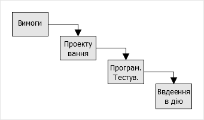
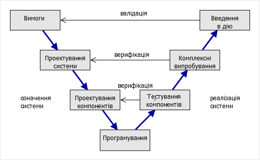
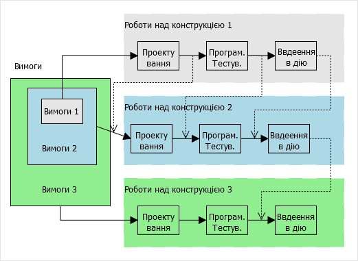
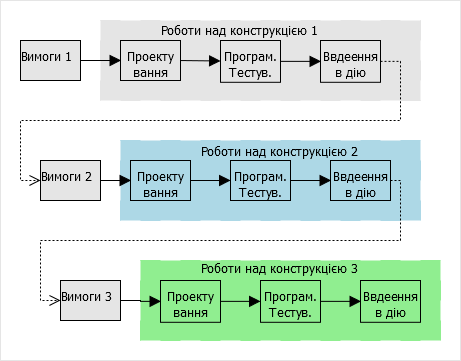
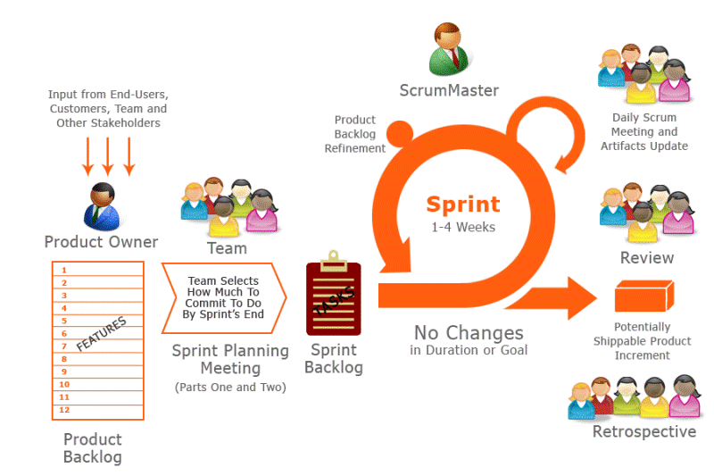
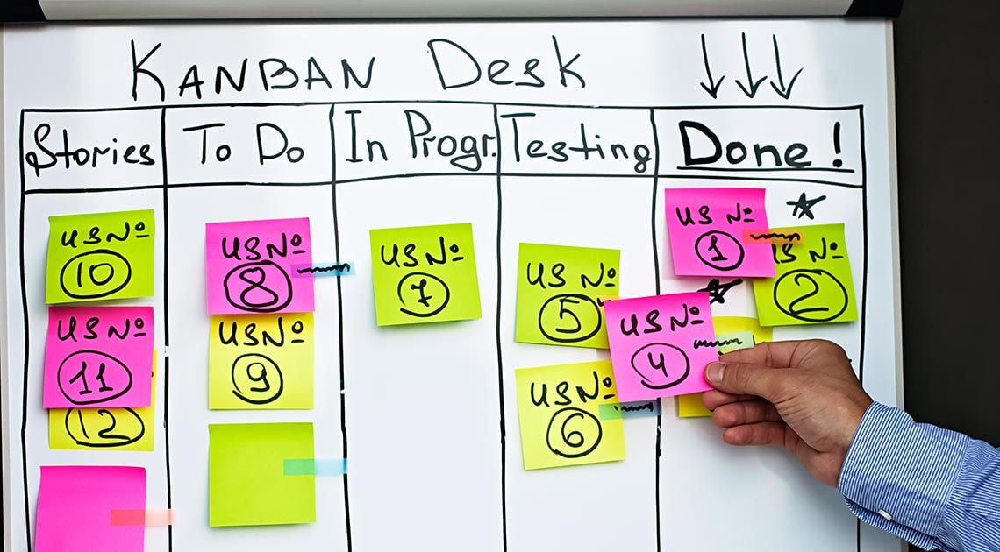

**Програмна інженерія в системах управління. Лекції.** Автор і лектор: Олександр Пупена 

| [<- до лекцій](README.md) | [на основну сторінку курсу](../README.md) |
| ------------------------- | ----------------------------------------- |
|                           |                                           |

# 17. Моделі життєвого циклу

## 17.1. Життєвий цикл систем

Для кращого розуміння керування життєвими циклами систем та ПЗ коротко зупинимося на основах системної інженерії.  Розглянемо систему з точки зору стандарту ДСТУ ISO/IEC 15288 "Інформаційні технології. Системна інженерія. Процеси життєвого циклу системи". 

***Система*** (system) - це комбінація взаємодіючих елементів, організованих для досягнення однієї або декількох поставлених цілей. Сприйняття та означення конкретної системи, її архітектури та системних елементів залежить від інтересів і обов'язків спостерігача. Умовна особа (людина або організація) яка має певний інтерес до системи називається ***зацікавленою особою*** (***stakeholder***).  Виділена при цьому система називається ***цільовою системою*** (***system-of-interest***). Роль інших систем в зовнішньому світі відносно цільової системи можуть бути також уточнені: забезпечуючи система, система в середовищі функціонування (які взаємодіють з цільовою).

  ***Забезпечуючими системами (еnabling system***) називають системи, які забезпечують створення, розвиток, функціонування і утилізацію цільової системи протягом її життєвого циклу. Такими системами можуть бути, наприклад, системи  проектування, для виробництва складових цільової системи, з навчання, з обслуговування цільової системи і т.д. Поняття забезпечуючої системи тісно зв’язано з життєвим циклом цільової системи. До забезпечуючих систем можна також віднести організації, які приймають участь в життєвому циклі забезпечуючої системи.   

Таким чином, серед усієї купи систем (або ПЗ), та, яку ви розглядаєте в даний момент називається цільовою, а усі ніші які з нею взаємодіють - системи в навколишньому середовищі. При цьому ту організацію, яка розробляє цю систему, або супроводжує, або налагоджує називають забезпечуючою.      

Відповідно до ISO/IEC/IEEE 15288:2015, ***життєвий цикл*** (***ЖЦ***, life cycle) – це розвиток системи, продукції, послуги, проекту або іншої, створюваної людиною ***сутності*** від задумки до списання. Життєвий цикл (ЖЦ) систем, у тому числі програмних, включає в себе усі стадії від виникнення потреби в системі певного цільового призначення до повного завершення її використання, у зв’язку з моральним старінням або за втрати необхідності. 

Як вже було сказано вище, у життєвому циклі будь якої системи приймають участь багато інших систем. Деякі організації, як забзепечуючі системи, приймають участь тільки на певних відрізках часу життєвого циклу цільової системи. Тому для них роботи по просуванню цільової системи по життєвому циклу можуть початися пізніше і закінчитися раніше, ніж це відбувається в життєвому циклі цієї системи. Вони розглядають цю частину робіт і часу, як ***проект***, для якого виділяються ресурси, та час відповідно до вимог. Цей проект також описується в термінах життєвого циклу. Тому слід розуміти що життєвий цикл проекту та цільової системи - це різні життєві цикли, але взаємопов'язані між собою. Так, наприклад, розробка програмного забезпечення може цілком бути проектом, якщо там не передбачаються роботи по супроводженню та виведення з експлуатації.   

Життєвий цикл традиційно ділять на ***стадії***, кожна з яких розглядається як роботи над системою (наприклад ПЗ) , що приводять до зміни її стану. За результатами цих робіт з’являються якісь артефакти (документи, програми, системні компоненти тощо) і приймають якісь важливі рішення щодо інших стадій. Стадії відрізняються за характером робіт. Наприклад, стадія "проектування" зосереджена на розробці певного типу документації, за яким проводять реалізацію, а "введення в дію" - на самій реалізації. Поділ життєвого циклу системи на стадії залежить від її типу та прийнятих правилах в тих організаціях, що її розроблюють. У якості прикладу, життєвий цикл будь-якої системи можна розглядати як наступні стадії: 

- задум: формування основних вимог до системи; вигляд системи - технічні вимоги, технічне завдання, опис прототипу;
- проектування: розробка необхідної для реалізації системи документації; вигляд системи - проектна документація;
- розроблення і тестування: створення системи в її кінцевому вигляді з тестуванням; 
- введення в дію: впровадження реалізованої системи у її робочому середовищі, перевірка на відповідність до замовлення;
- експлуатація (включаючи підтримку): супроводження, внесення змін в систему; 
- утилізація (виведення з експлуатації): роботи по знищенню системи.

Наприклад, якщо необхідно написати якийсь програмний застосунок, спочатку обдумують яким він повинен бути і формують певний набір функціональних та інших вимог. Потім за цими вимогами роблять якісь схеми та описи, розділяють роботу на невеликі частини (модулі, функції) для яких прописують правила та інтерфейси і т.п, тобто роблять проектування. Потім пишуть код і тестують його у певних тестових середовищах. Звісно тестування проходить не відразу в середовищі, яким користується замовник. Після завершення усіх робіт, ПЗ розгортається (вводиться в дію) в його робочу середовищі, наприклад у замовника, де воно буде працювати. Під час функціонування, в ПЗ треба буде вносити зміни, робити оновлення, тощо - це стадія експлуатації. Коли замовнику вже не потрібно ПЗ, він його видаляє (утилізує).      

Слід відмітити, що часто розробники систем останню стадію не враховують, вважаючи що після введення в дію та гарантійного терміну експлуатації інше лежить на плечах кінцевого замовника. 

Стадії як правило йдуть послідовно в часі, хоч можуть перекриватися. У сучасних методологіях розробки ПЗ поділ на стадії є досить умовним, і відноситься більше не до часу проведення робіт, а характеру діяльностей, які там виконуються. Послідовність стадій та процесів залежить від обраної моделі життєвого циклу. 

## 17.2. Процеси життєвого циклу

***Модель життєвого циклу*** – структурна основа процесів і діяльностей, яка відноситься до життєвого циклу, що слугує в якості загального посилання для встановлення зв’язків та взаєморозуміння сторін. Процеси життєвого циклу для розробки систем описані в стандарті ДСТУ ISO/IEC/IEEE 15288:2016 а для програмного забезпечення в ISO/IEC12207.  

Стандарт ISO/IEC 15288 означує множину процесів, названих процесами життєвого циклу, за допомогою яких може бути змодельований життєвий цикл системи. Термін ***процес*** (process) взятий із ISO 9000 і значить сукупність взаємозв'язаних ресурсів і діяльностей, яка перетворює вхідні елементи у вихідні, задля досягнення певної цілі. Результатами процесу згідно [12] та [13] може бути ***продукт*** (product), послуга (service), інформація, ***артефакт*** (наприклад документи, схеми). 

Таким чином, **життєвий цикл системи є складною організацією процесів, які можуть виконуватися паралельно в часі, бути ітеративними (повторюються), рекурсивними (ініціюють запуск таких саме процесів на нижньому рівні) і мають залежні від часу характеристики**.     

Спосіб керування цими процесами означується прийнятою в організаціях методологією розробки. Під методологією розробки ПЗ (Software development methodology) розуміють сукупність методів, які використовуються для розробки програмного продукту. Методології часто включають загальний філософський підхід, означення життєвого циклу, передбачають набір практик, які будуть використовуватися та організацію робіт. Під практиками розуміються процеси, способи та технології для їх виконання. 

Основою методології є прийнята модель життєвого циклу проекту, яким займається організація. Нагадаємо, що проект може охоплювати певні стадії життєвого циклу системи. Серед великої кількості моделей життєвого циклу можна умовно виділити три фундаментальних: водоспадна (каскадна), інкрементна та еволюційна. Кожна з цих моделей може використовуватися самостійно або в комбінації з іншими. Варто відмітити, що це не єдина класифікація моделей життєвого циклу. 

Надалі розглянемо деякі з моделей, але не в контексті життєвих циклів систем а – програмних проектів, враховуючи, що стадії експлуатації та виведення з обслуговування не використовується. 

## 17.3. Водоспадна модель (Waterfall Model) 

***Водоспадна*** (каскадна) модель життєвого циклу передбачає, що всі процеси виконуються в межах певних стадій, виконання яких означено в часі. Весь цикл передбачає одноразове поступове проходження стадій від означення вимог до експлуатації. Для розробки ПЗ цю модель можна представити як на рис.17.1. Після кожної стадії приймаються важливі рішення (так звані gate) про перехід до іншої, після чого повернення назад не передбачається. Можливе паралельне виконання робіт (етапів) але в рамках однієї стадії.




Рис.17.1. Приклад каскадної моделі.

Типовим ЖЦ подібного плану є описаний в ГОСТ 34.601-90, який до недавнього часу діяв і в Україні. Водоспадна модель дуже зручна для розрахунку ресурсів, але в чистому вигляді мало коли здійснена. Вона має ряд недоліків:

- передбачається, що усі стадії виконуються ідеально, помилки на ранніх стадіях однозначно приводять до важких наслідків на наступних, які не можливо усунути не повернувшись назад;
- неможливо внести зміни у вимоги, які з'являються після стадії "Формування вимог", бо це суперечить послідовності стадійності;
- продукт (систему, ПЗ) можна використовувати тільки в кінці життєвого циклу проекту;
- потребують залучення певного виду ресурсу у великих кількостях тільки на певних етапах стадій.          

Водоспадну модель як правило використовують тоді, коли є великий досвід розробки подібних систем і напрацьовані практики. Вона популярна при розробці фізичних систем, в яких практично важко вносити зміни "в залізі", якщо вони не були передбачені на ранніх стадіях. Сьогодні цю модель використовують з певними модифікаціями, зокрема V-model. 

## 17.4. V-model 

Класична каскадна модель погано справляється з проблемами, що виникають на заключних стадіях життєвого циклу. Наслідком даних проблем стає зниження якості поставленого товару, причому часто не стільки з позицій якості виготовлення (наприклад, стабільності і безвідмовності роботи), а в частині відповідності очікувань замовника щодо вирішення його задач. Саме ця особливість підштовхувала практиків до модифікації каскадної моделі, з метою уникнення відриву рішень, виконаних на початкових стадіях аналізу і проектування від заключних стадій випробувань, впровадження та супроводу програмного продукту. Однією з таких модифікацій стала V-подібна модель життєвого циклу - ***V-model***. 

Назва моделі пішла від форми латинської букви V, яка показує форму лінії часу, що перегнута навпіл в точці, де стадії означення систем переходять в стадії реалізації та впровадження. Для програмних систем цю модель можна представити як на рис.17.2. У даному випадку час вважається логічним, тобто не по ходу виконання робіт, а по ходу проходження процесів, які використовуються.  Перелом потрібен для того, щоб показати суть верифікації і валідації: виготовлення частин та системи проводить перевірку через механізм верифікації (перевірки відповідності формальних вимог), а впровадження - через валідацію (задоволення вимог замовника). 

                                
 Рис.17.2.Приклад V-моделі

Враховуючи, що перевірка (тестування) передбачає більш чітку формалізацію вимог, які потрібно використовувати при верифікації та валідації, вияв та виправлення помилок проводиться на ранніх стадіях реалізації системи. Крім того, у результаті більш чіткого постановлення вимог, зменшується ступінь невизначеності на стадіях означення системи.     

## 17.5. Інкрементні моделі (Incremental Model) 

***Інкрементні*** моделі життєвого циклу передбачають заплановане нарощування продукту (конструкції). Життєвий цикл проекту починається з видачі повного набору вимог, після чого йде розробка першої конструкції по всім стадіям, яка реалізовує тільки частину з вимог (див.рис.17.3). Далі виконують роботи над іншою конструкцією, в якій реалізовують іншу частину вимог і т.д., поки буде не завершено створення задуманої системи, яка б задовольняла усім вимогам. Кожна конструкція включає реалізацію вимог попередньої і нових, таким чином нарощуючи свій функціонал.   




Рис.17.3. Інкрементна модель

Для кожної конструкції виконують необхідні процеси, роботи і завдання. Наприклад, аналіз вимог і створення архітектури можуть бути виконані відразу для всіх конструкцій, тоді як розробку технічного проекту програмного засобу, його програмування і тестування, введення в дію (розгортання) і кваліфікаційні випробування (валідацію) виконують при створенні кожної з наступних конструкцій. 

У даній моделі при розробленні кожної конструкції, роботи і задачі процесів виконують послідовно, або частково паралельно з перекриттям. Тобто, роботи над різними конструкціями можуть виконуватися паралельно, при цьому вихідна інформація якихось процесів розроблення для однієї конструкції може виконуватися як вхідна для іншої (на рис.17.3 показано пунктирними лініями). 

Процеси супроводу та експлуатації можуть бути реалізовані паралельно з процесом розроблення. Процеси замовлення і постачання, а також допоміжні і організаційні процеси зазвичай виконують паралельно з процесом розроблення.

Серед переваг інкрементної моделі можна виділити:

- чітке розуміння усіх вимог на усіх ітераціях, оскільки вони не змінюються;
- придатність для використання проміжного продукту (конструкції) за короткий час;
- природний поділ системи на нарощувані компоненти (інкремент);
- можливості виділення ресурсів на кожній ітерації за необхідності;
- простіше навчання персоналу;
- можливість внесення невеликих змін та виправлення помилок в уже працюючу систему на наступних ітераціях.

З іншого боку, чітке означення усіх вимог та можливостей, які передбачає модель, не дає можливості вносити в них зміни.  

Одним із видів інкрементальних моделей можна виділити RAD, в якій вимоги реалізовуються паралельно кількома командами розробників після чого відбувається їх інтеграція.  


## 17.6. Еволюційні моделі (Iterative Model)

У ***еволюційних*** (ітеративних, Iterative) моделях систему також розробляють у вигляді окремих конструкцій, але на відміну від інкрементних, вимоги означуються на кожній ітерації. Тобто на початковій ітерації формують тільки частину вимог, які відомі на той час. Після розробки конструкції, яка задовольняє цим вимогам, повертаються знову до етапу означення вимог для нової конструкції, і т.д. Графічно ця модель для ПЗ представлена на рис.17.4.     




Рис.17.4  Еволюційна модель. 

При такому методі для кожної інструкції роботи і задачі процесу розробки виконують послідовно або паралельно з частковим перекриванням. 

Серед переваг використання даної моделі модна навести наступні:

- придатність для використання проміжного продукту за короткий час;
- можливості виділення ресурсів на кожній ітерації за необхідності;
- простіше навчання персоналу;
- задіяння замовника у формування вимог перед кожною ітерацією;
- можливість внесення змін при зміні в технологіях;
- можливість внесення невеликих змін та виправлення помилок в уже працюючу систему на наступних ітераціях.

Серед можливих недоліків можна назвати підвищені вимоги до замовника, що передбачає постійне задіяння його в процесах. Крім того, не маючи повний перелік вимог практично не можливо розрахувати необхідний часу розробки всього проекту та необхідних для цього ресурсів (час, бюджету).   

Один із видів еволюційної моделі є ***спіральна***. У ній після кожної ітерації (витка спіралі) проводиться аналіз ризиків для створення нової конструкції. Тобто на кожній ітерації проводиться аналіз і приймається рішення, чи варто взагалі робити наступний виток (ітерацію). Для аналізу ризиків може використовуватися модель (прототип).     

## 17.7. Методології розробки Agile

На сьогоднішній день для більшості невеликих ІТ-компаній характерне використання неформальних методологій розробки ІТ-продуктів, що відомі під загальною назвою ***Agile development*** або «гнучкі методи розробки». Вони базуються на так званому «Маніфесту Agile», який звучить так:

- люди і взаємодія важливіше процесів та інструментів;

- працюючий продукт важливіше за вичерпну документацію;

- співпраця з замовником важливіше узгодження умов контракту;

- готовність до змін важливіше проходження за попереднім планом;


Даний маніфест розкривається в наступних принципах:

1. Найвищим пріоритетом є задоволення потреб замовника, завдяки регулярному і ранньому постачанню готового програмного забезпечення.

2. Зміна вимог вітається, навіть на пізніх стадіях розробки.
3. Agile-процеси дозволяють використовувати зміни для забезпечення замовнику конкурентної переваги.

4. Працюючий продукт слід випускати якомога частіше (з періодичністю від кількох тижнів до кількох місяців).

5. Працюючий продукт - основний показник прогресу.

6. Протягом всього проекту розробники і представники бізнесу повинні щодня працювати разом.

7. Над проектом повинні працювати мотивовані професіонали.

8. Щоб робота була зроблена, необхідно створити для професіоналів умови, забезпечити підтримку і повністю довіритися їм.

9. Безпосереднє спілкування є найбільш практичним і ефективним способом обміну інформацією як з самою командою, так і всередині команди.

10. Інвестори, розробники і користувачі повинні мати можливість підтримувати постійний ритм нескінченно. Agile допомагає налагодити такий стійкий процес розробки.

11. Постійна увага до технічної досконалості і якості проектування підвищує гнучкість проекту.

12. Простота - мистецтво мінімізації зайвого клопоту - вкрай необхідна.

13. Найкращі вимоги, архітектурні та технічні рішення народжуються у самоорганізованих командах.

14. Команда повинна систематично аналізувати можливі способи поліпшення ефективності і відповідно коригувати стиль своєї роботи.


У випадку Agile складно говорити про проходженні компанією будь-якої певної моделі ЖЦ розробки ПЗ. Хоча, по суті, така розробка потрапляє в клас еволюційних моделей, що характеризуються розробкою продукту в ході декількох ітерацій, де безперервно і паралельно йдуть процеси аналізу і коригування результатів роботи.

Серед ризиків може бути створений у результаті постійної взаємодії всіх учасників хаос, що  впливає на всі сфери розробки. Тому використовуючи Agile потрібно  розуміти обмеження: команди повинні бути невеликі, учасники повинні бути компетентні та мотивовані, ітерації короткі з максимально зрозумілими  цілями, встановлені чіткі обмеження за часом і кінцевий результат  повинен бути очевидним. 

Боротьба з невизначеністю проходить шляхом планування на короткі періоди. Правило таке: чим вища невизначеність - тим коротша ітерація. На початку кожної ітерації  неминуче виконується контроль, ретроспектива, оцінка та аналіз  результатів, планування наступної ітерації.

До Agile відносять ряд практик, підходів і методологій, у тому числі Scrum - каркас для керування проектами та Kanban - метод керування розробкою .

Останнім часом найбільш відомим і популярним методом такої "швидкої" розробки є методологія ***Scrum***. Творці методології відзначають, що ключовим принципом Scrum є прийняття розробником факту можливості змін вимог замовника в ході роботи, зміни його розуміння цілей проекту в ході його виконання. Тому в даній методології, замість занурення в розуміння проблеми замовника на початкових стадіях, що виконує проект команда фокусується на можливостях надати продукт або, як мінімум його частини, як можна швидше, а потім терміново відреагувати на знову з'явилися (уточнені) вимоги.

На відміну від основних моделей життєвого циклу розробки ПЗ, методологія Scrum не наказує певну послідовність розробки продукту і не означує склад робіт. Замість цього дана методологія жорстко фіксує час ітерації («спринту»), за яке повинні бути отримані конкретні результати, так званий «інкремент продукту» (Potentially shippable increments, PSIs). При цьому склад необхідних компонентів і функціональності «інкремент продукту» означується командою безпосередньо перед початком «спринту», за допомогою інструменту, званого «беглог проекту» - переліку вимог, що підтримує їх пріоритизації за важливістю для стейкхолдерів проекту. Самі вимоги до продукту записуються у вигляді «користувацьких історій» (User stories) - спеціального шаблону, який застосовується і в інших методологіях Agile:

```
Як <роль> я хочу <мета/дія>, щоб отримати <цінність>
```

Методологія Scrum має на увазі повторення «спринтів» до того, поки всі вимоги, описані в «беглозі проекту», не будуть реалізовані в продукт що поставляється.

В Методології Scrum існують три ключових ролі:

1. Власник продукту (Product owner) - це людина, яка представляє в проекті зацікавлених осіб (Stakeholders). Він висловлює команді вимоги і побажання замовника і саме він здійснює документування вимог до майбутнього продукту.

2. Команда розробників (Scrum Team) - це система, що самоорганізується з групи осіб, відповідальних за розробку і постачання інкрементів продукту до кінця кожного завершення ітерації розробки - спринту.

3. Скрам майстер (Scrum master) - це людина, відповідальна за усунення перешкод для можливостей команди виконати завдання в строк. При цьому Скрам майстер не є керівником команди/проекту, в традиційному розумінні функції керівництва, але в той же час є буфером між командою і її зовнішнім оточенням.


Графічно методологія Scrum представлена на рис.17.5.

 


 Рис.17.5 Методологія Scrum

Метод ***Kanban*** передбачає керування роботами за допомогою віртуальної дошки, яка розбита на колонки, що вказує на стан виконання певного завдання. При необхідності виконання завдання, воно виставляється  у ліву колонку. Потім виконавець, або відповідальна особа по мірі виконання завдання переносить його з колонки в колонку, поки воно не досягне правої крайньої колонки, що буде вказувати на завершення виконання завдання.   



рис.17.6. Керування роботами з використанням методу  Kanban 

Для успішної реалізації Kanban рекомендується користуватися практиками:

1. Візуалізуйте. Візуалізація процесів роботи допомагає в правильному розумінні змін, що плануються і допомагає впроваджувати їх згідно з планом. Типовим способом візуалізувати процес роботи є використання дошки з колонками і картками. Колонки на дошці позначають різні кроки процесу роботи.

2. Обмежуйте задачі в процесі виконання. Використовується система «витягування» на частинах, або всьому процесі роботи. Враховується, що робота, котра перебуває в стані виконання на кожному кроці робочого процесу (колонці), є обмеженою, і що нова робота «витягується» на крок, коли з'являється місце в колонці кроку.

3. Керуйте потоком. Кожен перехід між станами в потоці моніториться, вимірюється і звітується. Активне керування потоком дозволяє оцінити позитивні та негативні ефекти змін у системі.

4. Зробіть політики явними. Поки механізм чи процес не стане явним, часто важко чи неможливо здійснювати обговорення щодо його вдосконалення. Без явного розуміння, як все працює, будь-які обговорення проблем стають емоційними та суб'єктивними. З явним розумінням можливо перейти до більш раціональних, емпіричних та об'єктивних обговорень проблем.

5. Створіть цикли зворотного зв'язку. Організації що не створили другий рівень зворотнього зв'язку — перегляд операцій, — зазвичай не бачать вдосконалення процесу поза локалізованим рівнем команди.

6. Вдосконалюйте співпрацюючи, розвивайтесь експериментально (використовуючи моделі та науковий метод. Метод Канбан пропагує малі поступові, постійні та еволюційні зміни які приживаються. Коли команди мають спільне розуміння теорій про роботу, процес, ризики, вони більш ймовірно будуть здатними виробити спільне розуміння проблем та запропонувати вдосконалення які будуть результатом консенсусу.

Kanban може використовуватися для керування будь-якими роботами, а не тільки розробкою систем чи ПЗ. Є багато безкоштовних, або частково-безкоштовних застосунків, з інтуїтивно зрозумілим інтерфейсом, наприклад Trello (https://trello.com). 

## Запитання для самоперевірки

1. Що таке життєвий цикл? 
2. Чим ЖЦ проекта відрізняється від ЖЦ системи? 
3. Що таке процеси ЖЦ?
4. Опишіть водоспадну модель ЖЦ, назвіть її переваги та недоліки.
5. Опишіть V-модель ЖЦ, назвіть її переваги порівняно з водоспадною.
6. Опишіть інкрементні моделі ЖЦ, назвіть їх переваги та недоліки.
7. Опишіть еволюційні моделі ЖЦ, назвіть її переваги та недоліки.
8. Опишіть методології розробки Agile.
9. Опишіть методологію Scrum.
10. Розкажіть про керування роботами з використанням методу Kanban. 

| [<- до лекцій](README.md) | [на основну сторінку курсу](../README.md) |
| ------------------------- | ----------------------------------------- |
|                           |                                           |