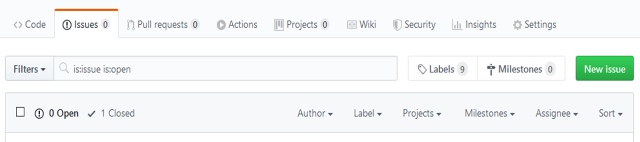
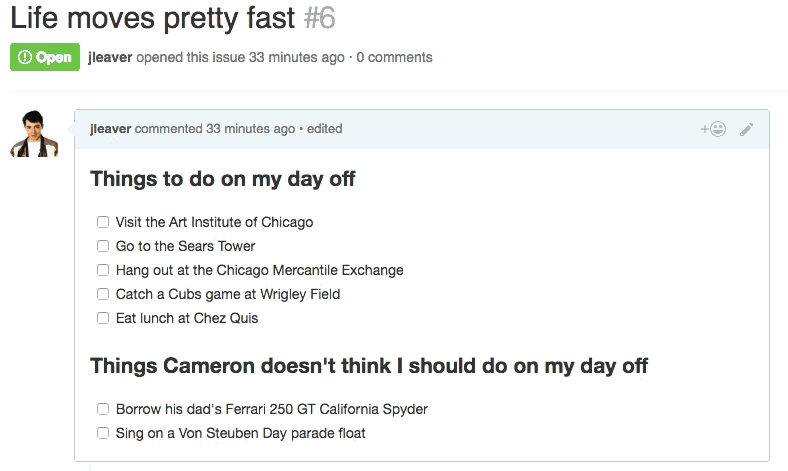

**Програмна інженерія в системах управління. Лекції.** Автор і лектор: Олександр Пупена 

| [<- до лекцій](README.md) | [на основну сторінку курсу](../README.md) |
| ------------------------- | ----------------------------------------- |
|                           |                                           |

# 18. Організація роботи в GitHub

## 18.1. Організація роботи з використанням обговорення питань (issues)

Для відстеження ідей, удосконалень, завдань або помилок при роботі в GitHub можна використовувати  **Питання для обговорення ([issues](https://help.github.com/en/github/managing-your-work-on-github/about-issues)**). Це має форму своєрідного форуму репозиторію. У якості мови форматування використовується MarkDown. 

Можна збирати відгуки користувачів, повідомляти про помилки в програмному забезпеченні та впорядковувати завдання, які необхідно виконати відповідно до обговорюваного питання у сховищі. Питання для обговорень можуть виступати більше ніж просто в якості місця для повідомлення про помилки в програмному забезпеченні. Можна пов’язати запит на пул із питанням, щоб показати, що виправлення триває, і автоматично закрити питання, коли хтось підтверджує або закриває запит на пул. 

Щоб бути в курсі останніх коментарів щодо обговорюваного питання, можна підписатися для отримування сповіщення про останні коментарі. Щоб швидко знайти посилання на нещодавно оновлені питання, на які ви підписалися, відвідайте інформаційну панель (dashboard). 

Використовуючи обговорення питань можна:

- відстежити та розставляти пріоритети своєї роботи, використовуючи дошки проектів (`project boards`). 
- створювати нові питання для обговорення для відстеження зворотного зв'язку з коментарями до питання або розгляду запиту на пул. 
- створювати шаблони питань, щоб допомогти авторам ставити змістовні питання для обговорень. 
- передавати відкриті питання до інших сховищ. 
- закріплювати важливі питання, щоб полегшити їх пошук, запобігаючи повторним створенням питань та зменшуючи рівень шуму. 
- відстежувати дублікати питань, використовуючи збережені відповіді. 
- повідомляти про коментарі, що порушують [Керівні принципи спільноти GitHub](https://help.github.com/en/articles/github-community-guidelines). 

Питання також можуть бути [присвоєні іншим користувачам](https://help.github.com/en/articles/assigning-isissue-and-pull-requests-to-other-github-users), [позначені мітками](https://help.github.com/en/articles/applying-labels-to-isissue-and-pull-requests) для швидшого пошуку та [згруповані разом за віхами](https://help.github.com / uk / статті / створення-та-редагування важливих етапів-для-питань-і-тягнути-запити).

У публічному сховищі будь який користувач може створити питання для обговорення, якщо це не заборонено налаштуваннями. Можна створити питання із існуючого запиту на пул, або безпосередньо з коментарю в обговоренні іншого питання або запиту на пул.  При використанні для відстеження та пріоритизації робіт проектних дошок, питання для обговорення можна перетворювати з нотаток на дошках. 

рис.18.1. Вигляд вікна issues

Використовуючи формат MarkDown можна створювати списки завдань як набір опцій в коментарях до обговорень питань та запитів на пул. Користувачі будуть вибирати опції простим вибором мишою.  У списку питань для обговорень та запитів на пул відображатимуться прогрес виконання завдань (помічених опцією).

Можна також змінювати послідовність опцій звичайним перетягуванням. 

Про використання проектів можна прочитати за [цим посиланням](https://docs.github.com/en/issues).

## 18.2. Робота з сайтами GitHub Pages

 З репозиторію GitHub можна безпосередньо створювати [вебсайти](https://help.github.com/en/github/working-with-github-pages) як для нових, так і для існуючих сховищ. Це дає наступні можливості:

- Сайти підтримують теми для кастомізації виглядів сторінок. 
- Якщо для свого сайту ви використовуєте джерело публікації GitHub Pages за замовчуванням, ваш сайт публікується автоматично. Ви також можете опублікувати сайт свого проекту з іншої гілки чи папки. 
- Можна використовувати налаштовувані сторінки помилки 404 (сторінка не знайдена).
- Можна змусити використовувати на Ваших сторінках тільки HTTPS-запити.
- Можна використовувати підмодулі з GitHub Pages для включення інших проектів у свій код сайту.
- Можна скасувати публікацію свого сайту GitHub Pages, щоб сайт більше не був публічно доступний.

GitHub Pages - статична служба розміщення веб-сайтів, яка приймає файли HTML, CSS та JavaScript прямо зі сховища на GitHub, за бажанням запускає файли через процес збирання та публікує веб-сайт. Ви можете побачити приклади сайтів GitHub Pages у колекції [приклади сторінок GitHub](https://github.com/collections/github-pages-examples).

Ви можете розмістити свій сайт на домені GitHub `github.io` або на власному власному домені. Для отримання додаткової інформації див. "[Використання користувацького домену зі сторінками GitHub](https://help.github.com/en/articles/using-a-custom-domain-with-github-pages)."

Існує три типи сайтів GitHub Pages: проектний, користувацький та організації. Сайти проекту підключені до конкретного проекту, розміщеного на GitHub, наприклад, бібліотеки JavaScript або колекції рецептів. Веб-сайти користувачів та організацій підключені до конкретного облікового запису GitHub.

Щоб опублікувати сайт користувача (тільки один сайт на користувача), ви повинні створити сховище (що належить вашому обліковому запису користувача) з назвою `<user>.github.io`. Щоб опублікувати сайт організації (тільки один сайт на організацію), ви повинні створити сховище (що належить організації) з назвою `<organization>.github.io`. Якщо ви не використовуєте користувацький домен, веб-сайти користувачів та організацій доступні на веб-сторінці `http(s)://<username>.github.io` або ` http(s)://<organization>.github.io`.

Вихідні файли для сайту проекту зберігаються в тому ж сховищі, що і їх проект. Якщо ви не використовуєте користувальницький домен, сайти проектів доступні за адресою `http(s)://<user>.github.io/<repository>` або `http(s)://<organization>.github.io/<repository>`.

Ресурсними даними публікації для вашого сайту GitHub Pages є гілка або папка, де зберігаються вихідні файли для вашого сайту. Усі сайти мають ресурсні дані публікації за замовчуванням, а сайти проектів мають додаткові ресурси публікації.

Сайти GitHub Pages доступні для всіх в Інтернеті, навіть якщо їх сховища є приватними або внутрішніми. Якщо у вас є конфіденційні дані у сховищі вашого сайту, ви можете видалити їх перед публікацією. Для отримання додаткової інформації див. "[Про видимість сховища](https://help.github.com/en/github/creating-cloning-and-archiving-repositories/about-repository-visibility)."

Джерелом публікації за замовчуванням для сайтів користувачів та організацій є гілка `master`. Якщо у сховищі для вашого користувача або на сайті організації є гілка `master`, ваш сайт автоматично публікується з цієї гілки. Ви не можете вибрати інше джерело публікації для сайтів користувачів або організації.

Джерелом публікації за замовчуванням для сайту проекту є гілки `gh-pages`. Якщо у сховищі для вашого проекту веб-сайту є гілка `gh-pages`, ваш сайт автоматично публікується з цієї гілки. Сайти проекту також можуть бути опубліковані з гілки `master` або з папки ` /docs` на гілці `master`. Щоб опублікувати свій сайт з одного з цих джерел, потрібно налаштувати інше джерело публікації. Для отримання додаткової інформації див. "[Налаштування джерела публікації для вашого веб-сайту GitHub](https://help.github.com/en/articles/configuring-a-publishing-source-for-your-github-pages-site# вибір-публікація-джерело)."

рис.18.2. Налаштування публікації.

Якщо ви вибрали папку `/docs` гілки `master` як джерело публікації, GitHub Pages прочитає все, щоб опублікувати ваш сайт, включаючи файл *CNAME*, із папки `/docs`. Наприклад, коли ви редагуєте власний домен через налаштування GitHub Pages, користувацький домен буде записаний в `/docs/CNAME`. Щоб отримати додаткові відомості про файли *CNAME*, див. "[Managing a custom domain for your GitHub Pages site](https://help.github.com/en/articles/managing-a-custom-domain-for-your-github-pages-site). "

Ви не можете публікувати свій сайт проекту у будь-якій іншій гілці, навіть якщо гілка за замовчуванням не є  `master`  або `gh-pages`.

GitHub Pages публікує будь-які статичні файли, які Ви завантажуєте до Вашого сховища. Ви можете створювати власні статичні файли або використовувати генератор статичних сайтів для їх створення. Ви також можете налаштувати свій власний процес збирання (build) локально або на іншому сервері. Ми рекомендуємо статичний генератор сайту **Jekyll** із вбудованою підтримкою GitHub Pages і спрощеним процесом збирання. Для отримання додаткової інформації див. [About GitHub Pages and Jekyll](https://help.github.com/en/articles/about-github-pages-and-jekyll).

GitHub Pages використовуватимуть **Jekyll** для створення вашого сайту за замовчуванням. Якщо ви хочете використовувати генератор статичного сайту, відмінний від Jekyll, відключіть процес збирання Jekyll, створивши порожній файл під назвою `.nojekyll` у корені вашого джерела публікації, а потім дотримуйтесь інструкцій генератора статичних веб-сайтів щодо створення свого сайту локально.

GitHub Pages не підтримує серверні мови типу PHP, Ruby, або Python.

Є наступні обмеження за обємом:

- GitHub Pages ресурси репозиторію рекомендується обмежувати до 1GB. 
- Публіковані сайти GitHub Pages можуть бути не більше ніж 1 GB.
- Сайти GitHub Pages  мають межу пропускної здатності до 100 Гб на місяць 
- Сайти GitHub Pages мають обмеження 10 збирань (builds) на годину.

Якщо ваш сайт перевищує ці квоти використання, GitHub не буде обслуговувати ваш сайт. Або ви можете отримати ввічливий електронний лист від GitHub Support, що пропонує стратегії зменшення впливу вашого сайту на сервери GitHub , включаючи розміщення сторонньої мережі розповсюдження контенту (CDN) перед вашим сайтом, використання інших функцій GitHub, таких як релізи, або перехід до іншої послуги хостингу, яка може краще відповідати вашим потребам.

Про додаткові правила та обмеження читайте на  [Prohibited uses](https://help.github.com/en/github/working-with-github-pages/about-github-pages#prohibited-uses).

## Запитання для самоперевірки

1. Розкажіть про основні можливості issues.
2. Як відбувається інтеграція з pull requets і проектами?
3. Які можливості надає GitHub Pages?
4. Як опублікувати сайт на основі репозиторію з використанням GitHub Pages?
5. Як створити власну сторінку з використанням GitHub Pages?

| [<- до лекцій](README.md) | [на основну сторінку курсу](../README.md) |
| ------------------------- | ----------------------------------------- |
|                           |                                           |