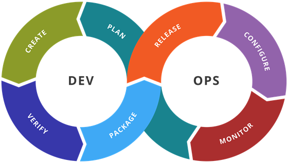
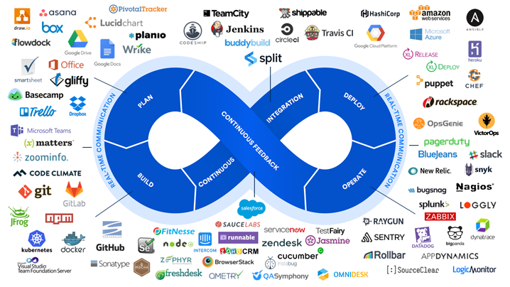
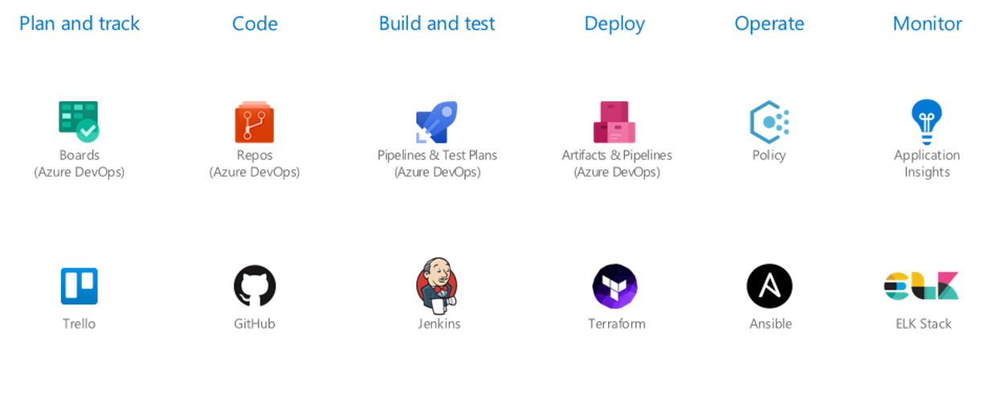

**Програмна інженерія в системах управління. Лекції.** Автор і лектор: Олександр Пупена 

| [<- до лекцій](README.md) | [на основну сторінку курсу](../README.md) |
| ------------------------- | ----------------------------------------- |
|                           |                                           |

# 19.Вступ до Devops

## 19.1. Ідеологія та практики DevOps 

**DevOps** – сукупність практик, що поєднують процеси розробки (Dev) та експлуатації (Ops), що спрямовані на скорочення часу між фіксацією змін в системі та впровадженням цих змін у виробництво, забезпечуючи високу якість продукту, в нашому випадку систем IoT в цілому або програмної частини. Тобто, мета DevOps - скоротити етапи розробки в життєвому циклі та забезпечити гнучку співпрацю між різними командами. Методологія DevOps добре зарекомендувала себе в ІТ галузі. Процес розробки системи зі застосуванням практик DevOps може виглядати таким чином: формування вимог - ТЗ - розробка - введення в дію - отримання метрик роботи - формування вимог - і знову цикл повторюється. Таким чином нові вимоги добре простежуються, а метрики інтегруються до суміжних рівнів. 

Створення міцного фундаменту, необхідного для впровадження ефективних devops-методів, потребує розуміння його ключових термінів і поняття. Протягом всієї історії обчислювальної техніки був описаний ряд методологій, що застосовуються для поліпшення і полегшення розробки або експлуатації програмного забезпечення. У кожній методології передбачається розбиття роботи на етапи, кожна з яких являє собою окремий набір дій. Для багатьох методологій типовим є розділення процесу розробки від експлуатації, що призводить до конфлікту цілей у різних команд. Крім цього, якщо змушувати членів інших команд слідувати тим чи іншим методологіям, які не відповідають використовуваним в цих командах процесам і ідеям, це може привести до невдоволення і розчарування. Знання особливостей і переваг різних методологій допоможе поліпшити розуміння суті проблем що виникають і зменшить непорозуміння між членами команди. 

Моделі життєвих циклів а також методології розробки розглядалися у попередній лекції.  

Практики DevOps відображають ідею постійного вдосконалення та автоматизації. Більшість практик фокусуються на одній або декількох етапах циклу розвитку. 



Рис. 19.1. Етапи життєвого циклу DevOps

**Безперервна розробка** 
 Ця практика охоплює фази планування та кодування життєвого циклу DevOps. Для реалізації можуть бути задіяні механізми керування версіями, наприклад Git.

**Безперервне тестування** 
Ця практика включає автоматизовані, заздалегідь заплановані, постійні тести коду під час його написання або оновлення коду програми. Такі тести можуть пришвидшити доставку коду до виробництва. 

**Безперервна інтеграція**
Ця практика поєднує інструменти управління конфігурацією разом з іншими інструментами тестування та розробки для відстеження того, наскільки розроблений код готовий до виробництва. Це передбачає швидкий зворотній зв'язок між тестуванням та розробкою для своєчасного виявлення та вирішення проблем із кодом. 

Безперервна інтеграція (Continuous Integration; CI) - це процес інтегрування нового коду, написаного розробниками, в основний код або гілку «майстер», який здійснюється протягом робочого дня. Цей підхід відрізняється від методики, відповідно до якої розробники працюють з незалежними гілками тижнями або місяцями, виконуючи злиття коду в основну гілку тільки після повного завершення роботи над проектом. Тривалі періоди часу між злиттями призводять до того, що в код вноситься дуже багато змін, що підвищує ймовірність появи помилок. При роботі з великими пакетами змін набагато важче ізолювати і ідентифікувати фрагмент коду, який викликав збій. Якщо ж використовуються невеликі набори змін, для яких часто виконується злиття, пошук помилок значно спрощується. Ідея полягає в тому щоб прагнути уникнути проблем, пов'язаних з інтеграцією, які неминуче з'являться при злитті великих наборів змін.

У системах безперервної інтеграції після завершення злиття нових змін зазвичай автоматично виконується набір тестів. Ці тести виконуються після фіксації змін і завершення злиття. Це дозволяє уникнути накладних витрат, пов'язаних з використанням ручної праці тестерів. Чим більше додаткових витрат вимагає виконувана дія, тим менша ймовірність, що вона буде виконана, особливо в разі нестачі часу. Результати виконання цих тестів часто візуалізують. Якщо результати виділені зеленим кольором, значить, тест завершився успішно, а тільки що інтегрований програмний реліз не містить помилок. Провальні або «червоні» тести означають, що реліз містить помилки і повинен бути виправлений. Завдяки використанню цього робочого потоку ідентифікація і усунення проблем здійснюються набагато швидше.

**Безперервна доставка**
Методологія безперервної доставки (Continuous Delivery) ця практика являє собою набір загальних принципів з розробки програмного забезпечення, які дозволяють часто створювати нові релізи програмного забезпечення із залученням автоматизованого тестування і безперервної інтеграції, автоматизує доставку змін коду після тестування до передвиробничого або проміжного середовища. Співробітник може прийняти рішення дозволити ці зміни або відхилити. Це дозволяє переконатися в тому, що нові зміни можуть бути інтегровані без звернення до автоматичних тестів. У разі безперервної доставки забезпечується розгортання змін.

**Безперервне розгортання**
Безперервне розгортання (Continuous deployment; CD) подібно до постійної доставки, ця практика автоматизує випуск нового або зміненого коду у виробництво. Компанія, яка здійснює постійне розгортання, може випускати зміни коду або функції кілька разів на день. Використання контейнерних технологій, таких як Docker та Kubernetes може забезпечити постійне розгортання, допомагаючи підтримувати узгодженість коду на різних платформах та середовищах розгортання. У той час як безперервна доставка дозволяє гарантувати розгортання нових змін, безперервне розгортання означає, що виконується розгортання змін у виробничому циклі.

Чим швидше зміни програмного забезпечення впроваджуються у виробництво, тим швидше співробітники побачать результати своєї роботи. Завдяки «прозорості» зростає ступінь задоволеності роботою, з'являються позитивні емоції, що, в свою чергу, сприяє зростанню продуктивності. Також з'являються можливості для швидкого навчання. Якщо в коді функції або в дизайні програми допущена серйозна помилка, її легше виявити і виправити шляхом перегляду недавно зміненого робочого контенту.

**Безперервний моніторинг**
Ця практика передбачає постійний моніторинг як діючого коду, так і базової інфраструктури, яка його підтримує. Цикл зворотного зв'язку, який повідомляє про помилки або проблеми повертається до розробки.

**Інфраструктура як код**
Цю практику можна використовувати на різних етапах DevOps для автоматизації створення інфраструктури, необхідної для випуску програмного забезпечення шляхом написання коду. Цей спосіб виключає необхідність ручного конфігурування і оновлення для окремих компонентів обладнання, інфраструктура стає більш "гнучкою" в налаштуванні та масштабуванні. Ця практика також дозволяє операційним групам контролювати конфігурації середовища, відстежувати зміни та спрощувати повернення до попередніх конфігурацій. Прикладами таких практик є інструменти Ansible та Terraform.

## 19.2. Методи devops

Методи devops визначені не настільки жорстко, як методології, засновані на заборонах. Спочатку ідеї devops з'явилися серед практиків, які були прихильниками гнучкого системного адміністрування і кооперації між командами розробників і експлуатації. Особливості застосовуваної при цьому практики залежали від середовища. 

Процес розбиття діяльності по розробці ПЗ на окремі етапи називається методологією розробки програмного забезпечення. Зазвичай виділяються наступні етапи:

- специфікація кінцевих результатів роботи або артефактів;
- розробка та верифікація коду відповідно до специфікації;
- розгортання коду у фінальному споживацькому або виробничому середовищі.

Впровадження ефективних devops-методик ґрунтується на наступних чотирьох стовпах:

- співпраця;
- близькість;
- інструменти;
- масштабування.

Співпраця - це процес досягнення поставленої мети з допомогою взаємодії між декількома людьми. Керівним принципом руху devops стала кооперація між командами по розробці та експлуатації програмного забезпечення. Перш ніж організувати успішну взаємодію між командами, що мають різні цілі, потрібно налагодити групову роботу в одній команді. Якщо в командах не налагоджена робота на індивідуальному і груповому рівні, взаємодія між командами не буде успішною.

Крім розвитку і підтримки відносин співробітництва між окремими людьми, групами і відділами всередині організації, важливі міцні взаємини в галузі. Близькість - це процес формування взаємовідносин між командами, що сприяє свободі вибору різних цілей або показників при збереженні загальних цілей організації. При цьому полегшується розвиток емпатії і навчання в різних групах. Близькість може проявлятися на рівні взаємин між організаціями, дозволяючи їм ділитися історіями і вчитися один у друга. В результаті створюється колективна база культурних і технічних знань.

Інструменти - це стимулятор змін, реалізованих на основі поточної культури і цілей. 
Необхідно правильно вибрати інструменти,  так як вони впливають на існуючі структури, щоб запобігти появі проблем в командах і організаціях, пов'язаних з цінностями, нормами і організаційної структурою. Якщо обрані інструменти (або їх відсутність) заважають працювати окремим співробітникам, ініціатива по впровадженню devops буде приречена на провал. І якщо ціна налагодження співробітництва і так висока, то відсутність інвестицій в інструменти (або інвестиції в погані інструменти) призведе до подальшого зростання ціни на продукт.

Масштабування концентрується на процесах і рушійній силі, які повинні використовувати організації протягом усього життєвого циклу. Це також дозволяє керувати іншими стовпами ефективних devops-методик на рівні організацій. Управління здійснюється в міру зростання, досягнення зрілості і навіть скорочення організацій. 

DevOps на відміну від водоспадної моделі застосовується в більш широких аспектах і зосереджений навколо: організаційних змін, зокрема при підтримці тісної співпраці між різними типами працівників що займаються поставками програмного забезпечення, а ці працівники є частиною циклу технічного процесу; розробників; операцій; гарантії якості; управління; системного адміністрування, обслуговування систем; адміністрування баз даних; координаторів; автоматизації процесів в поставці програмного забезпечення. 

## 19.3.  Інструменти DevOps 

Оскільки DevOps має на меті функціональний режим роботи, для його провадження на практиці використовують різні набори інструментів, які відповідають одній або декільком наступним категоріям:

- інструменти розробки і збірки (building)

- інструменти для автоматизації тестування

- інструменти для організації розгортання

- Runtime-інструменти

- інструменти для спільної роботи

Успішне і сплановане впровадження Devops-практик містить інструменти із всіх 5 груп.



Рис. 19.2. Інструменти DevOps

**Інструменти розробки і збірки (building)** - це основа стеку CI/CD-пайплайну, тому що тут починаються всі процеси. Кращі інструменти в цій категорії можуть керувати кількома потоками подій і легко інтегруватися з іншими продуктами.

На цьому етапі життєвого циклу розробки виділяють три групи інструментів:

- система управління версіями (SCM)
- безперервна інтеграція (CI)
- керування даними (Data management)

У 2020 р GIT зарекомендував себе з позитивного боку, тому SCM-інструмент повинен мати бездоганну підтримку для GIT. Для CI обов'язкова умова - здатність виконувати і запускати збірки в ізольованому контейнерному середовищі. Що стосується управління даними, тут потрібна можливість вносити зміни в схему бази даних і підтримувати бази даних відповідно до версії програми. GitHub та GitLab одні з популярніших інструментів розробки і збірки.

Інструменти для керування даними дозволяють створювати версії баз даних, відслідковувати міграції баз даних, легко переносити або повертати зміни схеми без використання додаткових інструментів. М

Піраміда тестування (тестів) має 4 рівня:

- Юніт-тести - Це основа всього процесу автоматизованого тестування. Юніт-тестів має бути більше в порівнянні з іншими видами тестів. Розробники пишуть і запускають юніт-тести, щоб переконатися, що частина програми (відома як «юніт») відповідає своїй конструкції і поводиться як належить. 

- Компонентні тести - Основна мета тестування компонента - перевірити поведінку введення/виведення об'єкта тестування. Допомагає переконатися, що функціональність тестового об'єкта реалізована правильно згідно специфікації. 

- Інтеграційні тести - Вид тестування, при якому окремі програмні модулі об'єднуються і тестуються як група. 

- Наскрізні тести - допомагає спостерігати за роботою всієї програми і зробити так, щоб все функціонувало, як було заплановано.

Серед прикладів інструментів для автоматизації тестування ПЗ можна виділити наступні. 

- Cucumber. Підходить для інтеграційного тестування. Об'єднує специфікації і тестову документацію в єдиний документ. Специфікації завжди актуальні, так як вони автоматично тестуються Cucumber. При потребі зібрати фреймворк для автоматизованого тестування з нуля і моделювати поведінку користувача в веб-застосунку, то Selenium WebDriver з Java і Cucumber BDD - відмінний спосіб вивчити і впровадити Cucumber в проекті.
- SoapUI Pro. Інструмент для наскрізного тестування. Функціональне тестування. 
- LoadRunner. Інструмент для наскрізного тестування. Дозволяє бути впевненим що новий код буде працювати в умовах екстремального навантаження. Підтримує велику кількість протоколів.

Інструменти для організації розгортання можна поділити на три підкатегорії:

- керування артефактами

- керування конфігураціями 

- розгортання

Серед прикладів інструментів для організації розгортання ПЗ можна виділити наступні. 

- Nexus. Репозиторій артефактів Nexus підтримує практично всі основні технології: від Java до NPM і Docker. Можливість використовувати цей інструмент для зберігання всіх використовуваних артефактів. Проксінг віддалених менеджерів пакунків також значно прискорює процес збірок CI, роблячи пакети доступніше для збірки. Інша перевага - можливість отримати повне уявлення про всі пакетах, які використовуються в декількох програмних проектах, блокуючи небезпечні open source пакети (що можуть виступати вектором атаки).
- Ansible. Інструмент для керування конфігураціями. При запуску, такий інструмент, отримавши бажану конфігурацію, буде намагатися виправити поточну конфігурацію програми. А при новому підході присутні тільки компоненти з відсутністю стану. Нові версії коду є артефактами, які розгортають для заміни існуючих. Це можна вважати певним ефемерним, короткостроковим оточенням.
- Terraform. Інструмент для розгортання. Terraform вирішує проблему опису вашої інфраструктури як коду: починаючи з мережевих компонентів і закінчуючи повноцінними образами сервера. Цей продукт пройшов довгий шлях з моменту першого випуску: створено величезну кількість плагінів і створено спільному, що точно буде в нагоді при будь-якому сценарії розгортання. Здатність підтримувати будь-який тип оточення (локально, в хмарі або десь ще) не має рівних. 

Кінцевою метою будь-якого проекту розробки є запуск програми на кінцевому пристрої (ях). У світі DevOps ми хочемо отримувати повну інформацію про всі можливі проблеми з середовищем, а також хочемо звести до мінімуму втручання вручну. Вибір правильного набору Runtime-інструментів вкрай важливий, щоб досягти перемоги при розробці програми.

Підкатегорії Runtime-інструментів:

- X-як сервіс (XaaS)

- оркестрація

- моніторинг

- логування

Серед прикладів Runtime-інструментів для ПЗ можна виділити наступні. 

- Amazon Web Services. 
- OpenShift. 
- New Reliс. 
- Splunk. 

Інструменти для спільної роботи можна поділити на підкатегорії:

- відслідковування задач

- ChatOps

- документування

Серед прикладів Інструментів для спільної роботи можна виділити наступні. 

- Jira. Інструмент відслідковування проблем та задач. Дозволяє командам розробки і супроводу управляти проектною роботою і завданнями спринту. Вбудовані стандарти, які використовують Agile-термінологію, спрощують перехід від традиційних методів роботи до більш ефективних процесів.
- Trello. Інструмент відслідковування проблем та задач. Сервіс користується методом Kanban.
- MatterMost. ChatOps інструмент. Для загального спілкування всередині компанії.
- Confluence. Інструмент для збереження технічної документації. Дозволяє створити внутрішній інтернет-портал і дати до нього доступ потрібним користувачам.

Також постачальники хмарних технологій використовують готові набори інструментів, так звані фреймворки. 

На Рис.19.3 приклад одного з них 



 Рис. 1.3 DevOps в Azure фреймворк

## 19.4. Основи YAML

[YAML](https://uk.wikipedia.org/wiki/YAML) — зручний для читання людиною формат серіалізаціі даних, концептуально близький до мов розмітки, але орієнтований на зручність введення-виведення типових структур даних багатьох мов програмування. YAML в основному використовується як формат для файлів конфігурації. 

- файли YAML мають розширення `.yaml`  або `.yml`
- YAML є чутливим до регістру.
- YAML не дозволяє використовувати табуляцію, натомість використовуються пробіли.

Коментарі починаються з октоторпа (його також називають "хеш", "гострий", "фунт" або "знак числа" - `#`).

Означення початку та кінця документа необов'язково. Початок документа позначається  '`---`' , що розміщується з самого зверху, а кінець -  '`...`'.

YAML має базові типи **відображення (mappings)** (хеші/словники), **послідовності (sequences)** (масиви / списки) та **скаляри** (рядки/числа). Хоча його можна використовувати з більшістю мов програмування, він найкраще працює з мовами, побудованими навколо цих типів структури даних. Сюди входять: PHP, Python, Perl, JavaScript та Ruby.

Скаляри часто називають змінними в програмуванні. Скаляри представляють собою рядки та числа, які складають дані на сторінці. Скаляр може бути:

- булевою властивістю, наприклад `Так`, 
- цілим (числом), наприклад `5`, 
- або рядком тексту, наприклад речення чи назва веб-сайту.

Більшість скалярів не беруться в лапки, але якщо ви вводите рядок, який використовує пунктуацію та інші елементи, які можна переплутати з синтаксисом YAML (тире, колонки тощо), ви можете процитувати ці дані за допомогою одинарних (`''` )або подвійних (`""` ) лапок. Подвійні лапки дозволяють використовувати escapings для представлення символів ASCII та Unicode.

```yaml
integer: 25
string: "25"
float: 25.0
boolean: Yes
```

Послідовності (Sequences) - це базовий список з кожним елементом у списку, розміщеним у його власному рядку. Це аналог масиву в інших мовах. Блок послідовностей позначають кожен запис з тире та пробілом (`- `). 

```yaml
- Cat
- Dog
- Goldfish
```

Ця послідовність розміщує кожен елемент у списку на одному рівні. Якщо ви хочете створити вкладену послідовність з елементами та підпунктами, це можна зробити, розмістивши перед кожним тире в підпунктах один пробіл. YAML використовує для відступу пробіли, **НЕ** табуляцію. Приклад цього ви можете побачити нижче. 

```yaml
-
 - Cat
 - Dog
 - Goldfish
-
 - Python
 - Lion
 - Tiger
```

Це аналогічно 2-мірному масиву в інших мовах. Якщо ви хочете вкласти свої послідовності ще глибше, вам просто потрібно додати більше рівнів.

```yaml
-
 -
  - Cat
  - Dog
  - Goldfish
```

Послідовності можуть бути додані до інших типів структури даних, таких як відображення чи скаляри.

Відображення (Mappings) дає можливість перелічити ключі з їх значеннями. Це аналог асоційованого масиву. Для відображення використовується двокрапка та пробіл (`: ` ) для позначення кожної пари ключ : значення. 

```yaml
animal: pets
```

Цей приклад відображає значення `pets`  до ключа `animal` . 

Використовуючи спільно з послідовністю, ви можете побачити, що ви починаєте складати список `pets`. У наступному прикладі тире, яке використовується для позначення кожного елемента, починається з відступу (пробілу), що робить лінію елементів дочірніми, в відображаючи лінію `pets`  - батьківською.

```yaml
pets:
 - Cat
 - Dog
 - Goldfish
```

YAML також має стилі потоку, використовуючи явні показники, а не відступи для позначення області. Послідовність потоку записується як розділений комою список у квадратних дужках. Аналогічним чином у потоці відображень (flow mapping) використовуються фігурні дужки.

```yaml
# Sequence of Sequences
- [name        , hr, avg  ]
- [Mark McGwire, 65, 0.278]
- [Sammy Sosa  , 63, 0.288]
# Mapping of Mappings
Mark McGwire: {hr: 65, avg: 0.278}
Sammy Sosa: {
    hr: 63,
    avg: 0.288
  }
```

Будь-який вузол YAML може бути закріплений і посилатися в іншому місці як псевдонім. Щоб закріпити певне значення або набір значень, використовуйте  `&name of anchor`. Для посилання на нього використовується  `*name of anchor`

```yaml
item:
  - method: UPDATE
    where: &FREE_ITEMS
      - Portable Hole
      - Light Feather
    SellPrice: 0
    BuyPrice: 0

npc:
  - method: MERGE
    merge-from: {name: General Goods Vendor}
    items: *FREE_ITEMS
```

Блокові колекції (Collections) AML використовують відступи для сфери застосування та починають кожен запис у своєму власному рядку. 

```yaml
# Sequence of Scalars
- Mark McGwire
- Sammy Sosa
- Ken Griffey
# Mapping Scalars to Scalars
hr: 65    # Home runs
avg: 0.278 # Batting average
rbi: 147   # Runs Batted In
# Mapping Scalars to Sequences
american:
  - Boston Red Sox
  - Detroit Tigers
  - New York Yankees
national:
  - New York Mets
  - Chicago Cubs
  - Atlanta Braves
#  Sequence of Mappings
-
  name: Mark McGwire
  hr: 65
  avg: 0.278
-
  name: Sammy Sosa
  hr:   63
  avg:  0.288
```

Додаткові посилання

## Запитання для самоперевірки

1. Поясніть що таке DevOps.
2. Назвіть практики DevOps та коротко опишіть їх.
3. Назвіть методи devops та коротко опишіть їх.
4. Назвіть типи інструментів DevOps та коротко опишіть їх можливості.  
5. Яке призначення файлів YAML?
6. Назвіть основні конструкції YAML.

| [<- до лекцій](README.md) | [на основну сторінку курсу](../README.md) |
| ------------------------- | ----------------------------------------- |
|                           |                                           |

