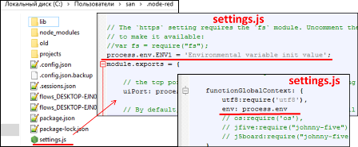

**Програмна інженерія в системах управління. Лекції.** Автор і лектор: Олександр Пупена 

| [<- до лекцій](README.md) | [на основну сторінку курсу](../README.md) |
| ------------------------- | ----------------------------------------- |
|                           |                                           |

# 2. Основи Node-RED

## 2.1. Про NODE-RED 

**Node-RED** - це інструмент для візуального програмування потоків даних, розроблений працівниками компанії IBM для поєднання різноманітних пристроїв, API та онлайн-сервісів як складових частин Інтернету речей. Node-RED дає можливість розробляти програмне забезпечення для програмно-апаратних систем, які включають в себе різноманітні IoT пристрої, застосунки та сервіси, при цьому навіть не використовуючи текстове програмування. 

Редактор Node-RED базується на браузері. Мова дозволяє об’єднувати в потоки вузли з широкого набору палітри, які можуть бути розгорнуті для виконання лише одним клацанням миші. 

Node-RED дає змогу працювати з браузерним редактором потоків даних як окремими вузлами з різним функціоналом, що уможливлюють створення JavaScript-функцій. Причому можна використовувати як базові вузли, якими одразу забезпечений Node-RED, так і встановлювати вузли з додатковим функціоналом з репозиторію NPM або ж навіть створити свій власний вузол з унікальним функціоналом. 

Програми або ж їхні частини, розроблені за допомогою Node-RED, можуть бути збережені та поширені для вільного використання. Саме середовище побудовано на основі **Node.js**, яке буде вивчатися в одній з наступних лекцій. За ініціативою IBM у 2016 році Node-RED став відкритим програмним забезпеченням (open-source) як частина проекту JS Foundation.

Легке середовище виконання (runtime) побудоване на Node.js, в повній мірі використовуючи перевагу його подіє-орієнтованої не блокуючої моделі. Це робить його ідеальним для роботи на краю (Edge) мережі на недорогих апаратних засобах, таких як Raspberry Pi, а також у хмарі.

Діапазон вузлів палітри легко розширити додаванням великої кількості модулів (сотні тисяч) зі сховища Node  щоб отримати нові можливості.

Потоки, створені в Node-RED, зберігаються за допомогою JSON, що дозволяє легко імпортувати та експортувати їх для спільного використання з іншими.

## 2.2. Редактор

Детальний опис редактору доступний [за посиланням](https://pupenasan.github.io/NodeREDGuidUKR/base/1_2.html)

Редактор складається з таких 4 компонентів:

- у верхній частині міститься заголовок, що містить кнопку  розгортання, головне меню, і якщо користувач пройшов автентифікацію,  меню користувача.
- ліворуч знаходиться **палітра (palette),** яка містить вузли доступні для використання
- посередині знаходиться основна **робоча область(workspace)**, в якій створюються потоки
- праворуч знаходиться бічна панель (**sidebar**)


рис.2.1. Вигляд редактору Node-RED.

Уся програма складається з об’єднання вузлів – **потоків** (**flow**). Потоки розробляються в межах вкладок браузера з певною назвою. Вкладки також називаються потоками, хоч на них може бути  кілька наборів об’єднаних вузлів. 

Термін “потік” також використовується для неофіційного  опису одного набору підключених вузлів. Таким чином, потік (вкладка)  може містити кілька потоків (набори з’єднаних вузлів).

Потоки можна добавляти, видаляти, деактивувати (вони не розгортаються). До потоків можна добавляти опис у форматі MarkDown.

**Вузли** (**Nodes**) можуть бути додані до робочої області з палітри або безпосередньо по імені. 

Вузли з’єднуються один з одним за допомогою з’єднань через їхні входи та виходи, які називаються **портами**. Вузол може мати:

- не більше одного вхідного порту
- багато  вихідних портів. 

Порт може мати мітку (label), що буде показуватися при  наведенні курсору. Деякі вузли відображають статусне повідомлення або піктограми поряд з ними. Це використовується для позначення стану вузла в режимі виконання.  Якщо вузол має які-небудь зміни, що не були розгорнуті в режимі  виконання, це буде відображено синім кружком над ним. Якщо є помилки у  конфігурації, то буде відображатися червоний трикутник.  Вузли `Inject` і `Debug` є єдиними вузлами, які мають кнопки керування: вприскування (`Inject` ) та відображення повідомлення (`Debug` ).

Діалогове вікно редагування вузла має три окремих розділи: властивості  (properties), опис (Description) та зовнішній вигляд (Appearance) .

**Конфігураційні вузли** (**config Node**) -  це спеціальний тип вузла, що містить конфігурацію багаторазової  доступності, що може бути розподілена між звичайними вузлами потоку. Доступ до них відбувається через бічну панель. 

Вузли можуть бути об’єднані разом, щоб утворити **групу** (**Group**). Потім вони  можуть бути переміщені або скопійовані як єдиний об’єкт у редакторі.

**Під-потоки** (**subflow**) - це сукупність вузлів, які згортаються в  єдиний вузол у робочій області. Вони можуть бути використані для  зменшення певної візуальної складності потоку або для об’єднання групи  вузлів, що використовується в різних місцях. Після створення, під-потік  додається до палітри доступних вузлів. Потім окремі екземпляри  під-потоку можна додати до робочої області, як і будь-який інший вузол.  Під-потік не може існувати сам собою без жодних вузлів, він повинен  містити їх прямо або опосередковано. Як і в звичайних потоках у вузлах підпотоків, може бути не більше одного вводу та багато виходів, за необхідності. Кожен запис у таблиці властивостей можна розширити, щоб налаштувати його відображення під час редагування екземпляру підпотоку. 

Потоки можна імпортувати та експортувати з редактора, використовуючи  формат JSON, що дозволяє дуже легко обмінюватися потоками з іншими  редакторами.

Діалогове вікно Імпорту можна використовувати для імпорту потоку за допомогою таких методів:

- вставлення в потік JSON потоку безпосередньо,
- завантаження файлу потоку з JSON,
- вибір локальної бібліотеки потоків,
- вибір потоків прикладів, передбачених встановленими вузлами.

Палітра містить всі вузли, які встановлені та доступні для використання. Вони організовані в декілька категорій починаючи зверху з inputs,  outputs та functions. Якщо є під-потоки, вони з'являються у  категорії у верхній частині палітри.

Для встановлення нових вузлів до палітри може використовуватися **менеджер палітри** (Palette Manager). Доступ до нього можна отримати за вкладкою Palette tab в User Settings dialog. 

**Бічна панель** надає наступні можливості:

- Information -- переглянути інформацію про вузли та отримати довідкову інформацію про них
- Debug -- перегляд повідомлень, переданих вузлам Debug
- Configuration Nodes -- керування конфігураційними вузлами
- Context data -- перегляд вмісту контекстів

Деякі вузли додають власні панелі бічної панелі, наприклад **node-red-dashboard**

## 2.3. Робота з повідомленнями

Потік Node-RED працює, передаючи повідомлення між  вузлами. Повідомлення є простими об'єктами JavaScript, які можуть мати  будь-який набір властивостей. Повідомлення, як правило, мають  властивість `payload`, це властивість за умовчанням, з якою працюватиме більшість вузлів. Node-RED також додає властивість, що називається `_msgid` - це ідентифікатор для повідомлення, яке може використовуватися для відстеження його проходження потоком

```json
{
"_msgid": "12345",
    "payload": "..."
}
```

Значенням властивості може бути будь-який дійсний тип JavaScript, наприклад

- `Boolean` – true, false
- `Number` – наприклад 0, 123.4
- `String` – "hello"
- `Array` - [1,2,3,4]
- `Object` - { "a": 1, "b": 2}
- `Null`

Докладніше про типи JavaScript буде в наступних лекціях.

Найпростіший спосіб зрозуміти структуру повідомлення - передати його в вузол `Debug` і переглянути його на бічній панелі Debug. За замовчуванням на вузлі Debug відображатиметься властивість `msg.payload` , але може бути налаштована для відображення будь-яка інша властивість  або все повідомлення цілком. При відображенні масиву, або об'єкта, бічна  панель забезпечує структурований вигляд, який може використовуватися для вивчення повідомлення.


рис.2.2. Перегляд структури повідомлення на бічній панелі Debug

- в самому верху він показує ім'я властивості, яке було передано. Тут за замовчуванням використано `msg.payload` 
- поруч із назвою є назва типу властивості - Object, String, Array ін..
- потім він показує вміст властивості. Для масивів і об'єктів  властивість розкладається на рядки. Клацаючи по ньому, властивість  розгорнеться, щоб показати більш детальну інформацію.

## 2.4. Огляд основних вузлів

До вузлів, що входять до стандартної комплектації Node-RED v.1.1 відносяться:

- Загальні (common) -- найбільш загальні вузли для роботи з потоками. 
- Функціональні (function) -- функції перетворення повідомлень та керування потоком 
- Послідовності (sequence) -- розбивка на послідовності та збирання послідовностей повідомлень
- Сховища (storage) -- робота з читанням/записом файлів
- Мережні (network) -- робота з WEB та IoT протколами 
- Парсери (parser) -- функції перетворенння форматів

Мережні вузли, парсери та storage будуть розглянуті в інших лекціях.  

Довідник по всім основним вузлам доступний [за посиланням](https://pupenasan.github.io/NodeREDGuidUKR/#стандартна-комплектація).


рис.2.3.  Основні вузли Node-RED

## 2.5. Загальні вузли (Common)

Таблиця 2.1. Перелік загальних вузлів

|                            Вузол                             | Призначення                                                  |
| :----------------------------------------------------------: | ------------------------------------------------------------ |
|  | [Inject](https://pupenasan.github.io/NodeREDGuidUKR/base/1_4_1.html#inject-ініціювання-повідомлення) для ініціювання потоку (відправки повідомлення) користувачем, автоматично при запуску, періодично або за розкладом. |
|  | [Debug](https://pupenasan.github.io/NodeREDGuidUKR/base/1_4_1.html#debug-вивести-на-відлагодження) використовується для відображення повідомлень на бічній панелі Debug у редакторі. |
|  | [Complete](https://pupenasan.github.io/NodeREDGuidUKR/base/1_4_1.html#complete) запускає потік, коли інший вузол завершує оброблення повідомлення. |
|  | [Catch](https://pupenasan.github.io/NodeREDGuidUKR/base/1_4_1.html#catch-обробник-помилок) ловить помилки виконання інших вузлів у тому самому потоці (вкладці) і формує повідомлення з інформацією про них. |
|  | [Status](https://pupenasan.github.io/NodeREDGuidUKR/base/1_4_1.html#status-стан-вузлу) показує стан (status message) вказаних або усіх вузлів в потоці. |
|  | [Link in](https://pupenasan.github.io/NodeREDGuidUKR/base/1_4_1.html#link-in-та-link-out-посилання) вхідне з’єднання з іншого потоку |
|  | [Link out](https://pupenasan.github.io/NodeREDGuidUKR/base/1_4_1.html#link-in-та-link-out-посилання) вихідне з’єднання до іншого потоку |
|  | [Comment](https://pupenasan.github.io/NodeREDGuidUKR/base/1_4_1.html#comment) для добавлення коментарів в потік. |
|  | [Unknown](https://pupenasan.github.io/NodeREDGuidUKR/base/1_4_1.html#unknown-невідомий) вузол невідомого типу для встановленого Node-RED |

Вузол **[Inject](https://pupenasan.github.io/NodeREDGuidUKR/base/1_4_1.html#inject-ініціювання-повідомлення)** потрібен для ініціювання потоку (відправки повідомлення) користувачем, автоматично при запуску, періодично або за розкладом. У налаштуваннях вузла можна вказати тему повідомлення (`Topic`) та значення `Payload` . У новіших версіях можливості вузла `Inject` значно розширилися. Тепер в ньому можна задавати будь яку властивість  повідомлення а також вказувати налаштування запуску в певні дні тижня по календарю. Для payload можна встановити різні типи: відмітку часу (Timestamp), константу, значення [контекстів](https://pupenasan.github.io/NodeREDGuidUKR/base/1_7.html) потоку (`flow context`) або глобального контексту (`global context`), `$env variable` – змінну середовища Node.js, `J:expression` – [JSONata](https://pupenasan.github.io/NodeREDGuidUKR/jsonata/) перетворення.

Вузол  **[Debug](https://pupenasan.github.io/NodeREDGuidUKR/base/1_4_1.html#debug-вивести-на-відлагодження)** використовуватися для відображення повідомлень на бічній панелі Debug у редакторі, середовища виконання або зображення статусу вузла. Бічна панель забезпечує структурований перегляд повідомлень, що  надсилаються, що полегшує вивчення цього повідомлення. Поряд з кожним  повідомленням бічна панель налагодження включає в себе інформацію про  час надходження повідомлення та місце з якого вузлу воно  надіслане. Натискання на ідентифікатор вихідного вузла покаже цей вузол у робочій області. Кнопку на вузлі можна використовувати для ввімкнення або вимкнення його виходів. 

Потоки різних вкладок можна з'єднувати між собою інформаційними дротами. Це робиться за допомогою вузлів **[Link in](https://pupenasan.github.io/NodeREDGuidUKR/base/1_4_1.html#link-in-та-link-out-посилання)** (вхідне з’єднання з іншого потоку) та **[Link out](https://pupenasan.github.io/NodeREDGuidUKR/base/1_4_1.html#link-in-та-link-out-посилання)** (вихідне з’єднання до іншого потоку). Таким чином потік на одній вкладці передає повідомлення до потоку іншої вкладки.  

Вузол  [Catch](https://pupenasan.github.io/NodeREDGuidUKR/base/1_4_1.html#catch-обробник-помилок) буде розглянуто в іншій темі.

## 2.6. Ознайомлення з JSON 

**JSON** ([JavaScript Object Notation](http://json.org/)) - це стандартний спосіб подання об'єкта JavaScript у вигляді рядку (string). Він часто використовується у веб-API для відправки та повернення даних. 

Усі об'єкти беруться у фігурні дужки. Це приклад порожнього об'єкту.

```json
{}
```

Властивості об'єкту типу ключ-значення записуються наступним чином:

```json
{"key1" : 23 , "key2" : "24", "key5" : {"key5_1": 37, "key5_2": [123, 124]} }
```

Ключі обовязково беруться в подвійні лапки.

Масиви записуються з використанням квадратних дужок, в яких перераховуються елементи масиву:

```json
[10, "20", 30]
```

У якості елементів можна використовувати різні типи даних: Number, String (“”), Object, Array, true/false, null. Таким чином масиви та об'єкти можуть включати у свою чергу масиви та об'єкти.    

Структура msg та змінні контексту в Node-RED є об'єктами. Усі їх поля можна представити у вигляді JSON.   Якщо властивість повідомлення містить рядок JSON, то перед тим, як отримувати доступ до  його властивостей, його слід перетворити до еквівалентного об'єкта  JavaScript. Щоб визначити, чи властивість вміщує String чи Object, може  бути використаний вузол Debug. Для здійснення цього перетворення Node-RED забезпечує вузол JSON з розділу "парсери".

## 2.7. Поняття контекстів

Node-RED забезпечує спосіб зберігання інформації, яка може бути розподілена між різними вузлами, без використання повідомлень, що проходять через потоки. Це називається **контекстом** (**context**). Контекст можна сприймати як внутрішні змінні, для зберігання проміжних значень, які мають різні області видимості.  Існує три рівні контексту:

-   **Node** - видимий тільки для вузла, який встановлює значення
-   **Flow** - видимий для всіх вузлів на одному потоці (або вкладки у редакторі)
-   **Global** - видимий для всіх вузлів

Вибір області видимості для будь-якого конкретного значення залежить від того, як воно використовується. Наприклад кожен екземпляр вузлу типу Function, може зберігати всередині значення змінних між викликами. Потоки можуть зберігати значення змінних для доступу з усіх вузлів цього потоку. Глобальний контекст зручний у тому випадку, коли треба розподіляти змінні для всіх вузлів проекту.   

За замовчуванням контекст зберігається лише в пам\'яті. Це означає, що його вміст очищується, коли Node-RED перезавантажується. З випуском версії 0.19 можна налаштувати Node-RED для збереження контекстних даних, щоб він став доступним і після перезавантаження. 

Найпростішим способом встановити значення контексту є використання вузла Change. Наприклад, наступне правило вузлу Change зберігатиме значення  `msg.payload` в контексті потоку (flow) під ключем (назвою) `myData` 


рис.2.4. Використання Change для збереження в контекст.

Різні вузли можуть безпосередньо отримати доступ до контексту. Наприклад, вузол Inject може бути налаштований для введення значення в контекст, а вузол Switch може маршрутизувати повідомлення на основі значення, збереженого в контексті. Використання контексту у вузлі Function буде розглянуто в одній з наступних лекцій.

Контекст можна остаточно видалити, використовуючи вузол `Change` та правило `delete`.


рис.2.5. Приклад видалення властивості потоку з використанням вузла Change 

Для перегляду та видалення контексту вручну можна скористатися бічною панеллю редактора. Детальніше читайте [за посиланням](https://pupenasan.github.io/NodeREDGuidUKR/base/1_2.html#%D0%B1%D1%96%D1%87%D0%BD%D0%B0-%D0%BF%D0%B0%D0%BD%D0%B5%D0%BB%D1%8C-%D0%BA%D0%BE%D0%BD%D1%82%D0%B5%D0%BA%D1%81%D1%82%D0%BD%D1%96-%D0%B4%D0%B0%D0%BD%D1%96-context-data). Детально про роботу з контекстом можна прочитати з [довідника](https://pupenasan.github.io/NodeREDGuidUKR/base/1_7.html). 

## 2.8. Функціональні вузли (function)

Вузли цієї групи призначені для перетворення повідомлень та керування потоком.  

Таблиця 2.2. Функціональні вузли

| Вузол                                                        | Призначення                                                  |
| ------------------------------------------------------------ | ------------------------------------------------------------ |
|  | [Function](https://pupenasan.github.io/NodeREDGuidUKR/base/1_5.html) дозволяє виконувати код JavaScript для обробки повідомлень, що передаються через нього. |
|  | [Switch](https://pupenasan.github.io/NodeREDGuidUKR/base/1_4_1.html#switch-перемикач-повідомлення) дозволяє передавати повідомлення до різних гілок потоку, оцінюючи набір правил для кожного повідомлення |
|  | [Change](https://pupenasan.github.io/NodeREDGuidUKR/base/1_4_1.html#change-зміна-повідомлення-в-потоці) для зміни властивостей повідомлення та контекстів (потоку і глобального) без необхідності вдаватися до вузла Function |
|  | [Range](https://pupenasan.github.io/NodeREDGuidUKR/base/1_4_1.html#range-масштабування) масштабує числові значення відповідно до вказаних вхідних та вихідних діапазонів |
|  | [Template](https://pupenasan.github.io/NodeREDGuidUKR/base/1_4_1.html#template-шаблон) використовується для створення тексту з властивостей повідомлення з використанням означеного шаблону Mustache |
|  | [Delay](https://pupenasan.github.io/NodeREDGuidUKR/base/1_4_1.html#delay-затримка) робить затримку для кожного повідомлення, що проходить через вузол, або обмежує швидкість, з якою вони можуть пройти. |
|  | [Trigger](https://pupenasan.github.io/NodeREDGuidUKR/base/1_4_1.html#trigger) відправляє повідомлення з вказаним інтервалом |
|  | [Exec](https://pupenasan.github.io/NodeREDGuidUKR/base/1_4_1.html#exec-запуск-команди) запускає системну команду. |
|  | [Rbe](https://pupenasan.github.io/NodeREDGuidUKR/base/1_4_1.html#rbe-гістерезис-нечутливість) пропускає повідомлення лише у випадку зміни корисного навантаження |

Вузол **[Change](https://pupenasan.github.io/NodeREDGuidUKR/base/1_4_1.html#change-зміна-повідомлення-в-потоці)** використовується для зміни властивостей повідомлення та контекстів (потоку і глобального) без необхідності вдаватися до вузла Function. Кожен вузол може бути налаштований з декількома операціями, які застосовуються у вказаному порядку. Доступні операції:

- **Set** - встановити властивість. Значення може бути з різними типами або може бути взяте з існуючого повідомлення або  властивості контексту.
- **Change** - пошук і заміна частин властивості повідомлення.
- **Move** - перемістити або перейменувати властивість.
- **Delete** – видалити властивість.

Для кожного правила вказується що саме треба змінити: властивість змінної `msg. ` , контекст потоку (`flow.`) або глобальний контекст (`global.`). Для `set` вказується яке саме значення необхідно присвоїти властивості. Це може бути константа, відмітка часу, значення властивості змінної `msg`, контексту чи змінної середовища, значення також може бути результатом виразу JSONata (буде розглянуто в одній із наступних лекцій). 

Вузол **[Switch](https://pupenasan.github.io/NodeREDGuidUKR/base/1_4_1.html#switch-перемикач-повідомлення)** дозволяє передавати повідомлення до різних гілок потоку, оцінюючи набір правил для кожного повідомлення і направивши його на конкретний порт. Цей вузол налаштовано за допомогою властивості для перевірки - це може бути або властивість повідомлення (message property), або властивість контексту (context property). Також в якості першого аргументу для порівняння може використовуватися вираз JSONata або змінна середовища. Існує чотири типи правил:

- **Value** - правила оцінюються для зконфігурованої властивості
- **Sequence** - правила можуть бути використані для послідовності повідомлень, наприклад, ті, які створені вузлом `Split`
- може бути надана JSONata **Expression**, який буде використаний для перевірки всього повідомлення і буде відповідати, якщо вираз повертає значення true .
- **Otherwise** - правило може бути використане для відповідності, якщо жодне з попередніх правил не співпало.

Вузол **[Delay](https://pupenasan.github.io/NodeREDGuidUKR/base/1_4_1.html#delay-затримка)** робить затримку для кожного повідомлення, що проходить через вузол, або обмежує швидкість, з якою вони можуть пройти. Якщо налаштовано на затримку повідомлень (delay messages), інтервал  затримки може бути фіксованим значенням, випадковим значенням у межах  діапазону або динамічно заданим для кожного повідомлення. Кожне  повідомлення затримується незалежно від будь-якого іншого повідомлення,  але залежно від часу його надходження.

Вузол **[Range](https://pupenasan.github.io/NodeREDGuidUKR/base/1_4_1.html#range-масштабування)** масштабує числові значення відповідно до вказаних вхідних та вихідних діапазонів. Масштабування відбувається відповідно до налаштованого вхідного діапазону (input range) та цільового діапазону (target range). Вхідне та вихідне  значення мусять бути числового формату, інакше вузол намагатиметься  перетворити їх в такий.

Вузли [Function](https://pupenasan.github.io/NodeREDGuidUKR/base/1_5.html) та [Template](https://pupenasan.github.io/NodeREDGuidUKR/base/1_4_1.html#template-шаблон) будуть розглянуті в одній з наступних лекцій. З іншими вузлами ознайомтеся самостійно. 

## 2.9. Ознайомлення з JSONata 

[JSONata](http://docs.jsonata.org/overview) - це мова запитів і перетворень даних JSON. Іншими словами це мова яка вказує як з вхідного JSON зробити вихідний JSON. JSONata використовується в багатьох вузлах Node-RED. У якості вхідних даних для JSONata є змінна повідомлення `msg`, яка розглядається як вхідний документ JSON. Тому до властивостей об'єкта `msg` доступаються безпосередньо через імена, наприклад `msg.payload` доступний просто як `payload`. 

JSONata проводить послідовні розрахунки відповідно до вказаного виразу. Після кожного розрахунку результат знаходиться в певній контекстній змінній (називатимемо розрахунковий контекст), який можна використовувати в наступних розрахунках. Звернутися до контексту можна через знак  `$`. Перед початком розрахунків в контексті знаходиться вхідний документ, тобто `msg`, тому звертатись до нього можна через  `$`. Тобто, якщо потрібно отримати доступ до всього об'єкту `msg` на верхньому рівні виразу, можна використовувати змінну `$` . Наприклад `$._msgid` поверне унікальний ідентифікатор повідомлення. Якщо звертання йде всередині розрахунку, то розрахунковий контекст буде містити проміжні результати, тому при необхідності оцінювання вхідного документу до нього звертаються через подвійний "долар" `$$` 

З символу  `$` починаються також усі функції JSONata та змінні користувача. Останні використовуються тоді, коли є необхідність писати не просто вирази а підпрограми на мові JSONata. 

У розрахунках можна також використовувати літеральні константи у форматі JavaScript, значення глобального контексту та контексту потоку, значення змінної середовища та комбінацію всього перерахованого. 

Аналогічно як Java Script через крапку можна доступатися до полів властивостей будь якого рівня вкладеності, а через `[]` до індексу масиву. Однак в JSONata квадратні дужки використовуються також для позначення умови пошуку (предикату). Якщо результат треба перетворити в інший вигляд, використовуються конструктори масивів (`[]`)  та об'єктів (`{}`). Так наступне повідомлення сформує обєкт з двома полями, в одне запише `payload` вхідного повідомлення, а в інше - `topic`.

Доступ до контекстів потоку та глобального контексту можна робити через відповідні функції. Доступ до глобального контексту відбувається через вбудовану у Node-RED JSONata функцію `$globalContext()` в якій вказується назва змінної та за необхідності сховище (другим аргументом). Аналогічно попередній, функція `$flowContext()` доступається до контексту потоку.

Для рядків у JSONata можна використовувати оператор конкатенації  `&`.  Числові літетерали та вирази можуть бути використані в розрахунках результатів з використанням звичайних математичних операторів. Можна використовувати оператори порівняння двох значень, які повертають логічні значення `true` або `false` (типу `>`, `<` і т.д). 

Детальніше про JSONata в [довіднику](https://pupenasan.github.io/NodeREDGuidUKR/jsonata/). 

## 2.10. Регулярні вирази

**Регулярні вирази** це шаблони, що використовуються для  пошуку збігу, співпадіння в тексті чи рядках.  Ці шаблони використовуються для пошуку збігу у  тексті. Тобто текст у регулярному виразі вказує на правила пошуку. 

Якщо в регулярному виразі просто вказати текст, наприклад `ABC`, то буде пошук співпадіння саме цієї комбінації, причому з урахуванням регістру. Для завдання спеціальних правил, необхідно використовувати спеціальні (службові) символи, типу: 

```
. ^ $ * + ? { } [ ] | ( )
```

Використання регулярних виразів відрізняться в різних реалізаціях. Тут розглянуті тільки пояснення щодо принципів їх використання, застосовно до вузлів, наприклад `Change`. Нижче наведений приклад для пошуку та заміни усіх комбінацій  `ABC`. Кожна комбінація змінюється на символ заміни.

 

рис.2.6. Приклад використання регулярного виразу.

Квадратні дужки `[]` використовуються для вказівки будь якого символу з наведених. Якщо в наведеному вище прикладі регулярний вираз замінити на `[ABC]` то в результаті буде `--- abc 123 --- abc 123 `.

Якщо в послідовності треба шукати спеціальні символи, то їх необхідно екранувати `\` , щоб вони не сприймалися як службові. Наприклад, якщо в тексті `[ABC][abc]` треба замінити усі квадратні дужки пробілами, то пошуковий текст треба написати так `[\[\]]`, де перша і остання квадратна дужка вказує на те, що шукаються будь які з наведених символів, а зворотня коса вказує на те, що символи `[` та`]` не є службовими.   

Зірочка `*` показує що символ, після якого він іде може зустрічатися один або нуль разів. Наприклад у тексті `baobaboooo` пошуковий запит `bo*` з зміною на `-` поверне результат `-ao-a-`, бо змінюються комбінація `bo` з будь якою кількістю `o`, навіть з 0-ю. 

Плюс `+`, на відміну від зірочки шукає результати як мінімум з одним символом. Наприклад у тексті `baobaboooo` пошуковий запит `bo+` з зміною на `-` поверне результат `baoba-`, бо змінюються комбінація `bo` з будь якою кількістю `o` більшою або рівною 1.

Використання регулярних виразів у вузлах дещо обмежене. Так, наприклад, наразі не підтримуються у вузлах типу `change` прапорці.  Детальніше про регулярні вирази можна прочитати за [посиланням](https://developer.mozilla.org/uk/docs/Web/JavaScript/Guide/Regular_Expressions)

## 2.11. Змінні середовища

**Змінні середовища** (environment variables) -- це конфігураційні змінні, які задаються у файлі  `settings.js` безпосередньо, або через "Project Settings" (планується у майбутніх версіях Node-RED) чи налаштування підпотоку. Ці змінні можна використовувати (зчитувати) в середовищі виконання для різноманітних функцій. 

Змінні середовища можуть бути доступні через добавлення в розділ `functionGlobalContext:` файлу `settings.js`  наступної властивості (перераховуються через кому):

```
env: process.env
```

Після введення ви можете отримати доступ до них у будь-якому вузлі, який має текстове поле (a/z), або у функціональному вузлі. Щоб оголосити власну змінну навколишнього середовища (наприклад `ENV_VAR`), потрібно її назву внести у файл `settings.js`. Додайте такі рядки безпосередньо перед рядком `module.exports = {`:

```
process.env.ENV_VAR = ‘just another bar’;
```

Після внесення змін у файл `settings.js` зупиніть/перезапустіть node-red, щоб зробити їх доступними для використання. 



рис.2.7. Добавлення змінних середовища.

Будь-яку властивість вузла можна встановити змінною середовища, встановивши його значення на рядок форми `${ENV_VAR}`. Коли Node-RED виконує завантаження потоків, він замінить значення цієї змінної середовища перед передачею її у вузол. 

До змінних середовища можна також отримати доступ у виразах JSONata, таких як у вузлі Change, використовуючи функцію `$env`:

```
$env('ENV_VAR')
```

У вузлі Function доступ до змінних середовища можна отримати за допомогою функції `env.get`:

```
let foo = env.get("FOO");
```

Починаючи з 0,20, підпотоки можна налаштувати з властивостями екземпляра. Вони відображаються як змінні середовища в підпотоці і можуть бути налаштовані для окремих екземплярів підпотоку.

## 2.1.2. Послідовності (sequence)

**Послідовність повідомлень** - це впорядкована серія  повідомлень, які певним чином пов'язані між собою. Деякі вузли  призначені для обробки таких послідовностей. Наприклад, вузол `Split` може перетворювати одне повідомлення, яке є масивом `payload` , у послідовність повідомлень, де кожне повідомлення містить payload що відповідає одному з елементів масиву. До групи `sequnece` входять вузли, які можуть працювати з послідовностями повідомлень.

Таблиця 2.3. Вузли для роботи з послідовностями повідомлень

| Вузол                                                        | Призначення                                                  |
| ------------------------------------------------------------ | ------------------------------------------------------------ |
|  | [Split](https://pupenasan.github.io/NodeREDGuidUKR/base/1_6.html#split) розділює одне повідомлення в послідовність повідомлень. |
|  | [Join](https://pupenasan.github.io/NodeREDGuidUKR/base/1_6.html#join) об’єднує послідовність повідомлень у єдине повідомлення |
|  | [Sort](https://pupenasan.github.io/NodeREDGuidUKR/base/1_6.html#sort) сортує масив або послідовність повідомлень на основі значення властивості або результату виразу JSONata |
|  | [Batch](https://pupenasan.github.io/NodeREDGuidUKR/base/1_6.html#batch) створює нові послідовності згрупованих повідомлень з отриманих. |

Кожне повідомлення в послідовності має властивість `msg.parts`. Це об'єкт, який містить інформацію про те, як повідомлення входить у послідовність. Він має такі властивості:

- `id` - ідентифікатор послідовності (групи повідомлень)
- `index` - позиція в середині послідовності (групи) 
- `count` - якщо відома загальна кількість повідомлень в групі. Див `streaming mode` нижче
- `type` - тип повідомлення - string/array/object/buffer
- `ch` - для string або buffer, дані (наприклад рядок), що використовуються для розділення повідомлення як рядка або масиву байтів 
- `key` - для розділення об'єкту, ключ або властивість, з якого було створено це повідомлення. Вузол може бути налаштований також для копіювання цього значення в інші властивості повідомлення, такі як `msg.topic`. 
- `len` -- довжина кожного повідомлення при розділенні з використанням фіксованого значення довжини

Вузол **[Split](https://pupenasan.github.io/NodeREDGuidUKR/base/1_6.html#split)** розділює одне повідомлення в послідовність повідомлень. Конкретна поведінка вузла залежить від типу `msg.payload`:  `String/Buffer` , `Array`  або `Object`. Вихідне повідомлення містить властивості, які вказують скільки повідомлень було створено, індекс повідомлення, тип, який символ використовувався для розділення та параметри розділення для об'єкта.  Вузол `Split` дозволяє легко створити потік, який виконує загальні дії по всій послідовності повідомлень перед тим, як використати вузол **join** , рекомбінуючи послідовність знову в одне повідомлення. Він використовує властивість `msg.parts` для відстеження окремих частин послідовності.

Вузол  **[Join](https://pupenasan.github.io/NodeREDGuidUKR/base/1_6.html#join)** об’єднує послідовність повідомлень у єдине повідомлення. Вузол забезпечує три режими роботи: автоматичний (по властивостям, що сформував Split), ручний - кофігурується, за правилами JSONata. 

**[Sort](https://pupenasan.github.io/NodeREDGuidUKR/base/1_6.html#sort)** сортує масив або послідовність повідомлень на основі значення властивості або результату вираження JSONata. Якщо вузол налаштований для сортування властивості повідомлення (`Sort = msg`), вузол сортує дані масиву, на які вказує задана властивість повідомлення. Якщо налаштовано для сортування послідовності повідомлень (`Sort = messge seqence`), вузол буде змінювати їх порядок. Під час сортування послідовності повідомлень вузол сортування покладається на отримані повідомлення, щоб встановити `msg.parts`. м імен в невідсортованому  порядку. 

## Питання до самоперевірки

1. Яке програмне середовище використовується для виконання Node-RED?   
2. На яких платформах може виконуватися середовище Node-RED?
3. Коли виконуються (обробляються) вузли Node-RED?
4. Скільки вхідних та вихідних портів може мати вузол?
5. Що таке конфігураційний вузол?
6. Розкажіть про призначення та функції вузла `Inject`.
7. Розкажіть про призначення та функції вузла `Debug` .
8. Яке призначення бічної панелі Debug?
9. Що таке JSON?
10. Що таке контексти? Які вони бувають і для чого використовуються?
11. Розкажіть про призначення та функції вузла `Change`. 
12. Розкажіть про призначення та функції вузла `Switch`
13. Розкажіть про призначення та функції вузла `Range`
14. Розкажіть про призначення вузла `Fucntion`
15. Що таке JSONata? Яка функціональність надається в JSONata?
16. Розкажіть про призначення та функції вузла `Split`
17. Розкажіть про призначення та функції вузла `Join`. Які вимоги до повідомлень ставляться в автоматичному режимі роботи?   

| [<- до лекцій](README.md) | [на основну сторінку курсу](../README.md) |
| ------------------------- | ----------------------------------------- |
|                           |                                           |

