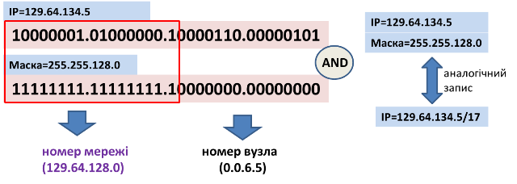
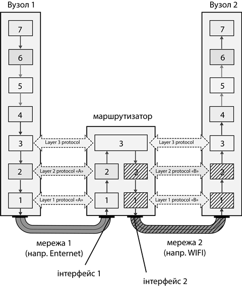
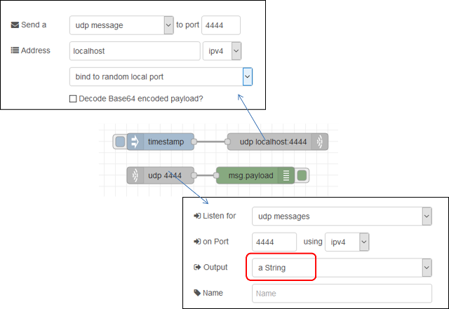
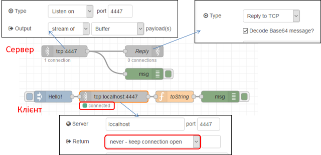

**Програмна інженерія в системах управління. Лекції.** Автор і лектор: Олександр Пупена 

| [<- до лекцій](README.md) | [на основну сторінку курсу](../README.md) |
| ------------------------- | ----------------------------------------- |
|                           |                                           |

# 3. Робота з TCP/UDP

## 3.1. Загальний принцип функціонування обміну між застосунками в мережах

Прикладні програми (застосунки) спілкуються між собою з використанням мереж. Для того щоб потрібна інформація дісталася від одного застосунку до іншого необхідно вирішити ряд завдань. Не достатньо просто передати побітово дані через провідники чи через ефір (бездротова передача), треба забезпечити їх доставку конкретному пристрою (вузлу), та конкретному застосунку на цьому пристрої. Якщо ж пристрої знаходяться в різних мережах, які об'єднані між  собою маршрутизаторами, необхідно також забезпечити маршрутизацію пакетів. Для спрощення цих задач їх вирішують різні протоколи які взаємодіють між собою. Розглянемо це на прикладі функціонування стеку протоколів TCP, IP та Ethernet, взаємодія яких показана на рис.3.1. 


рис.3.1.Функціонування стеку протоколів.

Коли один застосунок відправляє іншому якісь дані він послуговується протоколом транспортного рівня, звертаючись до відповідного драйверу з запитом на відправку даних. У даному випадку показаний протокол TCP, який функціонує умовно на 4-му рівні. Цей протокол не забезпечує доставку даних в мережі, його задача доставити дані від одного застосунку до іншого, у тому числі, якщо вони знаходяться на одному і тому ж пристрою. Для того щоб це зробити, до корисних даних, які треба передати (Upper Layer SDU (Data)) добавляється службова інформація, зокрема адреси застосунку-отримувача та відправника (tcp-порти). Ця інформація передається перед корисними даними разом з ними і називається **пакетом**. Кажуть що пакет TCP включає в себе (**інкапсулює**) дані протоколу верхнього рівня як **корисне навантаження** і має **заголовок** (**header**), в якому передається додаткова службова інформація. Пакет аналізується драйвером пристрою отримувача і за відповідним портом отримувача у заголовку шукає той застосунок, кому призначений даний пакет і віддає йому корисні дані. За необхідності корисне навантаження передається кількома частинами, які називаються сегментами. Тоді драйвер пристрою-отримувача повинен зібрати ці дані разом.

Для того щоб tcp-пакет досяг потрібного пристрою, необхідно вирішити ще кілька задач. По-перше, дані можуть передаватися між пристроями в різних мережах, які об'єднані між собою. Наприклад пристрої можуть спілкуватися через мережу Інтернет. Для цього драйвер TCP, просить передати драйвер IP (3-й рівень) його tcp-пакет конкретному вузлу в об'єднаній мережі. Для драйвера IP цей tcp-пакет інкапсулюється як корисне навантаження, а для його передачі в об'єднаній мережі використовується IP-адреси відправника та отримувача, яка поміщається в заголовок. Про функціонування пакету IP наведено нижче, тут зауважимо, що для передачі IP-пакету по мережі, драйвер IP послуговується послугами драйверу мережного інтерфейсу, наприклад Ethernet чи WiFi.

Задача Ethernet (2-й рівень), забезпечити доставку даних від одного пристрою до іншого (інших), які знаходяться в тій самій мережі. Для цього він інкапсулює IP-пакет в **кадр** (**frame**), який містить заголовок з інформацією про апаратну адресу картки (**MAC-адресу**) відправника та отримувача. Крім того в кінцевику (footer), кадр містить контрольну суму, за допомогою якої контролюється достовірність отримання вмісту кадру. 

Сформований кадр відправляється побітово по мережі (1-й рівень). Всі пристрої прослуховують мережу, і отримавши кадр призначений їм, починають зворотній процес перетворення. За допомогою контрольної суми перевіряють чи кадр прийшов без спотворень. Якщо все гаразд, вилучають корисне навантаження і передають його драйверу IP. За адресою отримувача визначають, чи пакет дійсно призначений їм, якщо ні - очевидно пристрій повинен його відправити на інший порт (див. нижче). Якщо отримувач дійсно цей пристрій, корисне навантаження переправляється драйверу TCP. За адресою tcp-порта той визначає якому застосунку призначене дане корисне навантаження, за необхідністю робить складання сегментів разом і віддає корисне навантаження застосунку. 

У наведеному вище прикладу показаний тільки прямий шлях передач даних між застосунками. Враховуючи, що на кожному етапі перетворення (рівні мережі) в заголовках передається також адреса відправника, застосунок може переслати повідомлення-відповідь до адресату, який ініціював передачу.      

Розглянемо принципи маршрутизації, яка вирішується протоколом IP та засобами рівня 3. Сьогодні є дві версії протоколів IP - `IP v4` (4-байтна адресація) та `IP v6`(16-байтна адресація). У будь якому випадку, адресація передбачає виділення адреси мережі та вузла.  У `IP v4` адреса мережі визначається за маскою, яка задається послідовністю бітів, що виділяє адресу мережі з вказаної адреси. Наприклад в адресі `192.168.1.1` з маскою `255.255.255.0`, перші три байти вказують на адресу мережі. Тобто при такому завданні адреса мережі буде `192.168.1.0` а пристрій буде мати адресу `1`.     



 рис.3.2. Визначення адреси мережі та вузла (пристрою) за маскою

Для маршрутизації пакетів в об'єднаній мережі використовуються **маршутизатори** (**router**). Вони знаходяться в місцях підключень кількох мереж, і забезпечують передачу пакетів з однієї мережі в іншу. Для цього маршрутизатори містять маршрутні таблиці, які містять записи з адресами та портами, куди треба відправляти пакети, якщо їх адреса задовільняє правило маршрутизації. На рис.3.3 показаний приклад маршрутизації. Розглянемо його детальніше.

   

 рис.3.3. Функціонування маршрутизаторів

На пристроях в налаштуваннях драйвера IP вказуються також маршрутні таблиці.  Як мінімум, там повинен бути вказана (або видана автоматично) IP адреса маршрутизатора за замовченням (може називатися "шлюз за замовченням"). Коли драйвер IP повинен відправити пакет за певним призначенням, він спочатку визначає (наприклад за маскою), чи знаходиться цей пакет в цій же мережі. Далі:

- Якщо так, він відправляє цей пакет за відповідно до цієї IP-адреси МАС-адресою
- Якщо ні, він відправляє цей пакет за відповідно до IP-адреси маршрутизатора МАС-адресою    

Для того щоб дізнатися відповідну МАС-адресу до IP-адреси використовуються ARP-таблиці. Ви можете переглянути такі таблиці на вашому пристрої через командний рядок, викликавши команду:  

```bash
arp -a
```

 Ці таблиці як правило формуються автоматично за допомогою протоколу ARP. Це працює наступним чином:

- драйвер IP шукає в ARP-таблиці відповідну до адреси отримувача MAC-адресу
  - якщо запис існує, драйвер IP просить драйвер Ethernet відправити пакет за вказаною  MAC-адресою
  - якщо запису немає: 
    - драйвер IP просить драйвер Ethernet відправити ARP-пакет з широкомовним (усім в мережі) запитом-питанням (у кого такий IP)
    - пристрій з вказаним IP відповідає
    - адреса заноситься в таблицю ARP
    -  драйвер IP просить драйвер Ethernet відправити пакет за вказаною  MAC-адресою 

Слід також зазначити, що є особливі адреси, для яких діють особливі правила адресації. Наприклад `127.0.0.1` - це адреса того самого пристрою, так званий `loopback`.  

Вище описаний дуже короткий принцип функціонування стеку з кількох протоколів.  

## 3.2. Протоколи TCP та UDP

Як зазначалося вище, протоколи транспортного рівня слугують для забезпечення передачі даних між застосунками. На сьогодні найбільш популярними є протоколи **TCP** (Transmission Control Protocol) та **UDP** - (User Datagram Protocol).

Протокол UDP дуже простий і призначений для доставки пакету до застосунку за вказаним портом udp (рис.4). Він не передбачає контролю доставки, контроль цілісності повідомлення та фрагментацію. За рахунок цього він швидкий, бо не потребує додаткових полів заголовку (які треба обробляти) а найголовніше - додаткового обміну службовою інформацією. Крім того він може використовуватися для широкомовлення (broacast, тобто всім) та мультиадерсної доставки (multicast). Його використовують у тому випадку коли дані повинні надійти швидко, навіть за умови втрати пакетів.


рис.3.4. Порівняння протоколів TCP та UDP

На противагу до UDP протокол TCP призначений для гарантованої доставки даних. Для цього перед обміном даних для застосунків встановлюється сеанс зв'язку, в межах якого буде проводитися обмін. Для встановлення сеансу проводиться домовленість, що передбачає передачу службових повідомлень (потрійне рукостискання), після чого йде обмін пакетами з контролем правильності доставки та підтвердженням отримання. Ці службові пакети роблять передачу надійною, але  набагато повільнішою ніж UDP.    

Обидва протоколи використовують для доставки даних до конкретного застосунку адресацію з використанням номерів портів. Для TCP ініціатор зв'язку називається клієнтом (Client) а застосунок, який очікує з'єднання - сервером (Server). Таким чином, щоб сервер отримав повідомлення від клієнта, клієнту треба вказати в заголовку відправленого пакету, а саме в порті отримувача, той порт, який прослуховує сервер. У свою чергу, сервер зможе відповісти клієнту, використавши з заголовку отриманого пакету адресу порта відправника. Тобто клієнт заздалегідь повинен знати порт, який прослуховує сервер. А серверу інформація про партнера стає відомою після отриманого повідомлення.   

Слід зазначити, що самі по собі протоколи TCP та UDP кінцевими застосунками рідко використовуються, так як не містять інформацію, що тлумачить що значить дані, що передаються. Цими протоколами послуговуються різноманітні протоколи прикладного рівня. Зокрема, дуже відомий протокол HTTP, яким користуються браузери для доступу до WEB-серверів, використовує для доставки запитів та відповідей протокол TCP. Враховуючи популярність протоколів прикладного рівня, для них визначені типові адреси портів, які також називаються **добре відомі** порти (**Well-Known**). Наприклад, за HTTP-сервером закріплений порт `80`. Якщо в браузері не вказати адресу порта (через двокрапку), буде вважатися використання порта 80. Тобто http://example.com та http://example.com:80 будуть доступатися до того ж порту.    


рис.3.5. Номери портів

Клієнтським застосункам при підключенні, як правило виділяються вільні порти, тобто ті, які на даний момент на даному пристрої не використовуються драйвером TCP. Нижче наведений розподіл портів:

- 0-1023 – добре відомі, системні порти (Well-Known, System)
- 1024-49151 – користувацькі (User)
- 49152-65535 – динамічні або приватні порти (Dynamic, Private) 

При побудові власних застосунків з використанням TCP та UDP, як правило користуються бібліотеками, які спрощують обмін з використанням так званих **сокетів** (**Socket**). Сокет - це такий програмний об'єкт, який слугує початковою або кінцевою точкою з'єднання, через який можна передати або отримати дані. Перед обміном даними сокет налаштовується на конкретний мережний інтерфейс та порт (рис.3.6). Таким чином адреса сокету є комбінацією з адреси IP та порту. Клієнтські сокети з'єднуються з серверними з використанням ідентифікатору підключення, який містить протокол, IP адреси та номери портів відправника (src) та отримувача (dst):     

**Protocol** **+** **IPdst** **+** **PORTdst** **+** **IPsrc** **+** **PORTsrc** (5 tuple)


рис.3.6. Принципи роботи сокетів

На рис.3.7. показані етапи роботи сокетів для протоколу TCP. Спочатку в застосунку створюються сокети (примітив `socket`). Далі відбувається зв'язок локальної адреси (IP та порт) з сокетом (примітив `bind`). Серверний сокет вказує на очікування з'єднання від клієнта (примітив `listen`). Клієнтський сокет викликає примітив `connect` для підключення до серверного сокету. В примітиві він вказує адресу серверного сокету. Серверний сокет підтверджує підключення примітивом `accept`, після чого будь який з партнерів може відправляти (`send`) та отримувати (`recv`) дані. Примітив `close`  розриває з'єднання.    


рис.3.7. Етапи роботи сокета

Таблиця 3.1. Примітиви роботи з сокетом.

| **Примітив** | **Призначення**                    |
| ------------ | ---------------------------------- |
| SOCKET       | створити сокет                     |
| BIND         | зв'язати локальну адресу з сокетом |
| LISTEN       | очікувати з'єднання від клієнта    |
| ACCEPT       | підтвердити з'єднання              |
| CONNECT      | підключатися до серверу            |
| SEND         | відправити по каналу               |
| RECEIVE      | отримати з каналу                  |
| CLOSE        | розірвати з'єднання                |

## 3.3. Робота з TCP та UDP в Node-RED

У Node-RED для роботи з TCP та UDP є відповідні вузли з палітри `Network`, які  встановлюються разом з Node-RED.  У цьому розділі розглянемо їх.

### UDP out 

Цей вузол відправляє `msg.payload` на призначений хост і порт UDP. Підтримується багатоадресна передача. 

На рис.3.8 показано налаштування `UDP out`. При відправлені можна задати як конкретний порт так і випадковий (`bind to random local port`). 


рис.3.8.Налаштування UDP out

Можна також використовувати `msg.ip` і `msg.port` для встановлення значень IP-адреси та порта призначення, але слід зауважити, що у цьому випадку статично налаштовані значення повинні бути порожніми.

Якщо вибрати широкомовлення (`broadcast`), тоді необхідно встановити адресу на ip адресу локального широкомовлення, або, `255.255.255.255`, яка є глобальною адресою широкомовної передачі. **Примітка**: У деяких системах вам може знадобитися мати root, щоб використовувати порти нижче 1024 та/або широкомовлення.

### UDP in

Вузол введення UDP, який виробляє `msg.payload`, що містить буфер, рядок або base64-кодований рядок. Підтримується багатоадресне отримування.


рис.3.9. Налаштування `UDP in`

Він також забезпечує передачу `msg.ip` та ` msg.port`, встановлені на ip-адресу та порт, з якого було отримано повідомлення. У деяких системах може знадобитися root або адміністраторський доступ для використання портів нижче 1024 та/або широкомовлення.

На рис.3.10 вказаний приклад використання UDP, де Node-RED відсилає повідомлення до самого себе. 



рис.3.10. Приклад роботи UDP

### TCP in 

 Забезпечує отримання вхідних даних з порта TCP.

Можна або підключитися до віддаленого порту TCP (`Type = Connect To`), або прийняти вхідні з'єднання (`Type = Liasten On`).


рис.3.11. Налаштування `TCP in`

У деяких системах вам може знадобитися root або адміністратор для доступу до портів нижче 1024.

При підключенні до віддаленого порту вузол для цього підключення буде тільки приймати вхідні повідомлення. При необхідності підключення в режимі запит/відповідь варто використовувати вузол TCP request.

### TCP out

Забезпечує відправлення вихідного повідомлення на TCP-порт. 

Можна або підключитися до віддаленого порту TCP (`Type=Connect to`), приймати вхідні з'єднання (`Type=Listen on`) або відповідати на повідомлення, отримані від вузла TCP In (`Type=Reply to TCP`).


рис.3.12. Налаштування `TCP out`

Надсилається лише `msg.payload`. Якщо  `msg.payload` - рядок, що містить кодування бінарних даних Base64, опція `decode Base64` призведе до того, що вона буде перетворена назад у двійкові дані перед відправкою.

Якщо `msg._session` немає, корисне навантаження надсилається **всім** підключеним клієнтам. У деяких системах вам може знадобитися root або адміністратор для доступу до портів нижче 1024.

При підключенні до віддаленого порту вузол для цього підключення буде тільки відправляти вихідні повідомлення. При необхідності підключення в режимі запит/відповідь варто використовувати вузол TCP request.

### TCP Request

Простий вузол для відправки клієнтського запиту TCP та очікування відповіді. Запит відправляється через msg.payload на порт TCP-сервера, після чого очікується відповідь. Конфігурування вузла показано на рис.3.13.


рис.3.13. Налаштування `TCP Request`

Вузол підключається по TCP, надсилає запит і чекає відповідь, яку формує на виході вузла `msg.payload`. За допомогою параметра Return налаштовується різні режими очікування відповіді для видачі отриманих даних в `msg.payload` та закриття з'єднання:

- за фіксованою кількістю символів у буфері (`fixed number of charts`),
- за вказаним символом, який сигналізує про завершення передачі (`when character received`)
- за фіксованим часом очікування (`after a fixed timeout`),
- передавати дані за надходженням  і ніколи не закривати з'єднання (`never`) 
- відправляти запит, а потім негайно закрити з'єднання, не чекаючи відповідь (`immediately`).

Відповідь буде виводитися у `msg.payload` як буфер. Для текстового перетворення можна скористатися методом `.toString()`.

Якщо в налаштуваннях залишити хост або порт tcp порожнім, їх потрібно встановити, використовуючи властивості `msg.host` та `msg.port` у кожному повідомленні, надісланому до вузла.

На рис.3.14 показаний приклад роботи вузлів TCP. У даному прикладі в Node-RED реалізоване як серверне так і клієнтське підключення для з'єднання самого з собою. Сервер відправляє клієнту те саме повідомлення, яке отримав (ехо-відповідь).



рис.3.14. Приклад роботи вузлів TCP

## Питання для самоперевірки.

1. Яке призначення протоколів IP?
2. Як у IPv4 з використанням масок з адреси вузла виділяється адреса мережі?
3. Куди відправляється пакет за замовченням, якщо адреса IPv4 не в даній підмережі?
4. Поясніть що таке протокол ARP та таблиця ARP?    
5. Яке призначення у транспортних протоколів TCP та UDP? 
6. Поверх якого протоколу працюють TCP та UDP?
7. Виділіть основні відмінності в принципах роботи TCP та UDP.
8. Поясніть що таке порти TCP та UDP.
9. Поясніть на прикладі що таке добре відомі (Well-Known) порти TCP та UDP.
10. Які, як правило номери портів виділяються TCP та UDP клієнтам?
11. Поясніть принципи функціонування сокетів.
12. Яка принципова відмінність в роботі клієнтських та серверних сокетів TCP та UDP?
13. Яке призначення вузлів UDP-in та UDP-out в Node-RED?
14. Яке призначення вузлів TCP-in та TCP-out  в Node-RED?
15. Яке призначення вузла TCP-request в Node-RED? 

| [<- до лекцій](README.md) | [на основну сторінку курсу](../README.md) |
| ------------------------- | ----------------------------------------- |
|                           |                                           |

