**Програмна інженерія в системах управління. Лекції.** Автор і лектор: Олександр Пупена 

| [<- до лекцій](README.md) | [на основну сторінку курсу](../README.md) |
| ------------------------- | ----------------------------------------- |
|                           |                                           |

# 7. Системи керування версіями: Git, GitHub

## 7.1. Системи керування версіями

Система керування версіями (***СКВ,*** source code management, SCM) - це система, що записує зміни у файл або набір файлів протягом деякого часу таким чином, що можна повернутися до певної версії пізніше. Це може бути як програмний код так і будь-які інші файли.

Системи керування версіями зазвичай використовуються при розробці програмного забезпечення для відстеження, документування та контролю над поступовими змінами в електронних документах: у сирцевому коді застосунків, кресленнях, електронних моделях та інших документах, над змінами яких одночасно працюють декілька людей. Кожна версія позначається унікальною цифрою чи літерою, зміни документу занотовуються. Зазвичай також зберігаються дані про автора зробленої зміни та її час. Інструменти для керування версіями входять до складу багатьох інтегрованих середовищ розробки.

СКВ дозволяє повернути вибрані файли до попереднього стану, повернути весь проект до попереднього стану, побачити зміни, побачити, хто останній змінював щось і спровокував проблему, хто вказав на проблему і коли, та багато іншого.

Існують три основні типи систем керування версіями: локальні, з централізованим сховищем та розподіленим (деценралізованим).

Багато людей в якості одного з методів керування версіями застосовують копіювання файлів в окрему директорію (можливо навіть директорію з відміткою за часом). Даний підхід є дуже поширеним завдяки його простоті, проте він, схильний до появи помилок. Можна легко забути в якій директорії ви знаходитеся і випадково змінити не той файл або скопіювати не ті файли, які ви хотіли. Щоб справитися з цією проблемою, програмісти розробили локальні СКВ, що мають просту базу даних, яка зберігає всі зміни в файлах під керуванням версіями (рис.7.1). Сховище (база даних) з набором файлів та змін, які відбувалися над ними, що керуються СКВ називається ***репозиторієм***. По суті репозиторій як правило є одним проектом, над яким проводяться операції як з єдиним набором файлів.

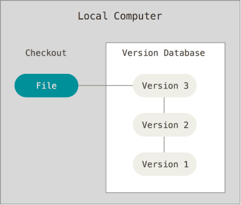

Рис.7.1. Принципи роботи локальних систем керування версіями.

СКВ дає можливість:

-   зберігати код;

-   запам'ятовувати історію змін до коду, та дозволяти у будь-який момент побачити хто саме зробив зміни, коли зробив зміни;

-   відкотитися до будь-якої версії коду у будь-який момент;

-   об'єднувати зміни різних версій, станів та розробників;

Наступним важливим питанням, з яким стикаються люди, є необхідність співпрацювати з іншими розробниками. Щоб справитися з цією проблемою, були розроблені централізовані системи керування версіями (**ЦСКВ**). Такі системи як CVS, Subversion і Perforce, мають єдиний сервер, який містить всі версії файлів, та деяке число клієнтів, які отримують файли з центрального місця.

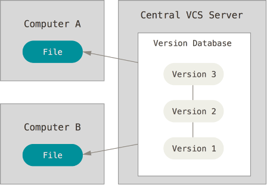

Рис. 7.2. Централізовані системи керування версіями.

Такий підхід має безліч переваг, особливо над локальними СКВ. Наприклад, кожному учаснику проекту відомо, певною мірою, чим займаються інші. Адміністратори мають повний контроль над тим, хто і що може робити. Набагато легше адмініструвати ЦСКВ, ніж мати справу з локальними базами даних для кожного клієнта. Але цей підхід також має деякі серйозні недоліки. Найбільш очевидним є єдина точка відмови, яким є централізований сервер. Якщо сервер виходить з ладу протягом години, то протягом цієї години ніхто не може співпрацювати або зберігати зміни над якими вони працюють. Якщо жорсткий диск центральної бази даних на сервері пошкоджено, і своєчасні резервні копії не були зроблені, то втрачається абсолютно все --- вся історія проекту, крім одиночних знімків проекту, що збереглися на локальних машинах людей. Локальні СКВ страждають тією ж проблемою --- щоразу, коли вся історія проекту зберігається в одному місці, ви ризикуєте втратити все.

У розподілених системах керування версіями (**РСКВ**, Distributed Version Control System) клієнти не просто отримують останній знімок файлів репозиторія: натомість вони є повною копією сховища разом з усією його історією. Таким чином, якщо ламається який-небудь сервер, через який співпрацюють розробники, будь-який з клієнтських репозиторіїв може бути скопійований назад до серверу, щоб відновити його. Кожна копія дійсно є повною резервною копією всіх даних. Крім того, багато з цих систем дуже добре взаємодіють з декількома віддаленими репозиторіями, так що можна співпрацювати з різними групами людей, застосовуючи різні підходи в межах одного проекту одночасно. Це дозволяє налаштувати декілька типів робочих процесів, таких як ієрархічні моделі, які неможливі в централізованих системах.

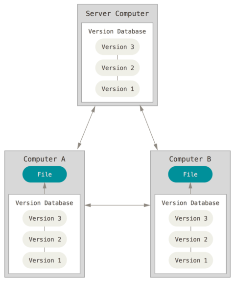

Рис 7.3. Розподілені системи керування версіями.

## 7.2. Система керування версіями GIT

***Git*** --- розподілена система керування версіями файлів та спільної роботи. Проект створив Лінус Торвальдс для керування розробкою ядра Linux, а сьогодні підтримується Джуніо Хамано (англ. Junio C. Hamano). Git є однією з найефективніших, надійних і високопродуктивних систем керування версіями, що надає гнучкі засоби нелінійної розробки, що базуються на відгалуженні і злитті гілок. Програма є вільною і випущена під ліцензією GNU GPL версії 2.

Система спроектована як набір програм, спеціально розроблених з врахуванням їхнього використання у скриптах. Це дозволяє зручно створювати спеціалізовані системи керування версіями на базі Git або користувацькі інтерфейси. Система має ряд користувацьких інтерфейсів: наприклад, **gitk** та **git-gui** розповсюджуються з самим Git. Віддалений доступ до репозиторіїв Git забезпечується git-демоном (службою), SSH або HTTP сервером.

Для керування Git можна використовувати різні варіанти клієнтів, зокрема Git-SCM <https://git-scm.com/downloads>. Крім оригінальних клієнтів командного рядка, є безліч клієнтів з графічним інтерфейсом користувача з різними можливостями. Командний рядок --- єдине місце, де можна виконувати всі команди Git, оскільки більшість графічних інтерфейсів для простоти реалізують тільки деяку підмножину функціональності Git. Для інсталяції Git під Windows достатньо перейти за посиланнями <http://git-scm.com/download/win> і завантаження почнеться автоматично.

Після інсталяції Git необхідно провести початкові налаштування. До Git входить утиліта що має назву git config, яка дозволяє отримати чи встановити параметри, що контролюють усіма аспектами того, як Git виглядає чи працює. Ці параметри можуть бути збережені в різних місцях. У системах Windows, Git шукає файл .gitconfig в каталозі \$HOME (C:\\Users\\\$USER для більшості користувачів). Він також все одно шукає файл /etc/gitconfig, хоча відносно кореня MSys, котрий знаходиться там, де ви вирішили встановити Git у вашій Windows системі, коли ви запускали інсталяцію. Є також системний конфігураційний файл C:\\ProgramData\\Git\\config. Цей файл може бути зміненим лише за допомогою git config -f \<файл\> адміністратором.

Перше, що необхідно зробити після інсталяції Git - встановити ім'я користувача та адресу електронної пошти. Це важливо, тому що кожен коміт в Git використовує цю інформацію, і вона незмінно включена у комміти, які ви робите:

```bash
git config --global user.name "John Doe"
git config --global user.email johndoe@example.com
```

Якщо ви передаєте опцію \--global, ці налаштування потрібно зробити тільки один раз, тоді Git завжди буде використовувати цю інформацію для всього, що ви робите у цій системі. Якщо ви хочете, перевизначити ім'я або адресу електронної пошти для конкретних проектів, ви можете виконати цю ж команду без опції \--global в каталозі необхідного проекту. Багато з графічних інструментів допомагають зробити це при першому запуску.

Якщо ви хочете подивитися на свої налаштування, можете скористатися командою

```bash
git config –-list
```

, щоб переглянути всі налаштування, які Git може знайти.

Для отримання допомоги по конкретній команді, можна викликати:

```bash
git help <command>
```

або

```bash
git <command> -h
```

## 7.3. Основи роботи з Git для локального репозиторію

Більшість дій можна виконувати на локальній файловій системі без використання інтернет підключення. Вся історія змін зберігається локально і при необхідності вивантажується у віддалений репозиторій. Будь-який знімок в Git спочатку робиться локально, а потім вивантажується у віддалений репозиторій.

Git зберігає дані набором знімків. Кожного разу при фіксації поточної версії проекту Git зберігає зліпок того, як виглядають всі файли проекту. Але якщо файл не змінювався, то дається посилання на раніше збережений файл (див. рис. 7.4). Git схожий на своєрідну файлову систему з інструментами, які працюють поверх неї.

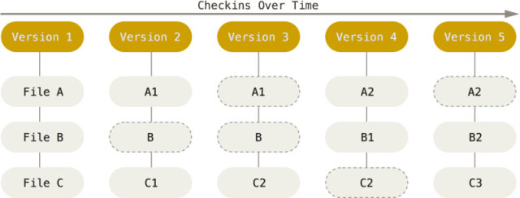

Рис. 7.4. Дані як зліпки стану проекту в часі

Усі зміни користувачем проводяться у файлах ***робочої директорії*** (Working Directory). По суті, робоча директорія -- це місце розміщення плинної редагованої версії усіх файлів проекту (див.рис.7.5). У робочій директорії знаходиться папка «.git», яка вміщує ***репозиторій проекту***, тобто базу даних всієї необхідної інформації для контролю версій: зліпки файлів, розмір, час створення і останньої зміни. За необхідності фіксації файлів робочої папки вони передаються і зберігаються в репозиторію, при необхідності редагування конкретної версії -- витягуються з репозиторію.

У своїй базі Git зберігає все по контрольним сумам (хешам) файлів. Перед кожним збереженням файлів Git, використовуючи спеціальний алгоритм (SHA-1) за змістом файлу обчислює хеш (контрольну суму). Отриманий хеш стає унікальним індексом файлу в Git. Використовуючи хеш Git легко відслідковує зміни в файлах.

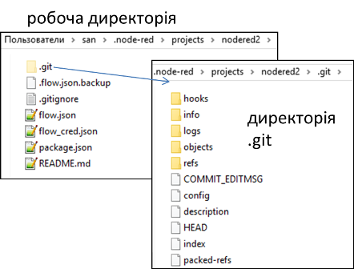

Рис. 7.5. Приклад робочої директорії

При редагуванні файлів в робочій директорії вони змінюються, тобто не відповідають їх версії в репозиторію. Коли змінювані (***modified***) файли є сенс зафіксувати в репозиторії, спочатку їх індексують (***stage***). Під час індексації, у файл індекса, який також називають областю додавання (***staging area***), що  зазвичай знаходиться в директорії Git, розміщується інформація про те, що саме буде зафіксовано у наступному знімку (див.рис.7.6). Після індексації усіх необхідних файлів, фіксація проводиться командою ***commit***, а файли вважаються зафіксованими або «збереженими в коміті» (***commited***).

Таким чином, у випадку, якщо окрема версія файлу вже є в директорії Git, цей файл вважається збереженим у коміті. Якщо він зазнав змін і перебуває в індексі, то він індексований. Якщо ж його стан відрізняється від того, який був у коміті, і файл не знаходиться в індексі, то він називається зміненим. 

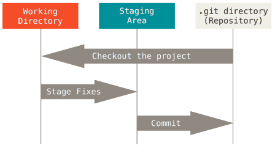

Рис. 7.6. Області збереження в Git.

Для роботи з проектом, що наразі не перебуває під СКВ, спочатку треба перейти до теки цього проекту. У командному рядку Windows для цього можна використати команду cd:

```bash
cd /c/user/my_project
```

та виконати:

```bash
git init
```

Це створить новий підкаталог .git, який містить всі необхідні файли репозиторія --- скелет Git-репозиторія. На цей момент, у даному проекті ще нічого не відстежується. Якщо необхідно додати існуючі файли під керування версіями (на відміну від порожнього каталогу), слід проіндексувати ці файли і зробити перший коміт. Це можна зробити за допомогою декількох команд git add, що означують файли, за якими необхідно слідкувати, після яких треба виконати git commit:

```bash
git add *.c
git add LICENSE.txt
git commit -m 'Перша версія проекту'
```

У цьому прикладі було проіндексовано усі файли з розширенням \*.c та файл LICENSE.txt, після чого вони були зафіксованими в коміті.

Після цих команд на машині буде локальний Git репозиторій та робоча директорія з усіма файлами цього проекту. При кожній зміні файлів в робочій не обов'язково їх відправляти в репозиторій. Зазвичай, це робиться коли треба зафіксувати певну версію проекту для можливості повернення до неї.

Кожен файл робочої директорії може бути в одному з двох станів (рис.7): ***контрольований*** (***tracked***) чи ***неконтрольований*** (***untracked***). Контрольовані файли --- це файли, що були в останньому знімку. Вони можуть бути не зміненими (***unmodified***), зміненими (***modified***) або індексованими (staged). Якщо стисло, контрольовані файли --- це файли, про які Git щось знає. Неконтрольовані файли --- це все інше, будь-які файли у вашій робочій директорії, що не були у вашому останньому знімку та не існують у вашому індексі. Якщо ви щойно зробили клон репозиторія, усі ваші файли контрольовані та не змінені, адже Git щойно їх отримав, а ви нічого не редагували.

По мірі редагування файлів, Git бачить, що вони змінені, адже їх змінили після останнього коміту. Впродовж роботи розробник вибірково індексує ці змінені фали та потім зберігає всі індексовані зміни, та цей цикл повторюється.


Рис.7.7. Стан файлів Git в робочій директорії

Перевірку стану можна зробити через команду `git status` , або через `git status -s` для короткої версії статусу.

Добавлення нових або змінених файлів до індексу робиться з використанням команди

```bash
git add <файли>
```

Команда `git add` приймає шлях файлу або директорії. Якщо це директорія, команда додає усі файли в цій директорії включно з піддерикторіями. `git add` -- багатоцільова команда, її слід використовувати щоб почати контролювати нові файли, щоб додавати файли та для інших речей, наприклад позначання конфліктних файлів як розв'язаних.

Команда `git diff` показує які саме зміни були внесені у змінені файли відносно останнього коміту.

Для внесення індексованих файлів в коміт, використовується команда

```bash
git commit
```

Додавання опції `-a` до команди `git commit`, змушує Git автоматично додати кожен файл, що вже контролюється, до коміту, що дозволяє вам пропустити команди `git add`.

Щоб видалити файл з Git, вам треба прибрати його з контрольованих файлів (вірніше, видалити його з вашого індексу) та створити коміт. Це робить команда `git rm`, а також видаляє файл з вашої робочої директорії, щоб наступного разу він не відображався неконтрольованим. Якщо ви просто видалите файл з вашої робочої директорії, при виводі команди `git status` він з'явиться під заголовком `Changes not staged for commit` (тобто, *неіндексованим*)  Потім, якщо ви виконаєте `git rm`, файл буде індексованим на видалення.

Для перейменування файлу у Git, можна виконати наступну команду:

```bash
git mv стара_назва нова_назва
```

Для перегляду історії комітів використовується команда `git log` , яка має багато опцій для налаштувань.

Для того, щоб Git не звертав уваги на деякі файли в робочій директорії, можна створити файл `.gitignore`, що містить шаблони, за яким файли ігноруються. Налаштування у файлі **[.gitignore](https://git-scm.com/docs/gitignore)** означують які ще не контрольовані файли потрібно ігнорувати при наступній індексації. Ці налаштування ніяк не впливають на індексацію файлів, які вже контрольовані (tracked) Gitом.

## 7.4. Основи роботи з галуженнями

Як вже зазначалося, Git зберігає дані не як послідовність змін, а як послідовність знімків. Коли фіксуються зміни (рис.7.8), Git зберігає об'єкт фіксації, що містить вказівник на знімок файлу, ім'я та поштову адресу автора, набране при коміті повідомлення та вказівники на попередні фіксації (parent). При першій фіксації (98ca9 на рис.7.8), посилання на попередню буде нульовим. Кожна інша фіксація буде містити посилання на попередню (стрілками вказується саме посилання на попередній коміт а не послідовність). Таким чином формується одна гілка з усією історією фіксацій.

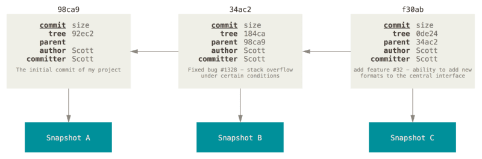

Рис.7.8. Фіксації та їх батьки.

Гілка в Git це просто легкий вказівник, що може пересуватись, на одну з цих фіксацій шляхом поступового переходу між ними. Загальноприйнятим ім'ям першої гілки в Git колись була ***master***, а з 2020 року ***main*** . При ініціалізації (створенні) репозиторія, за замовчуванням, Git створює тільки цю гілку. Коли ви почнете робити фіксації, вам надається гілка master(main), що вказує на останню зроблену фіксацію. Таким чином, щоразу, коли відбувається фіксація, вказівник «переміщується» вперед на останню фіксацію автоматично.

Галуження (***branches***) --- це відмежування від основної лінії розробки для продовження своєї частини роботи та уникнення конфліктів з основною лінією. Git дозволяє створити декілька гілок і перемикатися між ними. Це корисно, оскільки дозволяє працювати декільком розробникам над своїм функціоналом не заважаючи іншим і не псуючи основну гілку. Гілки у Git дуже просто використовувати. Приклад використання галужень в проекті показаний на рис.7.9.

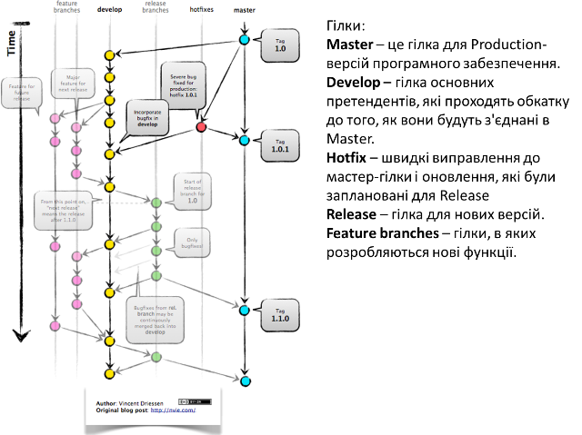

рис.7.9.Використання галужень в проекті

З певного моменту код розгалужується, над кожною гілкою можна працювати окремо, наприклад кільком розробникам, а тоді гілки об'єднуються назад у головну гілку, де всі можуть бачити і використовувати зроблені зміни.

Гілка в Git просто є вказівником на одну із фіксацій. При кожній новій фіксації гілка в Git рухається автоматично (тобто перемикається на конкретну фіксацію). Гілка є простим файлом, який містить 40 символів контрольної суми SHA-1 фіксації. Тобто коли створюється нова гілка, створюється новий файл-вказівник, який вказує на конкретну фіксацію.

Cтворення нової гілки робиться за допомогою команди `git branch`:

```bash
git branch testing
```

У результаті цього створюється новий вказівник на фіксацію, в якій ви зараз знаходитесь.

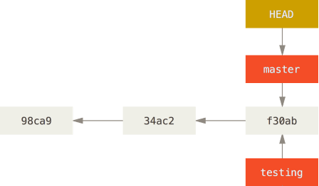

рис.7.10. Дві гілки вказують на одну послідовність фіксацій

У певний момент часу Git знаходиться на одній із гілок. Для цього він зберігає особливий вказівник під назвою ***HEAD*** - це просто вказівник на активну локальну гілку. Команда git branch тільки створює нову гілку --- вона не переключає на неї, а залишається на активній.

Щоб переключитися на існуючу гілку, треба виконати команду `git checkout`. Наприклад для переключення на нову гілку testing:

```bash
git checkout testing
```

Це пересуває HEAD, щоб він вказував на гілку testing.

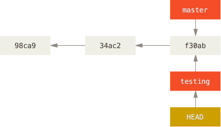

рис.7.11. HEAD вказує на поточну гілку

Після чергової фіксації, гілка testing пересунулась уперед, а гілка master досі вказує на фіксацію, що був у момент виконання `git checkout` для переключення гілок.

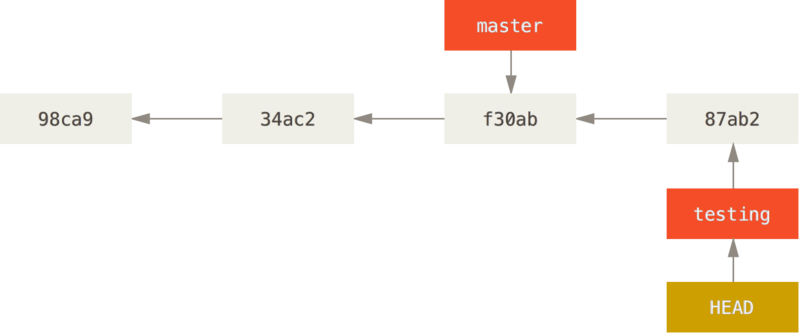

рис.7.12. Гілка testing пересувається уперед при фіксації

Після переключення назад до гілки master:

```bash
git checkout master
```

вказівник HEAD пересувається назад на гілку master, та повертаються файли у робочій папці до стану знімку, на який вказує master. Це також означає, що якщо зараз робляться нові зміни, вони будуть походити від ранішої версії проекту (рис.7.13).

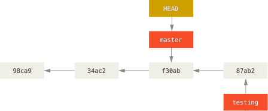

рис.7.13. HEAD пересувається, коли ви отримуєте (checkout)

Важливо зауважити, що коли переключаються гілки в Git, файли у робочій директорії змінюються. Якщо переключитися до старшої гілки, робоча папка буде повернута до того стану, який був на момент останнього фіксування у тій гілці. Якщо Git не може зробити це без проблем, він не дасть переключитися взагалі.

Якщо зробити декілька змін та зафіксувати:

```bash
git commit -a -m 'Зробив інші зміни'
```

то історія проекту розійшлася (diverged) по двом різним гілкам. Ви створили гілку, дещо в ній зробили, переключились на головну гілку та зробили там щось інше. Обидві зміни ізольовані в окремих гілках. Ви можете переключатись між цими гілками та злити їх разом, коли вони будуть готові. І все це робиться за допомогою простих команд `branch`, `checkout` та `commit`.

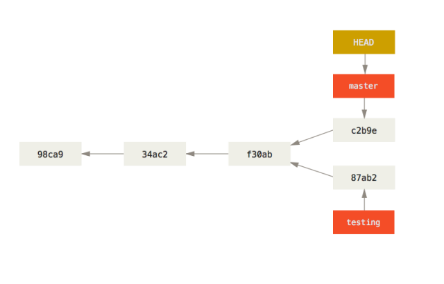

рис.7.14. Розходження історій

Зливання (об'єднання, ***merge***, мердж) гілок покажемо на прикладі. Припустимо є три гілки mster, iss53 і hotfix (рис.7.15).


рис.7.15. Приклад з 3-ма гілками

Для злиття (merge) гілки hotfix до master використовується команда `git merge`. Перед цим за допомогою checkout йде переключення на гілку master

```bash
git checkout master
git merge hotfix
Updating f42c576..3a0874c
Fast-forward
 index.html | 2 ++
 1 file changed, 2 insertions(+)
```

Зверніть увагу на фразу "fast-forward" у цьому злитті. Через те, що коміт C4, який зливався, належав гілці hotfix, що була безпосередньо попереду поточного коміту C2, Git просто переміщує вказівник вперед. Іншими словами, коли ви зливаєте один коміт з іншим, і це можна досягнути слідуючи історії першого коміту, Git просто переставляє вказівник, оскільки немає змін-відмінностей, які потрібно зливати разом - це називається "перемоткою" ("fast-forward"). Тепер це має вигляд як на рис.7.16

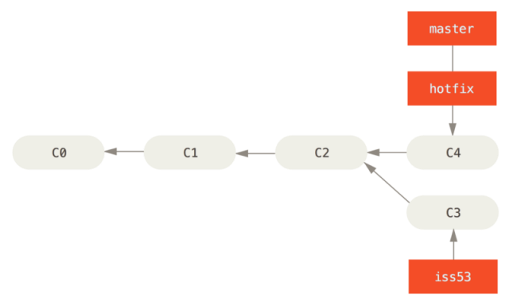

рис.7.16. master перекинутий на hotfix

Для видалення гілки hotfix використовується команда `git branch` з опцією -d:

```bash
git branch -d hotfix
Deleted branch hotfix (3a0874c).
```

Зауважте, що тепер зміни з гілки hotfix відсутні в гілці iss53. Якщо вам потрібні ці зміни підчас роботи над iss53, ви можете злити master з iss53 командою git merge master, або просто почекати до того моменту коли ви будете інтегровувати iss53 в master.

Припустимо, що необхідно злити iss53 з гілкою master. Все що потрібно це перемкнутися на робочу гілку і виконати команду git merge:

```bash
git checkout master
Switched to branch 'master'
git merge iss53
Merge made by the 'recursive' strategy.
index.html |    1 +
1 file changed, 1 insertion(+)
```

Виглядає трошки інакше, ніж те, що було з гілкою hotfix. У цьому випадку історія змін двох гілок почала відрізнятися в якийсь момент. Оскільки коміт поточної гілки не є прямим нащадком гілки, в яку зливаються зміни, Git мусить робити триточкове злиття, користуючись двома знімками, що вказують на гілки та третім знімком - їх спільним нащадком.

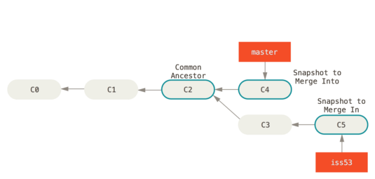

рис.7.17. Три відбитки типового злиття

Замість того, щоб просто пересунути вказівник гілки вперед, Git створює новий знімок, що є результатом 3-точкового злиття, і автоматично створює новий коміт, що вказує на нього. Його називають комітом злиття (merge commit) та його особливістю є те, що він має більше одного батьківського коміту.

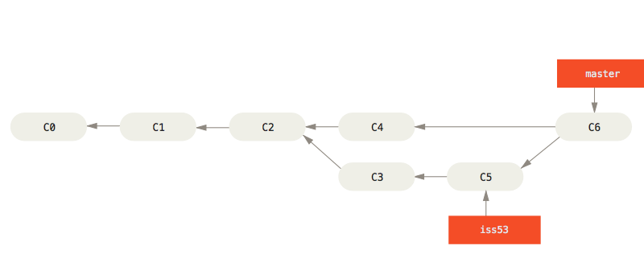

рис.7.18. Коміт злиття

Варто зауважити, що Git сам визначає найбільш підходящого спільного нащадка, якого брати за основу зливання.

Перегляд усіх гілок доступний через команду

```bash
git branch
  iss53
* master
  testing
```

Зверніть увагу на символ \* перед master: це вказівник на вашу поточно вибрану гілку (тобто ту, на котру вказує HEAD). Це означає, що якщо ви зараз захочете зробити коміт, master оновиться вашими новими змінами. Щоб побачити ваші останні коміти - запустіть git branch -v:

```bash
git branch -v
  iss53   93b412c fix javascript issue
* master  7a98805 Merge branch 'iss53'
  testing 782fd34 add scott to the author list in the readmes
```

Опції `--merged` та `--no-merged` корисні для фільтрування списку гілок залежно від того чи вони були злиті з поточною гілкою.

## 7.5. Вирішення конфліктів злиття

Трапляється, що процес злиття не проходить гладко. Якщо ви маєте зміни в одному й тому самому місці в двох різних гілках, Git не зможе їх просто злити. Якщо підчас роботи над `iss53` ви поміняли ту саму частину файлу, що й у гілці `hotfix`, ви отримаєте конфлікт, що виглядає приблизно так:

```bash
git merge iss53
Auto-merging index.html
CONFLICT (content): Merge conflict in index.html
Automatic merge failed; fix conflicts and then commit the result.
```

У цьому випадку Git не створив автоматичний коміт зливання. Він призупинив процес допоки ви не вирішите конфлікт. Для того, щоб переглянути знову які саме файли спричинили конфлікт, спочатку треба переглянути `git status`:

```bash
git status
On branch master
You have unmerged paths.
  (fix conflicts and run "git commit")

Unmerged paths:
  (use "git add <file>..." to mark resolution)

    both modified:      index.html

no changes added to commit (use "git add" and/or "git commit -a")
```

Все, що має конфлікти, які не були вирішені є в списку ***незлитих*** (***unmerged***) файлів. У кожен такий файл Git додає стандартні позначки-вирішенння для конфліктів, отже ви можете відкрити ці файли і вирішити конфлікти самостійно. Якщо ви хочете використовувати графічний інструмент для розв'язання конфліктів, виконайте команду `git mergetool`, яка запустить графічний редактор та проведе вас по всьому процесу.

У вашому файлі з конфліктом появиться блок, схожий на таке:

```html
<<<<<<< HEAD:index.html
<div id="footer">contact : email.support@github.com</div>
=======
<div id="footer">
 please contact us at support@github.com
</div>
>>>>>>> iss53:index.html
```

Розглянемо, як це розуміти. Версія файлу в `HEAD` (з вашої `master` гілки, оскільки ви запустили зливання, будучи на ній) у верхній частині блоку (все вище `=======`), а версія з `iss53` - все, що нижче. Щоб розв’язати цю несумісність, вам потрібно вибрати одну із версій, або самостійно (вручну) поредагувати вміст файлу. Наприклад, ви можете вирішити цей конфілікт, замінивши блок повністю:

```html
<div id="footer">
please contact us at email.support@github.com
</div>
```

В цьому випадку ми взяли потрохи з кожної секції, а стрічки `<<<<<<<`, `=======` та `>>>>>>>` видалили повністю. Після того, як ви розв’язали подібні несумісності в кожному блоці конфліктних файлів, виконайте для них `git add`, щоб індексувати та позначити, як ті, що розв’язані. Індексуючи файл, ви позначаєте його для Git таким, що більше не має конфлікту. Якщо ви хочете використовувати графічний інструмент для розв’язання конфліктів, виконайте команду `git mergetool`, яка запустить графічний редактор та проведе вас по всьому процесу:

```bash
git mergetool

This message is displayed because 'merge.tool' is not configured.
See 'git mergetool --tool-help' or 'git help config' for more details.
'git mergetool' will now attempt to use one of the following tools:
opendiff kdiff3 tkdiff xxdiff meld tortoisemerge gvimdiff diffuse diffmerge ecmerge p4merge araxis bc3 codecompare vimdiff emerge
Merging:
index.html

Normal merge conflict for 'index.html':
  {local}: modified file
  {remote}: modified file
Hit return to start merge resolution tool (opendiff):
```

Для того, щоб використовувати інструмент-програму іншу, ніж по-замовчуванню (Git обрав `opendiff`, оскільки команду було запущено з Mac), подивіться на список сумісних зверху одразу після “one of the following tools.” Просто введіть ім’я потрібного інструменту.

Після того, як ви вийшли з програми для зливання, Git спитає вас чи було зливання успішним. Якщо ви відповісте, що так, Git проіндексує файл для того, щоб позначити файл як безконфліктний. Можете виконати `git status` знову, щоб перевірити чи всі конфлікти розв’язані:

```bash
$ git status
On branch master
All conflicts fixed but you are still merging.
  (use "git commit" to conclude merge)

Changes to be committed:

    modified:   index.html
```

Якщо ви задоволені результатом та перевірили, що всі файли, котрі містили несумісності, проіндексовані, можете виконувати `git commit` і, таким чином, завершувати злиття. Повідомлення після коміту виглядає приблизно так:

```bash
Merge branch 'iss53'

Conflicts:
    index.html
#
# It looks like you may be committing a merge.
# If this is not correct, please remove the file
#	.git/MERGE_HEAD
# and try again.


# Please enter the commit message for your changes. Lines starting
# with '#' will be ignored, and an empty message aborts the commit.
# On branch master
# All conflicts fixed but you are still merging.
#
# Changes to be committed:
#	modified:   index.html
#
```

Якщо ви вважаєте, що це допоможе іншим зрозуміти коміт злиття у  майбутньому, можете змінити його повідомлення — докладно розказати, як  ви розвʼязали конфлікт, чому ви зробили саме такі зміни, якщо це й без  того не є очевидним.

Детальніше про роботу з Git читайте в українському варіанті онлайн книги [Pro Git](https://git-scm.com/book/uk/v2)

## Запитання для самоперевірки

1. Поясніть призначення систем керування версіями.
2. Які принципи функціонування централізованих та розподілених системи керування версіями? 
3. Які принципи функціонування Git? 
4. Що таке stage, commit?
5. Що таке tracked файли в Git? Як можна задати які файли будуть tracked?
6. Розкажіть про основні принципи роботи з галуженнями.
7. Що робить команда checkout в Git?
8. Розкажіть про принципи об'єднання (merge) гілок.
9. Розкажіть про причину виникнення конфліктів зливання та спосіб їх вирішення.

| [<- до лекцій](README.md) | [на основну сторінку курсу](../README.md) |
| ------------------------- | ----------------------------------------- |
|                           |                                           |