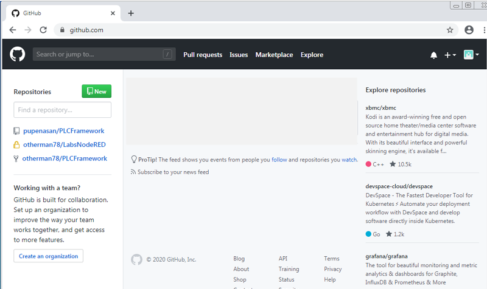
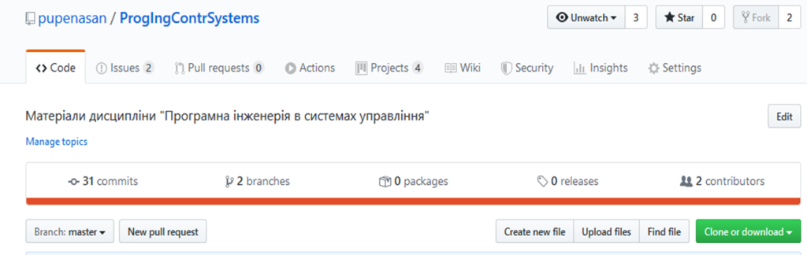
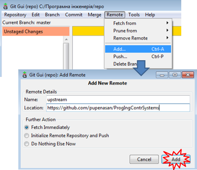
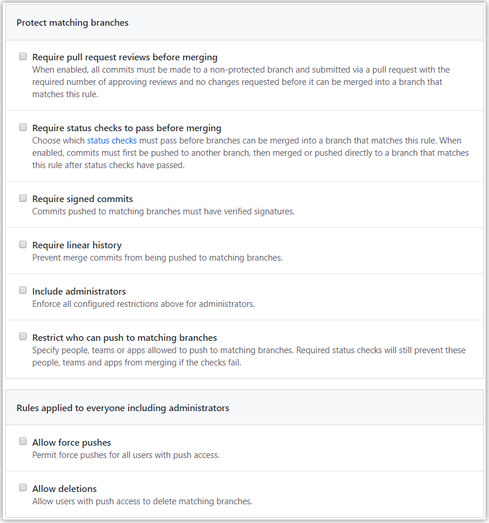

**Програмна інженерія в системах управління. Лекції.** Автор і лектор: Олександр Пупена 

| [<- до лекцій](README.md) | [на основну сторінку курсу](../README.md) |
| ------------------------- | ----------------------------------------- |
|                           |                                           |

# 8. Робота з віддаленими сховищами в Git/GitHub

## 8.1. Загальні основи використання GitHub

**GitHub** - це найбільший хостинг для сховищ (репозиторіїв) Git, та є центром співпраці між мільйонами розробників та проектів. Великий відсоток усіх сховищ Git мають в якості віддаленого сховища GitHub. Багато проектів з відкритим кодом використовують його задля Git хостингу, керування завданнями, перегляду коду та для багато чого іншого.

Для користування GitHub треба створити безкоштовний обліковий запис: зайти до https://github.com, обрати ім’я користувача, якого ще ні в кого немає, надати адресу  електронної пошти та пароль, натиснути на кнопку “Sign up  for Github” (Зареєструватись на Github). Після цього можна авторизовуватися щойно створеними ім’ям та паролем та зв’язуватися з Git сховищами за допомогою протоколу `https://` або `SSH`. Тим не менше, щоб просто клонувати публічні проекти, не треба навіть  реєструватися. Облікові записи необхідні тоді, коли необхідно створювати власні сховища та викладати до них зміни. 

Після реєстрації, перейшовши на основну сторінку GitHub (можна у будь який момент натиснути на зображення "котика"), на лівій бічній панелі можна подивитися список усіх доступних репозиторіїв та створити новий репозиторій. У правій частині екрану відображається репозиторії, які можуть Вас зацікавити. У центральній частині відображаються останні активності пов'язані з Вашим обліковим записом.     



рис.8.1. Зовнішній вигляд WEB-інтерфейсу GitHub

Вибравши відповідний пункту меню в верху екрану можна перейти на активні (не закриті) по всім репозиторіям запити на пул (pull requests), питань для обговорень (issues), застосунки для використання (Marketplace), оглянути цікавинки в репозиторіях інших собі чи організацій (Explore). Деякі з цих діяльностей  будуть розглядатися в наступних лекціях. 

Кнопки в правому верхньому кутку дозволяють: 

- (дзвіночок) - передивитися нові повідомлення; 
- (+) - доступитися до команд створення/імпорту репозиторію, проекту;
- (зображення користувача) - доступитися до сторінок стану та налаштувань свого користувача;   

GitHub виділяє кілька типів репозиторіїв в залежності від необхідного доступу: приватні (***private***), публічні (***public***) та внутрішні (***internal***). GitHub надає увесь свій функціонал безкоштовно, з тим обмеженням, що всі сховища повністю публічні (усі мають доступ на читання). Оплачувані послуги також пропонують можливість створювати приватні  сховища, які доступні безкоштовно в лімітованому варіанті. Надалі приватні сховища  не обговорюються.

Для сховища доступні різноманітні сервіси, які пов'язані не тільки з функціями керування версіями. На рис. 8.2 показаний зовнішній вигляд вікна керування сховищем для дисципліни "Програмна інженерія в системах управління".    



рис.8.2. Закладки вікна репозиторію

GitHub пропонує наступні основні функції роботи з репозиторієм (див.рис.8.2):

- `Code` - перегляд змісту сховища, файлів будь-якого коміту з будь-якої гілки; змістом може бути не тільки код, а будь які інші файли;   
- `Issues` - постановка і обговорення питань, що мають відношення до сховища;
- `Pull requests` - запити на пул (наприклад для об'єднання гілок);
- `Actions` - автоматизація дій з кодом сховища(workflow): побудова (компілювання), тестування, розгортання на цільовій або тестових середовищах виконання; 
- `Projects` - робота з проектами по методології "Канбан"; 
- `Wiki` - створення Вікісторінок для проекту;
- `Security` - налаштування політик безпеки для сховища;
- `Insights` - перегляд аналітики по сховищу;
- `Settings` - налаштування сховища.

Поступово в цій та інших лекціях, більшість з цих функцій будуть розглядатися.

Прийнято щоб в кореневій папці (та і у включених папках репозиторію) вміщувався файл README в форматі MD. У цьому випадку вміст файлу автоматично показується в нижній частині екрану. У цьому файлі як правило розміщують інформацію про ліцензію використання репозиторію, налаштування-рекомендації для учасників, кодекс поведінки та інше, що повідомляти про проект та очікування щодо участі в ньому.   

## 8.2. Загальні основи командної роботи

До репозиторіїв можна добавляти користувачів як ***співавторів*** сховища (***collaborate***), які матимуть права на запис. Для приватних репозиторіїв добавлені користувачі також матимуть доступ до читання (для публічних будь хто має право читати), а  кількість співавторів команди в безкоштовному користуванні є обмеженою. Якщо не налаштовані обмеження на гілки (див. налаштування захисту гілок), будь хто зі співавторів може робити в них зміни (push). Тому, в загальному, при роботі в команді з одним репозиторієм прийняті наступні рекомендації:  

1. Створюється нова гілка в локальному репозиторії. 
2. Редагуються файли та робиться коміт. Надсилаються зміни у віддалений репозиторій на GitHub (push).    
3. Робиться (відкривається) запит на Пул з редагованої гілки з пропозиціями змін (на об'єднання гілок) та/або для початку дискусії. Цей запит не обов'язково проводиться в час необхідності об'єднання (мерджа), він може ініціюватися для обговорення, або прохання допомоги, тощо.    
4. У результаті обговорення, при необхідності, робляться певні зміни в гілці. Робиться коміт і пуш. Запит на пул оновлюється автоматично.
5. За готовності гілки до об'єднання, проводиться зливання (мердж) відповідно до запиту на Пул . 
6. Прибирається гілка методом видалення на сторінці запита на пул або самої гілки.

Цей процес графічно показаний [за посиланням](https://guides.github.com/introduction/flow/).  Додатково можна почитати [англомовну документацію](https://help.github.com/en/github/collaborating-with-issues-and-pull-requests/overview) щодо командної роботи.

Є ще варіант сумісної роботи через форк (умовно створення копії) репозиторію, в якій ведуться всі зміни, після чого можна робити їх синхронізацію. Про це - нижче.  

**Запит на пул (Pull request)** - це пропозиція користувача на внесення зміни до певної гілки сховища GitHub, як правило способом об'єднання (мерджа) з іншою гілкою. Вони можуть бути прийняті або відхилені співавторами сховища, які мають на це право. Як тільки створено запит на пул, може проводитися дискусія щодо змін, неодноразове внесення наступних змін в гілці запиту, після чого  гілка може бути об'єднана (змерджена) з базовою гілкою, або запит може бути скасовано (закрито) без внесення змін.  Подібно до завдання (issues), запити на пул мають свій окремий форум для обговорення. Запити на пул можуть зв'язуватися також з завданнями.  

Спосіб використання запитів на Пул залежить від типу моделі розробки, яка використовується у проекті. Є дві основні типи моделей командної розробки, з якими можна використовувати запити на Пул:

1. ***Shared repository model*** (***модель загально-доступного репозиторію***): співавторам надається простий доступ до одного спільного сховища, а коли потрібно внести зміни - тоді створюються  тематичні гілки, які об'єднуються у результаті підтвердження запитів на пул. Запит на пул у цій моделі ініціює перегляд коду та загальну дискусію про необхідні зміни перед об'єднанням у основну розроблювальну гілку. Ця модель є більш поширеною для роботи в невеликих командах та організаціях над приватними проектами. У такій моделі варто налаштувати захист основних гілок від несанкціонованих змін, у цьому випадку в захищені гілки можуть вноситися зміни тільки за певних умов (див. налаштування захисту гілок). 
2. ***Fork and pull model*** (***модель форку та пулу***): кожен може зробити форк (копію) наявного сховища та надіслати (push) зміни на свій особистий форк, не потребуючи доступу до вихідного сховища, після чого репозиторії синхронізуються шляхом запитів на пул. Запити на пул відкриваютья для пропозиції зміни з гілки форку на гілку в сховищі джерела (upstream). Можна дозволити, щоб будь-хто, хто має push-доступ до upstream-сховища, міг вносити зміни у цей запит на пул. Ця модель користується популярністю у проектах з відкритим кодом, оскільки вона не створює додаткового опору для нових учасників та дозволяє людям працювати самостійно без попередньої координації.

## 8.3. Робота з форками 

Якщо є бажання зробити внесок до існуючого публічного сховища, проте у користувача немає  права на це, він можете створити для себе ***форк*** (***`fork`***) цього репозиторію. У цьому випадку GitHub створює копію цього сховища, що є існує в просторі імен користувача, який може викладати до неї зміни. Форк дозволяє вносити зміни в репозиторій, не впливаючи на оригінальне (вихідне) сховище. Користувач може отримувати оновлення з оригінального сховища або надсилати зміни з нього з допомогою ***запитів на пул*** (pull requests).

Хоч створення форку оригінального сховища подібне до створення його копії, між ними залишається зв'язок, який дає можливість:

- використовувати запит на пул, щоб запропонувати зміни від форку до ***оригінального*** сховища, також відомого як ***upstream***-сховище;
- вносити зміни з upstream-сховища до локального форку шляхом синхронізації;

Видалення форку не видаляє оригінальне upstream сховище. Можна вносити будь-які зміни у форк  - додавати співавторів, перейменувати файли, генерувати сторінки GitHub - не впливаючи на upstream-сховище. Однак не можна відновити сховище форк після його видалення. 

У проектах з відкритим кодом форки часто використовуються для повторення ідей або змін до того, як вони будуть запропоновані назад у upstream-сховище. Після внесення змін у форк, можна відкрити запит на пул для порівняння сховища форку з upstream-сховищем. Це може надати можливість надсилати запити на зміни до гілки форку будь-кому, хто має доступ на зміни до upstream-сховища. Це прискорює співпрацю, дозволяючи підтримуючим репозиторіям можливість локально робити коміти або запускати тести, перед тим як зробити запит на пул для об'єднання (мерджа). 

При необхідності створення копії наявного сховища без необхідності в майбутньому синхронізації та об'єднання гілок з upstream-сховищем, використовується дублювання (duplicate ) репозиторію. Можна також використовувати сховище як шаблон. Для отримання додаткової інформації див. [Дублювання сховища](https://help.github.com/en/articles/duplicating-a-repository) та [Створення репозиторію з шаблону](https://help.github.com/en/github/creating-cloning-and-archiving-repositories/creating-a-template-repository) 

Ви повинні сконфігурувати в Git підключення локального репозиторію до віддаленого оригінального (upstream) сховища  для синхронізації змін, що Ви робите у вашому форку для зміни їх в оригінальному репозиторію. Це також дозволить синхронізувати зміни у форку при зміні їх у оригінальному репозиторію. 

Для Windows через Git Bash:            

1. Відкрийте Git Bash.

2. Виведіть список сконфігурованих на даний момент відділених репозиторіїв для форка.

   ```shell
   git remote -v
   > origin  https://github.com/YOUR_USERNAME/YOUR_FORK.git (fetch)
   > origin  https://github.com/YOUR_USERNAME/YOUR_FORK.git (push)
   ```

3. Вкажіть новий віддалений оригніальний (*upstream* ) репозиторій  щоб можна було синхронізувати Ваш форк зі змінами в ньому.

   ```shell
   git remote add upstream https://github.com/ORIGINAL_OWNER/ORIGINAL_REPOSITORY.git
   ```

4. Перевірте нове сховище, яке ви вказали для свого форку. 

   ```shell
   git remote -v
   > origin    https://github.com/YOUR_USERNAME/YOUR_FORK.git (fetch)
   > origin    https://github.com/YOUR_USERNAME/YOUR_FORK.git (push)
   > upstream  https://github.com/ORIGINAL_OWNER/ORIGINAL_REPOSITORY.git (fetch)
   > upstream  https://github.com/ORIGINAL_OWNER/ORIGINAL_REPOSITORY.git (push)
   ```

Для Windows через Git Gui:     

1. Відкрийте Git Gui.
2. Вкажіть новий віддалений оригніальний (*upstream* ) репозиторій  щоб можна було синхронізувати Ваш форк зі змінами в ньому, наприклад.

 

рис.8.3. Добавлення репозиорію.

Після добавлення в конфігурації посилання на віддаленний репозиторій, можна синхронізувати з ним локальний репозиторй. У  Git Bash це робиться наступним чином                    

1. Відкрийте Git Bash.

2. Перейдіть на необхідну робочу директорію.

3. Отримайте нові дані (комміти) з віддаленого `upstream` сховища через команду `fetch` . У результаті комміти з `master` оригінального `upstream` будуть збережені в локальній папці `upstream/master`.

   ```shell
   git fetch upstream
   > remote: Counting objects: 75, done.
   > remote: Compressing objects: 100% (53/53), done.
   > remote: Total 62 (delta 27), reused 44 (delta 9)
   > Unpacking objects: 100% (62/62), done.
   > From https://github.com/ORIGINAL_OWNER/ORIGINAL_REPOSITORY
   >  * [new branch]      master     -> upstream/master
   ```

4. Перейдіть (Check out) на вашу локальну гілку форка `master` .

   ```shell
   git checkout master
   > Switched to branch 'master'
   ```

5. Злийте (Merge) зміни з `upstream/master` у локальну гілку  `master`. Це приводить гілку  `master` вашого форка синхронізованою до оригінального сховища, не втрачаючи локальних змін.

   ```shell
   git merge upstream/master
   > Updating a422352..5fdff0f
   > Fast-forward
   >  README                    |    9 -------
   >  README.md                 |    7 ++++++
   >  2 files changed, 7 insertions(+), 9 deletions(-)
   >  delete mode 100644 README
   >  create mode 100644 README.md
   ```

    If your local branch didn't have any unique commits, Git will instead perform a "fast-forward":  

   Якщо у вашої локальної гілки не було жодних унікальних комітів, Git замість цього здійснить "швидку перемотку" ("fast-forward"):

   ```shell
   git merge upstream/master
   > Updating 34e91da..16c56ad
   > Fast-forward
   >  README.md                 |    5 +++--
   >  1 file changed, 3 insertions(+), 2 deletions(-)
   ```

Зверніться до [довідникової системи GitHub](https://help.github.com/en/github/collaborating-with-issues-and-pull-requests/about-forks) для детального вивчення матеріалу.

## 8.4. Налаштування доступу та захисту 

***Захищені гілки*** (***Protected branches***) гарантують, що співавтори сховища не можуть внести безпосередньо зміни до гілок. Також це дозволяє ввімкнути інші необов'язкові перевірки та вимоги, наприклад, потреба в перевірці стану та необхідні огляди.

За замовчуванням будь-який запит на Пул можна об’єднати (змерджити) в будь-який час, якщо тільки гілка не суперечить базовій гілці. Можна застосувати обмеження щодо об'єднання через запит на Пул зі сховищем. Власники репозиторію та люди, які мають права адміністратора для сховища, можуть забезпечити виконання певних робочих процесів або вимог, створивши правила захищеної гілки.  Адміністратор може створити  у сховищі правило для певної гілки, усіх гілок чи будь-якої гілки, яка відповідає ***шаблону іменування*** (***Branch name pattern***), визначеному синтаксисом fnmatch. Наприклад, можна вимагати щоб у будь-якої гілки, що містить слово `release`, перед об'єднанням було щонайменше два огляди запиту на пул. у цьому випадку ви можете створити правило для гілки ` *release* `.  Якщо у сховищі є кілька правил захищених гілок, які впливають на одні і ті ж гілки, правила, які містять конкретну назву гілки, мають найвищий пріоритет. Коли адміністратор створює правило захисту гілки в сховищі, співавтори не можуть змусити надіслати зміни (пуш) на захищену гілку або видалити гілку за замовчуванням. 

Правила створюються та редагуються у налаштуваннях репозиторію Settings -> Branches. 



рис.8.4. Вікно налаштування захисту репозиторію

Вимога переглядів гарантує, що перш ніж співавтори можуть вносити зміни до захищеної гілки, запити на пул матимуть певну кількість схвальних відгуків. Адміністратори репозиторію можуть вимагати, щоб усі запити на пул перш ніж вони об’єднаються у захищену гілку отримували певну кількість схвальних відгуків від людей, які мають у сховищі дозволи *write* або *admin*, або від призначеного власника коду.  Якщо особа з дозволами *admin* у перегляді обирає опцію **Request changes**, тоді ця особа повинна схвалити запит на пул, перш ніж його можна буде об'єднати. Якщо рецензент, який вимагає зміни на запит на пул недоступний, кожен, хто має дозволи *admin* або *write* для сховища, може відхилити blocking review. 

Якщо ви застосували захист гілок у вашому сховищі, ви можете встановити необхідні перевірки статусу. Після ввімкнення повинні пройти всі необхідні перевірки стану, перш ніж гілки можуть бути об'єднані в захищену гілку.   

Ви можете застосувати обмеження для гілок, щоб лише певні користувачі, команди чи застосунки могли переходити до захищеної гілки у сховищах, що належать вашій організації. У ліцензії GitHub Free захист гілок доступний тільки для публічних сховищ. 

Ви можете надати доступ до надсилання змін (push) захищеної гілки лише користувачам, командам або встановленим застосункам GitHub Apps із доступом `write` до сховища. Люди та застосунки, що мають права адміністратора до сховища, завжди можуть перейти до захищеної гілки, за винятком, якщо в обмеженнях буде стояти "Include administrators".

Детально українською про GitHub Ви можете прочитати [за посиланням](https://git-scm.com/book/uk/v2/GitHub-%D0%A1%D1%82%D0%B2%D0%BE%D1%80%D0%B5%D0%BD%D0%BD%D1%8F-%D1%82%D0%B0-%D0%BD%D0%B0%D0%BB%D0%B0%D1%88%D1%82%D1%83%D0%B2%D0%B0%D0%BD%D0%BD%D1%8F-%D0%BE%D0%B1%D0%BB%D1%96%D0%BA%D0%BE%D0%B2%D0%BE%D0%B3%D0%BE-%D0%B7%D0%B0%D0%BF%D0%B8%D1%81%D1%83), довідникова система англійською -  за [цим](https://help.github.com/en/github) посиланням.

## Запитання для самоперевірки

1. Яке призначення GitHub? 
2. Які типи репозиторіїв доступні в GitHub?
3. Які функції роботи з репозиторієм пропонує GitHub?
4. Розкажіть про основні принципи командної роботи з одним репозиторієм в GitHub.
5. Поясніть що таке `Pull request`? Як відбувається робота зі змінами в межах одного `Pull request`?
6. Які типи моделей розробки можна використовувати для сумісної роботи в межах одного репозиторію в GitHub?
7. Поясніть що таке форк репозиторію? 
8. Як відбувається робота в межах форку та синхронізація з основним репозиторієм?
9. Як відбувається оновлення форку даними з основного репозиторію? 
10. Розкажіть про механізм налаштування доступу до внесення змін в гілки.     

| [<- до лекцій](README.md) | [на основну сторінку курсу](../README.md) |
| ------------------------- | ----------------------------------------- |
|                           |                                           |

