**Програмна інженерія в системах управління. Лекції.** Автор і лектор: Олександр Пупена 

| [<- до лекцій](README.md) | [на основну сторінку курсу](../README.md) |
| ------------------------- | ----------------------------------------- |
|                           |                                           |

# 9. Апаратне забезпечення Raspberry PI 3

## 9.1. Загальні характеристики та призначення

[https://www.raspberrypi.org](https://www.raspberrypi.org/)

Raspberry Pi (читається як Ра́збері па́й; буквально: укр. малиновий пиріг, надалі **RPI**) — одноплатний комп'ютер, розроблений британським фондом Raspberry Pi Foundation. Головне призначення — сприяти вивченню базових комп'ютерних навичок школярами. Модельний ряд цих комп'ютерів постійно оновлюється, але їх вартість варіюється в районі 50$, що дозволяє їх використовувати у різноманітних застосуваннях у тому числі IoT. 

На рис.9.1 показаний зовнішній вигляд плати  Raspberry PI версії 3 без корпусу.

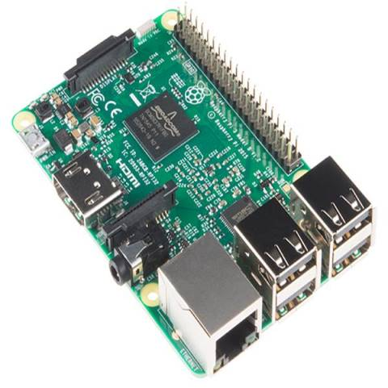

рис.9.1. Загальний вигляд Raspberry PI без корпусу.

На момент написання остання версія **Raspberry Pi 4 Model B** - четверте покоління  основної лінійки міні-комп'ютерів від Raspberry Pi Foundation. На цей час існує три варіанти комплектації, що розрізняються між собою обсягом  оперативної пам'яті: **2G**, **4G** і **8G** **LPDDR4-3200 SDRAM**. Серцем даних платформ є 4х ядерний Х64-bit Cortex-A72 Broadcom  (BCM2711B0) ARM-v8 SoC 1.5GHz процесор. На борту з'явилися два  USB порти 3.0, тепер в розпорядженні користувача два USB 2.0 і два USB  3.0 проти чотирьох USB 2.0 встановлених на Rpi 3 B/B+. Зміні піддався і HDMI роз'єм, його змінили два micro-HDMI з підтримкою роздільної  здатності 4Kp60. Так само модуль бездротового зв'язку отримав підтримку дводіапазонного Wi-Fi (стандарт IEEE 802.11ac) з підтримкою Bluetooth 5.0. І на завершення, роз'єм живлення USB-Type-C змінив свого попередника micro-USB.

Не варто забувати, що з новим процесором і його тактовою частотою,  зросла і робоча температура. З цієї причини настійно рекомендується  встановлювати хороше пасивне або активне охолодження. В іншому випадку,  комп'ютер буде грітися, що своєю чергою буде приводити до не бажаних  наслідків.

Важливим фактором є і джерело живлення. В якості джерела живлення варто використовувати тільки якісні блоки живлення, з характеристиками 5В -  3А. Використання неякісних блоків живлення або зарядних пристроїв  мобільних телефонів призводить до виходу з ладу внутрішнього джерела  живлення і не є гарантійним випадком! Максимальне значення вхідної  напруги живлення становить 5.5В. При вхідній напрузі 6В (навіть  імпульсному) мікросхема перетворювача напруги гарантовано вийде з ладу.  До подібного результату призведе замикання будь-якого виходу  внутрішнього перетворювача напруги на землю.

В якості операційної системи, користувач може використовувати, як  Raspberry Pi OS (Raspbian) або інші збірки операційних систем засновані  на базі Linux систем.

Оскільки вхідні схеми живлення виконана в спрощеному варіанті  інтерфейсу USB-C не всі блоки живлення коректно працюють з Raspberry Pi  4. У останніх редакціях міні-комп'ютера даний недолік виправлений.

На рис. 9.2 показані основні компоненти Raspberry PI 4 включаючи інтерфейси. Основні характеристики даної моделі:

- Процесор: 1.5 ГГц 64-бітний чотирьохядерний процесор ARM Cortex-A72
- Об'єм оперативної пам'яті: 2, 4 або 8ГБ LPDDR4 SDRAM
- Мережеві інтерфейси: 	
  - Гігабітний Ethernet з повною пропускною спроможністю інтерфейсу
  - Двохдіапазонна бездротова мережа 802.11ac
  - Bluetooth 5.0
- USB порти: 	
  - Два порти USB 3.0
  - Два порти USB 2.0
- Відеовихід: два micro-HDMI з підтримкою двох моніторів з роздільною здатністю до 4K
- Графічний інтерфейс: VideoCore VI, що підтримує OpenGL ES 3.x
- Апаратне декодування 4Kp60 відео HEVC
- Сумісність: Повна сумісність з більш ранніми продуктами Raspberry Pi
- Роз'єм живлення: USB-C
- Напруга живлення: 5В
- Додаткове живлення: Ethernet PoE Hat
- Максимальний споживаний струм: 3А
- Розширений 40-контактний роз'єм GPIO

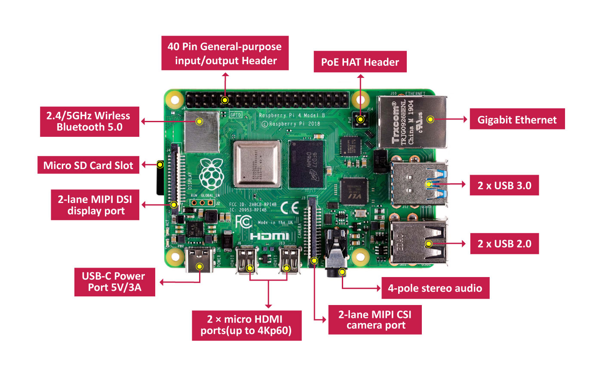

рис.9.2. Компоненти Raspberry PI 4.

До базової комплектації можна віднести плату комп'ютера, блок живлення та карта MicroSD. Усе інше підбирається в залежності від задачі.  

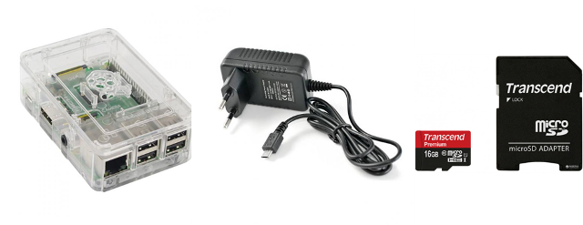

рис.9.3. Базова комплектація Raspberry PI 

Підключення периферії можна проводити як через наявні інтерфейси так і через контакти роз'єму [GPIO - General-purpose input/output](https://uk.wikipedia.org/wiki/GPIO) . Призначення контактів GPIO для Raspberry PI  показано на рис.9.4 а також доступне [за посиланням](https://www.raspberrypi.org/documentation/usage/gpio/)

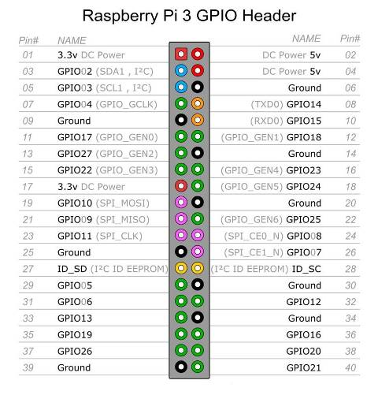

рис.9.4. Призначення контактів GPIO на Raspberry PI 

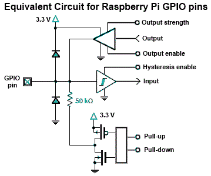

рис.9.5. Принципова схема GPIO на Raspberry PI 

## 9.2. Типи сигналів

У залежності від характеру інформації, яку необхідно отримати або видати, вона кодується в різних формах. 

**Аналогові сигнали** – характеризуються тільки діапазоном значень і є неперервними в часі. Так, наприклад, у резистивних датчиках температури при зміні температури змінюєтья значення опору. Ця зміна неперервна в часі і в значенні.   

**Дискретні сигнали** - характеризуються кінцевою множиною (набором) значень. Тобто сигнал може приймати конкретне значення з цього набору. Надалі вважатимемо що **дискретні сигнали** можуть приймати тільки два значення: «ТАК»/«НІ», 1/0, “TRUE”/”FALSE”, «ВКЛ»/«ВИКЛ»і т.д. Так наприклад, якщо треба дізнатися чи відкрити двері можна скористатися герконовим реле, в якому магніт замикає контакт. Якщо до контакту підвести живлення, то коли він буде замкнутий по ланцюгу піде струм, якщо ні - не піде. Ці два стани (є струм і немає струму) і використовуються як дискретні сигнали.  

Якщо інформацію необхідно отримати з датчика, то для RPI це буде вхідним сигналом. Якщо навпаки, необхідно керувати чимось, наприклад включити якесь реле, то це буде вихідним сигналом. Таким чином, у на  GPIO RPI  можуть бути використані: 

- Дискретні (цифрові) входи – Digital Inputs
- Дискретні (цифрові виходи) – Digital Outputs
- Аналогові входи – Analog Inputs (у RPI3 відсутні)
- Аналогові виходи – Analog Outputs (у RPI3 відсутні)

Цифрова техніка працює з цифровим сигналом, в якому все кодується як комбінація "0" та "1". Так, наприклад значення 254 у десятковому кодується як "11111110" у двійковому. Для того щоб аналоговий сигнал, який є неперервним як за часом (continuous time) так і за значенням (continuous value) мав цифрову форму його перетворюють на спеціалізованих платах - АЦП (аналогово-цифрових перетворювачах). Це робиться в кілька тактів (рис.9.6): значення модулюється за рівнем, тобто приводиться до певних дискретних значень в діапазоні розмірностей, яка визначається розрядністю АЦП. 

Так, наприклад, якщо розрядність АЦП дорівнює 8 біт, то кількість значень буде 256 (0..255). Тобто, якщо з датчика отримується значення в діапазоні від 0 до 10 Вольт, то АЦП може його оцифрувати з точністю до 10/256= 0,04 Вольта. При цьому рівень в приблизно 5 вольт буде відповідати або значенню 127 або 128, але ніяк не 127,5 . Зрозуміло, що точність такого представлення залежить від розрядності АЦП, тому чим розрядність вище - тим точніше йде перетворення. Перетворення з аналогової форми в цифрову відбувається з певною частотою а не неперервно за часом. Перетворенням з аналогової форми в цифрову займається цифроаналогові перетворювачі (ЦАП). 

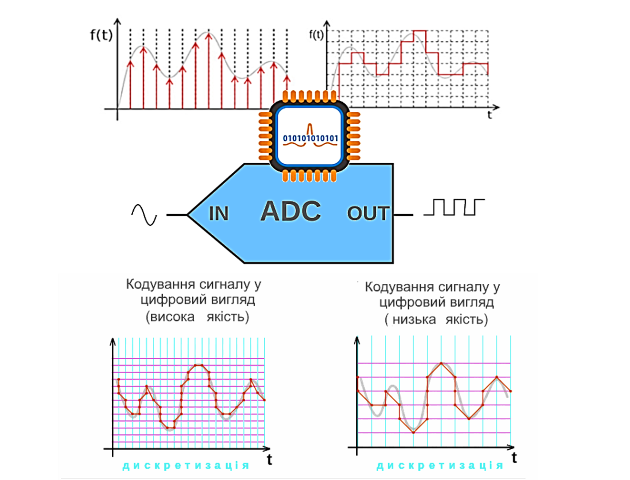

рис.9.6. Аналогово-цифрове перетворення.

З дискретними сигналами перетворення як правило зводиться до підсилення або послаблення сигналу та їх розділення по ланцюгам живлення. Таке розділення називається гальванічною розв'язкою і може проводитися різними способами. На рис.9.7 показана розв'язка дискретного входу через оптопару (optocoupler), яка є комбінацією фотодіода та світлодіода. Коли через контур зі світлодіодом проходить струм він замикає контур з фотодіодом. Така схема є дуже популярною і використовується в промислових контролерах (PLC), які будуть даватися на старших курсах.     

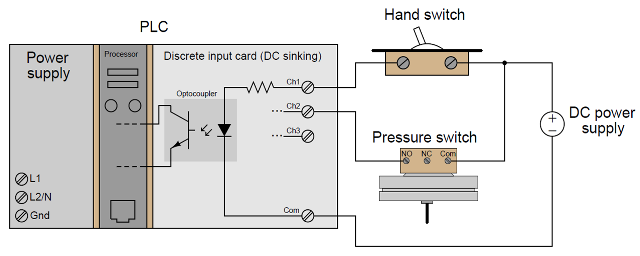

рис.9.7. Приклад реалізації дискретних входів з гальванічною розв'язкою через оптопару.  

На рис.9.8 показана реалізація дискретних виходів через оптопару, а на рис.9.9 через проміжне реле. 

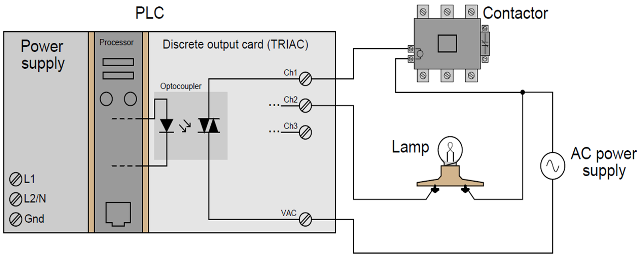

рис.9.8. Приклад реалізації дискретних виходів з гальванічною розв'язкою через оптопару та .  

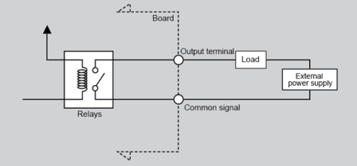

рис.9.9. Приклад реалізації дискретних виходів з гальванічною розв'язкою через реле.  

Додатково до аналогових і дискретних способів представлення інформації, сигнал може кодуватися часом активності (шириною імпульсу) дискретного сигналу. Так, наприклад, якщо спіраль в електричних нагрівачах буде під напругою, вона поступово буде нагріватися до певної температури. Якщо напругу зняти - вона буде охолоджуватися. Якщо напругу подавати на короткі моменти, то спіраль не буде встигати нагріватися до максимуму. Таким чином змінюючи час на який буде включатися подача напруги на спіраль можна керувати ступеню нагрівання. Перетворення аналогового сигналу в імпульсний з певною шириною імпульсу називається широтно-імпульсною модуляцією (**ШІМ**, **PWM** (pulse-wide modulation) (рис.9.10)

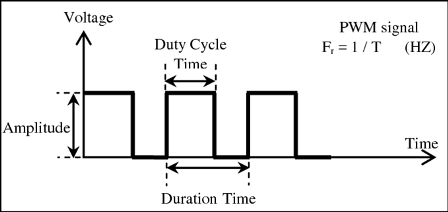

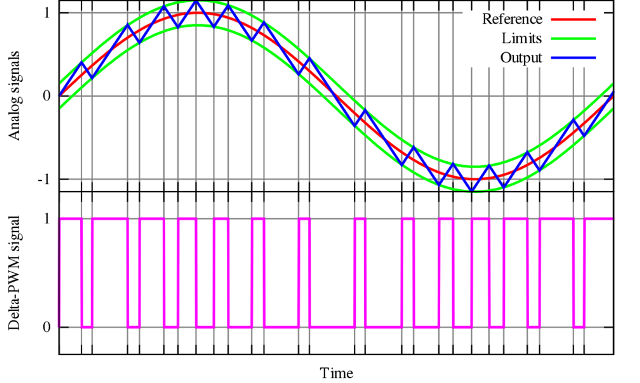

рис.9.10. Приклад широтноімпульсної модуляції. 

Контакти GPIO в RPI не призначені для підключення зовнішніх датчиків безпосередньо, так як знаходяться близько один до одного і до плати.  Для можливості фізичного підключення сигналів до контактів в прототипах можна  використовувати макетну плату, яка через спеціальні провідні перемички підключається до GPIO (9.11).

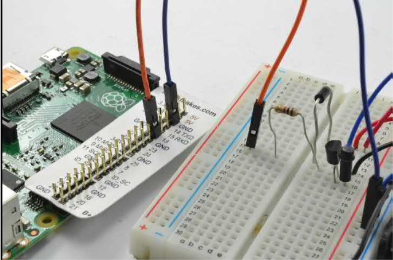

рис.9.11. Приклад підключення макетної плати до GPIO 

## 9.3. Приклади роботи з цифровими та аналоговими сигналами 

На рис.9.12 показаний простий приклад підключення світлодіоду до GPIO. Окрім світлодіода, монтажної плати та перемичок використовується  резистор для зменшення струму в колі. 

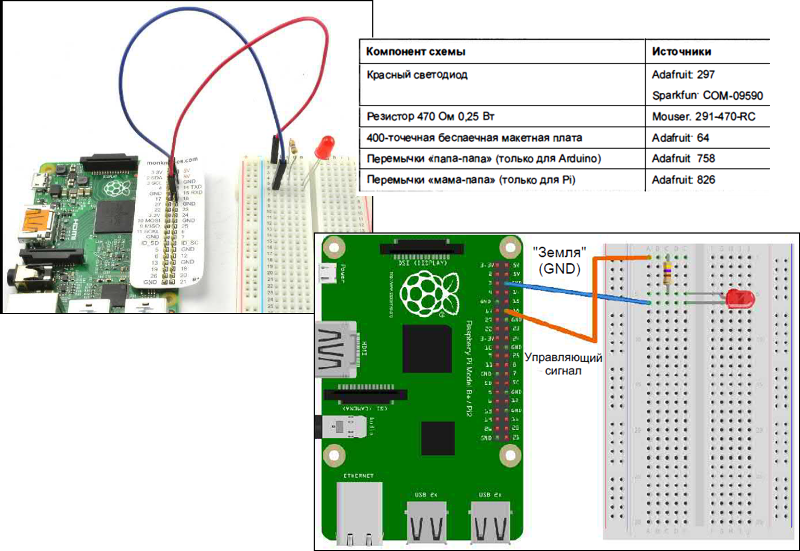

рис.9.12. Монтажна схема підключення світлодіода до GPIO 

Приклад програми керування світлодіодом показано на рис.9.13. З бібліотеки GPIO вибирається вузол PIN у якому вибирається номер піну та його тип. Світлодіод керується дискретним виходом, тому вибирається Type "Digital output". Можна вказати значення ініціалізації виходу при старті Node-RED.     

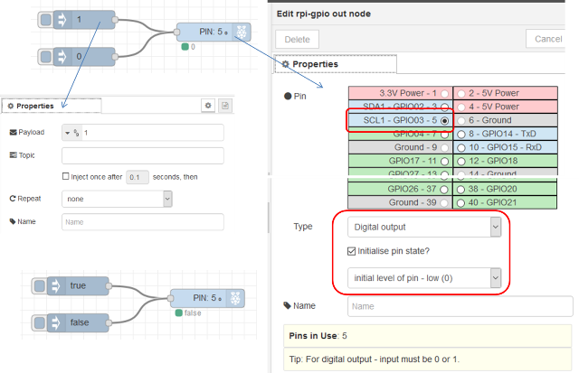

рис.9.13. Реалізація простої програми керування світлодіодом в Node-RED

## 9.4. Комунікаційні інтерфейси 

Окрім дискретних та аналогових сигналів GPIO, деякі контакти використовуються для підключення цифрових інтерфейсів шин. Тут коротко ознайомимося з деякими з них. 

**Інтерфейс I²C (розробник Philips)**

Кожний підключений до лінії I²C пристрій (Ведений, Slave) має власну адресу, до якої до неї підключається Raspberry Pi  (Ведучий, Master). Швидкість 400 кбіт/с, 100 кбіт/с, 10 кбіт/с (є і до 3,4 Мбіт/с), кількість пристроїв (до 127 – стара версія, 1024 – нова версія), кілька метрів (рис.9.14) .

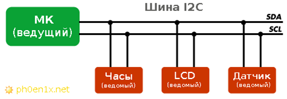

рис.9.14. Шина I2C

**One-wire**

1-Wire подібна за концепцією на I²C, але із меншою швидкістю передачі даних (9600 біт/с) на більшу відстань (100-500 м). Вона зазвичай використовується для зв'язку із малими недорогими пристроями, такими як цифрові термометри і погодні пристрої.  Однією відмінною особливістю цієї шини є можливість використання лише двох проводів: для даних і землі (рис.9.15-9.16). Детальніше можна прочитати [за посиланням](http://mikrotik.kpi.ua/index.php/courses-list/category-python/117-connecting-sensors-with-1-wire-to-raspberry-pi-lesson-20)[Wire ](http://mikrotik.kpi.ua/index.php/courses-list/category-python/117-connecting-sensors-with-1-wire-to-raspberry-pi-lesson-20)[до ](http://mikrotik.kpi.ua/index.php/courses-list/category-python/117-connecting-sensors-with-1-wire-to-raspberry-pi-lesson-20)[Raspberry Pi | ](http://mikrotik.kpi.ua/index.php/courses-list/category-python/117-connecting-sensors-with-1-wire-to-raspberry-pi-lesson-20)[Заняття 20 ](http://mikrotik.kpi.ua/index.php/courses-list/category-python/117-connecting-sensors-with-1-wire-to-raspberry-pi-lesson-20)

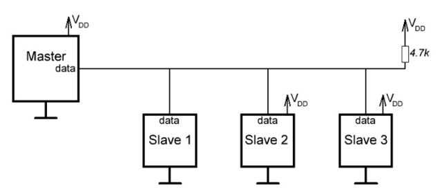

рис.9.15. Структура шини One-wire

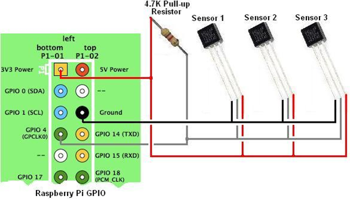

рис.9.16. Приклад використання One-wire з датчиками температури

**Інтерфейс SPI**

SPI (англ. Serial Peripheral Interface, SPI bus — послідовний периферійний інтерфейс, шина SPI) — фактичний послідовний синхронний повнодуплексний стандарт передачі даних, розроблений фірмою Motorola для забезпечення простого сполучення мікроконтролерів та периферії. SPI також називають чотирьох-провідним (англ. four-wire) інтерфейсом (рис.9.17). Основні характеристики: повнодуплексний, швидший за I²C, менше споживання, не потрібна адресація, немає стандарту, до кількох метрів.

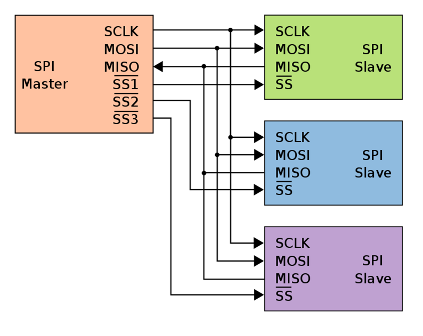

рис.9.17. Приклад використання SPI bus

**UART** 

UART (англ. universal asynchronous receiver/transmitter — універсальний асинхронний приймач/передавач) — тип асинхронного приймача-передавача, компонентів комп'ютерів та периферійних пристроїв, що передає дані між паралельною та послідовною формами. UART звичайно використовується спільно з іншими комунікаційними стандартами, такими як EIA RS-232. UART це зазвичай окрема мікросхема чи частина мікросхеми, що використовується для з'єднання через комп'ютерний чи периферійний послідовний порт. UART нині загалом включені в мікроконтролери (рис.9.18). 

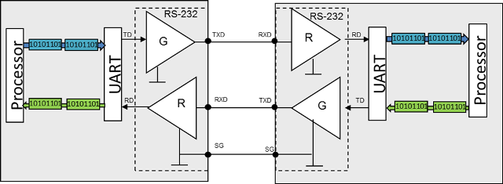

рис.9.18. Використання UART

## Запитання для самоперевірки

1. Які основні характеристики Raspberry PI?
2. Що можна віднести до базової комплектації Raspberry PI?
3. Поясніть що таке аналогові та дискретні сигнали.
4. Поясніть принцип роботи аналогово-цифрового перетворення.
5. Розкажіть як розрядність АЦП впливає на точність оцифрування і поясніть чому.
6. Що таке гальванічна розв'язка? Як вона може бути реалізована?
7. Що для Raspberry PI можна вважати входами а що виходами?
8. Який принцип роботи ШІМ? Розкажіть на прикладі.
9. Які вузли використовуються в Node-RED для роботи з GPIO?
10. Перерахуйте наявні цифрові інтерфейси в Raspberry PI.   

| [<- до лекцій](README.md) | [на основну сторінку курсу](../README.md) |
| ------------------------- | ----------------------------------------- |
|                           |                                           |