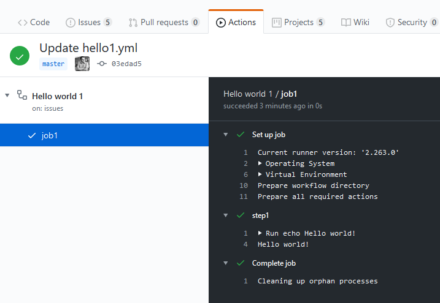
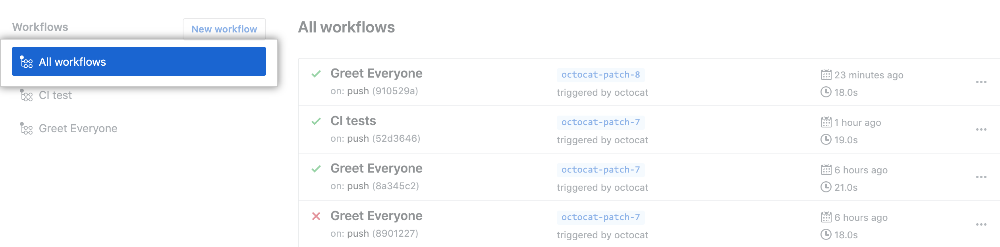

**Програмна інженерія в системах управління. Лекції.** Автор і лектор: Олександр Пупена 

| [<- до лекцій](README.md) | [на основну сторінку курсу](../README.md) |
| ------------------------- | ----------------------------------------- |
|                           |                                           |

# Git Hub actions

## [Про Git Hub actions](https://help.github.com/en/actions/getting-started-with-github-actions/about-github-actions)

Дії GitHub допоможуть вам автоматизувати робочі процеси з розробки програмного забезпечення в тому самому місці, де ви зберігаєте код та співпрацюєте над запитами на пул. Ви можете писати окремі завдання, що називаються діями (actions), і комбінувати їх для створення користувальницького робочого процесу (workflow). **Робочі процеси** (**workflow**) - це спеціалізовані автоматизовані процеси, які ви можете налаштувати у своєму сховищі для побудови, тестування, пакування, випуску чи розгортання будь-якого кодового проекту на GitHub.

За допомогою GitHub Actions ви можете будувати безперервну інтеграцію (CI) та можливості неперервного розгортання (CD) безпосередньо у вашому сховищі. Дії GitHub (GitHub Actions) надають повноцінну послугу безперервної інтеграції GitHub. Для отримання додаткової інформації див. "[About continuous integration](https://help.github.com/en/articles/about-continuous-integration)."

Робочі процеси працюють у Linux, macOS, Windows та контейнерах на машинах, розміщених на GitHub, названі **виконувачами** ('**runners**'). Крім того, ви також можете розмістити власних виконувачів для запуску робочих процесів на машинах, якими ви володієте або керуєте. Для отримання додаткової інформації див. "[About self-hosted runners](https://help.github.com/en/actions/automating-your-workflow-with-github-actions/about-self-hosted-runners)."

Ви можете створювати робочі процеси, використовуючи дії, означені у вашому сховищі, дії з відкритим кодом у загальнодоступному сховищі на GitHub або опублікованим образом контейнера Docker. Робочі процеси у сховищах форк не працюють за замовчуванням.

Ви можете виявити дії, які потрібно використовувати у своєму робочому процесі на GitHub, та створити дії, які потрібно ділитися спільнотою з GitHub. Для отримання додаткової інформації про створення власної дії див  "[Creating actions](https://help.github.com/en/actions/creating-actions)."

## Простий приклад

Наведений нижче приклад файлу YAML для означення workflow, який запускається при прикріпленні будь якої теми і виводить в консоль віртуальної машини фразу "Hello World"! 

```yaml
# самий прстий workflow, простіше я не придумав
# створює віртуалку і запускає там команду в bash
name: Hello world 1 # назва workflow  
on:                 # це подія, яка вказує коли буде запускатися workflow
  issues:           # назва події - коли щось відбувається з issues 
    types: pinned   # тип активності - прикрпілення  
# https://help.github.com/en/actions/reference/events-that-trigger-workflows#issues-event-issues 
jobs:               # перелік завдань
  job1:             # назва першого завдання
    runs-on: ubuntu-latest # тип машини, на якій виконувати завдання
    steps:                 # кроки 
      - name: step1        # назва кроку  
        run: echo Hello world! # виконує команди командного рядка
```

Після запуску на GitHub можна побачити результат запуску для кожного завдання та кроку.




## [Конфігурування та керування робочими процесами](https://help.github.com/en/actions/configuring-and-managing-workflows)

### Continuous integration (CI)

Практика розробки програмного забезпечення часто здійснює невеликі зміни коду до спільного сховища. За допомогою GitHub Actions ви можете створювати власні робочі процеси CI, які автоматизують створення та тестування вашого коду. З вашого сховища ви можете переглянути стан змін вашого коду та докладні журнали для кожної дії у вашому робочому процесі. CI економить час розробників, надаючи негайний зворотній зв'язок щодо змін коду для швидшого виявлення та усунення помилок.

### Continuous deployment (CD)

Неперервне розгортання ґрунтується на неперервній інтеграції (CI). Коли новий код введено і проходить ваші тести на CI, код автоматично розгортається на виробництво. За допомогою GitHub Actions ви можете створювати власні робочі процеси CD, щоб автоматично розгортати ваш код у будь-яку хмару, сервіс, що розміщений на власній основі, або платформу зі свого сховища. CD економить час розробників за рахунок автоматизації процесу розгортання та розгортає перевірений, стабільний код швидше змінюється для ваших клієнтів.

### Конфігурування робочих процесів

Можна створити більше одного робочого процесу в сховищі. Вони зберігаються в каталозі `.github/workflows`  у корені сховища як файли  файл ` .yml` або `.yaml` на мові YAML, з описом якого ви можете ознайомитися в [цій лекції](yaml.md). Опис вибору подій, запуску дії, додавання дій та налаштування робочого процесу дано в "[Workflow syntax for GitHub Actions](https://help.github.com/en/articles/workflow-syntax-for-github-actions)" . Після запуску робочого процесу можна побачити журнали збірки, результати тестів, артефакти та статуси для кожного кроку робочого процесу. Також можна отримувати сповіщення про оновлення стану робочого процесу (див.  "[Configuring notifications](https://help.github.com/en/github/managing-subscriptions-and-notifications-on-github/configuring-notifications#github-actions-notification-options).")


Робочі процеси повинні мати принаймні одне завдання (**job**), а завдання містити набір кроків (**steps**), які виконують окремі задачі (task). Кроки можуть запускати команди або використовувати дію (**action**). Ви можете створювати власні дії або використовувати дії, якими ділиться спільнота GitHub, та налаштовувати їх за потребою. 

### Змінні середовища 

GitHub встановлює змінні середовища за замовчуванням для кожного запущеного робочого процесу GitHub Actions. Ви також можете встановити власні змінні середовища у файлі робочого процесу. До змінних середовища можна звертатися за іменем, використовуючи знак `$`. Назва змінних середовища чутлива до регістру. 

Команди, що виконуються в діях або кроках, можуть створювати, читати та змінювати змінні середовища. Щоб встановити власні змінні середовища, потрібно вказати змінні у файлі робочого процесу для кроку, завдання або всього робочого процесу за допомогою  ключових слів  [`jobs..steps.env`](https://help.github.com/en/github/automating-your-workflow-with-github-actions/workflow-syntax-for-github-actions#jobsjob_idstepsenv), [`jobs..env`](https://help.github.com/en/github/automating-your-workflow-with-github-actions/workflow-syntax-for-github-actions#jobsjob_idenv), та [`env`](https://help.github.com/en/github/automating-your-workflow-with-github-actions/workflow-syntax-for-github-actions#env) , які описані нижче. 

```yaml
steps:
  - name: Hello world
    run: echo Hello world $FIRST_NAME $middle_name $Last_Name!
    env:
      FIRST_NAME: Mona
      Last_Name: Octocat
```

Ви також можете скористатися командою `set-env` робочого процесу для встановлення змінної середовища, яку можуть використовувати наступні кроки в робочому процесі. Команда `set-env` може використовуватися безпосередньо дією або як команда shell у файлі робочого процесу за допомогою ключового слова `run` . 

Ми настійно рекомендуємо діям використовувати змінні середовища для доступу до файлової системи, а не використовувати прямі шляхи до файлів. GitHub встановлює змінні середовища для дій, які потрібно використовувати у всіх середовищах виконувача.

| Змінна середовища   | Опис                                                         |
| ------------------- | ------------------------------------------------------------ |
| `CI`                | Завжди встановлено в `true`.                                 |
| `HOME`              | Шлях до домашньої директорії GitHub використовується для збереження користувацьких даних. Наприклад, `/github/home`. |
| `GITHUB_WORKFLOW`   | Ім'я workflow.                                               |
| `GITHUB_RUN_ID`     | Унікальний номер для кожного запуску в сховищі. Це число не змінюється, якщо ви повторно запустите робочий процес. |
| `GITHUB_RUN_NUMBER` | Унікальний номер для кожного запуску певного робочого процесу в сховищі. Це число починається з 1 для першого запуску робочого процесу та збільшується з кожним новим виконанням. Це число не змінюється, якщо ви повторно запустите робочий процес. |
| `GITHUB_ACTION`     | Унікальний ідентифікатор дії (`id`).                         |
| `GITHUB_ACTIONS`    | Завжди встановлене в значення `true`, коли GitHub Actions виконує робочий процес. Ви можете використовувати цю змінну для розмежування, коли тести виконуються локально або за допомогою GitHub Actions. |
| `GITHUB_ACTOR`      | Ім’я особи чи програми, яка ініціювала робочий процес. Наприклад, `octocat`. |
| `GITHUB_REPOSITORY` | Назва власника та сховища. Наприклад, `octocat/Hello-World`. |
| `GITHUB_EVENT_NAME` | Назва події webhook, яка спровокувала робочий процес.        |
| `GITHUB_EVENT_PATH` | Шлях до файлу з повним навантаженням події в webhook. Наприклад, `/github/workflow/event.json`. |
| `GITHUB_WORKSPACE`  | Шлях до каталогу робочого середовища GitHub. Каталог робочого середовища містить підкаталог із копією вашого сховища, якщо ваш робочий процес використовує дію [actions/checkout](https://github.com/actions/checkout). Якщо ви не використовуєте дію `actions/checkout`, каталог буде порожнім. Наприклад, `/home/runner/work/my-repo-name/my-repo-name`. |
| `GITHUB_SHA`        | SHA коміта, який ініціює workflow. Наприклад, `ffac537e6cbbf934b08745a378932722df287a53`. |
| `GITHUB_REF`        | Посилання на гілку чи тег, що ініціював робочий процес. Наприклад,  `refs/heads/feature-branch-1`. Якщо для типу події не доступна ні гілка, ні тег, змінна не буде існувати. |
| `GITHUB_HEAD_REF`   | Встановлюється лише для сховищ-форків. Відділення базового сховища. |
| `GITHUB_BASE_REF`   | Встановлюється лише для сховищ-форків. Гілка базового схоивща. |

### Artifact (Артефакт)

Артефакти дозволяють зберігати дані після завершення завдання та ділитися цими даними з іншим завданням у тому ж робочому процесі. Артефакт - це файл або колекція файлів, що утворюються під час виконання робочого процесу. Наприклад, ви можете використовувати артефакти, щоб зберегти свої збірки та випробування після закінчення запуску робочого процесу. GitHub для артефактів зберігає артефакти протягом 90 днів. Період збереження для запиту на пул перезапускається кожного разу, коли хтось робить новий запит на пул. 

Ось деякі поширені артефакти, які ви можете завантажити:

- Журнали файлів та основні дампів
- Результати тестів, збої та скріншоти
- Двійкові або стислі файли
- Вихід результатів тестів випробувань та результати покриття коду

Артефакти завантажуються під час виконання робочого процесу, і ви можете переглянути ім'я та розмір артефакту в інтерфейсі користувача. Коли артефакт завантажується за допомогою інтерфейсу GitHub, всі файли, які були окремо завантажені як частина артефакту, стискаються в один файл. 

GitHub надає дві дії, які можна використовувати для завантаження та вивантаження артефактів. Для отримання додаткової інформації, див. [actions/upload-artifact](https://github.com/actions/upload-artifact) та [download-artifact](https://github.com/actions/download-artifact) actions. Робота з цими діями показана нижче.


Далі розглянемо основні розділи описового файлу.

### Ім'я (`name`)

Напочатку вказується назва робочого процесу. Якщо опустити `name` GitHub встановлює його до шляху файлу робочого процесу відносно кореня сховища. 

### Події (`on`)

**Event** (**Подія**) - конкретна діяльність, яка запускає робочий процес. Наприклад, активність може походити з GitHub, коли хтось натискає на коміт до сховища або коли створюється запит на пул чи issue. Ви також можете налаштувати робочий процес для запуску, коли відбувається зовнішня подія, використовуючи repository dispatch webhook. На наведеному вище прикладі тип події був означений як `pinned` -  прикрпілення.

```yaml
on:                 # це подія, яка вказує коли буде запускатися workflow
  issues:           # назва події - коли щось відбувається з issues 
    types: pinned   # тип активності - прикрпілення  
```

Можна налаштувати робочий процес для запуску за певною подією GitHub (webhook events), за календарним графіком (Scheduled events) або із зовнішньої події (External events).

Щоб запустити робочий процес за подією на GitHub, додайте `on:`  та значення події після імені робочого процесу. Наприклад, цей робочий процес спрацьовує, коли пушаться зміни до будь-якої гілки сховища.

```yaml
on: push
```

Для планування робочого процесу можна використовувати синтаксис POSIX cron у вашому файлі робочого процесу. Найкоротший інтервал, з якого можна виконувати заплановані робочі процеси, - один раз на 5 хвилин. Наприклад, цей робочий процес спрацьовує щогодини.

```yaml
on:
  schedule:
    - cron:  '0 * * * *'
```

Щоб запустити робочий процес після того, як відбувається зовнішня подія, ви можете викликати подію webhook `repository_dispatch`, викликавши кінцеву точку REST API "Create a repository dispatch event". Для отримання додаткової інформації див. "[Create a repository dispatch event](https://developer.github.com/v3/repos/#create-a-repository-dispatch-event)"  в документації GitHub Developer.

Можна надати одну подію `string`, масив (`array` ) подій, "масив" типів подій ( `array` of event `types`), або відображення конфігурації події (event configuration `map` ), яка планує робочий процес або обмежує виконання робочого процесу певними файлами, тегами або змінами гілки. Список доступних подій див "[Events that trigger workflows](https://help.github.com/en/articles/events-that-trigger-workflows)."

```yaml
# Приклад масиву подій: заупскати при push або pull_request
on: [push, pull_request]
```

Якщо вам потрібно вказати типи дій або конфігурацію події, потрібно налаштувати кожну подію окремо. Ви повинні додати двокрапку (`:`) до всіх подій, включаючи події без конфігурації.

```yaml
on:
  # спрацьовує при push або pull request,
  # аде тільки для гілки master
  push:
    branches:
      - master
  pull_request:
    branches:
      - master
  # спрацьовує при page_build, а також при події release created
  page_build:
  release:
    types: # This configuration does not affect the page_build event above
      - created
```

Наприклад, цей робочий процес запускається, коли пуш, що включає файли в каталозі `test`, робиться на гілці ` master`, або пушиться в тег `v1`.

```yaml
on:
  push:
    branches:
      - master
    tags:
      - v1
    # шляхи до файлу, які слід врахувати у події. Необов’язково; за замовчуванням для всіх.
    paths:
      - 'test/*'
```

Для отримання додаткової інформації про синтаксис фільтрів гілок, тегів та шляхів див "[`on..`](https://help.github.com/en/articles/workflow-syntax-for-github-actions#onpushpull_requestbranchestags)" та "[`on..paths`](https://help.github.com/en/articles/workflow-syntax-for-github-actions#onpushpull_requestpaths).". Повний перелік подій можна подивитися [тут](https://help.github.com/en/actions/reference/events-that-trigger-workflows#webhook-events). 

Для отримання додаткової інформації та прикладів, див "[Events that trigger workflows](https://help.github.com/en/articles/events-that-trigger-workflows#webhook-events)."

Приклад наведений спочатку використовує тип [`issues`](https://help.github.com/en/actions/reference/events-that-trigger-workflows#issues-event-issues), в якому тип активності `pinned`

```yaml
on:                 # це подія, яка вказує коли буде запускатися workflow
  issues:           # назва події - коли щось відбувається з issues 
    types: pinned   # тип активності - прикрпілення  
```

### Змінні середовища `env`

Відображення `map` змінних середовищ, які доступні для всіх завдань і кроків робочого процесу. Ви також можете встановити змінні середовища, які доступні лише для завдання чи кроку. Коли більше однієї змінної середовища визначено з тим самим іменем, GitHub використовує найбільш специфічну змінну середовища. Наприклад, змінна середовища, означена на кроці, буде заміняти змінні завдання та робочого процесу з тим самим іменем, коли виконується крок. 

```yaml
env:
  SERVER: production # змінна SERVER має значення production
```

### Завдання `jobs`

**Завдання** (**job**) - набір кроків, які виконуються на одному виконувачі. Ви можете визначити правила залежності того, як виконуються завдання у файлі робочого процесу. Завдання можуть працювати паралельно або послідовно виконуватись залежно від стану попереднього завдання. 

#### Ідентифікатор та ім'я (`job_id`) 

Кожне завдання повинно мати ідентифікатор, який асоціюється з роботою. Ключ **`job_id`** - це рядок, його значення - відображення даних конфігурації завдання. Ви повинні замінити `<job_id>` на рядок, унікальний для об'єкта `jobs.<job_id>` .

```yaml
jobs:
  my_first_job: #індентифікатор завдання
    name: My first job #імя завдання
  my_second_job:
    name: My second job
```

#### Послідовність виконання кількох завдань (`needs`)

Завдання виконуються паралельно за замовчуванням. Щоб послідовно виконувати завдання, ви можете визначити залежності від інших завдань за допомогою ключового слова **`needs`**, який означує завдання, після успішного виконання яких запускається  це завдання. Це може бути рядок або масив рядків. Якщо завдання помилково завершується, усі завдання, які його потребують, пропускаються, якщо тільки завдання не використовують умовний вислів, який призводить до продовження роботи. Завдання в наведеному нижче прикладі виконують послідовно: `job1`, `job2` а потім `job3`

```yaml
jobs:
  job1:
  job2: #почне виконуватися тільки після успішного завершення job1
    needs: job1 
  job3: #почне виконуватися тільки після успішного завершення job1 та job2
    needs: [job1, job2]
```

Кожне завдання виконується в середовищі (типі машини), означеному **`runs-on`**. Цей параметр є обов'язковим.  Машина може бути або виконувачем, розміщеним у GitHub, або виконувачем, що влаштовується власноруч. 

#### Віртуальна машина для виконання (`runs-on`) 

**Runner** (**виконувач**) - це будь-яка машина із встановленим застосунком виконувача GitHub Actions. 

Віртуальне середовище виконувача, розміщеного у GitHub, включає конфігурацію апаратного забезпечення віртуальної машини, операційну систему та встановлене програмне забезпечення. 

Ви можете запускати робочі процеси на виконувачах, розміщених на GitHub або виконувачах, що розміщуються самостійно. Завдання можуть працювати безпосередньо на машині або в контейнері Docker. Ви можете вказати виконувач для кожного завдання в робочому процесі, використовуючи  `runs-on`. Для отримання додаткової інформації про `runs-on`, див "[Workflow syntax for GitHub Actions](https://help.github.com/en/articles/workflow-syntax-for-github-actions#jobsjob_idruns-on)."

Якщо ви використовуєте виконувач, розміщений у GitHub, кожне завдання виконується у новому екземплярі віртуального середовища, означеного `runs-on`. Доступними типами виконувачів, розміщених у GitHub, є:

| Віртуальне середовище | мітка workflow YAML                |
| --------------------- | ---------------------------------- |
| Windows Server 2019   | `windows-latest` або`windows-2019` |
| Ubuntu 20.04          | `ubuntu-20.04`                     |
| Ubuntu 18.04          | `ubuntu-latest` або `ubuntu-18.04` |
| Ubuntu 16.04          | `ubuntu-16.04`                     |
| macOS Catalina 10.15  | `macos-latest` or `macos-10.15`    |

```yaml
runs-on: ubuntu-latest
```

Див "[Virtual environments for GitHub-hosted runners](https://help.github.com/en/github/automating-your-workflow-with-github-actions/virtual-environments-for-github-hosted-runners)."

Щоб вказати власний (**self-hosted**) виконувач для свого завдання, конфігуруйте  `runs-on` у вашому файлі робочого процесу за допомогою власників міток виконувача. Усі self-hosted виконувачі, мають мітку  `self-hosted`. Див "[About self-hosted runners](https://help.github.com/en/github/automating-your-workflow-with-github-actions/about-self-hosted-runners)" та"[Using self-hosted runners in a workflow](https://help.github.com/en/github/automating-your-workflow-with-github-actions/using-self-hosted-runners-in-a-workflow).

```yaml
runs-on: [self-hosted, linux]
```

#### Виходи завдання (`outputs`)

Виходи завдання - це рядки, які містять вирази, які розраховуються на виконувачі в кінці кожного завдання. Виходи, що містять паролі, редагуються на виконувачі і не надсилаються в GitHub Actions.

```yaml
jobs:
  job1:
    runs-on: ubuntu-latest
    # Выдображення виходыв крокыв на виходи завдань
    outputs:
      output1: ${{ steps.step1.outputs.test }}
      output2: ${{ steps.step2.outputs.test }}
    steps:
    - id: step1
      run: echo "::set-output name=test::hello"
    - id: step2
      run: echo "::set-output name=test::world"
  job2:
    runs-on: ubuntu-latest
    needs: job1
    steps:
    - run: echo ${{needs.job1.outputs.output1}} ${{needs.job1.outputs.output2}}
```

#### Змінні середовища для завдання `env`

Відображення змінних середовища, які доступні для всіх кроків завдання. 

```yaml
jobs:
  job1:
    env:
      FIRST_NAME: Mona
```

#### Налаштування за замовченням (`defaults`)

Відображення налаштувань за замовчуванням, яка застосовуватиметься до всіх кроків завдання.  

```yaml
jobs:
  job1:
    runs-on: ubuntu-latest
    defaults: #налаштуванн для всіх кроків за замовченням
      run:
        shell: bash
        working-directory: scripts
```

#### Умовне виконання (`if` )

Ви можете використовувати умовний елемент `if` , щоб запобігти виконанню роботи, якщо умова не виконується. 

#### Кроки (`steps`)

Завдання містить послідовність задач (task), що називається `steps`. Кроки можуть:

- запускати команди, 
- виконувати завдання налаштування 
- виконувати дії у вашому сховищі, загальнодоступному сховищі або дії, опублікованих у реєстрі Docker. 

Не всі кроки виконують дії, але всі дії виконуються як крок. Кожен крок працює у своєму процесі в тому ж середовищі виконувача і має доступ до робочої області та файлової системи. Оскільки дії виконуються в їх власному процесі, зміни змінних оточуючих середовищ не зберігаються між кроками. GitHub пропонує вбудовані кроки для налаштування та завершення завдання.

Аналогічно завданням кроки мають:

- `id` та `name`
- `if` умовне виконання
- `env` змінні середовища кроку

```yaml
name: Greeting from Mona
on: push
jobs:
  my-job:
    name: My Job
    runs-on: ubuntu-latest
    steps:
    - name: Print a greeting
      env:
        MY_VAR: Hi there! My name is
        FIRST_NAME: Mona
        MIDDLE_NAME: The
        LAST_NAME: Octocat
      run: |
        echo $MY_VAR $FIRST_NAME $MIDDLE_NAME $LAST_NAME.
```

Цей крок виконується лише тоді, коли тип події є  `pull_request` і дія події `unassigned`.

```yaml
steps:
 - name: My first step
   if: ${{ github.event_name == 'pull_request' && github.event.action == 'unassigned' }}
   run: echo This event is a pull request that had an assignee removed.
```

Крок  `my backup step` запускається лише тоді, коли попередній крок завдання закінчується. Для отримання додаткової інформації див "[Context and expression syntax for GitHub Actions](https://help.github.com/en/actions/reference/context-and-expression-syntax-for-github-actions#job-status-check-functions)."

```yaml
steps:
  - name: My first step
    uses: monacorp/action-name@master
  - name: My backup step
    if: ${{ failure() }}
    uses: actions/heroku@master
```

`steps.continue-on-error` Запобігає відмови від роботи, коли крок не вдається. Установіть значення `true` , щоб дозволити роботу пройти, коли цей крок не вдався.

`steps.timeout-minutes`  - максимальна кількість хвилин, щоб виконати крок перед тим, як вбити процес.

#### Запуск дій: файлів або контейнерів в кроці (`steps.uses`)

Для вибору дії для кроку завдання вказується `steps.uses`.  **Дія** (**`action`** ) - це одиниця коду для багаторазового використання. Ви можете використовувати дію, означену в тому ж сховищі, що і робочий процес, в загальнодоступному сховищі або [published Docker container image](https://hub.docker.com/). 

Дії (actions) - це або файли JavaScript, або контейнери Docker. Якщо дія, яку ви використовуєте, є контейнером Docker, ви повинні запустити завдання в середовищі Linux. Докладніше див. У розділі [`runs-on`](https://help.github.com/en/actions/reference/workflow-syntax-for-github-actions#jobsjob_idruns-on).

Ви можете переглядати та використовувати дії, створені GitHub в організації [github.com/actions](https://github.com/actions). Щоб відвідати Docker Hub, див. "[Docker Hub](https://www.docker.com/products/docker-hub)" на сайті Docker.  Щоб посилатися на дії у вашому файлі робочого процесу з правильним синтаксисом, ви повинні врахувати, де означено дію.

Для використання дії, означеної в приватному сховищі, і файл робочого процесу, і дія повинні бути в одному сховищі. Ваш робочий процес не може використовувати дії, означені в інших приватних сховищах, навіть якщо інше приватне сховище знаходиться в одній організації.

Щоб зберегти робочий процес стабільним, навіть коли проводиться оновлення дії, ви можете посилатися на версію дії, яку ви використовуєте, вказавши номер файлу Git ref чи Docker у файлі робочого процесу. 

```yaml
steps:    
  # посилання на вказаний commit
  - uses: actions/setup-node@74bc508
  # посилання на версію випуску
  - uses: actions/setup-node@v1.2
  # посилання на гілку
  - uses: actions/setup-node@master
```

Для використання публічних дій використовується синтаксиси

```
{owner}/{repo}@{ref}
{owner}/{repo}/{path}@{ref}
```

Наприклад

```yaml
jobs:
  my_first_job:
    steps:
      - name: My first step
        # Uses the master branch of a public repository
        uses: actions/heroku@master
      - name: My second step
        # Uses a specific version tag of a public repository
        uses: actions/aws@v2.0.1
```

Для використання дій в тому самому репозиторії як workflow використовується синтаксис

```
./path/to/dir
```

Шлях до каталогу, який містить дії у сховищі вашого робочого процесу. Ви повинні перевірити сховище, перш ніж використовувати дію.

```yaml
jobs:
  my_first_job:
    steps:
       #спочатку   
      - name: Check out repository 
        uses: actions/checkout@v2
      - name: Use local my-action
        uses: ./.github/actions/my-action
```

Синтаксис використання дій Docker Hub 

```
docker://{image}:{tag}
```

Образ Docker опублікований на [Docker Hub](https://hub.docker.com/).

```yaml
jobs:
  my_first_job:
    steps:
      - name: My first step
        uses: docker://alpine:3.8
```

Приклад використання дій Docker public registry 

```
docker://{host}/{image}:{tag}
```

Образ Docker у публічному репозитрію.

```yaml
jobs:
  my_first_job:
    steps:
      - name: My first step
        uses: docker://gcr.io/cloud-builders/gradle
```

Деякі дії вимагають введення даних, які потрібно встановити за допомогою ключового слова [`with`](https://help.github.com/en/actions/reference/workflow-syntax-for-github-actions#jobsjob_idstepswith) . 

#### Запуск команд в командному рядку (`steps.run`)

Запускає програми командного рядка, використовуючи оболонку операційної системи. Якщо ви не вкажете `name`, ім'я кроку за замовчуванням буде текстом, визначеним у команді `run` . Команди виконуються за допомогою стандартних оболонок, які входять у систему. Ви можете вибрати іншу оболонку та налаштувати оболонку, яка використовується для виконання команд. Для отримання додаткової інформації, "[Using a specific shell](https://help.github.com/en/actions/reference/workflow-syntax-for-github-actions#using-a-specific-shell)". Кожне ключове слово `run` представляє собою новий процес і оболонку в середовищі runner. Коли ви надаєте багаторядкові команди, кожен рядок працює в одній оболонці. Наприклад:

- Однорядкова команда: 

  ```yaml
  - name: Install Dependencies
    run: npm install
  ```

- Багаторядкова команда:

  ```yaml
  - name: Clean install dependencies and build
    run: |
      npm ci
      npm run build
  ```

Використовуючи ключове слово  `working-directory` , ви можете вказати робочий каталог, де запустити команду.

```yaml
- name: Clean temp directory
  run: rm -rf *
  working-directory: ./temp
```

Ви можете змінити параметри оболонки за замовчуванням в операційній системі виконувача за допомогою ключового слова `shell`.

```yaml
steps:
  - name: Display the path
    run: echo $PATH
    shell: bash
```

#### Передача параметрів в крок (`steps.with`)

Кожен вхідний параметр означується в `steps.with` як пара ключ/значення, який встановлюється як змінна середовища. Змінна отримує префікс `INPUT_` і перетворюється у верхній регістр. Наступний приклад означує два вхідні параметри (`first_name`, та `last_name`), означені дією `hello_world` . Ці вхідні змінні будуть доступні для дії `hello_world`  як змінні середовища `INPUT_FIRST_NAME` і `INPUT_LAST_NAME` .

```yaml
jobs:
  my_first_job:
    steps:
      - name: My first step
        uses: actions/hello_world@master
        with:
          first_name: Mona
          last_name: Octocat      
```

Для контейнерів докер в steps.with означуються також `args` та `entrypoint`.

`Args` - це рядок, який означує входи для контейнера Docker. GitHub передає `args` в контейнер 'ENTRYPOINT', коли контейнер запускається. Цей параметр не підтримує `array of strings`.

```yaml
steps:
  - name: Explain why this job ran
    uses: monacorp/action-name@master
    with:
      entrypoint: /bin/echo
      args: The ${{ github.event_name }} event triggered this step.
```

`entrypoint`  переміщує Докер `ENTRYPOINT`  у `Dockerfile` або встановлює його, якщо його ще не було вказано. На відміну від інструкції Docker `ENTRYPOINT`, яка має форму оболонки та виконується, ключове слово ` entrypoint` приймає лише один рядок, що означує виконуваний файл, який слід запустити.

```yaml
steps:
  - name: Run a custom command
    uses: monacorp/action-name@master
    with:
      entrypoint: /a/different/executable
```

Ключове слово `entrypoint` призначене для використання з контейнерними діями Docker, але ви також можете використовувати його з діями JavaScript, які не означують жодних входів.

### Стандартні дії в кроках

Перелік публічних дій в кроках доступний за [посиланням](https://github.com/sdras/awesome-actions). Серед них є так звані [офіційні дії](https://github.com/sdras/awesome-actions#official-actions), які розглянуті в цьому розділі.   

- [actions/checkout](https://github.com/actions/checkout) - налаштовує своє сховище для доступу з робочого процесу (workflow) 
- [actions/upload-artifact](https://github.com/actions/upload-artifact) - вивантажує артефакти з вашого workflow
- [actions/download-artifact](https://github.com/actions/download-artifact) - завантажує артефакт з вашого build
- [actions/cache](https://github.com/actions/cache) - кешує залежності та виходи білдів в GitHub Actions
- [actions/github-script](https://github.com/actions/github-script) - записує скрипт для GitHub API і конекстів workflow 

#### Використання checkout дій 

Дія checkout - це стандартна дія, яку потрібно включити у свій робочий процес перед іншими діями, якщо:

- Для вашого робочого процесу потрібна копія коду вашого сховища, наприклад, коли ви створюєте і тестуєте своє сховище або використовуєте постійну інтеграцію.
- у вашому робочому процесі є хоча б одна дія, визначена в одному сховищі. Для отримання додаткової інформації, див "[Referencing actions in your workflow](https://help.github.com/en/actions/configuring-and-managing-workflows/configuring-a-workflow#referencing-actions-in-your-workflow)."

Щоб використовувати стандартну дію цей крок має наступну форму використання:

```yaml
- uses: actions/checkout@v2
```

Використання `v2` у цьому прикладі гарантує, що ви використовуєте стабільну версію дії з оформлення замовлення. 

За такого підходу усі необхідні файли репозиторію будуть доступні через кореневу папку. Наприклад доступ до `log.txt` в папці `.github/workflows` на виконувачі буде за наступною адресою    

```bash
./.github/workflows/log.txt
```

Для отримання додаткової інформації див [the checkout action](https://github.com/actions/checkout).

#### Дії з артефактами (artifact)

Для виконувачів, що розміщуються в GitHub, кожне завдання в робочому процесі виконується в новому екземплярі віртуального середовища. Коли завдання завершено, виконувач припиняє і видаляє екземпляр віртуальної середовища.

Для обміну даними з завданнями можна використовувати стандартні дії з артефактами [actions/upload-artifact](https://github.com/actions/upload-artifact) та [download-artifact](https://github.com/actions/download-artifact):

- **Вивантаження (Uploading) файлів**: Дайте ім'я вивантажуваному файлу та вивантажте дані до завершення завдання.
- **Завантаження (Downloading) файлів**: Ви можете завантажувати лише артефакти, які були вивантажені під час того ж робочого процесу. Завантажуючи файл, ви можете посилатися на нього по імені.

Кроки завдання поділяють одне і те ж середовище на машині виконувача, але виконуються у власних індивідуальних процесах. Для передачі даних між кроками в завданні можна використовувати входи та виходи. Цей приклад робочого процесу ілюструє, як передавати дані між завданнями в одному і тому ж робочому процесі. 

```yaml
name: Share data between jobs

on: [push]

jobs:
  job_1:
    name: Add 3 and 7
    runs-on: ubuntu-latest
    steps:
      - shell: bash
        run: |
          expr 3 + 7 > math-homework.txt # в файл записується 10 
      - name: Upload math result for job 1
        uses: actions/upload-artifact@v1 #виклик upload-artifact
        with: # вхідні аргументи  
          name: homework # імя артефакту 
          path: math-homework.txt # вивантажити файл 
        # дія розміщує файл у каталозі під назвою `homework`  

  job_2:
    name: Multiply by 9
    needs: job_1
    runs-on: windows-latest
    steps:
      - name: Download math result for job 1
        uses: actions/download-artifact@v1 # завнтажити файл
        with: # вхідні аргументи  
          name: homework # імя артефакту
      - shell: bash
        run: |
          value=`cat homework/math-homework.txt` 
          expr $value \* 9 > homework/math-homework.txt
      - name: Upload math result for job 2
        uses: actions/upload-artifact@v1
        with:
          name: homework
          path: homework/math-homework.txt

  job_3:
    name: Display results
    needs: job_2
    runs-on: macOS-latest
    steps:
      - name: Download math result for job 2
        uses: actions/download-artifact@v1
        with:
          name: homework
      - name: Print the final result
        shell: bash
        run: |
          value=`cat homework/math-homework.txt`
          echo The result is $value
```

Завдання, які залежать від артефактів попереднього завдання, повинні чекати успішного виконання залежного завдання. Цей робочий процес використовує ключове слово `needs`, щоб забезпечити послідовне виконання  `job_1`, `job_2`, та `job_3` . Наприклад, для `job_2` потрібує ` job_1`, використовуючи синтаксис `needs: job_1`.

Job 1 виконує наступні дії:

- Виконує математичний обчислення та зберігає результат у текстовому файлі під назвою `math-homework.txt`.
- Використовує дію  `upload-artifact` для вивантаження файлу `math-homework.txt` з назвою `homework`. Дія розміщує файл у каталозі під назвою`homework`

Job 2 використовує результат у попередній роботі:

- Завантажує артефакт `homework` , вивантажений у попередньому завданні. За замовчуванням дія `download-artifact` завантажує артефакти в каталог робочої області, в якому виконується крок. Ви можете використовувати вхідний параметр ` path`, щоб вказати інший каталог завантажень.
- читає значення з файлу  `homework/math-homework.txt`, виконує математичний обчислення та зберігає результат у ` math-homework.txt`.
- Вивантажує файл `math-homework.txt`. Це вивантаження перезаписує попереднє вивантаження, оскільки обидва вивантаження мають одне ім’я.

Job 3 відображає результат, вивантажений у попередньому завданні:

- Завантажує артефакт  `homework`.
- Друкує результат журналу математичного рівняння.

Повна математична операція, виконана в цьому прикладі робочого процесу, є `(3 + 7) x 9 = 90`.

Після завершення робочого процесу ви можете завантажити стислий файл вивантажених артефактів на GitHub, знайшовши робочий процес на вкладці **Actions** . Також ви можете використовувати API GITHub REST для завантаження артефактів. Для отримання додаткової інформації див. "[Artifacts](https://developer.github.com/v3/actions/artifacts/)"  в документації на GitHub Developer.

Якщо вам потрібно отримати доступ до артефактів із попереднього запуску робочого процесу, вам потрібно буде десь зберігати артефакти. Наприклад, ви можете запустити сценарій в кінці робочого процесу для зберігання збірок артефактів на Amazon S3 або Artifactory, а потім скористатися API служби зберігання для отримання цих артефактів у майбутньому робочому процесі.

Ви можете завантажити артефакти, які були вивантажені під час робочого процесу. Артефакти автоматично закінчуються через 90 днів, однак ви завжди можете повернути використані сховища в GitHub Actions, видаливши артефакти, перш ніж вони закінчуються на GitHub.


3. На лівій бічній панелі натисніть робочий процес, який ви хочете бачити.



4. У розділі "Запуск робочого процесу" натисніть назву запуску, який ви хочете побачити.


5. Для завантаження артефактів використовуйте спадне меню **Artifacts**, і виберіть артефакт, який ви хочете завантажити.


6. Для видалення артефактів, використовуйте спадне меню **Artifacts** та натисніть на корзинку 


### Простий приклад 2

Змінимо наведений вище приклад, щоб він брав існуючий файл в репозиторію і добавляв туди запис

```yaml
jobs:               # перелік завдань
  job1:             # назва першого завдання
    runs-on: ubuntu-latest # тип машини, на якій виконувати завдання
    steps:                 # кроки
      - name: uses my repository
        uses: actions/checkout@v2
      - name: step1        # назва кроку  
        run: echo Hello world! >> ./.github/workflows/log.txt # добавляє в файл текстовий рядок
      - name: upload file from vm # вивантажує артефакт в файл текстовий рядок 
        uses: actions/upload-artifact@v2
        with:
          name: log
          path: ./.github/workflows/log.txt
```

Зверніть увагу, що файл `log.txt`  у сховищі не зміниться.


### Додавання знаку статусу workflow до вашого репозиторію

Значки стану показують, чи поточний процес в даний час не працює або проходить. Загальне місце для додавання значка статусу - у файлі README.md вашого сховища, але ви можете додати його на будь-яку веб-сторінку, яку ви хочете. За замовчуванням значки відображають статус вашої гілки за замовчуванням (як правило, `master`). Ви також можете відобразити стан запуску робочого процесу для певної гілки чи події, використовуючи параметри запиту `branch`  та `event`  в URL-адресі.


Якщо у вашому робочому процесі використовується ключове слово `name` , вам слід посилатися на робочий процес за назвою. Якщо назва вашого робочого процесу містить пробіл, вам потрібно буде замінити пробіл кодованою URL-адресою рядка `% 20`. Більше інформації про ключове слово `name` див "[Workflow syntax for GitHub Actions](https://help.github.com/en/articles/workflow-syntax-for-github-actions#name)."

```vim
https://github.com/<OWNER>/<REPOSITORY>/workflows/<WORKFLOW_NAME>/badge.svg
```

Крім того, якщо у вашому робочому процесі немає `name`,   Ви повинні посилатися на файл робочого процесу за допомогою шляху файлу щодо кореневого каталогу сховища.

**Примітка.** Посилання на файл робочого процесу за допомогою шляху файлу не працює, якщо робочий процес має `name`

```vim
https://github.com/<OWNER>/<REPOSITORY>/workflows/<WORKFLOW_FILE_PATH>/badge.svg
```

#### Приклад використання workflow name

This Markdown example adds a status badge for a workflow with the name "Greet Everyone." The `OWNER` of the repository is the `actions` organization and the `REPOSITORY` name is `hello-world`.

Цей приклад Markdown додає значок статусу для робочого процесу з назвою "Greet Everyone". `OWNER`  сховища - це організація `actions` , а назва `REPOSITORY`  -  `hello-world`..

```crystal

```

#### Приклад використання шляху workflow file 

Цей приклад розміщення додає значок статусу для робочого процесу за допомогою файлу `.github/workflows/main.yml`. `OWNER`  сховища - це організація `actions` , а назва `REPOSITORY`  -  `hello-world`.

```crystal

```

#### Приклад використання параметру `branch` 

Цей приклад розміщення додає значок статусу для гілки з назвою `feature-1`.

```crystal

```

#### Приклад використання параметру `event` 

Цей приклад розміщення додає значок, який відображає стан запуску робочого процесу, ініційований подією `pull_request`.

```crystal

```

## Створення власних Actions (дії)

**Actions** (**дії**) - це індивідуальні завдання, які можна комбінувати для створення робіт та налаштування робочого процесу (workflow). Ви можете створювати власні дії, а також використовувати та налаштовувати дії, якими ділиться спільнота GitHub. Щоб використовувати дію в робочому процесі, потрібно включити її як крок.

Ви можете створювати дії, записуючи власний код, який взаємодіє з вашим сховищем будь-яким способом, включаючи інтеграцію з GitHub API та будь-яким стороннім доступним стороннім API. Наприклад, дія може публікувати npm-модулі, надсилати SMS-сповіщення, коли створюються нагальні питання (issues), або розгортати готовий до виробництва код.

Дії можуть виконуватися безпосередньо на машині або в контейнері Docker. Ви можете визначити вхідні, вихідні змінні та змінні середовища для дії.

Ви можете створити контейнер Docker та дії JavaScript. Для дій потрібен файл метаданих для означення входів, виходів та основної точки входу для вашої дії. Ім'я файлу метаданих має бути або  `action.yml` , або `action.yaml`. Для отримання додаткової інформації див. "[Синтаксис метаданих для дій GitHub](https://help.github.com/en/articles/metadata-syntax-for-github-actions)."

Якщо ви будуєте дію, яку ви не плануєте надавати загальнодоступній, ви можете зберігати файли дії в будь-якому місці вашого сховища. Якщо ви плануєте поєднувати дії, робочий процес та код програми в одному сховищі, радимо зберігати дії в каталозі `.github`. Наприклад, `.github/actions/action-a` та `.github/actions/action-b`.

[Creating a Docker container action](https://docs.github.com/en/actions/creating-actions/creating-a-docker-container-action)

[Створення та збереження шифрованих паролів](https://help.github.com/en/actions/configuring-and-managing-workflows/creating-and-storing-encrypted-secrets) 

[Автентифікація з GITHUB_TOKEN](https://help.github.com/en/actions/configuring-and-managing-workflows/authenticating-with-the-github_token)

| [<- до лекцій](README.md) | [на основну сторінку курсу](../README.md) |
| ------------------------- | ----------------------------------------- |
|                           |                                           |