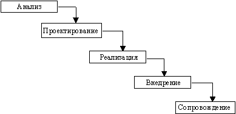
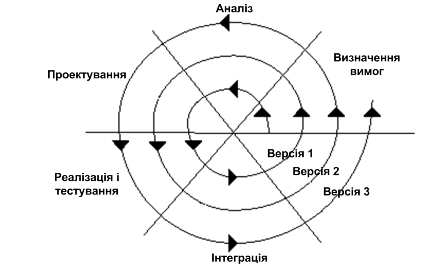

# Вступ до програмної інженерії в системах автоматизованого керування.

Основи керування життєвим циклом програм та систем автоматизованого керування. Загальні поняття, короткий опис структури систем керування. Поняття життєвого циклу. Основні процеси та етапи життєвого циклу, моделі життєвого циклу.

## Основні поняття та означення.

Мета дисципліни «Програмна інженерія в системах управління» -- формування знань з розробки програмного забезпечення, орієнтованого на автоматизовані системи управління, що відносяться до технологічного та виробничого рівня (АСУТП, IIoT, MES та інші). Дисципліна направлена на вивчення методів та засобів програмної інженерії, розуміння основ побудов систем управління побудованих на основі архітектури промислового Інтернету речей (IIoT), поглиблення знання в програмуванні мови JavaScript, мережних технологіях Інтернету та використання СУБД.

У курсі «Основи програмування» Ви познайомилися з основними підходами та мовами програмування. Очевидним є, що в загальному програма (*program, routine*) -- це впорядкована послідовність команд (інструкцій) або операторів для вирішення конкретної задачі. Сукупність програм, а також необхідних для їх експлуатації документів для виконання певного переліку функцій, як єдиної системи прийнято називати ***програмним забезпеченням*** (**ПЗ**, *software*). По суті один виконавчий файл можна називати програмою, але взаємопов'язану систему таких файлів та документації на них -- ПЗ.

Все програмне забезпечення можна умовно поділити на такі типи:

-   системне ПЗ

-   прикладне ПЗ

***Системне ПЗ*** (***System Software***) -- сукупність програм і програмних комплексів для забезпечення роботи комп'ютера та обчислювальних мереж. Це операційна система та додаткові системні служби. По суті, кінцевий користувач напряму не використовує це ПЗ, його використовують інші програми. А от ***прикладне ПЗ*** слугує вирішенню певних задач і розраховане на кінцевого користувача. Прикладне ПЗ виконуються з використанням системного, тому його прийнято називати також ***застосунком*** (***application***).

Можна окремо виділити також такий тип застосунку, як ***інструментальне ПЗ*** -- програмне забезпечення, призначене для проектування, розробки і супроводження програм. За допомогою цього типу ПЗ розробляються інші програми. Саме інструментальне ПЗ є одним з передметів даного курсу. Комплекс інструментального ПЗ який призначений для виконання різних етапів розробки програм називається ***інтегрованим середовищем розробки***. Туди як правило входить:

-   редактор (текстовий, або графічний)

-   компілятор/інтерпретатор

-   засоби автоматизації зборки, розгортання

-   відлагоджувач

-   довідникова система

-   систему підтримки життєвого циклу продукту

-   інше

Інтегрованим середовищем набагато зручніше користуватися, ніж розрізненим набором.

Створення невеликих програм може зайняти кілька годин. Це характерно для утилітарних програм (розроблених для власного користування) і вони, як правило, мають сервісне призначення та не призначені для широкого розповсюдження, або поширюються безкоштовно.

Програмний продукт комерційного характеру -- це комплекс взаємопов'язаних програм для вирішення певної проблеми (задачі) часто масового попиту, підготовлений до реалізації аналогічно будь-якому іншому виду промислової продукції. Програмний продукт повинен бути відповідним чином підготовлений до експлуатації (відлагоджений), мати необхідну технічну документацію, надавати сервіс і гарантію надійної роботи. Великі програмні продукти є системою взаємопов'язаних виконавчих програм, бібліотек та баз даних. Як правило розробкою таких програмних систем займається кілька людей, або навіть десятків чи сотень і при цьому необхідна чітка організація та інженерна діяльність, чим займається програмна інженерія.

***Програмна інженерія*** --- це застосування системного, вимірюваного підходу до розробки, використання та супроводу програмного забезпечення, а також дослідження цих підходів, тобто застосування принципів інженерії до програмного забезпечення.

## Життєвий цикл

Будь яка фізична сутність, у тому числі програмна, колись задумується, з'являється на світ і зникає. Кажуть, що вона проходить свій життєвий цикл. Весь комплекс процесів програмної (і системної) інженерії пов\'язаний з упорядкування робіт навколо життєвого циклу. Тобто планування робіт, використання інструментів та інших засобів для створення, зміни, чи обслуговування, перевірку виконання робіт та інші дії розглядають в контексті знаходження програмного продукту на певній стадії життєвого циклу.

***Життєвий цикл*** програмних систем включає в себе усі стадії від виникнення потреби в програмі певного цільового призначення до повного завершення використання цієї системи, у зв'язку з моральним старінням або втрати необхідності.

Стадії життєвого циклу виділяють по різному. Найпростіше життєвий цикл будь-якої системи можна розглядати як наступні стадії: задум, розробка, введення в дію, експлуатація, утилізація. Часто розробники систем останню стадію не враховують, вважаючи що після введення в дію та гарантійного терміну експлуатації, інше лежить на плечах покупця. Для програмного забезпечення вона також втрачає сенс, особливо для продуктів масового вжитку.

З точки зору розробника ПЗ основними стадіями життєвого циклу можна виділити:

1.  **Постановка задачі**. На цій стадії чітко формулюють призначення програмного забезпечення і означують основні вимоги до нього. Кожна вимога представляє собою опис необхідної або бажаної властивості ПЗ. Розрізняють функціональні та експлуатаційні вимоги. ***Функціональні вимоги*** означують функції, які повинно виконувати розроблювальне програмне забезпечення. ***Експлуатаційні вимоги*** вказують на особливості його функціонування. При формуванні вимог до нового ПЗ, що не має аналогів інколи необхідно провести спеціальні передпроектні дослідження. Стадія завершується розробкою ***Технічного Завдання*** (***ТЗ***), яке фіксує принципові вимоги та основні проектні рішення.

2.  **Аналіз вимог і означення специфікацій**. Специфікаціями називають точний формалізований опис функцій і обмежень розроблювального ПЗ. Розрізняють функціональні та експлуатаційні специфікації, а також специфікацію якості майбутнього ПЗ. Сукупність специфікацій представляє собою загальну логічну модель проектованого ПЗ. Спочатку виконують аналіз вимог ТЗ, формують змістовну постановку задачі, вибирають мат.апарат формалізації, будують модель предметної області, визначають підзадачі і вибирають або розробляють методи їх вирішення. Частина специфікацій може бути означена в процесі передпроектних досліджень і відповідно зафіксована в технічному завданні. На цій стадії доцільно сформувати тести для пошуку помилок в проектованому ПЗ, вказавши очікувані результати.

3.  **Проектування**. Основною задачею цієї стадії є означення докладних специфікацій розроблюваного програмного забезпечення. Процес проектування складного програмного забезпечення зазвичай включає:

-   проектування загальної структури - визначення основних компонентів і їх взаємозв\'язків;

-   декомпозицію компонентів і побудова структурних ієрархій відповідно до рекомендацій блочно-ієрархічного підходу;

-   проектування компонентів.

Результатом проектування є детальна модель розроблюваного програмного забезпечення разом зі специфікаціями його компонентів всіх рівнів. Тип моделі залежить від обраного підходу (структурний, об\'єктний або компонентний) і конкретної технології проектування. Однак в будь-якому випадку процес проектування охоплює як проектування програм (підпрограм) і визначення взаємозв\'язків між ними, так і проектування даних, з якими взаємодіють ці програми або підпрограми.

Прийнято розрізняти також два аспекти проектування:

-   логічне проектування, яке включає ті проектні операції, які безпосередньо не залежать від наявних технічних і програмних засобів, що складають середовище функціонування майбутнього програмного продукту;

-   фізичне проектування - прив\'язка до конкретних технічних і програмних засобів середовища функціонування, тобто. врахування обмежень, означених у специфікаціях.

4.  **Реалізація**. Реалізація -- це процес поетапного написання кодів програми з обраною мовою програмування (кодування), їх тестування і налагодження. По суті ця стадія включає ітераційні етапи: написання коду, тестування програми (верифікація), налагодження.

5.  **Тестування (валідація)**. Перевірка ПЗ відповідно до вимог.

6.  **Супровід**. Супровід - це процес створення і впровадження нових версій програмного продукту. Причинами випуску нових версій можуть служити:

-   необхідність виправлення помилок, виявлених в процесі експлуатації попередніх версій;

-   необхідність вдосконалення попередніх версій, наприклад, поліпшення інтерфейсу або підвищення його продуктивності, розширення складу виконуваних функцій;

-   зміна середовища функціонування, наприклад, поява нових технічних засобів та/або програмних продуктів, з якими взаємодіє супроводжуване програмне забезпечення.

На цій стадії в програмний продукт вносять необхідні зміни, які так само, як в інших випадках, можуть вимагати перегляду проектних рішень, прийнятих на будь-якій попередній стадії.

Слід зазначити, що стадії в різних представленнях життєвого циклу можуть бути відмінні від перерахованих вище. Наприклад етап тестування (верифікації) програми відповідно до проектних вимог може бути виділено в окрему стадію.

## Моделі життєвих циклів

Для керування процесами життєвого циклу використовують різні методології, які відображаються в моделях життєвих циклів. Нижче наведені для прикладу дві моделі.

***Водоспадна*** або ***каскадна модель*** (waterfall model) - послідовний метод розробки програмного забезпечення, названий так через діаграму, схожу на водоспад (як на ілюстрації справа).

Ця модель використовувалася і використовується для фізичних систем, де фізична реалізація вимагає чіткого продумування і виконання без помилок кожної попередньої стадії. Наприклад, якщо архітектор зробив помилки на стадії проектування, побудована будівля під час експлуатації може не витримати сильного вітру, або під час будівництва (реалізація) може не вистачити матеріалів. Якщо на стадії реалізації зробити неправильні дії, на стадії експлуатації можуть бути також проблеми.

Класична водоспадна модель не дуже придатна до ПЗ, тому використовують її модифікації або інші моделі. По-перше, висловлення вимог замовником - це суб'єктивний, неформалізований процес, який може багаторазово уточнюватися протягом розроблення і навіть після її завершення та випробовування, якщо з'ясується, що замовник \"хотів зовсім інше\". По-друге, змінюються обставини та умови використання системи, тому загальновизнаним законом програмної інженерії є закон еволюції, котрий можна сформулювати так: кожна діюча програмна система з часом потребує змін або перестає використовуватися.

Зважаючи на необхідність еволюції, водоспадну модель можна розглядати як модель життєвого циклу лише для першої версії розробки. Враховуючи, що на кожній стадії робіт може виникнути потреба змін, і цю потребу має бути задоволено таким чином, щоб: документація, яка є продуктом кожної стадії (опис вимог, опис проекту тощо), відповідала дійсному стану розробки після внесення змін, було створено так звану ***спіральну модель*** розвитку робіт, відміною якої є можливість багаторазового повернення до стадії формулювання вимог до розробки з будь-якої стадії робіт, якщо виявиться необхідність внесення змін. Кожний виток спіралі відповідає одній з версій розробки. На кожній стадії розроблення аналізується потреба змін, а внесення змін на будь-якій стадії обов'язково починається з внесення змін до попередньо зафіксованих вимог.

Одним із сучасних засобів розробки ПЗ є CASE-технологія (CASE - Computer-Aided System Engineering) - програмний комплекс, що автоматизує весь технологічний процес аналізу, проектування, розробки і супроводу складних програмних систем. Основна перевага CASE-технології - це підтримка колективної роботи над проектом за рахунок можливості роботи в локальній мережі розробників, експорту (імпорту) будь-яких фрагментів проекту, організованого керування проектами.

## Автоматизовані системи управління та їх ПЗ

У даній дисципліні увага приділяється програмному забезпеченню, що використовується в автоматизованих ***системах управління технологічними процесами*** (***АСУТП***). Розгляд компонентів таких систем, а також алгоритмічного забезпечення, процесів керування та проектування є предметом багатьох дисциплін, які будуть читатися на старших курсах. Тут їх розглянемо тільки поверхово для розуміння загальних процесів керування та роль ПЗ в них.

АСУТП потрібна для автоматизації керування різнорідними процесами. Для взаємодії системи з тим, що автоматизують (технологічний процес, часто називають ***об'єкт управління***) існують датчики (сенсори) та виконавчі механізми (актуатори).

***Датчики*** (давачі) системі потрібні як людині зір, слух, нюх, різні рецептори, сенсорика і т.п. За допомогою датчиків система може дізнатися про значення температури (термометри) або про прохід людини через турнікет в метро (оптичні датчики). Типів датчиків та способів вимірювання настільки багато, що існують книги на кілька томів, які присвячені тільки цим засобам.

***Виконавчі механізми*** (ВМ) приводять в дію регулюючі органи (РО). Регулюючі органи безпосередньо впливають на об'єкт управління. Наприклад водопровідний кран -- це типовий регулюючий орган, який може закривати/відкривати людина своїм руками. Руки людини -- це її виконавчий орган, який можна замінити на виконавчий механізм системи -- двигун.

Датчики та виконавчі механізми підключаються до регуляторів, в яких закладена логіка управління об'єктом. Маючи інформацію з датчиків а також бажане значення він може діяти через виконавчий механізм на об'єкт забезпечуючи бажаний стан. Для алгоритмічно складних об'єктів використовують програмовані контролери (***ПЛК***). Це спеціалізовані комп'ютери з операційними системами реального часу, які програмуються на спеціалізованих мовах програмування, в тому числі текстових схожих на C чи JavaScript. Розробка такого ПЗ -- це також компетенції спеціаліста з автоматизації і буде розглядатися в старших курсах.

Більшість систем є ***автоматизованими***, тобто такими, де людина приймає участь в деяких рішеннях. У повністю ***автоматичних*** системах, машина бере на себе усі функції управління. Для автоматизованих систем необхідний ***людино-машинний інтерфейс*** (ЛМІ) -- комплекс засобів у тому числі програмних, які дають можливість взаємодіяти людині з регуляторами або ПЛК. Розробка ЛМІ також входить в компетенції спеціалістів з автоматизації і буде розглядатися в інших дисциплінах. Крім локальних засобів ЛМІ, великі АСУТП потребують диспетчерського управління, де в спеціальних пунктах спостерігають за всім виробництвом та координують дії.

Таким чином, у системах АСУТП програмні засоби займають велику роль, а їх розробка та супроводження є частиною життєвого циклу всієї системи.

Сучасні системи управління можуть бути розроблені різним способом. Для автоматизації різного рівня задач можуть використовуватися системи типу «Інтернет речей» (Internet of Things, IoT) або його промислове виконання «Промисловий Інтернет речей» (Industrial Internet of Things, IIoT). Саме програми та технології IoT будуть предметом даної дисципліни, життєвими циклами якої (у більшості програмною його частиною) необхідно буде управляти.
