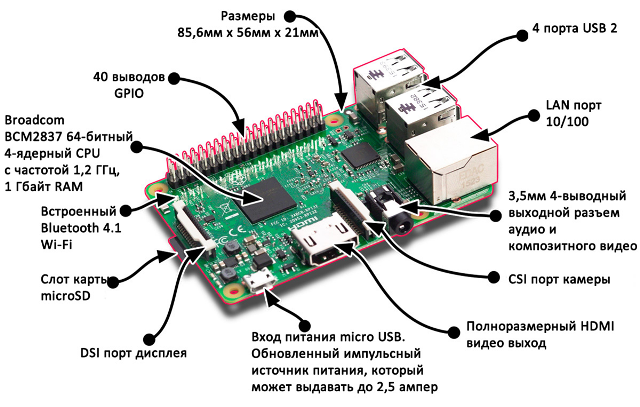
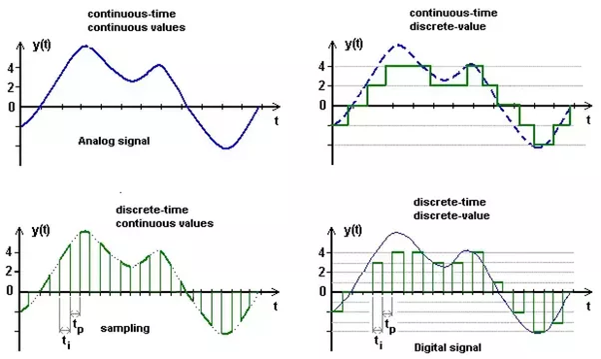
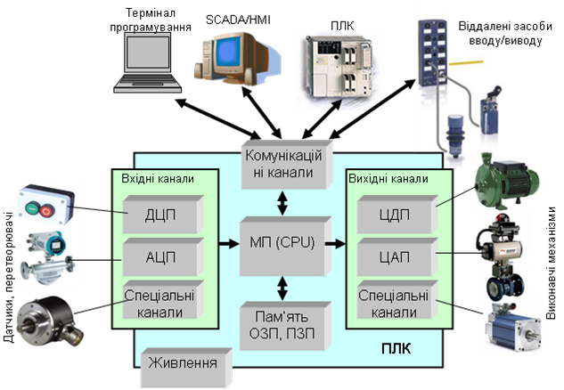
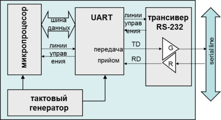
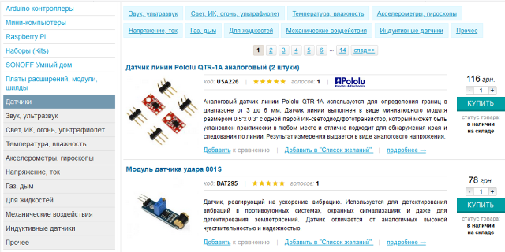
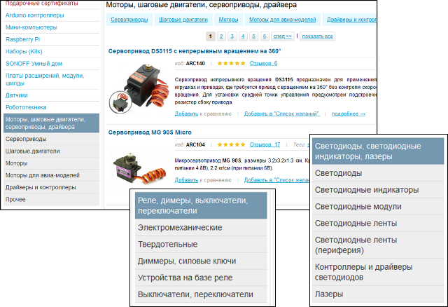

# Апаратне забезпечення Raspberry PI 3

[https://www.raspberrypi.org](https://www.raspberrypi.org/)

---

## Характеристики

Процесор: Broadcom BCM2837 64bit ARM Cortex-A53 Quad Core SoC
Робоча частота процесора: 1.2ГГц
Оперативна пам'ять: 1 ГБ
Пам'ять програм и даних: MicroSD
USB порти: 4 х USB 2.0 порта з виходом до 1.2 A
Розширений 40-контактный роз'єм GPIO
Відео / аудіо виход через 4-контактный роз'єм 3.5 мм, HDMI, CSI камери або Raw LCD (DSI)
Мережний інтерфейс: 10/100 Ethernet (RJ45)
Бездротовий інтерфейс: BCM43143 WiFi и Bluetooth Low Energy (BLE)
Периферійні пристрої низького рівня: 

- 27 х GPIO
- UART
- I2C інтерфейс
- SPI шина з двома сигналами вибору мікросхем
- 3.3V
- 5V
- GND
  Вимоги до живлення: 5В @ 2.4 А через джерело живлення MicroUSB
  Розміри: 85 х 56 х 17 мм
  Підтримка: Raspbian, Windows 10 IoT Core, OpenELEC, OSMC, Pidora, Arch Linux, RISC OS та інші!

---

## Приклад базової комплектації

\- Raspberry Pi 3 Model B  ~ 1100 г

\- Корпус модульний для Raspberry Pi 2 B+, Pi 3 B (прозорий) ~110 г 

\- Блок живлення імпульсний 5В 3А, microUSB ~150 г

\- Goodram microSDHC 16GB UHS-I class 10  ~100 г

сума ~ 1500 г.

---

## Типи сигналів

- Дискретні (цифрові) входи – Digital Inputs
- Дискретні (цифрові виходи) – Digital Outputs
- Аналогові входи – Analog Inputs (у RPI3 відсутні)
- Аналогові виходи – Analog Outputs (у RPI3 відсутні)
- Виходи ШІМ (широтно імпульсна модуляція) – PWM (pulse-wide modulation)

---

## Аналогові чи дискретні?

**аналогові** – характеризуються тільки діапазоном значень, неперервні в часі

**дискретні** - характеризуються множиною (набором) значень, 
 надалі вважатимемо що **дискретні** – тільки два значення «ТАК»/«НІ», 1/0, “TRUE”/”FALSE”, «ВКЛ»/«ВИКЛ» …. 

---

## Аналогово-цифрове перетворення (АЦП, ЦАП)

---

## Входи чи виходи?

---

## Дискретні (цифрові)входи

---

## Дискретні (цифрові)виходи

---

## Широтно-імпульсна модуляція ШІМ (PWM pulse-width modulation)

---

## Принципова схема GPIO

---

## Макетна плата

---

## Приклад підключення світлодіоду

---

## Приклад програми керування світлодіодом 

---

## Інтерфейс I²C (розробник Philips)

Кожний підключений до лінії I²C пристрій (Ведений, Slave) має власну адресу, до якої до неї підключається Raspberry Pi  (Ведучий, Master). Швидкість 400 кбіт/с, 100 кбіт/с, 10 кбіт/с (є і до 3,4 Мбіт/с), кількість пристроїв (до 127 – стара версія, 1024 – нова версія), кілька метрів.

Список з адресами пристроїв, підключених до I²C можна отримати програмою i2cdetect із пакету i2c-tools.

[Знакомство с шиной I2C в Raspberry Pi, работаем с ADC-DAC PCF8591 на ](https://ph0en1x.net/94-adc-dac-pcf8591-raspberry-pi-tutorial-i2c-bus-python.html)[Python](https://ph0en1x.net/94-adc-dac-pcf8591-raspberry-pi-tutorial-i2c-bus-python.html) 

---

## **One-wire**

1-Wire подібна за концепцією на I²C, але із меншою швидкістю передачі даних (lj 9600 біт/с) на більшу відстань (100-500 м). Вона зазвичай використовується для зв'язку із малими недорогими пристроями, такими як цифрові термометри і погодні пристрої. 

Однією відмінною особливістю цієї шини є можливість використання лише двох проводів: для даних і землі. 

[Підключення сенсорів з інтерфейсом 1-](http://mikrotik.kpi.ua/index.php/courses-list/category-python/117-connecting-sensors-with-1-wire-to-raspberry-pi-lesson-20)[Wire ](http://mikrotik.kpi.ua/index.php/courses-list/category-python/117-connecting-sensors-with-1-wire-to-raspberry-pi-lesson-20)[до ](http://mikrotik.kpi.ua/index.php/courses-list/category-python/117-connecting-sensors-with-1-wire-to-raspberry-pi-lesson-20)[Raspberry Pi | ](http://mikrotik.kpi.ua/index.php/courses-list/category-python/117-connecting-sensors-with-1-wire-to-raspberry-pi-lesson-20)[Заняття 20 ](http://mikrotik.kpi.ua/index.php/courses-list/category-python/117-connecting-sensors-with-1-wire-to-raspberry-pi-lesson-20) 

---

## Інтерфейс SPI

SPI (англ. Serial Peripheral Interface, SPI bus — послідовний периферійний інтерфейс, шина SPI) — фактичний послідовний синхронний повнодуплексний стандарт передачі даних, розроблений фірмою Motorola для забезпечення простого сполучення мікроконтролерів та периферії. SPI також називають чотирьох-провідним (англ. four-wire) інтерфейсом. 

- повнодумплексний

- швидший за I²C

- менше споживання 

- не потрібна адресація

- немає стандарту

- кілька метрів

  [http://](http://wiki.amperka.ru/rpi:installation)[wiki.amperka.ru/rpi:installation](http://wiki.amperka.ru/rpi:installation) 

---

## **UART** 

(англ. universal asynchronous receiver/transmitter — універсальний асинхронний приймач/передавач) — тип асинхронного приймача-передавача, компонентів комп'ютерів та периферійних пристроїв, що передає дані між паралельною та послідовною формами. UART звичайно використовується спільно з іншими комунікаційними стандартами, такими як EIA RS-232. UART це зазвичай окрема мікросхема чи частина мікросхеми, що використовується для з'єднання через комп'ютерний чи периферійний послідовний порт. UART нині загалом включені в мікроконтролери. 

---

## Датчики (sensors)

---

## Виконавчі механізми

[https://](https://arduino.ua/cat67-rele-dimeri-vikluchateli-perekluchateli)[arduino.ua/cat67-rele-dimeri-vikluchateli-perekluchateli](https://arduino.ua/cat67-rele-dimeri-vikluchateli-perekluchateli) 

## Корисні посилання 

[http://wiki.amperka.ru](http://wiki.amperka.ru/)[/](http://wiki.amperka.ru/) **База знаний** **Амперки** 

[http://](http://mikrotik.kpi.ua/index.php/courses-list/category-raspberry)[mikrotik.kpi.ua/index.php/courses-list/category-raspberry](http://mikrotik.kpi.ua/index.php/courses-list/category-raspberry) 