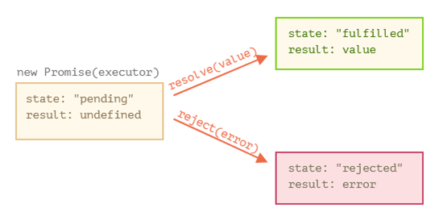
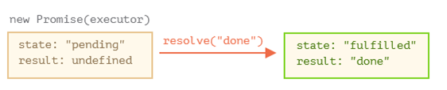
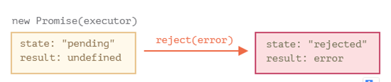
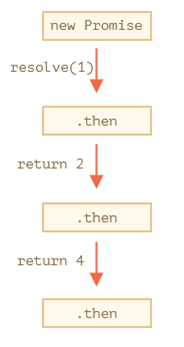
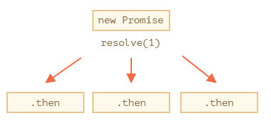

# Асинхронний JS

## Функції зворотного виклику та асинхронність

Багато функцій JavaScript та його середовищ виконання одразу повертають результат, ще до того як вона виконала цільову дію. Це корисно тоді, коли завершення обробки функції займає багато часу, яке при очікуванні буде гальмувати виконання програми. 

Наприклад, функція `setTimeout` повинна виконати якусь дію через вказаний інтервал часу. Для того щоб вказати цю дію, вона записується як інструкції в функції, яка буде викликатися через цей інтервал. Наприклад: 

```javascript
let fn = function () {console.log ("пройшло 2 секунди")};
console.log ("Запускаємо таймер");
setTimeout(fn, 2000);
console.log ("Таймер запущено, чекаємо...");
```

У даному прикладі, функція `fn` містить інструкцію, яку необхідно виконати через 2 секунди. При виклику `setTimeout` ця функція передається в якості аргументу разом з інтервалом (задається в мілісекундах). Замість того, щоб чекати 2 секунди, функція `setTimeout` одразу обробляється і передає керування наступній інструкції, що йде за нею. У цей час десь на рівні ОС запускається окремий програмний потік, задача якого відслідкувати спрацювання таймеру. Однак цей потік не зупиняє виконання програми JavaScript, вона виконується далі. Коли системний потік з таймером виявить, що час пройшов, він викличе функцію `fn`. 

Таким чином наведена вище програма спочатку виведе повідомлення "Запускаємо таймер", потім "Таймер запущено, чекаємо..." і через 2 секунди "пройшло 2 секунди". Така функція, яка запускається на виконання, одразу віддає керування потоку, що її визвав, ще до завершення результату називається ***асинхронною***. Функція, яка передається в якості аргументу для її виклику називається ***функцією зворотного виклику*** (колбек, callback). У наведеному вище прикладі функція `setTimeout` є асинхронною, а  `fn` - функцією зворотного виклику.

Наведений вище код з використанням функцій стрілок може виглядіти наступним чином:

```javascript
console.log ("Запускаємо таймер");
setTimeout(() => console.log ("пройшло 2 секунди"), 2000);
console.log ("Таймер запущено, чекаємо...");
```

Асинхронно також працює функція `setInterval`, яка запускає функцію, з вказаною періодичністю: 

```javascript
let fn = function () {console.log ("пройшло 2 секунди")};
console.log ("Запускаємо таймер");
setInterval(fn, 2000);
console.log ("Таймер запущено, чекаємо...");
```

Асинхронність є дуже корисною характеристикою тих функцій, які працюють з зовнішніми засобами.  

## Проміси

Проміси в спрощеному вигляді працюють наступним чином:

1. Є одна частина коду (умовно "виробник"), яка виконуючись займає певний час, наприклад завантажує дані по мережі. 
2. Є інша частина коду (умовно "споживач"), якому потрібно отримати результат виконання коду-"вирбника", коли він буде готовий. 
3. `Promise` (надалі «проміс») – це спеціальний об'єкт в JavaScript, який зв'язує код "виробника" з кодом "споживача". Код-"виробник" може виконуватися як завгодно довго, щоб отримати результат, а *проміс*  робить результат доступним для коду-"підписника" саме тоді, коли цей результат буде готовий. 

Синтаксис створення `Promise`:

```javascript
let promise = new Promise(function(resolve, reject) {
  // функція-виконавець (executor)
});
```

Функція, що передана в конструкцію `new Promise`, називається *виконавцем* (executor). Коли `Promise` створюється, вона запускається автоматично. Вона повинна містити код «виробника», який колись створить результат. Її аргументи `resolve` і `reject` – це функції зворотного виклику, які надає сам JavaScript. Код програміста – тільки всередині коду "виконавця". Коли код отримає результат, зараз або пізніше  – це не важливо, він повинен викликати одну з цих функцій зворотного виклику:

- `resolve(value)` — якщо робота завершилася успішно, с результатом `value`.
- `reject(error)` — якщо виникла помилка, `error` – об'єкт помилки.

Таким чином, "виконавець" запускається автоматично, він повинен виконати роботу, а потім викликати `resolve` або `reject`.

У об'єкта `promise`, який повертається конструктором `new Promise`, є внутрішні властивості:

- `state` («стан») — на початку `"pending"` («очікування»), потім змінюється на  `"fulfilled"` («виконано успішно») при виклику `resolve` або на `"rejected"` («виконано з помилкою») при виклику `reject`.
- `result` («результат») — на початку `undefined`, далі змінюється на `value` при виклику `resolve(value)` або на `error` при виклику `reject(error)`.

Тому "виконавець"  зрештою переводить `promise` в один із двох станів:



Нижче приклад конструктора `Promise` і простого "виконавця" з кодом, що дає результат з затримкою (через `setTimeout`):

```javascript
let promise = new Promise(function(resolve, reject) {
  // ця функція виконається автоматично, при виклику new Promise
  // через 1 секунду сигналізувати, що задача виконана з результатом "done"
  setTimeout(() => resolve("done"), 1000);
});
```

Запустивши код вище, буде:

1. Функція "виконавець" запускається одразу при виклику `new Promise`.
2. Виконавець отримує два аргументи: `resolve` і `reject` — це функції, вбудовані в JavaScript, тому нам не потрібно їх писати. Нам потрібно лиш потурбуватися, щоб виконавець викликав одну з них за готовністю.

Через одну секунду «обробки» виконавець викличе  `resolve("done")`, щоб передати результат:



Це був приклад успішно виконаного завдання, в результаті якого був отриманий "успішно виконаний" проміс. Наступний приклад, в якому виконавець повідомить, що завдання виконане з помилкою. 

```javascript
let promise = new Promise(function(resolve, reject) {
  // спустя одну секунду будет повдомлено, що задача виконана з помилкою
  setTimeout(() => reject(new Error("Whoops!")), 1000);
});
```



Проміси як успішні так і відхилені надалі будемо називати «завершеними», на відміну від початкового проміса в "очікуванні". Може бути щось одне: або результат, або помилка.

Виконавець повинен викликати щось одне: `resolve` або `reject`. Стан проміса може бути змінено тільки один раз. Усі наступні виклики `resolve` і `reject` будуть проігноровані:

```javascript
let promise = new Promise(function(resolve, reject) {
  resolve("done");

  reject(new Error("…")); // ігнорується
  setTimeout(() => resolve("…")); // ігнорується
});
```

Функція `resolve`/`reject` очікує тільки один аргумент (або жодного). Усі додаткові аргументи будуть проігноровані. Викликайте `reject` з об'єктом `Error`. У випадку, якщо щось пішло не так, ми повинні викликати  `reject`. Це можна зробити з аргументом будь якого типу (як і `resolve`), але рекомендується використовувати об'єкт `Error` (або наслідуваний від нього). 

Зазвичай виконавець робить щось асинхронне і після цього викликає `resolve`/`reject`, тобто через певний час. Але це не обов'язково `resolve` або `reject` можуть бути викликані одразу:

```javascript
let promise = new Promise(function(resolve, reject) {
  // задача, що не потребує часу
  resolve(123); // одразу поверне результат: 123
});
```

Це може статися, наприклад, коли ми почали виконувати якесь завдання, але тут же побачили, що раніше його вже виконували, і результат закешований. Така ситуація нормальна. Ми відразу отримаємо успішно завершений `Promise`.

Властивості `state` і ` result` - це внутрішні властивості об'єкта `Promise` і ми не маємо до них прямого доступу. Для обробки результату слід використовувати методи `.then` /` .catch` / `.finally`, про них мова піде далі.

Об'єкт `Promise` служить сполучною ланкою між виконавцем (кодом "виробника") і функціями-"споживачами", які отримають або результат, або помилку. Функції-споживачі можуть бути зареєстровані (підписані) за допомогою методів `.then`,` .catch` і `.finally`.

### then

Найбільш важливий і фундаментальний метод – `.then`. Синтаксис:

```javascript
promise.then(
  function(result) { /* обробляє успішне виконання */ },
  function(error) { /* обробляє помилку */ }
);
```

Перший аргумент методу `.then` - це функція, яка виконується, коли проміс переходить в стан «виконано успішно», і отримує результат. Другий аргумент `.then` - це функція, яка виконується, коли проміс переходить в стан «виконано з помилкою», і отримує помилку.

Наприклад, ось реакція на успішно виконаний проміс:                      

```javascript
let promise = new Promise(function(resolve, reject) {
  setTimeout(() => resolve("done!"), 1000);
});

// resolve запустить першу функцію, що передається в .then
promise.then(
  result => alert(result), // виведе "done!" через одну секунду
  error => alert(error) // не буде запущена
);     
```

Якщо ми зацікавлені тільки в результаті успішного виконання завдання, то в `then` можна передати лише одну функцію:                                       

```javascript
let promise = new Promise(resolve => {
  setTimeout(() => resolve("done!"), 1000);
});
promise.then(alert); // виведе "done!" через одну секунду
```

### catch

Якщо ми хотіли б тільки обробити помилку, то можна використовувати `null` у якості першого аргументу:` .then (null, errorHandlingFunction) `. Або можна скористатися методом `.catch (errorHandlingFunction)`, який зробить те ж саме:                                       

```javascript
let promise = new Promise((resolve, reject) => {
  setTimeout(() => reject(new Error("Помилка!")), 1000);
});

// .catch(f) те саме, що і promise.then(null, f)
promise.catch(alert); // виведе "Error: Помилка!" через одну секунду
```

Виклик `.catch(f)` – це скорочений варіант  `.then(null, f)`.

### finally

За аналогією з блоком `finally` зі звичайного ` try {...} catch {...} `, у проміс також є метод ` finally`. Виклик `.finally(f)` схожий на `.then (f, f)`, в тому сенсі, що `f` виконається в будь-якому випадку, коли проміс завершиться: успішно чи з помилкою. `Finally` добре підходить для очищення, наприклад зупинки індикатора завантаження, адже його потрібно зупинити незалежно від результату.

Наприклад:

```javascript
new Promise((resolve, reject) => {
  /* зробити щось, що займе час, а після викликати resolve/reject */
})
  // виконається, коли проміс завершиться, незалежно від того, успішно чи ні 
  .finally(() => зупинити індикатор завантаження)
  .then(result => показати результат, err => показати помилку)
```

Але це не зовсім псевдонім `then (f, f)`, як можна було б подумати. Існує кілька важливих відмінностей:

1. Обробник, що викликається з `finally`, не має аргументів. В `finally` ми не знаємо, як був завершений проміс. І це нормально, тому що зазвичай наше завдання - це виконати «загальні» завершальні процедури.

2. Обробник`finally` «пропускає»результат або помилку далі, до наступних обробників.

3. Останнє, але не менш значуще: виклик `.finally (f)` зручніше, ніж `.then (f, f)` - не треба дублювати функції f.

    Наприклад, тут результат проходить через `finally` до` then`:

```javascript
new Promise((resolve, reject) => {
  setTimeout(() => resolve("result"), 2000)
})
  .finally(() => alert("Проміс завершений"))
  .then(result => alert(result)); // <-- .then обробить результат
```

А тут помилка з проміс проходить через `finally` до ` catch`:

```javascript
   new Promise((resolve, reject) => {
     throw new Error("error");
   })
     .finally(() => alert("Проміс завершений"))
     .catch(err => alert(err));  // <-- .catch обробить об'єкт помилки
```

Однак, якщо проміс вже завершений, то обробники виконуватися відразу:                      

```javascript
// при створенні промісу він відразу переводиться в стан "успішно завершений" 
let promise = new Promise(resolve => resolve("готово!"));

promise.then(alert); // готово! (выведеться одразу)
```

### Ланцюжок промісів

Приклад ланцюжка промісів:                      

```javascript
new Promise(function(resolve, reject) {
  setTimeout(() => resolve(1), 1000); // (*)
}).then(function(result) { // (**)
  alert(result); // 1
  return result * 2;
}).then(function(result) { // (***)
  alert(result); // 2
  return result * 2;
}).then(function(result) {
  alert(result); // 4
  return result * 2;
});
```

Ідея полягає в тому, що результат першого промісу передається по ланцюжку обробників `.then`. Потік виконання такий:

1. Початковий проміс успішно виконується через 1 секунду `(*)`,
2. Потім викликається обробник в `.then` `(**)`.
3. повертається їм значення передається далі в наступний обробник  `.then` `(***)` 
4. ... і так далі.

У підсумку результат передається по ланцюжку обробників, і ми бачимо кілька `alert` поспіль, які виводять:` 1` → `2` →` 4`. 



Все це працює, тому що виклик `promise.then` теж повертає проміс, так що ми можемо викликати на ньому наступний ` .then`. Коли обробник повертає якесь значення, то воно стає результатом виконання відповідного проміс і передається в наступний `.then`.

**Технічно можливо додати багато обробників `.then` до єдиного промісу. Але це не ланцюжок**. Наприклад:

```javascript
let promise = new Promise(function(resolve, reject) {
  setTimeout(() => resolve(1), 1000);
});
promise.then(function(result) {
  alert(result); // 1
  return result * 2;
});
promise.then(function(result) {
  alert(result); // 1
  return result * 2;
});
promise.then(function(result) {
  alert(result); // 1
  return result * 2;
});
```

Ми додали кілька обробників до одного промісу. Вони не передають один одному результати свого виконання, а діють незалежно. Ось картина того, що відбувається (порівняйте це з зображенням ланцюжка промісів вище):



Всі обробники `.then` на одному і тому ж промісі отримують одне і те ж значення - результат виконання того ж самого промісу. Таким чином, в коді вище всі `alert` показують один і той же результат:` 1`. На практиці досить рідко потрібно призначати кілька обробників одному Проміс. А ось ланцюжок Проміс використовується набагато частіше.

У ланцюжку промісів обробник `handler`, переданий в ` .then(handler) `, може повернути проміс. В цьому випадку подальші обробники очікують, поки він виконається, і потім отримують його результат. наприклад:                     

```javascript
new Promise(function(resolve, reject) {
  setTimeout(() => resolve(1), 1000);
}).then(function(result) {
  alert(result); // 1
  return new Promise((resolve, reject) => { // (*)
    setTimeout(() => resolve(result * 2), 1000);
  });
}).then(function(result) { // (**)
  alert(result); // 2
  return new Promise((resolve, reject) => {
    setTimeout(() => resolve(result * 2), 1000);
  });
}).then(function(result) {
  alert(result); // 4
});
```

Тут перший `.then` показує ` 1` і повертає новий проміс `new Promise (...)` в рядку `(*)`. Через одну секунду цей проміс успішно виконується, а його результат (аргумент в `resolve`, тобто` result * 2 `) передається обробнику в наступному ` .then`. Він знаходиться в рядку `(**)`, показує `2` і робить те ж саме. Таким чином, як і в попередньому прикладі, виводяться 1 → 2 → 4, але зараз між викликами `alert` існує пауза в 1 секунду. Повертаючи проміс, ми можемо будувати ланцюжки з асинхронних дій.

### Приклад: fetch

У фронтенд-розробці проміс часто використовуються, щоб робити запити по мережі. Давайте розглянемо один такий приклад. Ми будемо використовувати метод [fetch](https://learn.javascript.ru/fetch), щоб довантажити інформацію про користувачів з віддаленого сервера. Цей метод має багато опціональних параметрів, але базовий синтаксис досить простий:

```javascript
let promise = fetch(url);
```

Цей код запитує по мережі `url` і повертає проміс. Проміс успішно виконується і в свою чергу повертає об'єкт `response` після того, як віддалений сервер надсилає заголовки відповіді, але *до того, як вся відповідь сервера повністю завантажена*. Щоб прочитати повну відповідь, треба викликати метод `response.text ()`: він теж повертає проміс, який виконується, коли дані повністю завантажені з віддаленого сервера, і повертає ці дані.

Код нижче запитує файл `user.json` и завантажує його змістом з серверу:                    

```javascript
fetch('/article/promise-chaining/user.json')
  // .then в коді нижче виконується, коли віддалений сервер відповідає
  .then(function(response) {
    // response.text() повертає новий проміс,
    // який виконується і повертає повну відповідь сервера, 
    // коли він завантажиться
    return response.text();
  })
  .then(function(text) {
    // ...і тут вміст отриманого файлу
    alert(text); // {"name": "iliakan", isAdmin: true}
  });
```

Є також метод `response.json()`, який читає дані в форматі JSON. Він більше підходить для нашого прикладу, так що давайте використовувати його. Ми також застосуємо стрілочні функції для більш компактного запису коду:                      

```javascript
// те ж саме, що і раніше, тільки тепер response.json () читає дані в форматі JSON 
fetch('/article/promise-chaining/user.json')
  .then(response => response.json())
  .then(user => alert(user.name)); // iliakan, отримали ім'я користувача
```

Тепер давайте щось зробимо з отриманими даними про користувача. Наприклад, ми можемо надіслати запит на GitHub, щоб завантажити дані з профілю користувача і показати його аватар:

```javascript
// Запитуємо user.json
fetch('/article/promise-chaining/user.json')
  // завантажуємо дані в форматі json
  .then(response => response.json())
  // робимо запит на GitHub
  .then(user => fetch(`https://api.github.com/users/${user.name}`))
  // завантажуємо відповідь у форматі json
  .then(response => response.json())
  // показуємо аватар (githubUser.avatar_url) протягом 3 секунд (можливо, з анімацією)
  .then(githubUser => {
    let img = document.createElement('img');
    img.src = githubUser.avatar_url;
    img.className = "promise-avatar-example";
    document.body.append(img);
    setTimeout(() => img.remove(), 3000); // (*)
  });
```

Код працює, деталі реалізації відображені в коментарях. Однак в ньому є одна потенційна проблема, з якою часто стикаються новачки. Подивіться на рядок `(*)`: як ми можемо зробити якісь дії *після* того, як аватар був показаний або видалений? Наприклад, ми б хотіли показувати форму редагування користувача або щось ще. Зараз це неможливо. Щоб зробити наш код розширюваним, нам потрібно повертати ще один проміс, який виконується після того, як завершується показ аватара. Приблизно так:                      

```javascript

fetch('/article/promise-chaining/user.json')
  .then(response => response.json())
  .then(user => fetch(`https://api.github.com/users/${user.name}`))
  .then(response => response.json())
  .then(githubUser => new Promise(function(resolve, reject) { // (*)
    let img = document.createElement('img');
    img.src = githubUser.avatar_url;
    img.className = "promise-avatar-example";
    document.body.append(img);
    setTimeout(() => {
      img.remove();
      resolve(githubUser); // (**)
    }, 3000);
  }))
  // спрацює через 3 секунди
  .then(githubUser => alert(`Закінчили показ ${githubUser.name}`));
```

Тобто, обробник `.then` в рядку ` (*) `буде повертати ` new Promise`, який перейде в стан «виконано» тільки після того, як в `setTimeout` `(**)` буде викликана ` resolve (githubUser ) `. Відповідно, наступний по ланцюжку `.then` чекатиме цього. Як правило, всі асинхронні дії повинні повертати проміс. Це дозволяє планувати після нього якісь додаткові дії. Навіть якщо ця можливість не потрібна прямо зараз, вона може знадобитися в майбутньому. І, нарешті, давайте розіб'ємо написаний код на окремі функції, придатні для повторного використання:                                            

```javascript
function loadJson(url) {
  return fetch(url)
    .then(response => response.json());
}
function loadGithubUser(name) {
  return fetch(`https://api.github.com/users/${name}`)
    .then(response => response.json());
}
function showAvatar(githubUser) {
  return new Promise(function(resolve, reject) {
    let img = document.createElement('img');
    img.src = githubUser.avatar_url;
    img.className = "promise-avatar-example";
    document.body.append(img);
    setTimeout(() => {
      img.remove();
      resolve(githubUser);
    }, 3000);
  });
}

// Використання:
loadJson('/article/promise-chaining/user.json')
  .then(user => loadGithubUser(user.name))
  .then(showAvatar)
  .then(githubUser => alert(`Показ аватара ${githubUser.name} завершён`));
  // ...
```

Відразу помітно кілька переваг перед підходом з використанням функцій зворотного виклику:

| Проміси                                                      | Функції зворотного виклику                                   |
| ------------------------------------------------------------ | ------------------------------------------------------------ |
| Проміси дозволяють робити речі в природному порядку. Спершу ми запускаємо код виробника, і потім код споживача через `.then` | У нас повинна бути функція `callback` на момент виклику функції "виробника". Іншими словами, нам потрібно знати що робити з результатом *до того*, як викликається функція "виробника". |
| Ми можемо викликати `.then` у ` Promise` стільки раз, скільки захочемо. Щоразу ми додаємо нового «споживача», нову функцію-підписника в «список підписок». | Функція зворотного виклику може бути тільки одна.            |

### Async/await

Існує спеціальний синтаксис для роботи з промісами, який називається «async/await». Почнемо з ключового слова `async`. Воно ставиться перед функцією, ось так:

```javascript
async function f() {
  return 1;
}
```

У слова `async` один простий сенс: ця функція завжди повертає проміс. Значення інших типів автоматично обертаються в проміс, який завершується успішно. Наприклад, ця функція поверне виконаний проміс з результатом `1`:                                       

```javascript
async function f() {
  return 1;
}
f().then(alert); // 1
```

Можна і явно повернути проміс, результат буде однаковим:                      

```javascript
async function f() {
  return Promise.resolve(1);
}
f().then(alert); // 1
```

Так що ключове слово `async` перед функцією гарантує, що ця функція в будь-якому випадку поверне проміс. Є ще інше ключове слово - `await`, яке можна використовувати тільки всередині ` async`-функцій:

```javascript
// працює тільки всередині async–функцій
let value = await promise;
```

Ключове слово `await` змусить інтерпретатор JavaScript чекати до тих пір, поки проміс праворуч від ` await` не виконається. Після чого воно поверне його результат, і виконання коду продовжиться. У цьому прикладі проміс успішно виконається через 1 секунду:                      

```javascript
async function f() {
  let promise = new Promise((resolve, reject) => {
    setTimeout(() => resolve("готово!"), 1000)
  });
  let result = await promise; // буде чекати, поки проміс не виконається (*)
  console.log(result); // "готово!"
}
f();
```

У даному прикладі виконання функції зупиниться на рядку `(*)` до тих пір, поки проміс не виконається. Це станеться через секунду після запуску функції. Після чого в змінну `result` буде записаний результат виконання промісу, і браузер відобразить alert-вікно «готово! ».

Зверніть увагу, хоча `await` і змушує JavaScript чекати виконання промісу, це не віднімає ресурсів процесора. Поки проміс не виконається, JS-рушій може займатися іншими завданнями: виконувати інші скрипти, обробляти події і т.п. По суті, це просто «синтаксичний цукор» для отримання результату промісу, більш наочний, ніж `promise.then`. `Await` не можна використовувати в звичайних функціях та на верхньому рівні вкладеності. Якщо ми спробуємо використовувати `await` всередині функції, оголошеної без ` async`, отримаємо синтаксичну помилку:                             

```javascript
function f() {
  let promise = Promise.resolve(1);
  let result = await promise; // SyntaxError
}
```

Помилки не буде, якщо ми вкажемо ключове слово `async` перед оголошенням функції. Як було сказано раніше, `await` можна використовувати тільки всередині ` async`-функцій.

Давайте перепишемо приклад `showAvatar()` за допомогою `async / await`:

1. Нам потрібно замінити виклики `.then` на ` await`.
2. І додати ключове слово `async` перед оголошенням функції.                      

```javascript
async function showAvatar() {

  // запитуємо JSON з даними користувача
  let response = await fetch('/article/promise-chaining/user.json');
  let user = await response.json();

  // запитуємо інформацію про цього користувача з github
  let githubResponse = await fetch(`https://api.github.com/users/${user.name}`);
  let githubUser = await githubResponse.json();

  // відображаємо аватар користувача
  let img = document.createElement('img');
  img.src = githubUser.avatar_url;
  img.className = "promise-avatar-example";
  document.body.append(img);

  // чекаємо 3 секунды а потім ховаємо аватар
  await new Promise((resolve, reject) => setTimeout(resolve, 3000));

  img.remove();

  return githubUser;
}

showAvatar();  
```

Як і `promise.then`, ` await` дозволяє працювати з проміс-сумісними об'єктами. Ідея в тому, що якщо в об'єкта можна викликати метод `then`, цього достатньо, щоб використовувати його з ` await`. 

```javascript
class Thenable {
  constructor(num) {
    this.num = num;
  }
  then(resolve, reject) {
    alert(resolve);
    // виконати resolve зі значенням this.num * 2 через 1000мс
    setTimeout(() => resolve(this.num * 2), 1000); // (*)
  }
};
async function f() {
  // код буде чекати 1 секунду,
  // після чого значення result стане рівним 2
  let result = await new Thenable(1);
  alert(result);
}
f();
```

Коли `await` отримує об'єкт з ` .then`, який не є промісом, JavaScript автоматично запускає цей метод, передаючи йому аргументи - вбудовані функції `resolve` і ` reject`. Потім `await` призупинить подальше виконання коду, поки будь-яка з цих функцій не буде викликана (в прикладі це рядок` (*) `). Після чого виконання коду продовжиться з результатом `resolve` або` reject` відповідно.

Коли проміс завершується успішно, `await promise` повертає результат. Коли завершується з помилкою - буде викинуто виключення, так якби на цьому місці знаходився вираз `throw`. Такий код:

```javascript
async function f() {
  await Promise.reject(new Error("Упс!"));
}
```

Робить те ж саме, що і такий:

```javascript
async function f() {
  throw new Error("Упс!");
}
```

Але є відмінність: на практиці проміс може завершитися з помилкою не відразу, а через деякий час. У цьому випадку буде затримка, а потім `await` викине виняток. Такі помилки можна ловити, використовуючи `try..catch`, як зі звичайним ` throw`:                                            

```javascript
async function f() {
  try {
    let response = await fetch('http://no-such-url');
  } catch(err) {
    alert(err); // TypeError: failed to fetch
  }
}

f();
```

https://uk.javascript.info/promise-basics

## Node JS: модуль events

Асинхронність в JS досягається через виклик функцій-обробників, які викликаються за виконанням певної події. У простому випадку в асинхронну функцію передають функцію зворотного виклику.  Але є і інші способи, наприклад з використанням принципів подіє-орієнтованого програмування, при якому об’єктом генеруються події які обробляються спеціальними обробниками цих подій. 

У модулі events є клас Emitter. Екземпляри цього класу (об'єкти-**емітери**) генерують різноманітні події, на які можна підписатися і вказати функції, які будуть викликатися при виникненні цих подій. Таким чином всередині об'єкту йде генерація подій, а ззовні їх обробка.  

Багато класів в інших модулях наслідують емітери для формування подіє-орієнтованого підходу. 

```js
const Emitter = require('events');//імпортувати клас емітер
let emitter = new Emitter(); //створити новий емітер
let eventName = 'greet';
//спочатку зв'язати подію eventName з функцією зворотного виклику 
emitter.on( //on - метод для зв'язуання, "слухати" 
  eventName, //подія 
  function(){console.log('Hello all!')} //функція обробки
);
emitter.on(eventName, function(){
    console.log("Привіт усі!")
});
//emit - метод для генерування події 
emitter.emit(eventName);//перший параметр - назва події
//передача параметрів еміттеру
let emitter1 = new Emitter();
emitter1.on(eventName, function(data){
    console.log(data);
});
//другий параметр методу emit - параметри функції обробника
emitter1.emit(eventName, "Привіт світ!");

```

