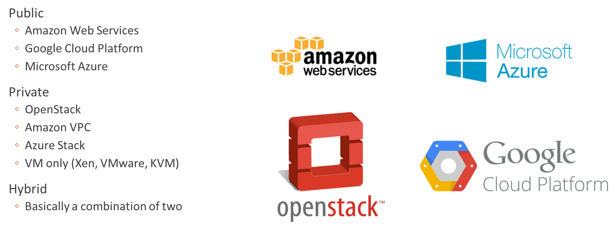
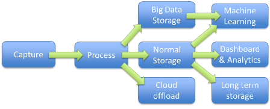

**Програмна інженерія в системах управління. Лекції.** Автор і лектор: Олександр Пупена 

| [<- до лекцій](README.md) | [на основну сторінку курсу](../README.md) |
| ------------------------- | ----------------------------------------- |
|                           |                                           |

# Використання хмарних сервісів для IoT.

## Про хмарні обчислення.

***Хмарні обчислення*** (Cloud Computing) — модель забезпечення повсюдного та зручного доступу через мережу на вимогу до загальнодоступного набору обчислювальних ресурсів, що підлягають налаштуванню (наприклад, до комунікаційних мереж, серверів, засобів збереження даних, прикладних програм та сервісів), і які можуть бути оперативно надані та звільнені з мінімальними затратами на керування та зверненнями до провайдера.

Поняття «хмара» відноситься до інфраструктури обчислювальних служб, які зазвичай необхідні відповідно до запиту. Набір ресурсів (обчислень, мереж, сховищ і пов'язаних з ними програмних сервісів) може динамічно масштабуватися в бік збільшення або зменшення в залежності від середнього навантаження і якості обслуговування. Хмари, як правило, - це великі центри обробки даних, які надають клієнтам послуги, орієнтовані на зовнішнього споживача, і модель оплати за використання. Ці центри створюють ілюзію єдиного хмарного ресурсу, в той час як насправді може бути використано багато географічно розподілених ресурсів (наприклад серверів). Це дає користувачеві відчуття незалежності від їх місця розташування. Ресурси є еластичними (що означає масштабованість), а сервіси – це еквівалент плати за використання, незмінний дохід для провайдера. Сервіси, які працюють в хмарі, відрізняються від традиційного програмного забезпечення своєю конструкцією та реалізацією. Хмарні застосунки можуть розроблятися і розвиватися швидше і в меншій мірі залежати від мінливості середовища. Таким чином, розгортання хмар відбувається дуже швидко.

рис.1

## Моделі топологій хмар

У хмарному середовищі існують три різні моделі топології хмар: приватна хмара (private cloud), хмара загального користування або публічна (public cloud) та гібридна хмара (Hybrid cloud). 

рис.2

***Публічна хмара*** **(*Public Cloud*)** - хмарна інфраструктура, при якій серверні потужності обов'язково знаходяться на стороні провайдера хмарних послуг, який надає ресурси відразу кільком організаціям з одночасно. Тут інфраструктура надається на вимогу для безлічі клієнтів і застосунків. Тут інфраструктура – це набір ресурсів, які будь-яка людина може використовувати в будь-який час в рамках своїх угод про рівень обслуговування. Перевага використання у тому, що хмарні центри обробки даних дозволяють забезпечити безпрецедентну масштабованість для багатьох клієнтів, які обмежені тільки тим, яку частину послуг вони хочуть придбати. Прикладами публічних хмар є^

- [AWS (Amazon Web Services)](https://aws.amazon.com/) 
- [Google Cloud](https://cloud.google.com)
- [Microsoft Azure](https://azure.microsoft.com) 
- [IBM Cloud](https://cloud.ibm.com/) 
- [Alibaba Cloud](www.alibabacloud.com)

***Приватна хмара (private cloud)*** – хмарна інфраструктура, надана в виключне користування однієї організації або корпорації. Приватна хмара існує по ряду причин, включаючи безпеку та перевіреність якості. Тобто це потрібно для гарантування, що інформація обробляється виключно системами, що керовані клієнтом. Однак, щоб вважатися хмарою, повинні існувати деякі аспекти хмарних сервісів, такі як віртуалізація і балансування навантаження. 

***Гібридна хмара*** (**Hybrid cloud**) – одночасне використання приватної і публічної хмари. 

Незалежно від моделі, каркаси хмар повинні забезпечувати динамічну масштабованість, швидкість розробки і розгортання, а також використання в потрібному місці незалежно від його близькості. Сучасні корпоративні системи, як правило, використовують гібридну архітектуру для забезпечення безпеки критично важливих застосунків і даних за місцем і використовують публічну хмару для підключення, простоти і швидкості розгортання.

Також можете подивитися [відео](https://youtu.be/Lpy0HuBbijI).

## Модель хмарних сервісів

Хмарні провайдери зазвичай підтримують цілий ряд продуктів «Все як сервіс» (XaaS). Тобто, послуга програмного забезпечення з оплатою за використання. Сервіс включає в себе службу мережі (NaaS), програмне забезпечення як послугу (**SaaS**), платформу як послугу (**PaaS**) і інфраструктуру як послугу (IaaS). Кожна модель представляє все більше і більше хмарних сервісів від постачальників. Ці сервісні пропозиції - додана вартість хмарних обчислень. Як мінімум, ці послуги повинні компенсувати капітальні витрати, з якими зіштовхується клієнт для придбання і обслуговування такого обладнання центру обробки даних, і врахувати це як експлуатаційні витрати. 

                               

Рис.3. Різні моделі надання хмарних сервісів.

***SaaS*** (Software as a Service, програмне забезпечення як послуга) пропонує користувачеві використовувати готове програмне забезпечення, яке виконується в хмарі. З точки зору користувача, віртуальний SaaS фактично працює на його пристрої. Прикладами таких сервісів є різноманітні застосунки Google (наприклад, Google Sheet, Google Docs) або Microsoft Office 365.

***PaaS*** (Platform as a Service, **платформа як сервіс**) використовує базове устаткування і програмні засоби нижнього рівня, що надаються хмарою. У такому випадку кінцевий користувач тільки використовує апаратне забезпечення центру обробки даних, операційну систему, проміжне ПЗ і різні бази даних постачальника для розміщення свого приватного застосунку або сервісу. Проміжне ПЗ може складатися з систем керування базами даних, збору та обробки даних і т.п. Тобто платформа використовується як певний напівфабрикат, за допомогою якого збирається рішення для кінцевого споживача. Зрештою, розробник може використовувати PaaS для створення власного SaaS.  

У моделі ***IaaS*** (Infrastructure as a Service, **інфраструктура як сервіс**) постачальник створює масштабовані апаратні служби в хмарі і надає модифікацію програмних каркасів для створення клієнтських віртуальних машин. По суті, клієнт отримує віртуальні комп’ютери з необхідною ОС і встановлює на них все, що необхідно. Кількість комп’ютерів, їх графік роботи керується ззовні як користувачем так і скриптами, що надає такому рішенню гнучкості.  

## Хмарні сервіси для IoT.

Хмарні обчислення надають можливість використовувати ІТ інфраструктуру (сервери, мережі та ПЗ) за вимогою.  Ціль такого використання може бути зовсім різною, наприклад збереження даних, використання застосунків, обробки даних і т.п. Як варіант вони можуть використовуватися як централізовані ресурси для доступу 24/7.  

При використанні хмарних платформ в архітектурі IoT, дані що збираються з Edge проходять певну обробку. Хмарні IoT сервіси розраховані на отримання великої кількості запитів на одиницю часу, що дає можливим побудувати розподілені системи IoT з тисячами джерел даних при цьому майже не втративши на швидкості обробки. Після отримання даних (Capture, див рис.4) відбувається їх первинна обробка, що включає певні розрахунки та переадресацію на наступний сервіс. Якщо крок «Capture» більше зосереджений на комунікаціях (наприклад MQTT чи HTTP), то «Process» - на логічному структуруванні даних та примітивній обробці (масштабування, агрегатування, тощо). Дані можуть об’єднуватися навколо сутностей типу «пристроїв» чи «цифрових двійників», що спрощує їх адміністрування. 

                               

Рис.4. Типовий шлях обробки даних в IoT.

Далі дані можуть передатися іншим сервісам, наприклад для збереження в різних сховищах: 

- під «Normal Storage» розуміється якась БД типу SQL або NONSQL, яка буде використовуватися різними сервісами для аналізу даних; 

- «Big Data Storage» - база даних спеціального формату, розрахована на роботу з даними великого об’єму;

- «Cloud offload» - це сховище поза межами хмари

- «Dashboard &Analytics» використовується для виведення даних в форматі онлайн-звітів. Під аналітикою розуміються звичайні сервіси статистичного аналізу, які не вимагають алгоритмів машинного навчання. Ці звіти як правило конфігуруються і не потребують програмування.

- «Long Term Storage» - використовується для довгострокового зберігання даних, які не потребують швидкого доступу та аналізу. 

- «Machine Learning» використовуються для складної обробки даних з використанням машинного навчання. 

## Інтеграція з хмарними сервісами та застосунками

| [<- до лекцій](README.md) | [на основну сторінку курсу](../README.md) |
| ------------------------- | ----------------------------------------- |
|                           |                                           |

