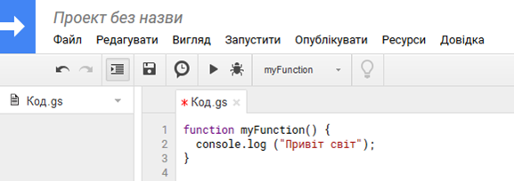
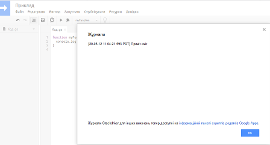
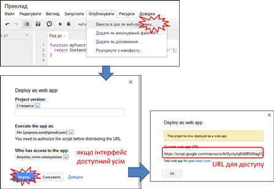
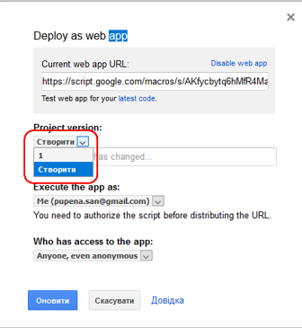

**Програмна інженерія в системах управління. Лекції.** Автор і лектор: Олександр Пупена 

| [<- до лекцій](README.md) | [на основну сторінку курсу](../README.md) |
| ------------------------- | ----------------------------------------- |
|                           |                                           |

# Google Apps Script


## Загальний огляд

**Google Apps Script** - це платформа для розробки застосунків, що дозволяє швидко та легко створювати бізнес-застосунки, які інтегруються з [G Suite](https://uk.wikipedia.org/wiki/G_Suite). Код пишеться на сучасній версії JavaScript, при цьому з надається доступ до вбудованих бібліотек для програм `G Suite`, таких як `Gmail`, `Календар`, `Диск` тощо. Для використання не потрібно встановлювати нічого - редактор надається безпосередньо в браузері, а сценарії працюють на серверах Google.

У Apps Script як і для багатьох інших реалізацій JavaScript *середовище виконання* містить рушій JavaScript, який аналізує та виконує код сценарію (див. [лекцію по JS](javascript.md)). Під час виконання програми передбачені правила доступу до пам'яті, як програма може взаємодіяти з операційною системою комп'ютера та який синтаксис програми є законним. Кожен веб-браузер має середовище виконання JavaScript.

Історично склалося, що програми Apps Script використовувався [**Інтерпретатор JavaScript від Rhino**](https://developer.mozilla.org/en-US/docs/Mozilla/Projects/Rhino). Хоча Rhino надав зручні можливості для виконання сценаріїв Apps Script, він також прив’язав Apps Script до певної версії JavaScript ([ES5](https://www.w3schools.com/whatis/whatis_es5.asp)). Тому розробники Apps Script не могли використовувати більш сучасні синтаксиси та функції JavaScript у сценаріях, що використовують середовище виконання Rhino. Щоб вирішити цю проблему, Apps Script тепер підтримує [**рушій V8**](https://v8.dev/), який використовують наприклад `Google Chrome` та `Node.js`. Тепер можна [конвертувати існуючі сценарії Rhino у версію V8](https://developers.google.com/apps-script/guides/v8-runtime/migration), щоб скористатися сучасним синтаксисом та функціями JavaScript.

## Можливості Apps Script

Apps Script є універсальним. Зокрема він дозволяє:

- Додати [користувацькі меню](https://developers.google.com/apps-script/guides/menus), [діалоги та бічні панелі](https://developers.google.com/apps-script/guides/dialogs ) до Документів, Таблиць(Sheets) та Форм Google.
- Писати [користувацькі функції](https://developers.google.com/apps-script/execution_custom_functions) та [макроси](https://developers.google.com/apps-script/guides/sheets/macros) для Google Sheets.
- Публікувати [веб-застосунки](https://developers.google.com/apps-script/execution_web_apps) - самостійно або вбудовані в Google Sites.
- Взаємодіяти з іншими [сервісами Google](https://developers.google.com/apps-script/guides/services), включаючи AdSense, Analytics, Календар, Диск, Gmail та Картами.
- Створювати [add-ons](https://developers.google.com/gsuite/add-ons/overview) для розширення Документів, Таблиць, Слайдів та форм Google і публікувати їх у магазині застосунків.
- Конвертувати Android App в [Android add-on](https://developers.google.com/gsuite/add-ons/mobile), щоб він міг обмінюватися даними з Google Doc або Листом користувача на мобільному пристрої.
- Упорядкуйте робочі процеси чату Hangouts, створивши [чат-бот](https://developers.google.com/hangouts/chat/quickstart/apps-script-bot).

## Використання Apps Script як Веб-застосунків.

Скрипти створюються на сторінці [Google Apps Script  https://script.google.com](https://script.google.com). Для роботи з цим сервісом, так само як і з більшістю інших необхідно мати обліковий запис Google.

### Швидкий старт

- Перейдіть [Google Apps Script](https://script.google.com) , натисніть "Новий проект".
- Напишіть простий код для виводу тексту в консоль.



- Збережіть проект.
- Запустіть проект на виконання (позначено трикутником, або меню "Запустити - Запустити функцію - myFunction"). 

- Повідомлення консолі можна передивитися через меню Вигляд -> Журнали.  



### Надання веб-контенту за запитом

Коли сценарій публікується як веб-застосунок, кожного разу коли відбувається запит до URL-адреси сценарію  - викликаються спеціальні функції зворотного виклику `doGet()` і `doPost()` . Замість повернення об’єкта інтерфейсу користувача, створеного за допомогою [HTML service](https://developers.google.com/apps-script/guides/html), можна використовувати  [Content service](https://developers.google.com/apps-script/reference/content) для повернення необробленого текстового вмісту. Це дозволяє писати сценарії, які діють як "служби", відповідаючи на запити `GET` та `POST` та обслуговуючи дані різних типів MIME. Таким чином можна організувати HTTP-API інтерфейс наприклад для роботи з сервісами в Інтернеті, що доступні 24/7.

Простий приклад для сервісу Content, який просто повертає текст при запиті сторінки, матиме наступний вигляд.

```javascript
function doGet() {
  return ContentService.createTextOutput('Привіт світ!');
}
```

Після написання коду скрипт необхідно зберегти і опублікувати. 



Для перевірки роботи скрипту треба вписати в поле адреси браузера вказаний URL. Повинен з'явитися відповідний текст.

Слід зауважити, що кожного разу при публікації сервісу після зміни коду необхідно вибирати нову версію.



Використовуючи ці ж об'єкти можна відповідати на запити в форматі ATOM, CSV, iCal, JavaScript, JSON, RSS, vCard, та XML.

## Надання дозволів скриптам

При запуску скриптів, що доступаються до застосунків Google, необхідно надавати дозволи. Якщо при запуску скрипта з'являється повідомлення про необхідність авторизації необхідно надати дозволи.


Найпростіший спосіб - надати дозволи самостійно.


## Використання Apps Script в Google Sheets

Скрипти Apps Script можуть використовуватися разом з Google Таблицями. Це має те саме призначення, що і мова VBA в `MS Excel` .

### Швидкий старт

- Перейдіть на [Гугл Таблиці](https://docs.google.com/spreadsheets/)
- Створіть нову або відкрийте існуючу таблицю.
- Зайдіть в меню "Інструменти - Редактор сценаріїв"
- Змініть код, як наведено нижче

```javascript
function myFunction() {
  	let sheet = SpreadsheetApp.getActiveSpreadsheet().getActiveSheet(); //отримати активну сторінку
    sheet.getRange(1,1).setValue("Приві світ"); // на активній сторінці у комірці 1,1 виведе повідомлення
}
```

- збережіть код і запустіть на виконання
- спосіб надання дозволів описаний вище 


**Посилання**.

[створення коду](https://netpeak.net/ru/blog/google-apps-script-poleznyye-funktsii-i-fishki-dlya-seo-chast-pervaya/)

https://xakep.ru/2015/01/08/google-apps-script/

https://developers.google.com/apps-script/guides/content

| [<- до лекцій](README.md) | [на основну сторінку курсу](../README.md) |
| ------------------------- | ----------------------------------------- |
|                           |                                           |