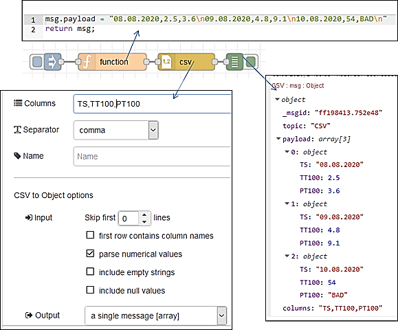
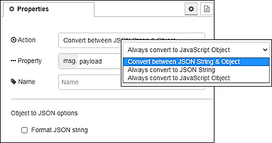
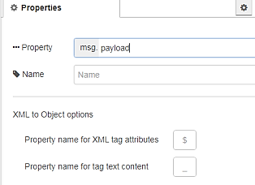

# Основи HTTP

## HTTP requests (робота з клієнтськими запитами)

Відправляє запити HTTP і повертає відповідь на нього (рис.8.1). В якості вхідного значення приймає наступні властивості повідомлень:

- url (string) – якщо не сконфігуроване в     вузлі, ця опціональна властивість виставляє url для запиту.
- method (string) - якщо не сконфігуроване в     вузлі, ця опціональна властивість виставляє метод HTTP для запиту. Повинно бути GET, PUT, POST, PATCH бо DELETE.
- headers (object) – виставляє HTTP заголовки в запиті 
- cookies (object) – якщо вказані, можуть бути     використані для відправки куків з запитом
- payload – виставляє тіло для запиту
- rejectUnauthorized – якщо виставлено в false дозволяє робити     запити на сайти https, які використовують сертифікати, які підписуються     самостійно 
- followRedirects – якщо виставлено в` `false запобігає     наступним перенаправленням (HTTP 301).` `true за замовчуванням

 

рис.8.1. Налаштування вузлу HTTP requests

На виході формує:

- payload (string | object | buffer) – тіло     відповіді. Вузол може бути     налаштований так, щоб повернути тіло у вигляді string,     спробувати розпарсити його як рядок JSON або залишити його у вигляді     двійкового буфера. 
- statusCode (number) - код стану відповіді або код помилки,     якщо запит не може бути завершений.
- headers (object) – об’єкт, що містить     заголовки відповідей 
- responseUrl (string) - у випадку,     якщо під час обробки запиту відбулися будь-які перенаправлення, це     властивість є останньою адресою, що переадресовується. В іншому випадку це     URL оригінального запиту.
- responseCookies (object) - якщо відповідь     включає файли cookie, ця властивість є об'єктом пар імені/значення для     кожного cookie.

Якщо сконфігуровано у вузлі, властивість URL може містити теги [mustache-style](http://mustache.github.io/mustache.5.html). Вони дозволяють створювати URL, використовуючи значення вхідного повідомлення. Наприклад, якщо URL-адресу встановлено example.com/{{{topic}}} в це місце буде автоматично додано` `msg.topic. Використання потрійних фігурних дужок {{{...}}} запобігає вилученню mustache із символів на зразок /&  і т.д.

Примітка: Якщо запускається за проксі-сервері, необхідно встановити стандартну змінну середовища http_proxy=... і перезапустити Node-RED, або використовувати вузол Proxy Configuration. Якщо було встановлено вузол Proxy Configuration, конфігурація цього вузлу має перевагу перед змінною середовища. 

Для того щоб використовувати більше одного з таких вузлів в тому самому потоці, необхідно дотримуватися властивості msg.headers. Перший вузол встановить цю властивість з заголовками відповіді. Тоді наступний вузол буде використовувати ці заголовки для свого запиту - це звичайно не правильно. Якщо властивість msg.headers залишається незмінною між вузлами, вона буде ігноруватися другим вузлом. Щоб встановити користувальницькі заголовки, msg.headers слід спочатку видалити або скинути порожнім об'єктом: {}.

Властивість cookies, передана вузлу, повинна бути об'єктом з парою ім'я : значення. Значення для встановлення значення cookie може бути string, або об'єктом з єдиною властивістю value. Будь-які файли cookie, повернені запитом, передаються назад у властивості responseCookies.

Для виконання запиту завантаження файлу, msg.headers["content-type"] слід встановити на multipart/form-data , а msg.payload , переданий у вузол, повинен бути об'єктом із такою структурою: 

```json
{
    "KEY": {
        "value": FILE_CONTENTS,
        "options": {
            "filename": "FILENAME"
        }
    }
}
```

Значення KEY, FILE`_`CONTENTS та FILENAME слід встановити у відповідні значення.

Якщо msg.payload є Object, вузол буде автоматично встановлювати тип контенту запиту в application/json і кодувати тіло відповідним чином.

Для кодування запиту як форми даних msg.headers["content-type"] буде встановлюватися як application/x-www-form-urlencoded.

На рис.8.2 показаний приклад з вузлом HTTP requests

 

рис.8.2. Приклад використання HTTP requests

## Http in (вхідне повідомлення HTTP-серверу)

  Створює точку для з`єднання  HTTP для створення веб-служб (рис.8.3). 

 


рис.8.3. Налаштування Http in

На виході формує:

- Payload (object) - Для запиту GET містить     об'єкт з параметрами рядка запиту. В іншому випадку, містить тіло запиту     HTTP.
- req (object) - Об'єкт запиту HTTP. Цей об'єкт містить кілька     властивостей, які надають інформацію про запит. 

Вузол прослуховує конфігурований шлях для запитів певного типу. Шлях може бути повністю означений, наприклад /user, або включати іменовані параметри, які приймають будь-яке значення, наприклад /user/:name. Коли використовуються іменовані параметри, їх фактичне значення в запиті може бути доступне за посиланнями msg.req.params.
 Для запитів, які включають тіло, наприклад POST або PUT, вміст запиту доступний як msg.payload.

Якщо тип вмісту запиту може бути визначений, тіло буде проаналізовано до будь-якого відповідного типу. Наприклад, application/json буде парсений до його представлення в об'єкти JavaScript.

Примітка: цей вузол не надсилає відповіді на запит. Потік повинен містити вузол HTTP Response для завершення запиту.

## 8.3. Http response (вихідне повідомлення HTTP-серверу)

  Надсилає відповіді на запити, отримані від вузла HTTP In (рис.8.4). 

 

рис.8.4. Налаштування Http response

В якості вхідного значення приймає наступні властивості повідомлень:

- payload (string) – тіло     відповіді 
- statusCode (number) – якщо встановлений,     використовується в якості статусного коду відповіді. За замовченням 200
- headers (object) – заголовки, якщо     встановлений забезпечує HTTP заголовки, які     включаються у відповідь  
- cookies (object) – якщо встановлений, може     бути використаний для встановлення або видалення куків (cookies)

statusCode і headers також можуть бути встановлені в налаштуваннях самого вузла. У цьому випадку їх не можна перевизначити відповідними властивостями повідомлення.

Властивість cookies повинна бути об'єктом пар імен/значень. Значення може бути або рядком для встановлення значення куки з параметрами за замовчуванням, або це може бути об'єктом опцій.

Наступний приклад встановлює два файли cookies - один з них називається name зі значенням nick, інший називається session зі значенням 1234 з терміном дії 15 хвилин.

```json
msg.cookies = {
    name: 'nick',
    session: {
        value: '1234',
        maxAge: 900000
    }
}
```

Допустимі опції:

- domain - (String) ім’я домену     для куки 
- expires - (Date)  expiry date in GMT. If not specified or     set to 0, creates a session cookie
- maxAge - (String) термін дії відносно поточного часу в мілісекундах
- path - (String) шлях куки,     за замовченням «/»
- value - (String) значення для     куки 

Для видалення, куки встановлюється в null``

На рис.8.5 показаний приклад використання вузлів http in/out в парі. Коли відбувається запит на сторінку hello видається текстовий зміст.

 

рис.8.5. Приклад використання http in/out

## Налаштування клієнтських і серверних з’єднань для WebSocket 

Для налаштування серверного ресурсу WebSocket для Node-RED використовуються конфігураційні вузли WebSocket-listener (рис.9.1). Вхідний порт для з’єднання буде тим самим, що і порт для конфігурування/WEB, тобто типово, 1880. Тому в конфігураційному вузлі вказується тільки частина URI що вказує розміщення ресурсу на сервері.  

 

рис.9.1.Конфігураційний вузол WebSocket-listener

Для налаштування з’єднання клієнтського вузлу WebSocket з Node-RED використовуються конфігураційні вузли WebSocket-client (рис.9.2). Для означення схеми на початку URL вказується ws:// для звичайного або wss:// для захищеного з’єднання. Далі вказується повний шлях до ресурсу, включаючи домен (або IP), порт (якщо не 80) та інша частина URL.   

 

рис.9.2.Конфігураційний вузол WebSocket- client

## WebSocket in

  Вхідний вузол WebSocket (рис.9.3). 

 

рис.9.3. Налаштування WebSocket in

За замовчуванням, дані, отримані з WebSocket, будуть знаходитись у msg.payload. Сокет може бути налаштований так, щоб очікувати правильно сформованого JSON-рядку, і в цьому випадку він розбирає JSON і надсилає отриманий об'єкт як ціле повідомлення. 

## WebSocket out

  Вихідний вузол WebSocket (рис.9.4).

 

рис.9.4. Налаштування WebSocket out

За замовчуванням msg.payload відправляє через WebSocket. Сокет може бути зконфігурований так, щоб кодувати весь об'єкт msg як рядок JSON і посилати його через WebSocket.

Якщо повідомлення, що надходить на цей вузол, запущено в вузлі WebSocket In, повідомлення буде відправлено клієнту, який ініціював потік. В іншому випадку повідомлення буде транслюватися всім підключеним клієнтам.

Якщо ви хочете передати повідомлення, яке розпочалося в вузлі WebSocket In, ви повинні видалити властивість msg._session з потоку.

## HTML

  Витягує елементи з HTML-документа, що міститься в msg.payload  за допомогою селекторів CSS (рис.10.1).

В якості вхідного значення приймає наступні властивості повідомлень:

- payload (string) – html- рядок     з якого вилучаються елементи.
- select (string) -  селектор, може бути використане це значення     властивості msg, якщо воно не налаштовано на панелі редагування.

 

рис.10.1. Налаштування вузлу HTML

На виході формує:

- payload (array | string) - результатом може бути одне повідомлення з корисним     навантаженням, що містить масив відповідних елементів, або кілька     повідомлень, кожен з яких містить відповідний елемент. 
- Якщо надсилаються декілька повідомлень, вони також     мають набір parts.

Цей вузол підтримує комбінацію селекторів CSS і jQuery. Докладніше про підтримуваний синтаксис див. [за цим посиланням](https://developer.mozilla.org/uk/docs/Web/CSS/CSS_Selectors) або [Документацію css-select](https://github.com/fb55/CSSselect#user-content-supported-selectors). 

На рис.10.2  наведений приклад використання HTML-парсера. Вузол  http request робить запит на сторінку з сайту example.org використовуючи метод get. Сторінка завантажується в Payload як текстове повідомлення. Далі повідомлення проходить через вузол парсера body, який витягує html-зміст усіх html-тегів body та відправляє їх окремими повідомленнями в payload. Враховуючи, щ вузол body в html-документі тільки один, його зміст виводиться один раз на панелі налагодження. Корисне навантаження цього повідомлення переходить через інший html-парсер з іменем p де вилучаються усі абзаци (тег p) і відправляються як масив повідомлень в форматі html.

 

рис.10.2. Приклад використання HTML-парсера 

## CSV

  Перетворює рядки, відформатовані CSV в об’єкти JavaScript та навпаки.

На вхід подається значення payload тип JavaScript object, array або рядок CSV.

На виході отримується також payload (*object , array або string*), який буде формуватися наступним чином:

•   Якщо вхідним значенням є string , він намагається розібрати його як CSV та створить JavaScript-об’єкт з парами ключ/значення для кожного рядка. Потім вузол буде надсилати повідомлення для кожного рядка, або одне повідомлення, що містить масив об'єктів.

•   Якщо вхід є об’єктом JavaScript, він намагається побудувати CSV string.

•   Якщо вхід є масивом простих значень, він будує однорядковий CSV string.

•   Якщо вхід - це масив масивів або масив об’єктів, створюється багаторядковий (multiple-line) CSV string.

 

рис.10.3. Налаштування вузла CSV

Шаблон стовпця (columns) може містити впорядкований список імен стовпців. При перетворенні CSV в об'єкт імена стовпців будуть використовуватися як імена властивостей. Крім того, назви стовпців можна взяти з першого ряду CSV. При перетворенні в CSV шаблон стовпця використовується для визначення, які властивості витягувати з об'єкта та в якому порядку. Якщо шаблон порожній, то вузол може використовувати простий список розділених комами властивостей, наданий у msg.columns, щоб визначити, що потрібно витягнути. Якщо цього немає, то всі властивості об'єкта виводяться в тому порядку, в якому вони знайдені.

Якщо вхід - це масив, то шаблон стовпців використовується лише для необов'язкового генерування рядів заголовків стовпців.

Якщо встановлено прапорець parse numerical values, числові значення рядків повертаються як числа, тобто середнє значення '1, "1.5", 2'. Якщо встановлено прапорець include empty strings, в результаті будуть повернуті порожні рядки, тобто середнє значення '"1", "", 3'. Якщо встановлено прапорець include null values, в результаті будуть повернуті нульові значення, тобто середнє значення '"1" ,, 3'.

Вузол може прийняти багаточастинний (multi-part) вхід, якщо властивість parts встановлено правильно, наприклад, з вузла вхідного файлу або вузла split. Якщо виводиться декілька повідомлень, вони матимуть властивість parts та формуватимуть повну послідовність повідомлень.

**Примітка:** шаблон стовпця (columns) повинен бути розділений комами, навіть якщо для даних обрано інший роздільник.

На рис.10.4 наведений приклад.

 

рис. 10.4. Приклад використання вузла CSV

## JSON

 Перетворює рядки JSON в об’єкти JavaScript та в зворотному напрямку.

 

рис. 10.5. Налаштування вузла JSON

На вхід подаються властивості:

·     payload (*object або string*) -- JavaScript object або JSON string.

·     schema (*object*) -- Опціональний об'єкт типу JSON Schema для валідації payload. Властивість буде видалено до відправлення `msg` на наступний вузол.

Вузол формує повідомлення з властивостями:

·     payload(*object або string*)

- - якщо      вхід є JSON string вузол спробує видати JavaScript object.
  - якщо      вхід є JavaScript object, вузол створить JSON string. String може      необов'язково бути добре відформатованим.

·     schemaError (*array*) -- якщо перевірка схеми JSON не вдається (див `shema`), вузол `catch` отримає властивість schemaError, що містить масив помилок.

За замовчуванням вузол працює з msg.payload, але може бути налаштований для перетворення з будь-якої властивості повідомлення.

Вузол також може бути налаштований так, щоб забезпечити частинне кодування замість перемикання між ними. Це може бути використано, наприклад, для вузла HTTP In , щоб забезпечити корисне навантаження парсованим об'єктом, навіть якщо вхідний запит не встановив правильний тип вмісту для вузла HTTP In для перетворення.

Якщо вузол налаштований так, щоб властивість було закодовано як String, і він отримав String, додаткові перевірки властивості не проводитимуться. Він не перевірить, що String є дійсним JSON, і не буде переформатувати його, якщо обрано параметр формату.

Для отримання більш детальної інформації про схему JSON ви можете ознайомитися зі специфікацією [за цим посиланням](http://json-schema.org/latest/json-schema-validation.html).

## XML

Перетворює рядок XML в об’єкт JavaScript та в зворотному напрямку напрямку.

 

рис. 10.6. Налаштування вузла XML

На вході очікує властивості:

·     payload (*object або string*) -- JavaScript object або XML string.

·     options(*object*) -- цю необов'язкову властивість можна використовувати для передачі будь-якого з параметрів, підтримуваних базовою бібліотекою, що використовується для перетворення в XML і з нього. Докладнішу інформацію див. у документах [the xml2js docs](https://github.com/Leonidas-from-XIV/node-xml2js/blob/master/README.md#options)

На виході вузол формує повідомлення:

- payload (*object або string*) 

- - якщо вхід є string,      вузол пробує парсити його як XML та перетворити в JavaScript object.
  - якщо вхід є      JavaScript object він пробує з нього створити XML string.

При перетворенні між XML і об'єктом будь-які атрибути XML додаються як властивість за назвою $ за замовчуванням. Будь-який текстовий вміст додається як властивість під назвою _. Ці імена властивостей можна вказати в конфігурації вузла.

Наприклад, наступний фрагмент XML

<p class="tag">Hello World</p>

буде конвертовано в об'єкт:

```json
{
  "p": {
    "$": {
      "class": "tag"
    },
    "_": "Hello World"
  }
}
```

Приклад перетворення XML в Object показаний на рисунку 10.7. Для атрибута priority використане назва властивості-обєкта $, що має такий атрибут. Для включених тегів створюються масиви зі значеннями.


рис. 10.7. Приклад перетворення XML в Object

Приклад перетворення з Object в XML показаний на рисунку 10.8.


рис.10.8. Приклад перетворення з Object в XML