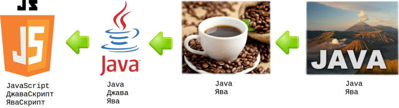

**Програмна інженерія в системах управління. Лекції.** Автор і лектор: Олександр Пупена 

| [<- до лекцій](README.md) | [на основну сторінку курсу](../README.md) |
| ------------------------- | ----------------------------------------- |
|                           |                                           |



# JavaScript

Джерела:

- <http://яваскрипт.укр/javascript>
- [Посібник JavaScript MDN](https://developer.mozilla.org/uk/docs/Web/JavaScript/Guide)
- [Современный учебник JavaScript](https://learn.javascript.ru/)

- [Довідник JavaScript](../Довідники/js/js.md)

## Вступ

### Про JS

**JavaScript (скорочено JS )** — крос-платформна об'єктно-орієнтована мова сценаріїв  (скриптів). Рушій JavaScript підключається до об'єктів свого середовища  виконання (наприклад, веб-браузера) та надає можливість керування  ними.

JS це реалізація стандарту [ECMAScript](http://xn--80adth0aefm3i.xn--j1amh/ECMAScript). **ES** - це скорочення від **E**CMA**S**cript. Кожне видання  специфікації отримує назву з абревіатурою ES та номер версії. Починаючи з ES6 офіційна назва специфікації позначається роком виходу. Тобто ES2015...ES2019

### JS-рушії vs Java-машини

Не дивлячись на схожість назв і елементів синтаксису, JavaScript та Java - це різні мови і навіть парадигми програмування. Java компілюється в проміжний байт-код, який швидко перетворюється на машинний код на необхідному обладнанні за допомогою Java-машини. Таким чином, реалізовуючи Java-машину (JVM) на різному залізі реалізовується крос-платформність.


На відміну від системи часу компіляції, мова JavaScript інтерпретована. Тобто вихідний код програми аналізується та виконується JavaScript-рушієм, без попередньої компіляції. Цей рушій може бути вбудований наприклад в браузер. Останні версії HTML (HTML5) включають в себе обов'язкову підтримку JavaScript. 

Таким чином, JavaScript найчастіше використовується як частина браузера, що надає можливість виконання коду на стороні клієнта  (такому, що виконується на пристрої кінцевого користувача) взаємодіяти з користувачем, керувати браузером, асинхронно обмінюватися даними з сервером , змінювати структуру та зовнішній вигляд веб-сторінки. Однак рушій може бути частиною іншого застосунку або бути окремим застосунком.   


Таким чином, JavaScript використовується для:

- написання сценаріїв веб-сторінок для надання їм інтерактивності;
- створення односторінкових веб-застосунків ([React](https://uk.wikipedia.org/wiki/React), [AngularJS](https://uk.wikipedia.org/wiki/AngularJS), [Vue.js](https://uk.wikipedia.org/wiki/Vue.js));
- програмування на стороні сервера ([Node.js](https://uk.wikipedia.org/wiki/Node.js));
- стаціонарних застосунків ([Electron](https://electron.atom.io/), [NW.js](https://nwjs.io/));
- мобільних застосунків ([React Native](https://facebook.github.io/react-native/), [Cordova](https://cordova.apache.org/));
- сценаріїв в прикладному ПЗ (наприклад, в програмах зі складу [Adobe Creative Suite](https://uk.wikipedia.org/wiki/Adobe_Creative_Suite) чи [Apache JMeter](https://uk.wikipedia.org/wiki/Apache_JMeter));
- всередині PDF-документів тощо.

Серед рушіїв можна виділити: 

- [V8](https://uk.wikipedia.org/wiki/V8_(%D1%80%D1%83%D1%88%D1%96%D0%B9_JavaScript)) – в Chrome, Opera, Node.js.
- [SpiderMonkey](https://uk.wikipedia.org/wiki/SpiderMonkey) – в Firefox.

Рушії працюють за таким алгоритмом (спрощено): читають та розбирають (парсять) текст скрипта; перетворюють скрипт в машинний код; запускають машинний код. При цьому можуть використовуватися алгоритми оптимізації.  

У даному курсі будуть використовуватися приклади в основному для серверних застосунків на Node.js 

### Редактори

Для створення скриптів та застосунків можна використовувати різні IDE (інтегровані середовища розробки, Integrated Development Environment) або/та утиліти розробки. При розробці скриптів для Веб-сторінок можна скористатися інтегрованими у Веб-бразуер утилітами. Наприклад для FireFox є Веб-консоль, яка може працювати у мультирядковому режимі. Можна вводити туди JS код і дивитися результат, запустивши його на виконання. 

   

У останніх версіях, при намаганні скопіювати в консоль текст, FireFox попросить один раз явно написати дозвіл на виконання копіпасту. Слід також розуміти, що код в консолі буде запускатися в контексті відкритої сторінки. 

У Google Chrome можливість перевірки коду доступна в Інструментах розробника. Введені у консолі інструкції одразу виконуються після натискання `Enter`. Якщо необхідно ввести кілька рядків інструкцій, після кожної треба вводити `Shift+Enter`.   


У даному курсі усі приклади для лабораторних робіт будуть наводитися для безкоштовного IDE середовища [Visual Studio Code](https://code.visualstudio.com/). Код пишеться в файлах `*.js`, які можна об'єднати в один проект, наприклад для серверу Node.js.    


Усі приклади, що наведені нижче, можете тестувати у [Visual Studio Code](https://code.visualstudio.com/): створити файл, зберегти його як `test.js`, копіювати туди код і запускати на виконання `F5`.

## Основи JavaScript

### Побудова коду програми

Код складається з набору інструкцій, які розділені символом `;`.  У наступному фрагменті дві інструкції введені через крапку з комою в одному рядку. 

```javascript
console.log("Привіт світ!"); console.log("Друга інструкція.");
```

У наведених вище інструкціях викликається метод `log` вбудованого системного об'єкту  `console`. Це дає можливість виводити на консоль текстові повідомлення.

Синтаксис коментарів такий самий, як в `C` та багатьох інших мовах програмування:

```js
console.log("Привіт світ!"); // коментар для одного рядка 
/* довгий коментар
   на кілька рядків
*/
/* Однак, не можна /* змішувати коментарі */ тут буде SyntaxError */
```

Для керування потоком виконання (наприклад, `if`, `for`, `while`), якщо необхідно виконувати кілька інструкцій та обмежити область видимості, використовують блокові інструкції `{` та `}`.  Все що знаходиться в межах фігурних дужок об'єднується в одну інструкцію. 

```javascript
let a=3; let b=2;
if (a>b) //якщо треба виконати кілька інструкцій коли a>b  
{ //початок блоку
	console.log("Це перша інструкція блоку."); 
    console.log("Це друга інструкція блоку.");
} //кінець блоку
```

### Змінні та константи

Для створення змінної в JavaScript використовуються ключові слова `let` та `var`.  Оператор **`let`** оголошує локальну змінну, яка видима в межах блоку, де вона оголошена (`{}`). Оператор **`var`**  має область видимості у межах усіє функції. Є ще ряд відмінностей між  `let` та `var`, які не будемо тут розглядати.  У нових скриптах рекомендується використовувати  `let` .

Наведений нижче приклад створює (іншими словами: *об'являє* або *означує*) змінну з іменем `message`, і поміщає в неї дані, використовуючи оператор присвоювання `=` . Рядок збережеться в області пам'яті, зв'язаною зі змінною. Ми можемо отримати до неї доступ, використовуючи ім'я змінної. 

```javascript
let message1;
message1 = 'Hello'; // записати рядок в змінну
console.log(message1); // пише в консоль значення змінної
let message2 = 'Hello';//Можна суміщати об'явлення змінної і запис даних в один рядок.   
let user = 'John', age = 25, message3 = 'Hello';//можна кілька змінних об'являти в одному рядку
//або навіть так
let user1 = 'John',
  age1 = 25,
  message4 = 'Hello';
```

Оголошення **`const`**  створює посилання на значення, доступне лише для читання. Що **не** гарантує незмінність значення, на котре вказує посилання, а лише той факт, що не можна повторно присвоїти будь-яке значення змінній з відповідним ім'ям.

Коли ви оголошуєте змінну за  межами будь-якої функції, вона називається глобальною змінною, оскільки  вона доступна для будь-якого іншого коду в поточному документі. Коли ви оголошуєте змінну в межах функції, вона називається локальною змінною, оскільки вона доступна лише в межах цієї функції. 

### Типи даних 

Змінна в JavaScript може містити будь-які дані. У один момент там може бути рядок, а в інший – число. Коли змінна не прив'язується до конкретного типу, але при цьому типи даних існують, це називається "динамічною типізацією". 

```javascript
//в JS так можна робити
let message = "hello";		//це текст, і message тепер типу string
console.log (typeof(message));//string
message = 123456; 			//це число, і message тепер типу number 
console.log (typeof(message));//number
```

Оператор `typeof` повертає значення типу. У JS існує вісім типів даних: `number`, `BigInt`, `string`, `boolean`, `null`, `undefined`, `object`, `symbol`. Спочатку розглянемо базові типи, усі типи можна подивитися у відповідному розділі [розділі доідника](../Довідники/js/js.md#types)


## Основи роботи з об'єктами


## Масиви


## Функції


| [<- до лекцій](README.md) | [на основну сторінку курсу](../README.md) |
| ------------------------- | ----------------------------------------- |
|                           |                                           |