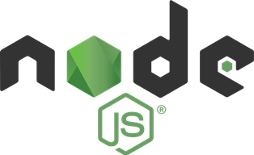

**Програмна інженерія в системах управління. Лекції.** Автор і лектор: Олександр Пупена 

| [<- до лекцій](README.md) | [на основну сторінку курсу](../README.md) |
| ------------------------- | ----------------------------------------- |
|                           |                                           |



# Веб-програмування в node.js

## Деякі вбудовані об'єкти та модулі node.js

### [console](https://nodejs.org/api/console.html)

```javascript
console.log ("Звичайне повідомлення");
console.warn ("Пвідомлення про попередження");
console.error ("Повідомлення про помилку");
```

### webserver

https://learn.javascript.ru/screencast/nodejs#nodejs-server-intro


## Інструменти налагодження

https://learn.javascript.ru/screencast/nodejs#nodejs-dev-debug

## Основи асинхронного програмування

https://learn.javascript.ru/screencast/nodejs#nodejs-event-loop-async

https://www.youtube.com/watch?time_continue=33&v=8cV4ZvHXQL4&feature=emb_logo

https://habr.com/ru/post/337528/

https://proglib.io/p/asynchrony/

## Посилання

https://www.w3schools.com/nodejs/nodejs_intro.asp

https://nodejs.org/uk/docs/

https://habr.com/ru/post/460661/

https://medium.com/devschacht/node-hero-6a07ef8d822d 


| [<- до лекцій](README.md) | [на основну сторінку курсу](../README.md) |
| ------------------------- | ----------------------------------------- |
|                           |                                           |