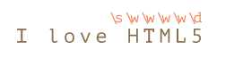
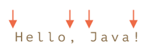

# Регуялярні вирази в JS

Регулярні вирази (Regular expressions) - це шаблони, які використовуються для знаходження і заміни текстових даних у рядках. Вони використовуються для виконання різних операцій з рядками, таких як пошук, заміна, розділення та валідація.

Регулярні вирази складаються з одного або кількох символів, що описують шаблон, та спеціальних символів, які вказують на певні патерни. Наприклад, ви можете використовувати регулярні вирази для знаходження всіх електронних адрес, які містять символ @, або для перевірки правильності форматування номера телефону.

Регулярні вирази підтримуються в багатьох мовах програмування, включаючи JavaScript, Python, Java, PHP та інші. В JavaScript, регулярні вирази використовуються для валідації форм, пошуку і заміни рядків, обробки текстових даних та інших завдань.

Існує безліч онлайн-сервісів для перевірки роботи з регулярними виразами, серед яких можна виділити такі:

1. Regex101 (https://regex101.com/)
2. RegExr (https://regexr.com/)
3. RegexPal (http://www.regexpal.com/)
4. RegexpTester (https://www.regextester.com/)
5. RegexPlanet (https://www.regexplanet.com/)

## Використання в JS

Найпростішим регулярним виразом, з якого формуються складні, є звичайний символ. Більшість символів у регулярному виразі представляють самі себе, за винятком спеціальних символів (метасимволів) `[` `]` `\` `^` `$` `.` `|` `?` `*` `+` `(` `)` `{` `}`, яким може передувати символ `\` (зворотна коса риска), котрий робить метасимволи «екранованими», «захищеними» для представлення,  відображення їх самих як символів тексту. Можна екранувати деяку послідовність символів, розмістивши її між `\Q` і `\E`.

Регулряні вирази є екземпляром вбудваного класу JS.

```js
regexp = new RegExp("шаблон", "прапорці");//довгий синтаксис
regexp = /шаблон/; // короткий синтаксис без прапорців, символ слешу говорить про те що це регулярний вираз
regexp = /шаблон/gmi; // короткий синтаксис з прапорцями gmi 
```

Приклади використання в JS.

### match

Шукає перше або всі співпадіння в залежності від прапорців:

```js
let str = "Давай, мила моя, давай!";
let result = str.match(/давай/);
console.log (result); //
/*Поверне наступне:
[
  'давай',
  index: 17,
  input: 'Давай, мила моя, давай!',
  groups: undefined
]*/

result = str.match(/давай/gi); //призначення прапорців див нижче
console.log (result); //['Давай', 'давай']

result = str.match(/HTML/);
console.log (result); // null
```

### replace

```js
console.log( "We will, we will".replace(/we/i, "I") ); // I will, we will
console.log( "We will, we will".replace(/we/ig, "I") ); // I will, I will
console.log( "Люблю HTML".replace(/HTML/, "$& та JavaScript") ); // Люблю HTML та JavaScript
```

| Дії в рядку заміни                                           | Спецсимволи |
| ------------------------------------------------------------ | ----------- |
| всталвяє усі знайдені співпадіння                            | `$&`        |
| вставляє частину рядку до співпадіння                        | $\`         |
| вставляє частину рядку після співпадіння                     | `$'`        |
| якщо `n` це 1-2 значне число, вставляє вміст n-ї дужкової групи регулярного виразу, | `$n`        |
| вставляє вміст дужкової групи з ім'ям `name`                 | `$<name>`   |
| вставляє символ `"$"`                                        | `$$`        |

### test

Метод `regexp.test(str)` перевіряє, чи є хоч одне співпадіння, якщо так, то повертає `true`, інакше `false`.

```js
let str = "Я ЛюБлЮ JavaScript";
let regexp = /люблю/i;
console.log( regexp.test(str) ); // true
```

### Прапорці

Регулярні вирази можуть мати прапорці, які означують правила пошуку:

| Прапорцець | Значення                                                     | Прклад |
| ---------- | ------------------------------------------------------------ | ------ |
| `i`        | пошук не залежить від регістра, тобто немає різниці між `A` та `a`. |        |
| `g`        | пошук йде по усім співпадінням, без нього тільки першу       |        |
| `m`        | Багаторядковий режим                                         |        |
| `s`        | включає режим «dotall», при якому крапка в сивольному класі `.` може відповідати символу перевода рядку `\n` |        |
| `u`        | включає повну підтримку юнікоду, дозволяє корректну обрабку суррогатних пар |        |
| `y`        | режим пошуку на конкретній позиції в тексті                  |        |

## Набори

Нбори вказуються у квадратних дужках `[` `]`  і дозволяють вказати інтерпретаторові  регулярних виразів, що на даному місці в рядку може стояти один із  перерахованих символів. Зокрема, `[абв]` задає можливість появи в тексті одного із трьох зазначених символів, а `[1234567890]` задає відповідність одній із цифр. 

```javascript
// найти [т або х], пілся яких іде "оп"
console.log( "Топ хоп".match(/[тх]оп/gi) ); // ["топ", "хоп"]
```

Зверніть увагу, що в наборі кілька символів, але в результаті він відповідає рівно одному символу. Так що цей приклад не дає збігів:                      

```javascript
console.log ( "Вуаля".match(/В[уа]ля/) ); // null 
// шукає "В", потім [у або а], потім "ля"
// а в рядку В, потім у, потім а
```

Можливе зазначення діапазонів символів: наприклад, `[0-9]`. Для включення усіх символів українського алфавіту можна використовувати `[Є-ЯҐ]`, `[а-їґ]`.

У наведеному нижче прикладі ми шукаємо `"x"`, за яким слідують дві цифри або букви від `A` до ` F`:

```javascript
console.log( "Exception 0xAF".match(/x[0-9A-F][0-9A-F]/g) ); // xAF
```

Якщо ми хочемо знайти букви і в верхньому та нижньому регістрах, то ми можемо додати ще діапазон `a-f`:` [0-9A-Fa-f] `. Або поставити біля регулярного виразу прапор `i`.

Також ми можемо використовувати символьні класи всередині  `[…]`.

Якщо потрібно вказати символи, які не входять у зазначений набір, то використовують символ `^` усередині квадратних дужок, наприклад, `[^0-9]` означає будь-який символ, крім цифр.  

Ще приклади:

- `[^aeyo]` – будь який символ, за виключенням `'a'`, `'e'`, `'y'` або `'o'`.
- `[^0-9]` – будь який символ, за виключенням цифри, те ж, сае що і `\D`.
- `[^\s]` – будь який непробільний символ, те ж саме, що і `\S`.

Приклад нижче шукає будь-які символи, крім латинських букв, цифр і пробілів:

```javascript
console.log( "mymail@gmail.com".match(/[^\d\sA-Z]/gi) ); // ['@','.']
```

## Довільний символ `.` 

Метасимволу `.` (**крапка**) відповідає довільний символ (але не його відсутність), окрім символу нового рядка (в деяких реалізаціях).

```js
let regexp = /CS.4/;
console.log( "CSS4".match(regexp) ); // CSS4
console.log( "CS-4".match(regexp) ); // CS-4
console.log( "CS 4".match(regexp) ); // CS 4 (пробіл також є символом)
console.log( "CS4".match(regexp) ); // null, немає спіпадінь, бо крапка - це деякий символ

console.log( "A\nB".match(/A.B/) ); // null бо `.` не є символом перевода рядку 
console.log( "A\nB".match(/A.B/s) ); // A\nB бо прапорець /s вводить до `.` і символ перевода рядку 
```

## Символьний клас

*Символьний клас* – це спеціальне позначення, яке відповідає будь-якому символу з певного набору. 

Деякі символьні класи можна замінити спеціальними метасимволами, де великі літери є зворонтіми символьними класами, тобто навпаки.

| Символ | Опис                                                         |
| ------ | ------------------------------------------------------------ |
| `\d`   | Відповідає цифрі. Еквівалентно `[0-9]`                       |
| `\D`   | Відповідає символу що не є цифрою. Еквівалентно `[^0-9]`     |
| `\s`   | Відповідає будь-якому пробільному символу, подібно табуляції, переводу рядку та інші. Еквівалентно `[ \f\n\r\t\v]` |
| `\S`   | Відповідає будь-якому непробільному символу. Еквівалентно `[^ \f\n\r\t\v]` |
| `\w`   | Відповідає будь-якому літерному символу, цифрі й знаку підкреслення. Еквівалентно `[[:word:]]` |
| `\W`   | Відповідає будь-якому символу, крім літерного символу, цифрового або підкреслення. Сюди також входить кирилиця. Еквівалентно `[^[:word:]]` |

```js
let str = "+38(044)123-45-46";
let regexp = /\d/;
console.log (str.match(regexp) ); // 3 - першу цифру
let regexp1 = /\d/g;
console.log (str.match(regexp1) ); //['3','8','0','4','4','1','2','3','4','5','4','6']
console.log (str.match(regexp1).join('') ); //380441234546
```

Регулярний вираз може містити як звичайні символи, так і символьні класи. Наприклад, `CSS\d` відповідає рядку `CSS` з цифровю пілся неї:       

```javascript
let str = "Чи є стандарт CSS4?";
let regexp = /CSS\d/
console.log( str.match(regexp) ); // CSS4
```

Також ми можемо використовувати кілька символьних класів:

```javascript
console.log( "I love HTML5!".match(/\s\w\w\w\w\d/) ); // ' HTML5'
```

Відповідність (кожному символьному класу відповідає один символ результату):



## Якорі

### Типи якорів

Наступні символи дозволяють позиціонувати регулярний вираз щодо елементів тексту: початку й кінця рядка, меж слова.  Вони називаються «якорі» (anchors). 

| Представлення | Позиція                   | Приклад | Відповідність                                                |
| ------------- | ------------------------- | ------- | ------------------------------------------------------------ |
| `^`           | Початок рядка             | `^a`    | **a**aa aaa                                                  |
| `$`           | Кінець рядка              | `a$`    | aaa aa**a**                                                  |
| `\b`          | Межа слова                | `a\b`   | aa**a** aa**a**                                              |
| `\b`          | Межа слова                | `\ba`   | **a**aa **a**aa                                              |
| `\B`          | Не межа слова             | `\Ba\B` | a**a**a a**a**a                                              |
| `\G`          | Попередній успішний пошук | `\Ga`   | **aaa** aaa (пошук зупинився на 4-й позиції — там, де не знайшлося `a`) |

### Початок та кінець рядка

У символів каретки `^` і долара `$` є спеціальні значення в регулярних виразах. Каретка `^` означає збіг з початком тексту, а долар `$` - з кінцем. 

```javascript
let str1 = "Mary had a little lamb";
console.log(/^Mary/.test(str1)); // true - текст починається з 'Mary'
console.log(/Mary$/.test(str1)); // false - текст не закінчується з 'Mary'
console.log(/lamb$/.test(str1)); // true - текст закінчується 'lamb
```

Шаблон `^Mary` значить: «начало рядку, потім Mary», а шаблон `lamb$` - "спочатку lamb, потім кінцець рядку" 

Обидва якорі разом `^...$` часто використовуються для перевірки, чи збігається рядок з шаблоном повністю. Наприклад, щоб визначити, чи в правильному форматі користувач ввів дані, перевіримо, що рядок є часом в форматі `12:34`, тобто дві цифри, потім двокрапка, потім ще дві цифри. Мовою регулярних виразів це `\d\d:\d\d`:

```javascript
let goodInput = "12:34";
let badInput = "12:345";
let regexp = /^\d\d:\d\d$/;
console.log( regexp.test(goodInput) ); // true
console.log( regexp.test(badInput) ); // false
```

Тут збіг з `\d\d:\d\d` шукається не десь посередині тексту, а відразу після початку рядка ` ^ `, і після нього повинен бути відразу кінець рядка` $ `. Тобто, весь рядок - це як раз час в потрібному нам форматі. Поведінка якорів змінюється, якщо присутній прапор `m`.

### Багаторядковий режим

Багаторядковий режим вмикається прапором `m`. Він впливає тільки на поведінку `^` і `$`. У багаторядковому режимі вони означають не тільки початок/кінець тексту, а й початок/кінець кожного рядка в тексті. У прикладі нижче текст складається з декількох рядків. Шаблон `/^\d/gm` бере цифру з початку кожного рядка:                     

```javascript
let str = `1е місце: Іваненко І
2е місце: Миколів М
3е місце: Петренко П`;
console.log( str.match(/^\d/gm) ); // 1, 2, 3
console.log( str.match(/^\d/g) ); // 1 - бо без прапорця `m` 
console.log( str.match(/\D$/gm) ); // І, М, П
```

У звичайному режимі каретка `^` – це тільки початок тексту, а в багаторядковому – початок будь якого рядку. З символом  `$`  - ситуація аналогічна.                   

### Межа слова

Є три види позицій, які є межами слова:

- Початок тексту, якщо його перший символ `\w`.
- Позиція всередині тексту, якщо зліва знаходиться `\w`, а праворуч - НЕ ` \w`, або навпаки.
- Кінець тексту, якщо його останній символ `\w`.

Например, регулярное выражение `\bJava\b` будет найдено в строке `Hello, Java!`, где `Java` – отдельное слово, но не будет найдено в строке `Hello, JavaScript!`.

Наприклад, регулярний вираз `\bJava\b` буде знайдено в рядку ` Hello, Java! `, Де ` Java` - окреме слово, але не буде знайдено в рядку `Hello, JavaScript!`.

```javascript
console.log( "Hello, Java!".match(/\bJava\b/) ); // Java
console.log( "Hello, JavaScript!".match(/\bJava\b/) ); // null
```

                     

```javascript
console.log( "Hello, Java!".match(/\bHello\b/) ); // Hello
console.log( "Hello, Java!".match(/\bJava\b/) );  // Java
console.log( "Hello, Java!".match(/\bHell\b/) );  // null 
console.log( "Hello, Java!".match(/\bJava!\b/) ); // null 
console.log( "1 23 456 78".match(/\b\d\d\b/g) ); // ['23','78']
console.log( "12,34,56".match(/\b\d\d\b/g) ); // ['12','34','56']
```

Межа слова `\b` не працює для кирилиці. 

## Квантифікатори

Квантифікатор після символу, символьного класу або групи визначає, скільки разів  попередній вираз може зустрічатися. Варто враховувати, що квантифікатор може стосуватися більш ніж до одного символу в регулярному виразі, тільки якщо це символьний клас або група.

| Представлення | Кількість повторень    | Приклад       | Відповідність                             |
| ------------- | ---------------------- | ------------- | ----------------------------------------- |
| `{*n*}`       | Рівно *n* разів        | `colou{3}r`   | `colouuur`                                |
| `{*m*,*n*}`   | Від *m* до *n* включно | `colou{2,4}r` | `colouur`, `colouuur`, `colouuuur`        |
| `{*m*,}`      | Не менше *m*           | `colou{2,}r`  | `colouur`, `colouuur`, `colouuuur` і т.д. |
| `{,*n*}`      | Не більше *n*          | `colou{,3}r`  | `color`, `colour`, `colouur`, `colouuur`  |

| Представлення | Кількість повторень | Еквівалент | Приклад   | Відповідність                               |
| ------------- | ------------------- | ---------- | --------- | ------------------------------------------- |
| `*`           | Нуль або більше     | `{0,}`     | `colou*r` | `color`, `colour`, `colouur` і т.д.         |
| `+`           | Одне або більше     | `{1,}`     | `colou+r` | `colour`, `colouur` і т.д. (але не `color`) |
| `?`           | Нуль або одне       | `{0,1}`    | `colou?r` | `color`, `colour`                           |

Часто використовується послідовність `.*` для позначення будь-якої кількості будь-яких символів між двома частинами регулярного виразу.

Символьні класи в поєднанні із квантифікаторами дозволяють установлювати відповідності з реальними текстами. Наприклад, колонками цифр, телефонами, поштовими адресами, елементами [HTML](https://uk.wikipedia.org/wiki/HTML)-розмітки й ін. 

Якщо символи `{` `}` не утворюють квантифікатор, їхнє спеціальне значення ігнорується.

### Кількість `{n}`

Самий простий квантифікатор — це число в фігурних дужках: `{n}`. Він додається до символу (або символьному класу, або набору `[...]` і т.д.) і вказує, скільки їх нам потрібно. Можна по-різному вказати кількість, наприклад:

- точна кількість: `{5}`
- діпазон: `{3,5}`, від 3 до 5

Шаблон `\d{5}` значить рівно 5 цифр, він еквівалентний `\d\d\d\d\d`. Наступний приклад знаходить п'ятизначне число:

```javascript
console.log( "Мені 12345 років".match(/\d{5}/) ); //  "12345"
```

Ми можемо добавити `\b`, щоб виключити числа, що довше: `\b\d{5}\b`.

Для того, щоб знайти числа від 3 до 5 цифр, ми можемо вказати межі в фігурних дужках: `\d{3,5}`

```javascript
console.log( "Мені не 12, а 1234 роки".match(/\d{3,5}/) ); // "1234"
```

Верхню межу можна не вказувати. Тоді шаблон `\d{3,}` знайде послідовність чисел довжиною `3` і більше цифр:

```js
console.log( "Мені не 12, а 345678 роки".match(/\d{3,}/) ); // "345678"
```

### Одне або більше `+`

```javascript
let str = "+38(044)-123-45-67";
console.log(str.match(/\d+/g) ); // ['38', '044', '123', '45', '67']
```

### Нуль або одне `?`

```javascript
let str = "Варто писати color або colour?";
console.log( str.match(/colou?r/g) ); // ['color', 'colour']
```

### Нуль або більше`*`

```javascript
console.log( "100 10 1".match(/\d0*/g) ); // ['100', '10', '1']
```

### Приклади                  

```javascript
//Регулярний вираз для десяткових дробів (чисел з плаваючою комою):
console.log( "0 1 12.345 7890".match(/\d+\.\d+/g) ); // 12.345
//Регулярний вираз для «HTML-тега що відкривається без атрибутів», наприклад, <span> або <p>
console.log( "<body> ... </body>".match(/<[a-z]+>/gi) ); // <body>
console.log( "<h1>Привіт!</h1>".match(/<[a-z][a-z0-9]*>/gi) ); // <h1>
//Регулярний вираз для «HTML-тега що відкривається або закривається без атрибутів»
console.log( "<h1>Привіт!</h1>".match(/<\/?[a-z][a-z0-9]*>/gi) ); // ['<h1>', '</h1>']
```


https://developer.mozilla.org/en-US/docs/Web/JavaScript/Guide/Regular_Expressions

https://developer.mozilla.org/en-US/docs/Web/JavaScript/Reference/Global_Objects/RegExp

https://uk.wikipedia.org/wiki/%D0%A0%D0%B5%D0%B3%D1%83%D0%BB%D1%8F%D1%80%D0%BD%D0%B8%D0%B9_%D0%B2%D0%B8%D1%80%D0%B0%D0%B7

https://echo.lviv.ua/dev/7406
